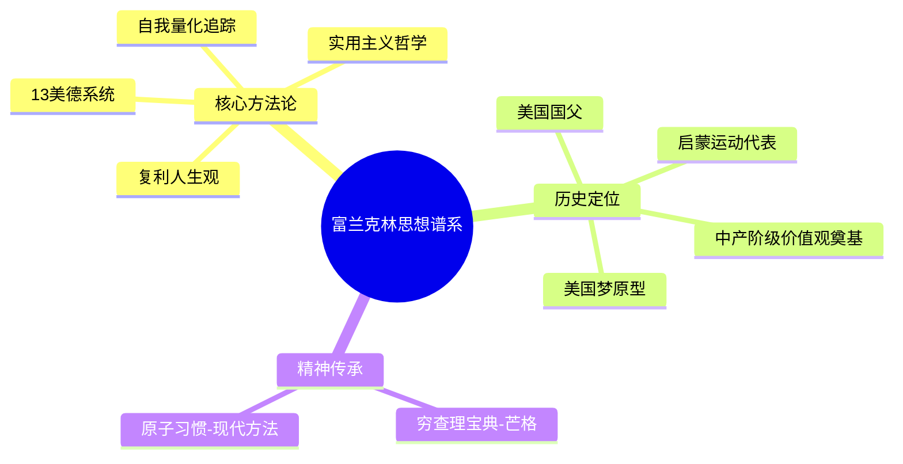

# 《本杰明·富兰克林：一个美国人的生活》拆解记录

## 这本书要解决什么问题？

**核心困境**：一个普通人是如何通过系统化自我提升，改变自己命运，进而改变世界的？

富兰克林给出的答案很直接：你不需要天赋异禀，你需要一套系统。

**一句话定位**：
> 穷小子的逆袭圣经——富兰克林用13美德系统，发明了"美国梦"这个概念，也发明了现代人的"自我量化"。

### 作者站在什么位置说这些话？

| 维度 | 定位 |
|------|------|
| 主领域 | 传记 × 自我提升 × 美国史 |
| 跨界领域 | 实用主义哲学、启蒙思想、公共事务 |
| 作者背景 | 沃尔特·艾萨克森，阿斯彭研究所CEO，写过乔布斯传、爱因斯坦传、马斯克传 |
| 历史语境 | 2003年出版，9/11后的美国，对"美国精神"的溯源需求强烈 |

### 和其他书有什么关系？

| 关联书籍 | 关联关系 | 共同底层逻辑 |
|----------|----------|--------------|
| [[马斯克传-艾萨克森-拆解记录]] | 精神继承 | 穷小子逆袭、自学成才、实用主义 |
| [[爱因斯坦传-艾萨克森-拆解记录]] | 艾萨克森三部曲 | 实用主义vs理论主义 |
| [[穷查理宝典-拆解记录]] | 思想传承 | 芒格以"穷查理"自居，直接致敬 |
| [[原子习惯-拆解记录]] | 方法进化 | 富兰克林是习惯追踪系统的先驱 |

### 知识网络图

---

## 作者的核心论点

### 13美德——史上第一个自我提升系统

富兰克林20岁时列出13项美德，每周专注修炼一项，13周一个循环。

| # | 美德 | 富兰克林定义 | 大白话翻译 |
|---|------|-------------|-----------|
| 1 | 节制 | 食不过饱，饮酒不醉 | 别暴饮暴食，别喝断片 |
| 2 | 缄默 | 言必于人于已有益 | 要么有用要么闭嘴 |
| 3 | 秩序 | 每样东西有固定位置 | 物归原处，事有定时 |
| 4 | 决心 | 该做的事必须做 | 说到做到，做完再说 |
| 5 | 节俭 | 只为对人于己有益花钱 | 花钱要产生价值 |
| 6 | 勤勉 | 不浪费时间，只做有用的事 | 别瞎忙 |
| 7 | 真诚 | 不使用欺骗性语言 | 别骗人，也别骗自己 |
| 8 | 正义 | 不损害他人利益 | 别害人，该做的事要做 |
| 9 | 中庸 | 避免极端，容忍别人给予的伤害 | 别走极端，学会忍让 |
| 10 | 清洁 | 身体、衣服、住所不允许不洁 | 干净是基本修养 |
| 11 | 宁静 | 不为琐事、普通或不可避免的事烦恼 | 别为小事抓狂 |
| 12 | 贞洁 | 仅为健康或生育使用性功能 | 控制欲望 |
| 13 | 谦逊 | 效法耶稣和苏格拉底 | 保持低调 |

**关键机制**：每周只攻一项，用表格打点，一目了然看到自己的进步。13周一个周期，一年可以循环4次。目标是"减少黑点"，不是"没有黑点"。

> **富兰克林美德养成定律**：美德不是天生的，而是通过刻意练习养成的。关键不是完美，而是持续改进。

富兰克林的13美德，本质上是一个"行为量化系统"——把抽象的"美德"拆解成具体的、可操作的行为，每天记录自己的表现。这就是现代"习惯打卡App"的祖先，他在250年前就发明了自我量化。

这个观点打碎了我的一个假设。我一直以为习惯追踪是现代科技的产物，原来250年前就有人用纸和笔实现了同样的效果。工具不重要，方法才重要。

### 穷小子逆袭=系统性积累

富兰克林的逆袭路径本身就是一套方法论：

- 出身：波士顿肥皂匠的儿子，15个孩子中排行第15
- 教育：只上了两年学，12岁当印刷学徒
- 起点：17岁只身逃到费城，身无分文
- 巅峰：美国国父、科学家、外交家、作家、发明家

他的人生像一条复利曲线。知识积累（当学徒时偷偷读书）→ 人脉积累（创建共读社，每周聚会讨论）→ 财富积累（从印刷工到出版穷理查年鉴，42岁退休实现财务自由）→ 声誉积累（做公益事业，赢得民众尊重）。

> **富兰克林复利定律**：成功不是靠天赋，而是靠系统性积累。知识、人脉、财富、声誉——这四种资本相互促进，形成正向循环。

艾萨克森在书中提到一个细节：当生意清淡时，富兰克林会推着手推车在街上走来走去，让人们看到"那个勤奋的年轻印刷工"。他知道被看见的勤奋比勤奋本身更重要。

下次遇到职业瓶颈，我不会再问"我够不够努力"，而是问"我在积累哪一种资本？"

### 实用主义哲学——什么有用就做什么

富兰克林不是理论哲学家，而是实用主义先驱。

他的科学观：不追求理论完美，追求实际应用。发明了避雷针、双光眼镜、富兰克林炉，每个发明都能解决实际问题。

他的政治观：不追求理想制度，追求可行的妥协。在制宪会议上，他支持自己不完全同意的宪法，因为"完美是好的敌人"。

> **实用主义定律**：完美是好的敌人。在复杂世界中，可行的妥协比理想化的方案更有价值。

芒格后来继承了这套实用主义哲学。他在《穷查理宝典》中以"穷查理"自居，直接致敬富兰克林的《穷理查年鉴》。

---

## 这本书的局限

| 批评点 | 谁在批评 | 怎么说 |
|--------|---------|--------|
| 对富兰克林的缺陷轻描淡写 | 读者评论 | 家庭关系冷漠、早年参与奴隶制，艾萨克森处理得过于宽容 |
| 英雄崇拜倾向 | 学术评论 | 艾萨克森承认自己admires Franklin deeply，可能影响客观性 |
| 忽略时代特殊性 | 社会评论 | 18世纪的费城机会比今天的美国多得多，"努力就能成功"忽略了系统性障碍 |

**富兰克林本人的争议**：

| 争议领域 | 内容 |
|----------|------|
| 奴隶制问题 | 早年拥有至少7名奴隶，晚年才成为废奴主义者 |
| 家庭关系冷漠 | 与妻子长期分居，与儿子决裂 |
| "美德"的虚伪？ | 他自己承认从未真正达到"道德完美"，只是"在表面上看起来谦虚" |

**一句话总结局限性**：
> 富兰克林的自我提升系统普适性很强，但他的"美国梦"叙事可能掩盖了结构性不平等。

---

## 最值得记住的话

**原书说的**：
1. "Well done is better than well said."（做得好比说得好）
2. "Lost time is never found again."（失去的时间永远找不回来）
3. "By failing to prepare, you are preparing to fail."（没有准备就是在准备失败）
4. "An investment in knowledge pays the best interest."（对知识的投资回报最高）
5. "Early to bed and early to rise makes a man healthy, wealthy, and wise."（早睡早起，健康富裕又聪明）

**翻译成人话**：
1. 13美德 = 250年前的习惯打卡App
2. 穷小子逆袭不是靠运气，是靠30年复利积累
3. 他不是比别人聪明，而是比别人更有系统
4. 完美是好的敌人——可行的妥协胜过理想的方案
5. 被看见的勤奋比勤奋本身更重要
6. 贫穷不是因为赚得少，是因为花得多
7. 真正的自律不是靠意志力，是靠可视化系统
8. 系统性积累胜过天赋异禀

---

## 讲给没读过的人听

你有没有发现，有些人总是能稳步前进，而大多数人一辈子都在原地打转？

富兰克林也曾经是个穷小子。波士顿肥皂匠的儿子，15个孩子中排行第15，只上了两年学，12岁当印刷学徒，17岁只身逃到费城，身无分文。

但他做了一件跟别人不一样的事——20岁时列出13项美德，每周专注修炼一项，用表格打点追踪。每天记录自己的表现，一年循环4次。

这不是靠意志力，这是靠系统。他不是比别人聪明，而是比别人更有系统。

最后他成为了美国国父、科学家、外交家、作家、发明家。他发明了"美国梦"——不是"每个人都会成功"，而是"每个人都有机会成功"。

---

## 用来检验理解的问题

**基础回忆**：
1. Q: 富兰克林的13美德系统的核心机制是什么？
   A: 每周只攻一项，用表格打点，13周一个周期。目标不是完美，是减少黑点。

2. Q: 富兰克林复利定律是什么？
   A: 成功靠四种资本系统性积累：知识、人脉、财富、声誉，相互促进形成正向循环。

3. Q: 为什么艾萨克森说富兰克林是"实用主义先驱"？
   A: 不追求理论完美，追求实际应用。避雷针、双光眼镜都是解决实际问题的发明。

**理解验证**：
1. Q: 为什么富兰克林的"被看见的勤奋"策略有效？
   A: 他知道勤奋需要被社会认可才能转化为声誉资本。

2. Q: 13美德系统和现代习惯追踪APP有什么区别？
   A: 本质一样，工具不同。富兰克林用纸笔，现代人用手机，但核心都是可视化追踪。

**实际应用**：
1. Q: 如果要建立自己的"美德追踪系统"，应该从哪里开始？
   A: 选择3-5个核心习惯，每周追踪一项，用可视化方式记录进展。

---

## 和其他书的对话

芒格和富兰克林的精神谱系最直接。芒格以"穷查理"自居，直接致敬富兰克林的《穷理查年鉴》。两人的共同点是：实用主义、节俭勤勉、跨学科思维、把道德当作可操作的系统。

马斯克继承了富兰克林的"穷小子逆袭"叙事和实用主义哲学。但马斯克是工程主义，用第一性原理重塑产业；富兰克林是实用主义，用妥协推进公共事务。

《原子习惯》是富兰克林方法论的现代版。克利尔把富兰克林的追踪系统系统化、科学化了。从富兰克林的13美德表格到现代习惯追踪器，自我提升的方法论进化史，核心逻辑从未改变：可视化反馈 + 小步积累 + 循环迭代。

---

*拆解日期：2026-03-08*
*下次回访：1周后回顾「讲给没读过的人听」和「检验问题」*