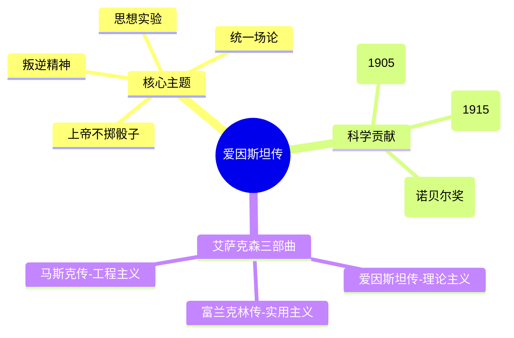

# 《爱因斯坦：生活与宇宙》读书笔记

## 这本书要解决什么问题？

**核心困境**：一个叛逆者如何在对抗权威的同时，创造出超越权威的伟大成就？

**一句话定位**：
> 叛逆的天才教科书——爱因斯坦用"思想实验"证明：想象力比知识更重要。

### 作者站在什么位置说这些话？

| 维度 | 定位 |
|------|------|
| 主领域 | 传记 × 科学史 × 哲学 |
| 跨界领域 | 物理学、政治思想、宗教哲学 |
| 作者背景 | 沃尔特·艾萨克森，基于最新解密的私人信件撰写 |
| 历史语境 | 2007年出版，填补了爱因斯坦私人信件公开后的传记空白 |

### 和其他书有什么关系？

| 关联书籍 | 关联关系 | 共同底层逻辑 |
|----------|----------|--------------|
| [[本杰明富兰克林传-艾萨克森]] | 艾萨克森三部曲 | 实用主义vs理论主义 |
| [[马斯克传-艾萨克森]] | 同系列传记 | 工程主义vs科学哲学 |
| [[从零到一-彼得蒂尔]] | 创新哲学 | 质疑权威→从0到1 |

### 知识网络图

---

## 作者的核心论点

### 叛逆精神——质疑权威的源动力

16岁的爱因斯坦做了一个假设：如果我骑在一束光上飞驰，会是什么感觉？这个"思想实验"最终导致了狭义相对论。

1905年，他发表狭义相对论时年仅26岁，彻底推翻了牛顿200年的物理学基础。年轻学生问他："如果实验证明你是错的怎么办？"他回答："那我会为亲爱的上帝感到遗憾，因为我的理论是正确的。"

叛逆不是简单的反对，而是从基本原理重新思考。爱因斯坦的习惯是问："这个结论的假设是什么？如果去掉这个假设会怎样？"

> **叛逆者定律**：创新往往来自对既定规则的挑战。能够推翻权威的人，首先必须理解权威为什么成立。

别人问"牛顿怎么说"，爱因斯坦问"牛顿为什么这么说"。

### 思想实验——想象力的方法论

"想象力比知识更重要。因为知识是有限的，而想象力概括着世界上的一切。"

爱因斯坦最强大的工具不是望远镜，不是实验室，而是他的大脑。他称之为"Gedankenexperiment"——思想实验。在脑海中构建假设场景，用逻辑推导可能的结论，然后与实验验证。

> **思想实验定律**：任何物理理论都可以在脑海中先于实验存在。真正的发现不是逻辑推导加实验验证的完整过程，想象力可以先于一切。

爱因斯坦的大脑就是他的实验室。他先在脑子里做实验，再到现实中验证。

这个观点打碎了我对"科学方法"的假设。我一直以为科学是"观察→假设→实验→结论"的线性过程，但爱因斯坦证明，想象力可以先于一切。

### 统一场论——跨界思维的原型

爱因斯坦毕生追求"统一场论"，试图将引力与电磁力统一起来。虽然未能完成，但这种思维方式开创了现代物理学的新方向。

统一场论思维的本质是寻找不同现象背后的共同规律。爱因斯坦相信宇宙的简洁性意味着深刻的统一。

> **统一场定律**：伟大的发现往往来自对看似不相关事物之间联系的洞察。跨界思维的本质是发现隐藏的统一性。

爱因斯坦相信上帝不掷骰子——宇宙有一种简洁的统一性。

### 科学与宗教的融合——斯宾诺莎的科学家

"科学没有宗教是跛子，宗教没有科学是盲人。"

爱因斯坦的宗教观是一种基于对宇宙秩序敬畏的"宇宙宗教感"，而非人格化神的崇拜。他拒绝"一个人格化的上帝"。

> **宇宙宗教定律**：真正的敬畏来自对宇宙秩序的认识，而非对超自然力量的恐惧。科学越深入，越接近宗教的边界。

爱因斯坦不信神，但敬畏宇宙的秩序。

下次遇到科学与信仰的冲突，我不会再简单地选边站，而是想起爱因斯坦的话：它们是探索真理的不同路径，终极目标一致。

---

## 这本书的局限

| 批评点 | 谁在批评 | 怎么说 |
|--------|---------|--------|
| 对量子力学的顽固反对 | 物理学界 | 晚年花费大量时间试图推翻量子力学，历史证明他是错的 |
| 个人生活的争议 | 传记读者 | 与第一任妻子因出轨破裂，与表姐的婚外情，对儿子教育不足 |
| 政治立场转变 | 政治评论家 | 从激进和平主义者到支持反法西斯战争，被一些人视为机会主义 |

**一句话总结局限性**：
> 爱因斯坦在科学上的叛逆精神是伟大的，但他把这种执拗带到量子力学领域，反而成了他晚年最大的遗憾。

---

## 最值得记住的话

**原书说的**：
1. "想象力比知识更重要。因为知识是有限的，而想象力概括着世界上的一切。"
2. "上帝不掷骰子。"
3. "科学没有宗教是跛子，宗教没有科学是盲人。"
4. "一个人的价值，应该体现在他能够给予什么，而不是他能够获得什么。"
5. "我想知道上帝是怎么想的，其他的都是细节。"

**翻译成人话**：
1. 别人问"牛顿怎么说"，爱因斯坦问"牛顿为什么这么说"
2. 爱因斯坦的大脑就是他的实验室——先在脑子里做实验
3. 叛逆不是简单的反对，而是从基本原理重新思考
4. 爱因斯坦不信神，但敬畏宇宙的秩序
5. 第一性原理的鼻祖不是马斯克，而是爱因斯坦

---

## 讲给没读过的人听

你知道相对论是怎么被发现的吗？不是在实验室里，不是用望远镜，而是在爱因斯坦的脑子里。

16岁时他想：如果我骑在一束光上飞驰，会是什么感觉？这个"思想实验"最终推翻了牛顿200年的物理学基础。爱因斯坦管这叫"Gedankenexperiment"——他的大脑就是实验室，先在脑子里做实验，再到现实中验证。

他说"想象力比知识更重要"，这不是心灵鸡汤，而是他的工作方法。他不是从实验中归纳理论，而是先用想象力构建理论，再用实验验证。

当然，他也有遗憾。晚年他顽固地反对量子力学，认为"上帝不掷骰子"。但历史证明，宇宙确实在掷骰子。即使是天才，固执也可能成为盲点。

---

## 用来检验理解的问题

**基础回忆**：
1. Q: 爱因斯坦的核心工作方法是什么？
   A: 思想实验（Gedankenexperiment）——在脑海中构建假设场景，用逻辑推导结论，再用实验验证。

2. Q: 爱因斯坦和牛顿的本质分歧是什么？
   A: 牛顿的绝对时空观 vs 爱因斯坦的相对时空观。时间和空间不是舞台，而是演员。

**理解验证**：
1. Q: 为什么说"第一性原理的鼻祖不是马斯克，而是爱因斯坦"？
   A: 爱因斯坦从基本原理重新思考物理学，质疑牛顿的假设。马斯克继承了这种"从基本原理出发"的思维方式。

2. Q: 爱因斯坦晚年最大的遗憾是什么？
   A: 顽固反对量子力学，错过了物理学最激动人心的发展时期。

---

## 和其他书的对话

马斯克的第一性原理直接继承了爱因斯坦的思维方式，但方向不同。爱因斯坦是"理性+想象力"，从基本原理探索宇宙；马斯克是"理性+工程"，从基本原理重塑产业。爱因斯坦重新定义了宇宙，马斯克在重新定义产业。

富兰克林和爱因斯坦是艾萨克森传记中的两种天才原型。富兰克林是实用主义——什么有用做什么；爱因斯坦是理论主义——先在脑子里想清楚再验证。两条通往伟大的不同路径。

蒂尔的《从零到一》和爱因斯坦的创新哲学高度一致。蒂尔说"竞争是留给失败者的"，爱因斯坦说"从基本原理重新思考"——两者都在说：不要在别人的框架里竞争，要创造新的框架。

---

*拆解日期：2026-03-08*
*下次回访：1周后回顾「讲给没读过的人听」和「检验问题」*