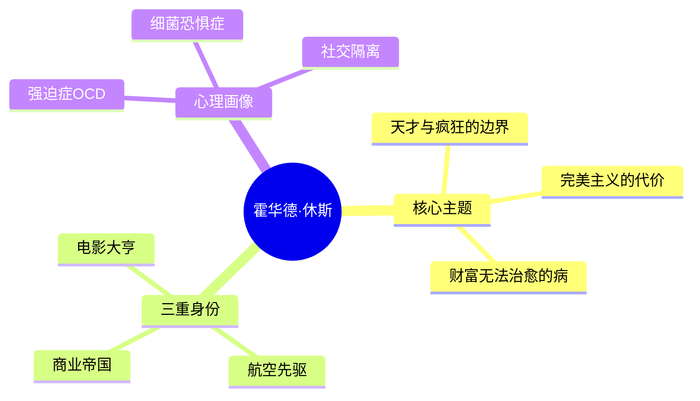

# 《霍华德·休斯：疯狂人生》拆解记录

## 这本书要解决什么问题？

**核心困境**：当无限的财富遇上不受控的精神疾病，会发生什么？

休斯的人生是一个关于完美主义、强迫症和自我毁灭的极端案例。这本书不是成功学，而是一面镜子。

**一句话定位**：
> 美国梦的阴暗面——从世界首富到死于饥饿的隐士，休斯展示了"成功"可能走向的可怕深渊。

### 作者站在什么位置说这些话？

| 维度 | 定位 |
|------|------|
| 主领域 | 传记 × 心理学 × 商业史 |
| 跨界领域 | 精神病学、航空史、电影史 |
| 作者背景 | 唐纳德·巴莱特，调查记者 |
| 历史语境 | 马斯克书单中唯一的"反面教材"——警示性传记 |

### 和其他书有什么关系？

| 关联书籍 | 关联关系 | 共同底层逻辑 |
|----------|----------|--------------|
| [[马斯克传-艾萨克森-拆解记录]] | 对比研究 | 疯狂天才的不同结局：有系统vs没系统 |
| [[本杰明富兰克林传-沃尔特·艾萨克森-拆解记录]] | 对立案例 | 13美德系统vs无系统的自我毁灭 |
| [[爱因斯坦传-沃尔特·艾萨克森-拆解记录]] | 天才原型 | 另一种天才——理性vs失控 |

### 知识网络图

---

## 作者的核心论点

### 完美主义——成就与毁灭的双刃剑

休斯拍《地狱天使》用了3年时间、87架飞机、损失3条人命、花费400万美元（相当于今天7000万美元），成为当时最昂贵的电影。后来H-1飞机打破世界速度纪录，但也让他坠毁险些丧命。

完美主义让他创造了奇迹，但也让他无法接受任何妥协——这是OCD的核心症状。

| 正面表现 | 负面表现 |
|----------|----------|
| H-1飞机打破世界速度纪录 | 飞机坠毁险些丧命 |
| 《地狱天使》成为经典 | 超支3倍、延期2年 |
| 收购TWA开创跨大西洋航线 | 后期管理完全瘫痪 |
| 建立休斯飞机公司 | 30年连续亏损 |

> **极端完美主义定律**：当完美主义超过临界点，它从优势变成致命缺陷。

完美主义就像火——用得好能炼钢，用不好会烧掉整座房子。

### 强迫症——被误解的天才病

休斯晚年用纸巾拿东西、让助手用1小时洗手、把尿液装在瓶子里、指甲长到弯曲。

这不是"怪癖"，而是OCD（强迫症）——大脑化学失衡导致的疾病。他的症状发展有一条清晰的时间线：童年期母亲过度保护，对疾病极度恐惧 → 青年期完美主义表现为工作狂 → 1946年XF-11试飞坠毁，头部重伤，开始依赖止痛药 → 晚年期完全陷入OCD症状，与世隔绝。

> **心理疾病的财富免疫定律**：财富可以买来一切，唯独买不来心理健康。

休斯的悲剧不是他"太有钱"，而是他的病"太严重"——钱只是让他的病表现得更夸张。

### 系统化 vs 混乱——为什么马斯克成功而休斯失败？

休斯收购TWA后让它连续亏损30年，收购RKO电影公司后2年内搞垮。相比之下，马斯克的多家公司都在增长。

| 维度 | 休斯 | 马斯克 |
|------|------|--------|
| 管理方式 | 直觉、冲动、随意 | 算法、原则、系统 |
| 决策依据 | "我感觉" | "数据显示" |
| 团队关系 | 解雇任何人、无人可信任 | 信任核心团队、有明确期望 |
| 精神状态 | 逐渐恶化 | 有起伏但总体稳定 |
| 结局 | 死于营养不良和药物过量 | 多家公司持续创新 |

> **天才可持续性定律**：没有系统化方法论的天才，最终会被自己的混乱吞噬。

同样是疯狂，休斯是被疯狂控制，马斯克是控制疯狂。

这打碎了我对"天才"的迷信——我一直以为天赋和热情就够了，但休斯证明：没有系统的天才，比普通人毁灭得更惨。

### 童年创伤——一切的开始

休斯的母亲对他过度保护，从小让他恐惧疾病和细菌。18岁时父母双亡，他突然继承了巨额财富。

童年的过度保护 + 突然失去父母 + 巨额财富 = 没有任何约束的创伤反应。

> **童年创伤放大定律**：财富会放大而不是治愈童年创伤。

休斯的悲剧从他出生前就开始了——他母亲把自己对疾病的恐惧，完整地"遗传"给了他。

---

## 这本书的局限

| 批评点 | 谁在批评 | 怎么说 |
|--------|---------|--------|
| 商业能力被高估 | 《纽约时报》书评 | "他似乎缺少企业成功的基因"——飞机部门30年连续亏损 |
| 传奇是神话 | 调查记者 | 很多"创新"来自他雇佣的工程师，不是他自己；"白手起家"不成立，18岁继承巨额遗产 |
| 心理疾病的伦理问题 | 伦理学者 | 当一个人有严重心理疾病但拥有无限财富，谁应该干预？制度缺失 |

**一句话总结局限性**：
> 休斯的"传奇"有很大一部分是神话。他的故事更多是警示，而非榜样。

---

## 最值得记住的话

**原书说的**：
1. "他似乎缺少企业成功的基因。"——《纽约时报》书评引用
2. "休斯把自己笼罩在神秘之中，部分是因为公众的关注，但更多是因为他困扰的性格。"
3. "他的助手和医生可能害死了他。"

**翻译成人话**：
1. 完美主义就像火——用得好能炼钢，用不好会烧掉整座房子
2. 同样是疯狂，休斯是被疯狂控制，马斯克是控制疯狂
3. 财富可以买来一切，唯独买不来心理健康
4. 童年创伤会放大，而不会自愈
5. 没有系统化方法论的天才，最终会被自己的混乱吞噬
6. 天才和疯子只有一线之隔——休斯就是那条线
7. 从休斯到马斯克，疯狂天才的故事告诉我们：天赋是礼物，系统是必需品

---

## 讲给没读过的人听

你知道霍华德·休斯吗？20世纪最富有的人之一，电影大亨、航空先驱、商业帝国的掌舵者。

但他也是20世纪最悲惨的人之一。晚年用纸巾拿东西，让助手用1小时洗手，把尿液装在瓶子里。1976年死在飞机上，体重仅90磅，身旁是装满尿液的瓶子。遗产20亿美元。

他的悲剧告诉我们三件事：第一，完美主义超过临界点就会变成致命缺陷。第二，财富买不来心理健康。第三，没有系统化方法论的天才，会被自己的混乱吞噬。

马斯克和休斯有很多相似之处——偏执、完美主义、航空野心。但马斯克有"五步工作法"，有核心团队，有系统。休斯什么都没有。同样是疯狂，马斯克是控制疯狂的人，休斯是被疯狂控制的人。

---

## 用来检验理解的问题

**基础回忆**：
1. Q: 休斯的OCD症状是如何发展的？
   A: 童年母亲过度保护→青年期完美主义工作狂→1946年坠毁头部重伤依赖止痛药→晚年完全陷入OCD。

2. Q: 休斯和马斯克的核心差异是什么？
   A: 休斯缺乏系统化管理，靠直觉冲动决策；马斯克用五步工作法和系统化运营。

**理解验证**：
1. Q: 为什么说"财富放大童年创伤"？
   A: 休斯18岁继承巨额财富，失去所有约束。财富让他可以雇佣只说"是"的人，没人能阻止他毁灭自己。

2. Q: "天赋是礼物，系统是必需品"怎么理解？
   A: 休斯有天赋没系统，最终自我毁灭。马斯克有天赋有系统，持续创新。天赋决定起点，系统决定终点。

---

## 和其他书的对话

马斯克和休斯是"疯狂天才"的正反两面。同样偏执、同样有航空野心、同样挑战极限。但马斯克有系统——五步工作法、核心团队、接受心理帮助。休斯什么都没有——拒绝帮助、不信任任何人、靠直觉决策。马斯克是"受控的疯狂"，休斯是"失控的疯狂"。

富兰克林是休斯的完美反面。富兰克林出身贫寒但有13美德系统；休斯出身富裕却没有任何系统。富兰克林用可视化追踪自己，逐步提升；休斯用完美主义毁灭自己，逐步崩溃。两人结局天差地别：一个是国父受人尊敬，一个是隐士死于营养不良。

达利欧的《原则》提供了休斯最需要的东西——系统化决策方法。达利欧用原则来避免犯错，休斯没有原则所以不断犯错。系统化决定了上限和下限。

---

*拆解日期：2026-03-08*
*下次回访：1周后回顾「讲给没读过的人听」和「检验问题」*