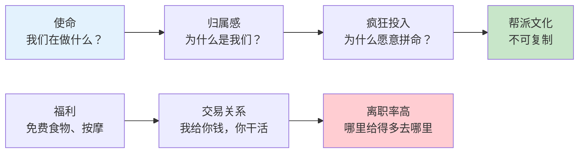
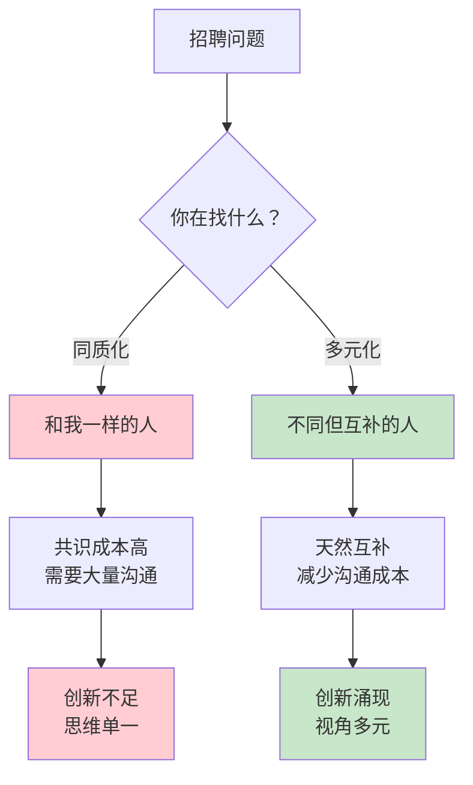
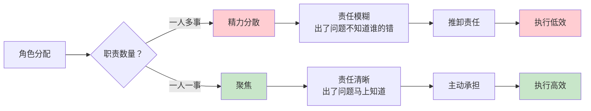

# 第10章《打造帮派文化》深度拆解

> **章节主题**：如何建立独特的初创公司团队文化
> **核心概念**：帮派文化、归属感、招聘
> **拆解日期**：2026-02-28

---

## 一、章节定位

### 1.1 这一章在解决什么问题？

**核心困境**：为什么有些公司员工愿意拼命工作，有些公司员工却在摸鱼？为什么初创公司更需要独特的文化？

彼得·蒂尔的回答是：**初创公司需要"帮派文化"——一种让员工产生强烈归属感的文化，让他们为了共同的使命而战。**

**一句话定位**：
> 文化不是福利和津贴，是让优秀的人愿意和你一起疯狂。

**降维翻译**：
> 别人给钱才干活，帮派成员不给钱也愿意干——因为他们相信你在做的事。

---

### 1.2 这一章在全书的地位

| 维度 | 定位 |
|------|------|
| **章节位置** | 第10章（中后段，组织建设核心） |
| **功能** | 从"打好基础"到"吸引人才"的关键转折 |
| **核心概念** | 帮派文化=归属感+使命感+独特性 |
| **承上启下** | 承接"基础决定命运"，启下"销售与营销" |

**在全书中的角色**：
- **实践指南**：如何建立真正的创业文化
- **人才战略**：如何吸引和留住优秀人才
- **组织建设**：创业公司和大公司的本质区别

---

### 1.3 和主拆解记录的关联

这一章是"如何建立垄断"的人才基础，解释垄断的可持续性：

| 核心概念 | 本章关联 | 实践应用 |
|----------|----------|----------|
| **垄断** | 帮派文化是护城河 | 别人无法复制你的文化 |
| **从0到1** | 帮派文化是从0到1的产物 | 大公司无法建立帮派文化 |
| **长期思维** | 帮派成员愿意长期投入 | 不需要短期激励 |
| **竞争优势** | 人才是最大竞争优势 | 用文化吸引最好的人 |

---

## 二、核心观点（三层提取）

### 观点1：文化不是福利，是使命

#### 【表层】现象层

**蒂尔的观察**：
- 谷歌提供免费食物、按摩、健身房——但这些不是文化
- PayPal没有这些福利，但员工更拼命
- 初创公司模仿大公司的福利，反而迷失了方向
- 真正的文化是让员工相信你在改变世界

**两种文化的对比**：

| 文化类型 | 特点 | 代表 |
|----------|------|------|
| **福利文化** | 免费食物、按摩、健身房 | 大公司、模仿者 |
| **帮派文化** | 使命、归属感、疯狂工作 | PayPal、早期苹果、早期谷歌 |
| **政治文化** | 内斗、站队、推卸责任 | 官僚机构、衰落的公司 |

**具体案例**：

| 公司 | 福利 | 文化 | 结果 |
|------|------|------|------|
| **早期PayPal** | 几乎没有福利 | 帮派文化，改变支付行业 | 孵化多个独角兽 |
| **早期谷歌** | 简单福利 | 帮派文化，组织世界信息 | 持续创新垄断 |
| **衰落期的雅虎** | 丰富福利 | 政治文化，内斗严重 | 被收购 |
| **普通创业公司** | 模仿大公司福利 | 没有真正文化 | 平庸或失败 |

#### 【中层】机制层

**文化的真正含义**：



**帮派文化的三个层次**：

| 层次 | 问题 | 帮派文化的答案 |
|------|------|----------------|
| **使命** | 我们在做什么？ | 改变世界（不是赚钱） |
| **归属** | 为什么是我们？ | 只有我们能做（独特性） |
| **投入** | 为什么拼命？ | 相信使命，不只是为了钱 |

**核心机制**：
```
使命感 → 归属感 → 投入感 → 帮派文化
福利 → 交易关系 → 离职 → 平庸团队
```

#### 【底层】规律层

> **蒂尔帮派定律**：初创公司的文化不是福利和津贴，而是让员工相信你们在做一件独一无二、改变世界的事。

**帮派文化的四要素**：

| 要素 | 定义 | 关键问题 |
|------|------|----------|
| **使命** | 你们在做什么 | 为什么这件事重要？ |
| **独特性** | 为什么是你们 | 只有你们能做吗？ |
| **归属感** | 为什么是我 | 我在这里重要吗？ |
| **疯狂投入** | 为什么拼命 | 除了钱，还有什么？ |

**历史验证**：
- **早期苹果**：改变个人电脑——帮派文化
- **早期谷歌**：组织世界信息——帮派文化
- **早期特斯拉**：加速世界向可持续能源转型——帮派文化
- **普通公司**：赚钱、生存——没有帮派文化

#### 【当下连接】2026场景

|----------|----------|----------|
| 员工为什么摸鱼？ | 你给的只是福利，不是使命 | "原来问题在我" |
| 如何吸引优秀人才？ | 用使命，不是用钱 | "方向错了" |
| 为什么公司做不大？ | 没有帮派文化，留不住人 | "早知道就好了" |
| 2026年AI公司怎么建文化？ | 用改变世界的使命吸引AI人才 | "使命感更重要" |

---

### 观点2：从共识开始——每个人都不同

#### 【表层】现象层

**蒂尔的观察**：
- PayPal的早期员工都是"怪人"——但怪得不一样
- 好的团队是各不相同的人，而不是完全一样的人
- 坏的招聘是"找和我一样的人"
- 初创公司需要独特的人，而不是"标准化的优秀员工"

**两种招聘方式对比**：

| 招聘方式 | 特点 | 结果 |
|----------|------|------|
| **同质化招聘** | 找和自己一样的人 | 思维单一、缺乏创新 |
| **多元化招聘** | 找不同但互补的人 | 思维碰撞、创新涌现 |

**PayPal早期团队的特点**：

| 成员 | 背景 | 独特之处 |
|------|------|----------|
| **蒂尔** | 哲学+法律 | 战略思维、反直觉 |
| **马斯克** | 物理+商业 | 技术狂人、疯狂愿景 |
| **霍夫曼** | 哲学+学术 | 社交网络洞察 |
| **列夫琴** | 技术天才 | 密码学专家 |

#### 【中层】机制层

**"每个人不同"的机制**：



**蒂尔的招聘原则**：

| 原则 | 说明 | 实践 |
|------|------|------|
| **独特性** | 每个人都应该不同 | 问：这个人带来了什么独特价值？ |
| **互补性** | 差异应该互补 | 问：他弥补了我们的什么短板？ |
| **使命认同** | 必须认同使命 | 问：他相信我们在改变世界吗？ |
| **文化匹配** | 必须匹配文化 | 问：他能在我们的文化中茁壮成长吗？ |

**核心机制**：
```
同质化团队 → 共识成本高 → 创新不足 → 平庸
多元化团队 → 天然互补 → 创新涌现 → 卓越
```

#### 【底层】规律层

> **蒂尔招聘定律**：好的团队是由各不相同但互补的人组成的，而不是由完全一样的人组成的。

**招聘的误区**：

| 误区 | 表现 | 后果 |
|------|------|------|
| **找克隆人** | 找和自己一样的人 | 思维单一、盲点相同 |
| **只看简历** | 只看学校、公司背景 | 可能招到"标准化平庸" |
| **忽视独特性** | 不问"他带来什么独特价值" | 团队同质化 |
| **忽视文化** | 只看能力不看文化 | 可能破坏团队文化 |

#### 【当下连接】2026场景

| 场景 | 错误做法 | 正确做法 |
|------|----------|----------|
| **技术招聘** | 只找名校技术大牛 | 找不同背景的技术人才 |
| **AI团队** | 清一色AI博士 | 技术+产品+商业背景混合 |
| **创业团队** | 找自己的朋友 | 找互补但认同使命的人 |
| **扩张期** | 快速招人填补坑位 | 慢下来招对的人 |

---

### 观点3：让每个人只做一件事

#### 【表层】现象层

**蒂尔的观察**：
- 初创公司最容易犯的错误：让员工做太多事
- 每个人应该只负责一件事，并对此全权负责
- 角色清晰 → 责任明确 → 执行高效
- 角色模糊 → 推卸责任 → 执行低效

**两种角色分配方式**：

| 分配方式 | 特点 | 结果 |
|----------|------|------|
| **一人多事** | 让能干的人做很多事 | 精力分散、责任模糊 |
| **一人一事** | 每人只负责一件事 | 聚焦、责任清晰 |

**PayPal的角色分配**：

| 角色 | 负责人 | 唯一职责 |
|------|--------|----------|
| **CEO** | 蒂尔 | 战略和融资 |
| **CTO** | 列夫琴 | 技术架构 |
| **CFO** | 贾维德 | 财务和合规 |
| **产品** | 霍夫曼 | 产品方向 |

#### 【中层】机制层

**"一人一事"的机制**：



**"一人一事"的原则**：

| 原则 | 说明 | 实践 |
|------|------|------|
| **唯一性** | 每个角色只有一个人负责 | 没有"共同负责" |
| **清晰性** | 职责边界清晰 | 每个人知道自己做什么 |
| **全权性** | 对自己的领域全权负责 | 有决策权，不需要事事请示 |
| **问责性** | 出了问题找谁一目了然 | 没有"这是团队的错" |

**核心机制**：
```
一人一事 → 聚焦 → 责任清晰 → 执行高效
一人多事 → 分散 → 责任模糊 → 执行低效
```

#### 【底层】规律层

> **蒂尔角色定律**：在初创公司，每个人应该只做一件事，并对此全权负责。角色清晰是执行力的基础。

**角色设计的陷阱**：

| 陷阱 | 表现 | 后果 |
|------|------|------|
| **共同负责** | 两个人负责同一件事 | 出了问题互相推诿 |
| **角色膨胀** | 一个人负责太多事 | 精力分散、质量下降 |
| **职责模糊** | 边界不清晰 | 重复劳动或遗漏 |
| **缺乏授权** | 事事请示 | 决策缓慢、士气低落 |

#### 【当下连接】2026场景

| 场景 | 错误做法 | 正确做法 |
|------|----------|----------|
| **小团队** | 能干的人多做事 | 每人只做一件事 |
| **扩张期** | 新人不知道做什么 | 明确角色和职责 |
| **远程团队** | 职责模糊 | 更需要清晰的角色 |
| **AI团队** | 工程师什么都做 | 技术、产品、运营分开 |

---

## 三、金句库

### 原书金句（⭐⭐⭐权威来源）

1. "初创公司最重要的优势是新的思维模式。"

2. "好的文化不是福利和津贴，是让员工相信你在改变世界。"

3. "每个人都应该不同，但都要认同使命。"

4. "让每个人只做一件事。"

5. "角色清晰是执行力的基础。"

6. "帮派文化是初创公司独有的，大公司无法复制。"

7. "招聘时问：这个人带来了什么独特价值？"

---

### 降维金句（便于传播，中学生能懂）

8. "文化不是免费午餐，是让人愿意拼命的使命。"

9. "不要找和你一样的人，要找和你不同但互补的人。"

10. "一个人做太多事，什么都做不好。"

11. "责任不清，出了问题没人认。"

12. "帮派文化：别人给钱才干活，我们不给钱也愿意干。"

13. "福利留不住人，使命才能。"

14. "初创公司最大的优势：可以建立帮派文化。"

15. "好团队是怪人组成的，不是克隆人组成的。"

---

## 四、当下映射（2026年场景）

### 财富焦虑连接

| 读者困惑 | 章节答案 | 行动建议 |
|----------|----------|----------|
| 如何留住核心员工？ | 用使命感，不是用钱 | 明确使命，让员工相信 |
| 如何降低离职率？ | 建立帮派文化 | 让员工有归属感 |
| 创业如何招人？ | 找认同使命的人 | 先说使命，再谈薪酬 |

---

### 职场焦虑连接

| 读者困惑 | 章节答案 | 行动建议 |
|----------|----------|----------|
| 如何判断公司好坏？ | 看有没有帮派文化 | 观察员工是否相信使命 |
| 选择什么公司？ | 选择有使命感的公司 | 不只看薪酬，看文化 |
| 为什么工作没动力？ | 可能是缺乏使命感 | 找到相信的使命 |

---

### 创业焦虑连接

| 读者困惑 | 章节答案 | 行动建议 |
|----------|----------|----------|
| 如何建团队文化？ | 用使命，不是福利 | 第一天就明确使命 |
| 如何招聘？ | 找不同但互补的人 | 问：他带来什么独特价值？ |
| 如何分配角色？ | 每人只做一件事 | 角色清晰，责任明确 |

---

## 五、章节关联

### 与《从0到1》其他章节的逻辑链


### 核心逻辑链条

1. **第8章发现秘密**：找到垄断机会
2. **第9章打好基础**：为垄断建立组织基础
3. **第10章打造帮派**：吸引和留住优秀人才
4. **第11章销售营销**：把产品卖给客户

---

### 与已拆解书籍的关联

| 书籍 | 关联逻辑 | 共同底层 |
|------|----------|----------|
| [[精益创业-埃里克·里斯-拆解记录]] | 帮派文化需要MVP验证 | 早期文化决定未来 |
| [[03-Resources/书籍拆解/1-拆解记录/创业维艰-霍洛维茨-拆解记录]] | 帮派文化帮助熬过至暗时刻 | 团队凝聚力决定生存 |
| [[原则-达利欧-拆解记录]] | 原则=文化基础 | 文化是决策框架 |
| [[联盟-里德·霍夫曼]] | 员工和公司是联盟关系 | 现代雇佣关系的本质 |

---

## 六、问答设计（启发式提问）

### 认知觉醒问题

**Q1：你的公司有帮派文化吗？**
- 如果答案是"我们有免费午餐" → 你有的是福利，不是文化
- 如果答案是"我们相信自己在改变世界" → 你可能有帮派文化
- **行动**：问员工"你为什么在这里工作？"

**Q2：你的团队是同质化还是多元化？**
- 如果答案是"我们都差不多" → 可能缺乏创新
- 如果答案是"我们各不相同但互补" → 可能创新力强
- **行动**：招聘时问"这个人带来什么独特价值？"

**Q3：每个员工的职责清晰吗？**
- 如果答案是"大家一起做" → 责任模糊
- 如果答案是"每人只做一件事" → 责任清晰
- **行动**：画一张组织架构图，标明每人职责

---

### 深度思考问题

**Q4：为什么PayPal黑帮这么成功？**
- 帮派文化：使命感强、归属感强
- 多元化：各不相同但互补
- 职责清晰：每人只做一件事
- **启示**：用帮派文化吸引和留住人才

**Q5：2026年AI公司如何建文化？**
- 使命：用AI改变世界，不只是赚钱
- 招聘：找不同背景的AI人才
- 角色：技术、产品、商业分开
- **蒂尔的建议**：别用大公司的福利思维

**Q6：帮派文化和996有什么区别？**
- 996是强制加班，员工是被动的
- 帮派文化是主动投入，员工是自愿的
- 区别在于：使命感 vs 被迫感
- **启示**：用使命感召，不要用制度强迫

---

## 七、执行清单（读完本章立即行动）

### Step 1: 文化诊断（今天完成）

- [ ] 问自己：我们的使命是什么？
- [ ] 问3个员工：你为什么在这里工作？
- [ ] 如果答案只是"赚钱"或"福利好"，你有问题

### Step 2: 招聘审视（本周完成）

- [ ] 检查最近3个招聘：他们带来什么独特价值？
- [ ] 如果答案模糊，招聘策略需要调整
- [ ] 更新招聘标准：独特性+互补性+使命认同

### Step 3: 角色检查（本月完成）

- [ ] 画一张组织架构图
- [ ] 标明每人职责
- [ ] 检查是否有"共同负责"或"一人多事"
- [ ] 调整为"一人一事"

### Step 4: 文化建设（持续进行）

- [ ] 明确使命并不断重复
- [ ] 招聘时筛选文化匹配
- [ ] 创始人以身作则
- [ ] 淘汰不认同使命的人

---

## 九、读者反馈收集点

### 认知冲击点（最可能引发共鸣）

1. **"文化不是福利"**：免费午餐不是文化，使命感才是
2. **"找不同的人"**：不要找克隆人，要找怪人
3. **"一人一事"**：责任清晰是执行力的基础

### 行动触发点（最可能引发行动）

1. **文化诊断**：问员工"你为什么在这里工作？"
2. **招聘审视**：检查最近3个招聘的独特性
3. **角色检查**：画组织架构图，标明每人职责

---
