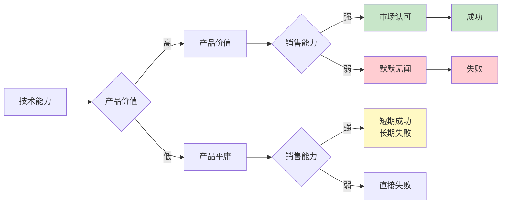
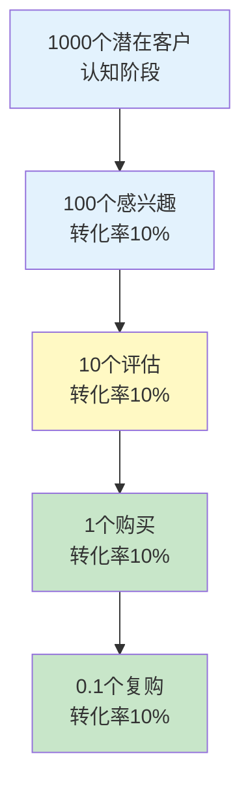
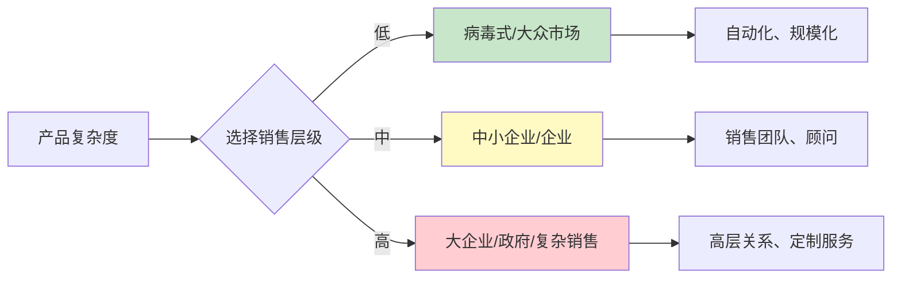
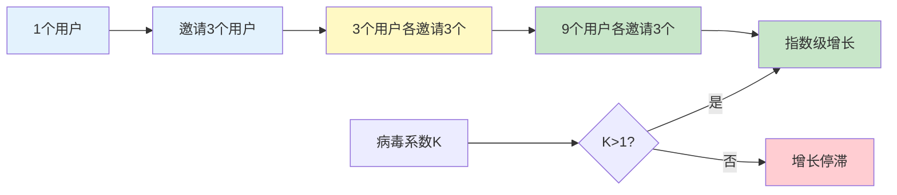
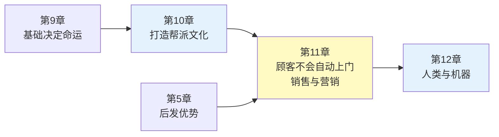

# 第11章《顾客不会自动上门》深度拆解

> **章节主题**：为什么销售和技术一样重要
> **核心概念**：销售漏斗、分销策略、病毒式营销
> **拆解日期**：2026-02-28

---

## 一、章节定位

### 1.1 这一章在解决什么问题？

**核心困境**：为什么那么多优秀的产品失败了？为什么工程师看不起销售，却最终因为不会销售而失败？

彼得·蒂尔的回答是：**好产品不会自己卖出去。销售不是可选项，是必选项。技术再强，不会销售等于零。**

**一句话定位**：
> 如果你的产品需要推销，那你就得推销。顾客不会自动上门。

**降维翻译**：
> 技术天才最容易犯的错：以为好产品会自己卖出去。错了，世界上没有"自动上门"的顾客。

---

### 1.2 这一章在全书的地位

| 维度 | 定位 |
|------|------|
| **章节位置** | 第11章（后段，商业化的关键） |
| **功能** | 从"团队建设"到"产品销售"的必经之路 |
| **核心概念** | 销售漏斗、分销策略、50%定律 |
| **承上启下** | 承接"打造帮派文化"，启下"人类与机器" |

**在全书中的角色**：
- **商业闭环**：从产品到销售的完整链路
- **认知颠覆**：工程师最需要补的一课
- **实践指南**：如何设计销售策略

---

### 1.3 和主拆解记录的关联

这一章是"垄断如何变现"的关键环节：

| 核心概念 | 本章关联 | 实践应用 |
|----------|----------|----------|
| **垄断** | 垄断产品也需要销售 | 好产品≠好销售 |
| **从0到1** | 销售策略也要创新 | 不要照搬大公司的销售模式 |
| **长期思维** | 销售是长期投资 | 每个客户的LTV要大于CAC |
| **竞争优势** | 销售能力是护城河 | 别人可以复制产品，复制不了销售网络 |

---

## 二、核心观点（三层提取）

### 观点1：50%定律——销售和技术一样重要

#### 【表层】现象层

**蒂尔的观察**：
- 工程师普遍看不起销售，认为"好产品会自己卖出去"
- 硅谷的工程师文化，导致销售被严重低估
- 但现实是：没有销售的公司都死了
- 最好的产品往往不是最成功的，最会销售的才是

**两种思维对比**：

| 思维类型 | 信念 | 结果 |
|----------|------|------|
| **工程师思维** | 好产品自己会卖出去 | 产品优秀但销量惨淡 |
| **销售思维** | 产品需要被推销 | 产品也许一般，但销量不错 |
| **蒂尔思维** | 技术和销售各占50% | 技术好+销售好=成功 |

**具体案例**：

| 公司 | 产品质量 | 销售能力 | 结果 |
|------|----------|----------|------|
| **谷歌** | 优秀 | 优秀（广告销售） | 垄断搜索 |
| **苹果** | 优秀 | 优秀（品牌+门店） | 垄断高端手机 |
| **特斯拉** | 优秀 | 优秀（马斯克个人IP） | 电动车霸主 |
| **技术型失败公司** | 优秀 | 差 | 被收购或倒闭 |

#### 【中层】机制层

**50%定律的核心机制**：



**为什么工程师忽视销售**：
1. 销售看起来"不酷"，不够技术范
2. 销售似乎不需要"硬技能"
3. 工程师习惯于"产品说话"
4. 硅谷文化崇尚技术，贬低商业

**核心机制**：
```
技术50% × 销售50% = 成功
技术100% × 销售0% = 失败
技术0% × 销售100% = 短期成功，长期失败
```

#### 【底层】规律层

> **蒂尔50%定律**：技术再重要，销售也一样重要。最好的产品需要最好的销售，否则就会输给更会销售的竞争对手。

**销售的真正含义**：
- 不是"忽悠"，是"传递价值"
- 不是"强迫"，是"教育市场"
- 不是"欺骗"，是"建立信任"

**历史验证**：
- **苹果**：不是最早做智能手机的，但乔布斯是最会推销的
- **特斯拉**：电动车不是马斯克发明的，但他让电动车变得性感
- **SpaceX**：火箭技术不是最先进的，但马斯克让太空变得迷人

#### 【当下连接】2026场景

|----------|----------|----------|
| 产品很好为什么卖不动？ | 你忽视了销售 | "原来如此" |
| 技术大牛创业为什么失败？ | 只有技术没有销售 | "扎心了" |
| AI产品怎么卖？ | AI产品更需要销售 | "方向感" |
| 2026年销售还重要吗？ | 更重要，因为竞争更激烈 | "紧迫感" |

---

### 观点2：销售漏斗——每个客户都要经过筛选

#### 【表层】现象层

**蒂尔的观察**：
- 销售是一个漏斗，不是一蹴而就
- 每个客户都要经过：认知→兴趣→评估→购买→复购
- 不同阶段的转化率不同
- 优化漏斗的每个环节，才能提高整体效率

**销售漏斗的五个阶段**：

| 阶段 | 定义 | 关键指标 |
|------|------|----------|
| **认知** | 客户知道你的存在 | 曝光量、触达率 |
| **兴趣** | 客户对你的产品感兴趣 | 点击率、停留时间 |
| **评估** | 客户比较你和竞争对手 | 询价率、演示请求 |
| **购买** | 客户决定购买 | 转化率、客单价 |
| **复购** | 客户再次购买 | 复购率、LTV |

**漏斗的残酷现实**：



#### 【中层】机制层

**漏斗优化的核心**：

| 优化方向 | 方法 | 效果 |
|----------|------|------|
| **增加入口** | 营销、广告、口碑 | 更多人进入漏斗 |
| **提高转化率** | 优化产品、话术、价格 | 每层漏掉更少的人 |
| **增加客单价** | 增值服务、高端版本 | 每个客户贡献更多 |
| **提高复购率** | 会员、订阅、服务 | 客户终身价值更高 |

**CAC vs LTV公式**：

```
LTV（客户终身价值）> CAC（获客成本）

理想比例：LTV / CAC ≥ 3

如果 LTV < CAC → 每卖一单都在亏钱
```

**漏斗思维vs销售思维**：

| 维度 | 传统销售思维 | 漏斗思维 |
|------|--------------|----------|
| **焦点** | 成交 | 全流程 |
| **指标** | 销售额 | 转化率、LTV |
| **优化** | 销售话术 | 漏斗每层 |
| **客户观** | 一次交易 | 长期关系 |

#### 【底层】规律层

> **蒂尔漏斗定律**：销售是一个漏斗，不是一蹴而就。优化漏斗的每个环节，比单纯追求成交更重要。

**漏斗的数学本质**：
- 如果每层转化率提升10%，整体转化率提升61%（1.1^5）
- 如果每层转化率提升20%，整体转化率提升149%（1.2^5）
- **结论**：优化每个环节，比优化一个环节更有效

**2026年的启示**：
- AI可以优化漏斗的每个环节
- 数据分析让漏斗可视化
- 自动化工具让漏斗更高效

#### 【当下连接】2026场景

| 场景 | 漏斗应用 | 优化方向 |
|------|----------|----------|
| **AI产品** | 免费试用→付费转化 | 提高试用到付费的转化率 |
| **SaaS** | 注册→活跃→付费→续费 | 提高每个环节的转化率 |
| **电商** | 浏览→加购→下单→复购 | 优化购物流程 |
| **知识付费** | 关注→试听→购买→复购 | 内容质量+销售话术 |

---

### 观点3：销售层级——不同产品需要不同销售策略

#### 【表层】现象层

**蒂尔的观察**：
- 不同复杂度的产品，需要不同的销售方式
- 复杂产品需要复杂销售，简单产品可以自动化
- 用错销售方式是致命的
- 初创公司要选择适合自己的销售层级

**七个销售层级**（按复杂度排序）：

| 层级 | 客单价 | 销售方式 | 典型产品 |
|------|--------|----------|----------|
| **1. 病毒式** | 0-100元 | 用户自发传播 | 社交应用、游戏 |
| **2. 大众市场** | 100-1000元 | 大众广告+渠道 | 快消品、手机 |
| **3. 中小企业** | 1000-1万元 | 电话销售+网络 | SaaS工具、软件 |
| **4. 企业** | 1万-10万元 | 专职销售团队 | B2B软件、设备 |
| **5. 大企业** | 10万-100万元 | 高级销售+顾问 | ERP、解决方案 |
| **6. 政府** | 100万+ | 政府关系+投标 | 国防、基础设施 |
| **7. 复杂销售** | 1000万+ | CEO亲自出马 | Palantir、SpaceX |

**销售层级的匹配规则**：



#### 【中层】机制层

**错位销售的后果**：

| 错误匹配 | 后果 | 原因 |
|----------|------|------|
| 简单产品用复杂销售 | 成本过高 | 销售成本超过利润 |
| 复杂产品用简单销售 | 卖不动 | 客户不理解价值 |
| 大企业用大众广告 | 浪费钱 | 决策者看不到广告 |
| 小产品用政府关系 | 没机会 | 不在采购名单上 |

**初创公司的销售选择**：

| 产品类型 | 推荐销售方式 | 原因 |
|----------|--------------|------|
| **消费者应用** | 病毒式传播 | 成本低、可规模化 |
| **SaaS工具** | 免费试用+付费转化 | 降低决策门槛 |
| **B2B软件** | 专职销售团队 | 需要演示和讲解 |
| **企业解决方案** | 顾问式销售 | 需要定制和信任 |

**核心机制**：
```
产品复杂度 ∝ 销售复杂度

简单产品 → 简单销售（病毒式、广告）
复杂产品 → 复杂销售（团队、关系）
```

#### 【底层】规律层

> **蒂尔层级定律**：不同产品需要不同的销售策略。用错销售方式，比没有销售更糟糕。

**销售层级的核心逻辑**：
- **低层级**：自动化、可规模化、边际成本低
- **中层级**：需要销售团队、有一定规模化能力
- **高层级**：依赖关系、无法规模化、边际成本高

**2026年的变化**：
- AI正在模糊层级边界
- 自动化让中层销售变得更高效
- 但高层销售仍然依赖人的关系

#### 【当下连接】2026场景

| 2026产品类型 | 适合的销售层级 | 关键策略 |
|--------------|----------------|----------|
| **AI应用** | 病毒式+中小企业 | 免费试用+网络效应 |
| **企业AI解决方案** | 企业/大企业 | 顾问式销售+案例 |
| **AI咨询服务** | 大企业/复杂销售 | CEO级关系+定制 |
| **AI硬件** | 大众市场+企业 | 品牌+渠道+销售团队 |

---

### 观点4：病毒式营销——最强大的销售方式

#### 【表层】现象层

**蒂尔的观察**：
- 病毒式营销是最强大的销售方式
- 产品自带传播性，用户帮你推销
- 社交网络让病毒式传播成为可能
- 不是所有产品都能病毒式传播

**病毒式传播的条件**：

| 条件 | 说明 | 案例 |
|------|------|------|
| **网络效应** | 用户越多，产品越好用 | 微信、抖音 |
| **社交货币** | 使用产品能炫耀 | iPhone、特斯拉 |
| **分享激励** | 分享有奖励 | 拼多多、Dropbox |
| **低门槛** | 容易上手 | TikTok、Instagram |

**病毒式vs传统销售的对比**：

| 维度 | 传统销售 | 病毒式传播 |
|------|----------|------------|
| **获客成本** | 高 | 极低 |
| **规模化** | 受限于销售团队 | 几乎无限 |
| **信任度** | 需要建立 | 用户背书 |
| **速度** | 慢 | 快 |
| **适用产品** | 所有产品 | 特定产品 |

#### 【中层】机制层

**病毒式传播的机制**：



**病毒系数（K值）**：
- K = 每个用户带来的新用户数
- K > 1 → 指数级增长
- K = 1 → 线性增长
- K < 1 → 增长停滞

**提高K值的方法**：

| 方法 | 机制 | 案例 |
|------|------|------|
| **分享奖励** | 邀请好友得优惠 | 拼多多、滴滴 |
| **社交炫耀** | 使用产品显身份 | iPhone、奢侈品 |
| **协作需求** | 需要邀请朋友 | Zoom、Notion |
| **内容裂变** | 分享有价值内容 | 抖音、小红书 |

#### 【底层】规律层

> **蒂尔病毒定律**：如果一个产品的病毒系数K>1，它将实现指数级增长，这是最强大的销售方式。

**病毒式传播的本质**：
- 用户成为你的销售员
- 获客成本趋近于零
- 规模化能力无限

**病毒式传播的限制**：
- 不是所有产品都能病毒式传播
- 高客单价产品很难病毒式
- 复杂产品需要解释，不适合病毒式

#### 【当下连接】2026场景

| 2026产品类型 | 病毒式潜力 | 策略 |
|--------------|------------|------|
| **AI社交应用** | 高 | 分享生成内容 |
| **AI工具** | 中 | 免费版+分享功能 |
| **AI教育** | 中 | 课程分享+推荐奖励 |
| **AI企业软件** | 低 | 需要销售团队 |

---

## 三、金句库

### 原书金句（⭐⭐⭐权威来源）

1. "顾客不会自动上门。"

2. "如果你的产品需要推销，那你就得推销。"

3. "销售不是可选项，是必选项。"

4. "技术再重要，销售也一样重要。"

5. "最好的产品需要最好的销售。"

6. "病毒式营销是最强大的销售方式。"

7. "销售漏斗：认知→兴趣→评估→购买→复购。"

8. "不同产品需要不同的销售策略。"

---

### 降维金句（便于传播，中学生能懂）

9. "好产品不会自己卖，你得去卖。"

10. "技术天才最容易犯的错：以为好产品不需要销售。"

11. "销售不是忽悠，是让人知道你的好。"

12. "顾客不会自己找上门，你得去找他们。"

13. "产品是子弹，销售是枪。没枪，子弹再好也打不出去。"

14. "50%定律：技术50分，销售也要50分。"

15. "病毒式传播：用户帮你卖，不用自己卖。"

16. "销售漏斗：1000人看到，100人感兴趣，10人评估，1人购买。"

---

## 四、当下映射（2026年场景）

### 财富焦虑连接

| 读者困惑 | 章节答案 | 行动建议 |
|----------|----------|----------|
| 产品很好为什么不赚钱？ | 你忽视了销售 | 学习销售，建立销售流程 |
| 技术创业怎么卖产品？ | 选择适合的销售层级 | 根据客单价和复杂度选择 |
| 如何降低获客成本？ | 病毒式传播 | 设计产品自带传播性 |

---

### 职场焦虑连接

| 读者困惑 | 章节答案 | 行动建议 |
|----------|----------|----------|
| 工程师要不要学销售？ | 要，50%定律 | 销售和技术一样重要 |
| 如何在公司内推动产品？ | 内部也需要销售 | 学会向内部"推销"你的想法 |
| 为什么有些PPT写得好但没人听？ | 缺乏销售思维 | 学会"推销"你的方案 |

---

### 创业焦虑连接

| 读者困惑 | 章节答案 | 行动建议 |
|----------|----------|----------|
| AI产品怎么卖？ | 选择合适的销售层级 | SaaS用免费试用，企业用顾问式销售 |
| 如何设计销售漏斗？ | 认知→兴趣→评估→购买→复购 | 优化每个环节的转化率 |
| 如何实现病毒式增长？ | 设计传播机制 | 分享奖励、社交炫耀、协作需求 |

---

## 五、章节关联

### 与《从0到1》其他章节的逻辑链



### 核心逻辑链条

1. **第5章后发优势**：垄断带来定价权
2. **第9章打好基础**：为垄断建立组织基础
3. **第10章打造帮派**：吸引销售人才
4. **第11章销售营销**：把产品卖给客户
5. **第12章人类与机器**：AI时代的销售变化

---

### 与已拆解书籍的关联

| 书籍 | 关联逻辑 | 共同底层 |
|------|----------|----------|
| [[精益创业-埃里克·里斯-拆解记录]] | MVP验证需要销售思维 | 产品需要市场验证 |
| [[创业维艰-霍洛维茨-拆解记录]] | 销售是创业的生死线 | 创业必须会销售 |
| [[纳瓦尔宝典-乔根森-拆解记录]] | 销售是杠杆的一种 | 用杠杆放大能力 |
| [[影响力-西奥迪尼]] | 销售的本质是影响力 | 影响力六大原则 |

---

## 六、问答设计（启发式提问）

### 认知觉醒问题

**Q1：你的产品有销售策略吗？**
- 如果答案是"产品会自己卖" → 你可能有危险
- 如果答案是"我们有销售团队/渠道" → 你在正确轨道
- **行动**：写下你的销售漏斗和转化率

**Q2：你用对了销售层级吗？**
- 客单价<100元 → 考虑病毒式传播
- 客单价1000-10万 → 考虑销售团队
- 客单价>100万 → 考虑高层关系
- **行动**：检查你的销售方式是否匹配产品

**Q3：你的病毒系数K是多少？**
- K>1 → 指数级增长
- K≈1 → 线性增长
- K<1 → 增长停滞
- **行动**：计算并优化你的K值

---

### 深度思考问题

**Q4：为什么苹果卖得好？**
- 产品优秀（技术50%）
- 品牌强大、门店体验、发布会营销（销售50%）
- **启示**：技术和销售缺一不可

**Q5：2026年AI产品怎么卖？**
- 竞争激烈，销售更重要
- 免费试用+付费转化是主流
- 企业级AI需要顾问式销售
- **蒂尔的建议**：选择适合的销售层级

**Q6：销售和产品哪个更重要？**
- 蒂尔的答案：各占50%
- 产品是基础，销售是放大器
- 好产品+好销售=成功
- **启示**：不要只做产品，也要学销售

---

## 七、执行清单（读完本章立即行动）

### Step 1: 销售策略诊断（今天完成）

- [ ] 写下你的销售漏斗：认知→兴趣→评估→购买→复购
- [ ] 计算每层转化率
- [ ] 识别最需要优化的环节

### Step 2: 销售层级匹配（本周完成）

- [ ] 确定你的产品客单价
- [ ] 确定你的产品复杂度
- [ ] 选择匹配的销售层级
- [ ] 检查是否错位销售

### Step 3: 病毒式潜力评估（本周完成）

- [ ] 计算你的病毒系数K
- [ ] 如果K<1，分析原因
- [ ] 设计提高K值的策略

### Step 4: CAC vs LTV计算（本月完成）

- [ ] 计算你的获客成本CAC
- [ ] 计算你的客户终身价值LTV
- [ ] 确保LTV > CAC × 3
- [ ] 如果不满足，优化销售策略

### Step 5: 销售能力建设（持续进行）

- [ ] 学习销售基础知识
- [ ] 建立销售流程和话术
- [ ] 招聘或培养销售人才
- [ ] 持续优化销售漏斗

---

## 九、读者反馈收集点

### 认知冲击点（最可能引发共鸣）

1. **"50%定律"**：技术再重要，销售也一样重要
2. **"顾客不会自动上门"**：好产品不等于好销量
3. **"销售层级匹配"**：用错销售方式比没有销售更糟糕

### 行动触发点（最可能引发行动）

1. **销售策略诊断**：写下你的销售漏斗
2. **CAC vs LTV**：计算并确保LTV > CAC × 3
3. **病毒系数**：计算你的K值，优化传播机制

---
