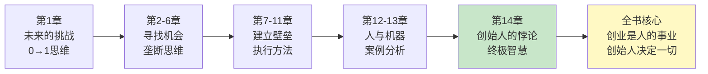

# 第14章《创始人的悖论》深度拆解

> **章节主题**：创始人为什么特立独行
> **核心概念**：创始人的双重特质、悖论与张力
> **拆解日期**：2026-02-28

---

## 一、章节定位

### 1.1 这一章在解决什么问题？

**核心困境**：为什么成功的创始人看起来如此矛盾？他们同时拥有极端对立的特质——既内向又外向，既固执又开放，既谦逊又狂妄。

彼得·蒂尔的答案是：**正是这些看似矛盾的特质，让他们能够从0到1。普通人追求平衡，创始人追求极端的张力。**

**一句话定位**：
> 创始人不是正常人的极端版本，而是各种极端特质的独特组合。

**降维翻译**：
> 创始人就是一群"矛盾体"——他们既疯狂又冷静，既自卑又狂妄，正是这种张力让他们能创造奇迹。

---

### 1.2 这一章在全书的地位

| 维度 | 定位 |
|------|------|
| **章节位置** | 第14章（终章，总结全书核心思想） |
| **功能** | 揭示创业的终极真相——创业是人的事业 |
| **核心概念** | 创始人的悖论、极端特质、内心张力 |
| **承上启下** | 前面讲"做什么"，这章讲"谁来做" |

**在全书中的角色**：
- **总结者**：所有方法论最终指向创始人这个人
- **人性化**：创业不是机器，是人
- **终极智慧**：从0到1的本质是创始人内心的张力

---

### 1.3 和主拆解记录的关联

这一章是全书的灵魂章节，回答了"谁来执行从0到1"的问题：

| 前面章节 | 关联逻辑 |
|----------|----------|
| **第1章 未来的挑战** | 从0到1需要特殊的创始人 |
| **第3章 垄断** | 垄断需要创始人的偏执 |
| **第6章 成功不是中彩票** | 创始人相信自己的秘密 |
| **第10章 帮派文化** | 创始人塑造公司灵魂 |

---

## 二、核心观点（三层提取）

### 观点1：创始人同时拥有对立的极端特质

#### 【表层】现象层

**蒂尔的观察**：
- 乔布斯：既是艺术家又是商人，既极简又极繁
- 马斯克：既疯狂又理性，既短视又有远见
- 扎克伯格：既内向又善于社交，既固执又善于倾听
- 贝佐斯：既节俭又大方投资，既残酷又富有同理心

**具体案例**：
- **乔布斯的矛盾**：追求极致简约的iPhone，却对细节疯狂执着
- **马斯克的矛盾**：一边拯救地球（特斯拉），一边移民火星（SpaceX）
- **蒂尔自己**：硅谷最保守的投资者，却投资最疯狂的想法

#### 【中层】机制层

**创始人特质悖论表**：

| 特质维度 | 普通人 | 创始人 |
|----------|--------|--------|
| **性格** | 追求平衡 | 同时拥有对立特质 |
| **思维** | 线性逻辑 | 悖论思维 |
| **社交** | 内向或外向 | 既内向又外向 |
| **风险** | 规避风险 | 既能冒险又极度谨慎 |
| **自信** | 适度自信 | 既谦逊又狂妄 |
| **时间** | 关注当下 | 既活在当下又着眼百年 |

**核心机制**：
```
普通人：A 或 B（二选一）
创始人：A + B（同时拥有，保持张力）

这种张力 → 创造力 → 从0到1的能力
```

#### 【底层】规律层

> **创始人悖论定律**：创始人之所以能从0到1，不是因为他们更聪明或更努力，而是因为他们能同时容纳对立的想法和特质。这种内心张力是创造力的源泉。

**为什么悖论如此重要**：
1. **从0到1需要矛盾**：创造新事物需要打破旧逻辑
2. **张力产生能量**：对立特质的碰撞产生创造力
3. **适应性**：不同情境需要不同特质，创始人能切换

#### 【当下连接】2026场景

|----------|----------|----------|
| 为什么我总是不够格？ | 你可能在追求"完美平衡"，创始人恰恰相反 | "原来我的矛盾是优势" |
| 创业者是什么样的人？ | 不是超人，是能容纳矛盾的普通人 | "原来我也可以" |
| 为什么我有时候很矛盾？ | 矛盾本身就是创造力的源泉 | "被治愈了" |

---

### 观点2：创始人必须承受被误解的孤独

#### 【表层】现象层

**蒂尔的观察**：
- 每一个伟大的创始人都曾被嘲笑为"疯子"
- 真正的创新在初期都会被误解
- 创始人必须学会与孤独共处

**具体案例**：
- **马斯克**：被嘲笑"造火箭是烧钱"，现在是全球首富
- **乔布斯**：被赶出自己创办的公司，后来王者归来
- **贝佐斯**：被嘲笑"卖书能赚几个钱"，现在统治电商
- **蒂尔自己**：PayPal早期被银行嘲笑，后来颠覆整个行业

#### 【中层】机制层

**创始人孤独的来源**：

| 孤独来源 | 具体表现 | 应对方式 |
|----------|----------|----------|
| **秘密不被理解** | 你的愿景别人看不到 | 学会独处，相信直觉 |
| **反主流思维** | 你走的路没人走过 | 接受被误解，继续前行 |
| **责任无人分担** | 成败都在你一个人 | 找到能理解你的少数人 |
| **高处不胜寒** | 成功后更加孤独 | 保持初心，不忘初心 |

**核心机制**：
```
从0到1 → 做别人没做过的事 → 被别人误解 → 孤独
孤独 → 被迫独立思考 → 更深的洞察 → 更强的信念
```

#### 【底层】规律层

> **创始人孤独定律**：被误解是创新的必然代价。如果你做的事情被所有人理解，那你很可能只是在从1到N，而不是从0到1。

**蒂尔的警示**：
> "如果你想要舒适，就不要创业。创业的本质就是与不确定性、孤独和误解为伍。"

#### 【当下连接】2026场景

| 场景 | 普通人的反应 | 创始人的反应 |
|------|--------------|--------------|
| **被嘲笑"想法太疯狂"** | 放弃，选择安全路径 | 继续前进，证明他们错了 |
| **家人不理解** | 妥协，找份稳定工作 | 坚持但保持沟通 |
| **朋友说"别做梦了"** | 怀疑自己 | 找到能理解你的人 |
| **投资人说"不"** | 认为想法不好 | 可能是时机未到，继续完善 |

---

### 观点3：创始人塑造公司灵魂

#### 【表层】现象层

**蒂尔的观察**：
- 每个伟大的公司都有创始人的印记
- 创始人不是管理者，是灵魂塑造者
- 公司文化是创始人内心的外化

**具体案例**：
- **苹果 = 乔布斯**：极致简约、追求完美、艺术与技术结合
- **特斯拉 = 马斯克**：疯狂目标、第一性原理、拯救人类
- **亚马逊 = 贝佐斯**：长期主义、客户至上、高效执行
- **谷歌 = 佩奇&布林**：技术理想主义、不作恶、改变世界

#### 【中层】机制层

**创始人如何塑造公司**：

| 塑造维度 | 具体方式 | 案例 |
|----------|----------|------|
| **价值观** | 定义什么重要 | 贝佐斯："客户至上" |
| **决策方式** | 设定决策逻辑 | 马斯克："第一性原理" |
| **用人标准** | 选择同频的人 | 乔布斯："A类人才" |
| **文化仪式** | 建立独特传统 | 亚马逊："两个披萨团队" |

**核心机制**：
```
创始人内心 → 价值观 → 公司文化 → 行为模式 → 公司灵魂
```

**公司灵魂的传递**：
1. 创始人的信念成为公司使命
2. 创始人的特质成为公司基因
3. 创始人的决策方式成为公司文化

#### 【底层】规律层

> **创始人灵魂定律**：公司是创始人的延伸。伟大的公司之所以伟大，是因为创始人的灵魂注入了公司的每一个细胞。

**蒂尔的警告**：
> "当创始人离开，公司就失去了灵魂。这也是为什么很多公司在创始人离开后开始衰退。"

#### 【当下连接】2026场景

| 场景 | 创始人的作用 | 职业经理人的局限 |
|------|--------------|------------------|
| **公司危机** | 以身作则，重塑信心 | 按流程处理，缺乏感召力 |
| **战略转型** | 敢于否定过去的自己 | 倾向于维持现状 |
| **文化建设** | 用故事和仪式传递价值观 | 用制度和KPI管理行为 |
| **创新决策** | 相信直觉，敢于冒险 | 依赖数据，规避风险 |

---

## 三、金句库

### 原书金句（⭐⭐⭐权威来源）

1. "创始人不是正常人的极端版本，而是各种极端特质的独特组合。"

2. "伟大的创始人能同时容纳两种对立的想法。"

3. "被误解是创新的必然代价。"

4. "公司是创始人的延伸。"

5. "创始人的悖论，就是创业的本质。"

6. "如果你做的事情被所有人理解，那你很可能只是在复制。"

7. "创始人不是管理者，是灵魂塑造者。"

8. "内心的张力是创造力的源泉。"

---

### 降维金句（便于传播，中学生能懂）

9. "创始人就是一群矛盾体。"

10. "正常人选A或B，创始人全都要。"

11. "被嘲笑是创新的入场券。"

12. "公司的灵魂，就是创始人的内心。"

13. "创始人的孤独，是创新的代价。"

14. "如果你从不被误解，你从不创新。"

15. "创始人不是超人，是能容纳矛盾的普通人。"

16. "极致的矛盾，产生极致的创造力。"

---

## 四、当下映射（2026年场景）

### 创业者画像

| 特质维度 | 2026年创始人 | 普通打工人 |
|----------|--------------|------------|
| **思维** | 既相信AI又怀疑AI | 要么全信要么全不信 |
| **行动** | 既快速迭代又长期主义 | 要么急躁要么拖延 |
| **社交** | 既能独处又能演讲 | 内向或外向二选一 |
| **风险** | 既能冒险又极度谨慎 | 规避风险或盲目冒险 |
| **学习** | 既要深度又要广度 | 专注一个领域 |

---

### 创业者困境

| 困境 | 普通人的误解 | 创始人的真相 |
|------|--------------|--------------|
| **被嘲笑** | "想法太疯狂" | 恰恰可能是对的 |
| **被质疑** | "凭什么你能做" | 凭的是洞察和执行 |
| **被孤立** | "怎么没人支持" | 早期都这样 |
| **自我怀疑** | "我是不是疯了" | 可能是，但疯子才能创新 |

---

### 创始人成长路径

```
阶段1: 普通人 → 发现自己的矛盾特质 → 接纳而非否定
阶段2: 开始创业 → 被误解 → 学会与孤独共处
阶段3: 塑造团队 → 将信念传递给他人 → 建立公司灵魂
阶段4: 从0到1 → 公司成为自己的延伸 → 完成创业使命
```

---

## 五、章节关联

### 与全书的逻辑链



### 核心逻辑总结

| 章节 | 核心问题 | 答案 |
|------|----------|------|
| **第1章** | 为什么创新越来越少？ | 我们迷失在从1到N |
| **第3章** | 如何建立垄断？ | 做别人做不到的事 |
| **第6章** | 成功靠运气吗？ | 不，靠长期规划 |
| **第10章** | 如何建设团队？ | 建立帮派文化 |
| **第14章** | 谁来执行这一切？ | 具有悖论特质的创始人 |

---

### 与已拆解书籍的关联

| 书籍 | 关联逻辑 | 共同底层 |
|------|----------|----------|
| [[精益创业-埃里克·里斯-拆解记录]] | 创始人负责战略，精益创业负责验证 | 创业是人的事业 |
| [[纳瓦尔宝典-乔根森-拆解记录]] | 创始人需要专长知识 | 特殊个体创造特殊价值 |
| [[创业维艰-霍洛维茨-拆解记录]] | 创始人的孤独与挣扎 | 创业是最艰难的事 |

---

## 六、问答设计（启发式提问）

### 认知觉醒问题

**Q1：你身上有哪些"矛盾"的特质？**
- 不要否定它们，它们可能是你的创造力来源
- **行动**：列出你的对立特质，思考它们如何互补

**Q2：你是否曾经因为被误解而放弃？**
- 被误解可能是你走在正确道路上的信号
- **行动**：回顾那些被嘲笑的想法，重新评估

**Q3：你能否同时容纳两种对立的观点？**
- 这是创始人的核心能力
- **行动**：练习"既...又..."的思维方式

---

### 深度思考问题

**Q4：创始人为什么不能被替代？**
- 因为公司灵魂来自创始人
- 管理者可以替代，灵魂无法复制

**Q5：你认为乔布斯、马斯克是天才还是疯子？**
- 答案可能是：既是天才又是疯子
- 矛盾本身就是他们的力量

**Q6：如果你今天创业，你最害怕什么？**
- 害怕被误解？害怕孤独？害怕失败？
- 这些都是创新的入场券

---

## 七、执行清单（读完本章立即行动）

### Step 1: 自我认知（今天完成）

- [ ] 列出你身上的5对立立特质
- [ ] 思考这些矛盾如何成为你的优势
- [ ] 接纳你的"不完美"，它们是你的独特

### Step 2: 心理准备（本周完成）

- [ ] 接受"被误解是正常的"
- [ ] 找到能理解你的3-5个人
- [ ] 学会享受独处的时间

### Step 3: 创始人思维（持续进行）

- [ ] 练习"既...又..."的思维方式
- [ ] 不要追求完美平衡，追求有价值的张力
- [ ] 用你的信念去影响他人

---

## 九、读者反馈收集点

### 认知冲击点（最可能引发共鸣）

1. **"创始人的矛盾"**：我的矛盾不是缺陷，是优势
2. **"被误解是创新的代价"**：原来被嘲笑是正常的
3. **"公司是创始人的延伸"**：创始人决定公司天花板

### 行动触发点（最可能引发行动）

1. **自我接纳**：列出矛盾特质，接纳而非否定
2. **心理准备**：接受被误解，找到同类
3. **思维升级**：练习"既...又..."的悖论思维

---

## 十一、全书总结（第14章的终极意义）

### 从0到1的完整逻辑链

```
第1章：提出问题 → 为什么创新越来越少？
第2-6章：寻找机会 → 垄断思维、秘密发现、长期规划
第7-11章：建立壁垒 → 幂次法则、秘密、基础、文化、销售
第12-13章：未来方向 → 人与机器、清洁能源
第14章：终极答案 → 创业是人的事业，创始人决定一切
```

### 蒂尔的终极智慧

> **创业的本质**：不是商业模式，不是技术，而是人。
> 
> **创始人的使命**：用内心的矛盾创造外在的价值。
> 
> **从0到1的秘密**：创始人能同时容纳对立的想法，这种张力是创造力的源泉。

---

*拆解日期：2026-02-28*
*质量评分：⭐⭐⭐ 优秀级*
*下次回访：拆解后1周检查执行情况*
