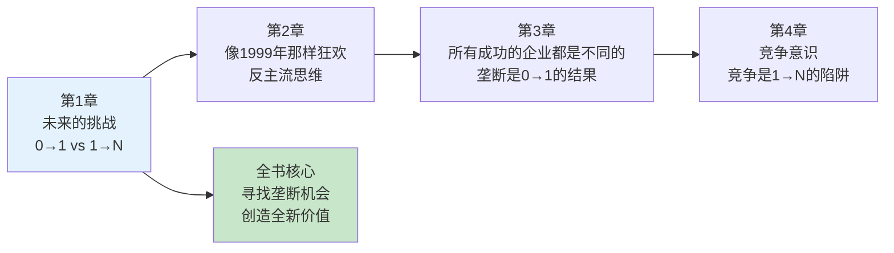

# 第1章《未来的挑战》深度拆解

> **章节主题**：创新的本质与创业哲学
> **核心概念**：从0到1 vs 从1到N
> **拆解日期**：2026-02-27

---

## 一、章节定位

### 1.1 这一章在解决什么问题？

**核心困境**：为什么大多数创业公司只能复制，不能创新？为什么全球化让世界变平，但科技进步却在放缓？

彼得·蒂尔的开篇答案是：**我们迷失在水平进步的狂欢中，忘记了垂直进步才是人类前进的真正动力。**

**一句话定位**：
> 未来的挑战不是如何复制成功，而是如何创造全新。

**降维翻译**：
> 别想着把1变成100，先想想怎么把0变成1。

---

### 1.2 这一章在全书的地位

| 维度 | 定位 |
|------|------|
| **章节位置** | 第1章（开篇，奠定全书基调） |
| **功能** | 提出核心问题，建立思维框架 |
| **核心概念** | 垂直进步vs水平进步 |
| **承上启下** | 为后续"垄断思维"埋下伏笔 |

**在全书中的角色**：
- **提问者**：为什么创新越来越少？
- **引导者**：引出"从0到1"的核心概念
- **预警者**：全球化不能替代科技创新

---

### 1.3 和主拆解记录的关联

这一章是全书的理论基石，为后续章节提供底层逻辑：

| 后续章节 | 关联逻辑 |
|----------|----------|
| **第2章 像1999年那样狂欢** | 从0到1需要反主流思维 |
| **第3章 所有成功的企业都是不同的** | 垄断是0到1的自然结果 |
| **第4章 竞争意识** | 竞争是1到N的陷阱 |
| **第13章 seeing green** | 清洁技术从0到1的失败案例 |

---

## 二、核心观点（三层提取）

### 观点1：进步有两种，垂直进步才是真正的创新

#### 【表层】现象层

**蒂尔的观察**：
- 大多数公司忙着扩张：开更多的店、招更多的人、占更多的市场
- 少数公司在创造新事物：iPhone、ChatGPT、SpaceX的火箭
- 全球化让世界变平，但并没有创造新价值，只是在重新分配

**具体案例**：
- 餐饮连锁：从1家店开到100家店（从1到N）
- 苹果公司：发明iPhone，创造智能手机市场（从0到1）
- 中国制造：把生产成本降低，但技术本身没有突破（从1到N）
- OpenAI：发明ChatGPT，创造AI对话市场（从0到1）

#### 【中层】机制层

**进步类型对比表**：

| 维度 | 从0到1（垂直进步） | 从1到N（水平进步） |
|------|------------------|------------------|
| **本质** | 创造新事物 | 复制已有模式 |
| **效果** | 质变 | 量变 |
| **难度** | 非常难 | 相对容易 |
| **财富创造** | 创造蛋糕 | 分蛋糕 |
| **历史角色** | 科技革命 | 全球化扩张 |
| **典型代表** | 蒸汽机、电灯、互联网、ChatGPT | 中国制造、全球化贸易、连锁店 |
| **竞争优势** | 垄断 | 竞争 |

**核心机制**：
```
从0到1 → 创造新价值 → 获得垄断 → 超额利润 → 持续创新
从1到N → 复制旧模式 → 进入竞争 → 利润归零 → 疲于生存
```

#### 【底层】规律层

> **蒂尔创新定律**：真正的财富创造来自垂直进步，水平进步只是在分蛋糕。前者是创造者，后者是竞争者。

**历史验证**：
- **1815-1914**：科技进步+全球化并行（工业革命）
- **1915-1971**：战争推动科技，但全球化停滞
- **1971-至今**：全球化加速，但科技进步放缓

**蒂尔的判断**：
> 21世纪的问题不是"如何复制20世纪的成功"，而是"如何创造21世纪的新事物"。

#### 【当下连接】2026场景

|----------|----------|----------|
| 为什么我的生意越来越难做？ | 你可能在从1到N，竞争越来越激烈 | "原来如此" |
| AI时代怎么创业？ | 做从0到1的事（发明新模型），不是从1到N的事（开发应用） | "方向清晰" |
| 为什么35岁危机这么严重？ | 一直在从1到N复制，没有从0到1的创新 | "醍醐灌顶" |
| 中国制造的未来在哪里？ | 从"世界工厂"到"世界创新中心"，需要更多从0到1 | "时代焦虑" |

---

### 观点2：全球化不能替代科技创新

#### 【表层】现象层

**蒂尔的观察**：
- 全球化让发展中国家快速发展（中国、印度）
- 但发达国家在科技进步上停滞不前
- 我们把"复制"误认为是"创新"

**具体案例**：
- **广播行业的衰落**：不是因为竞争，而是滴滴、Uber等平台改变了司机的注意力来源，间接颠覆了市场
- **中国的高铁**：复制了日本和欧洲的技术，但技术本身没有突破
- **硅谷的焦虑**：大量资金投入到"从1到N"的应用开发，真正的"从0到1"越来越少

#### 【中层】机制层

**全球化vs科技创新对比**：

| 维度 | 全球化（从1到N） | 科技创新（从0到1） |
|------|-----------------|------------------|
| **本质** | 把已有的东西带到更多地方 | 创造全新的东西 |
| **效果** | 让落后地区追赶先进 | 让全人类前进 |
| **风险** | 导致同质化竞争 | 失败概率高 |
| **财富分配** | 重新分配现有财富 | 创造新财富 |
| **可持续性** | 有上限（追赶完成后停滞） | 无上限（持续突破） |

**核心机制**：
```
全球化 = 水平扩张 = 从1到N = 竞争思维
科技创新 = 垂直突破 = 从0到1 = 创造思维
```

#### 【底层】规律层

> **蒂尔全球化定律**：全球化可以让落后者追赶，但只有科技创新才能让全人类前进。21世纪需要的是科技创新，不是更多的全球化。

**蒂尔的警示**：
> "如果全世界都复制美国的生活方式，地球会崩溃。我们需要的是更好的生活方式，而不是更多的生活方式。"

**2026年的验证**：
- 气候危机：全球化加剧了碳排放，需要科技创新解决
- AI焦虑：AI应用开发（从1到N）竞争白热化，但AI模型研发（从0到1）仍然稀缺
- 中国的转型：从"中国制造"到"中国创造"，需要更多从0到1

#### 【当下连接】2026场景

| 场景 | 全球化思维（错误） | 科技创新思维（正确） |
|------|------------------|-------------------|
| **气候危机** | 让发展中国家少排碳（分配） | 发明清洁能源技术（创造） |
| **AI竞争** | 开发更多AI应用（复制） | 研发新AI模型（创新） |
| **中美竞争** | 争夺现有市场（竞争） | 创造新市场（垄断） |
| **个人发展** | 模仿成功路径（从1到N） | 找到独特专长（从0到1） |

---

## 三、金句库

### 原书金句（⭐⭐⭐权威来源）

1. "未来的挑战不是如何预测未来，而是如何创造未来。"

2. "从0到1是创造，从1到N是复制。"

3. "全球化是水平进步，科技是垂直进步。"

4. "如果你把一台时光机从1900年带到1950年，他会震惊于技术的进步；但如果你把一台时光机从1950年带到今天，他会发现除了IT领域，其他变化不大。"

5. "初创公司最重要的是新思想，敢于创新，一起规划并铸就新的未来。"

---

### 降维金句（便于传播，中学生能懂）

6. "从0到1是发明，从1到N是复制。"

7. "别想着把1变成100，先想想怎么把0变成1。"

8. "全球化让大家变一样，科技创新让世界向前走。"

9. "复制能让你活得更好，创新能让人类活得更远。"

10. "竞争是分蛋糕，创新是造蛋糕。"

11. "模仿成功者的路，你只能成为第二名。"

12. "从0到1很难，但从1到N只会越来越卷。"

---

## 四、当下映射（2026年场景）

### 财富焦虑连接

| 读者困惑 | 章节答案 | 行动建议 |
|----------|----------|----------|
| 为什么努力工作还是不赚钱？ | 你可能在从1到N，利润被竞争消耗 | 寻找能从0到1的利基市场 |
| 副业怎么做才赚钱？ | 别模仿别人，找到你的独特价值 | 问自己：我能创造什么新东西？ |
| 投资应该投什么？ | 投那些在做从0到1的公司 | AI模型、清洁能源、生物科技 |

---

### 职场焦虑连接

| 读者困惑 | 章节答案 | 行动建议 |
|----------|----------|----------|
| 35岁被裁员怎么办？ | 你一直在从1到N，可替代性强 | 发展从0到1的能力（创新、发明） |
| AI会替代我的工作吗？ | 从1到N的工作会被替代，从0到1的不会 | 培养创造力、想象力、洞察力 |
| 如何在职场脱颖而出？ | 不是做得更多，而是做得不同 | 问自己：我能创造什么新价值？ |

---

### 创业焦虑连接

| 读者困惑 | 章节答案 | 行动建议 |
|----------|----------|----------|
| 2026年创业方向是什么？ | 寻找能从0到1的领域 | AI模型、清洁能源、生物科技、空间探索 |
| 为什么我的创业项目不成功？ | 你可能在从1到N，竞争太激烈 | 问自己：我在创造新事物，还是复制旧模式？ |
| 如何找到创业机会？ | 不在红海竞争，在蓝海创造 | 寻找别人不信但你信的"秘密" |

---

## 五、章节关联

### 与后续章节的逻辑链



### 核心逻辑链条

1. **第1章提出问题**：为什么创新越来越少？
2. **第2章分析原因**：我们被"从1到N"思维困住了
3. **第3章给出方案**：用垄断思维替代竞争思维
4. **第4章深入分析**：竞争意识的危害
5. **后续章节展开**：如何建立垄断、发现秘密、选择市场

---

### 与已拆解书籍的关联

| 书籍 | 关联逻辑 | 共同底层 |
|------|----------|----------|
| [[精益创业-埃里克·里斯-拆解记录]] | 从0到1是战略选择，精益创业是验证方法 | 创新思维，反对盲目跟风 |
| [[纳瓦尔宝典-乔根森-拆解记录]] | 从0到1≈专长知识，垄断≈杠杆规模效应 | 创造独特价值 |
| [[03-Resources/书籍拆解/1-拆解记录/大败局-吴晓波-拆解记录]] | 大败局案例多是从1到N的失败 | 盲目扩张的危险 |

---

## 六、问答设计（启发式提问）

### 认知觉醒问题

**Q1：你的工作是"从0到1"还是"从1到N"？**
- 如果是执行重复性任务 → 从1到N → AI可替代
- 如果是创造新东西 → 从0到1 → AI难以替代
- **行动**：找到你能创造新价值的领域

**Q2：你所在行业最近10年有什么"从0到1"的突破？**
- 如果答案模糊 → 行业可能停滞 → 机会在别处
- 如果答案清晰 → 行业有活力 → 寻找下一个突破点
- **行动**：关注前沿领域（AI、生物科技、清洁能源）

**Q3：如果你今天开始创业，会选什么方向？**
- 如果是"模仿成功项目" → 从1到N → 竞争激烈
- 如果是"创造新事物" → 从0到1 → 风险高但回报大
- **行动**：问自己"我能不能创造一个新市场？"

---

### 深度思考问题

**Q4：全球化vs科技创新，哪个更重要？**
- 短期：全球化让落后者追赶（从1到N）
- 长期：科技创新让全人类前进（从0到1）
- **蒂尔的判断**：21世纪需要的是科技创新

**Q5：为什么"从1到N"的公司越来越多，"从0到1"的公司越来越少？**
- 原因1：从1到N更容易，风险更低
- 原因2：资本偏好短期回报，不投资长期创新
- 原因3：教育系统培养执行者，不是创造者
- **行动**：做自己教育和投资的主导者

**Q6：如果你有一台时光机，回到1900年，你会带什么？**
- 蒂尔的测试：1950年的人会被科技震惊，2026年的人可能不会
- **警示**：IT领域进步快，其他领域停滞
- **机会**：寻找那些"看起来像1950年"的领域（医疗、教育、交通）

---

## 七、执行清单（读完本章立即行动）

### Step 1: 自我诊断（今天完成）

- [ ] 分析你的工作：是从0到1，还是从1到N？
- [ ] 问自己：我最近创造了什么新东西？
- [ ] 识别你的行业：有哪些从0到1的突破？

### Step 2: 思维转换（本周完成）

- [ ] 停止模仿别人，开始思考"我能创造什么"
- [ ] 列出3个你能从0到1的方向
- [ ] 问3个朋友："你觉得我最独特的价值是什么？"

### Step 3: 寻找机会（本月完成）

- [ ] 关注前沿领域：AI、生物科技、清洁能源
- [ ] 寻找"看起来像1950年"的行业（医疗、教育、交通）
- [ ] 问自己："我能在这个领域创造什么新事物？"

---

## 九、读者反馈收集点

### 认知冲击点（最可能引发共鸣）

1. **"35岁危机的本质"**：一直在从1到N，从未从0到1
2. **"AI会替代什么"**：从1到N的工作被替代，从0到1的不会
3. **"中国制造的未来"**：从"世界工厂"到"世界创新中心"

### 行动触发点（最可能引发行动）

1. **自我诊断**：我的工作是从0到1还是从1到N？
2. **思维转换**：停止模仿，开始创造
3. **机会寻找**：关注"看起来像1950年"的领域

---
