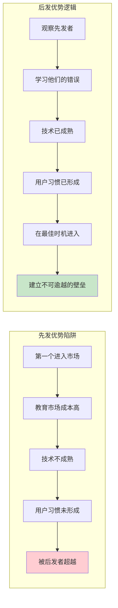
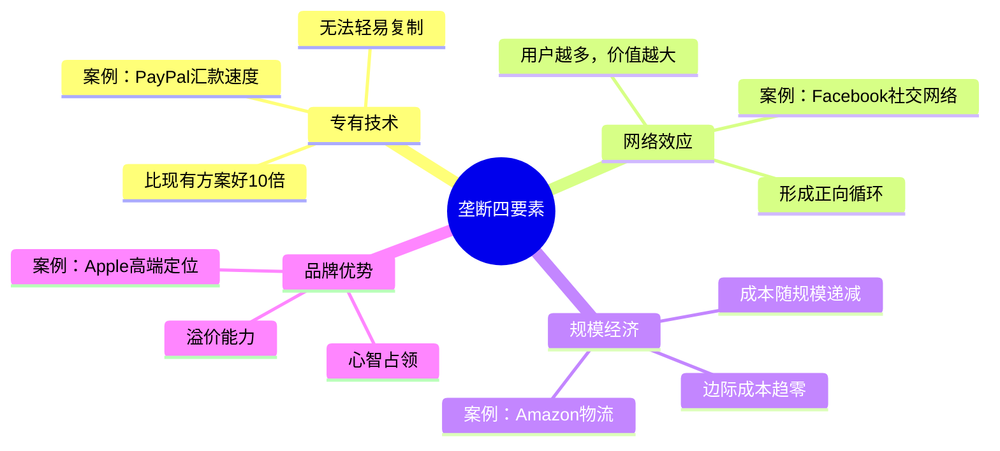
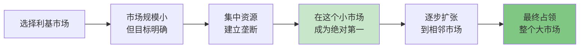
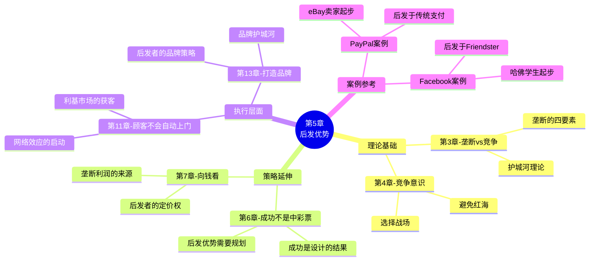

# 第5章：后发优势（Last Mover Advantage）

> **章节主题**：如何在市场中取得长期优势——不是第一个，而是最后一个
> **核心论点**：先发优势是陷阱，后发优势才是真正的护城河
> **拆解日期**：2026-02-27

---

## 一、章节定位

### 1.1 在全书中解决什么问题？

**核心问题**：垄断建立起来后，如何保持垄断地位？

前4章的逻辑链条：
- 第3章：垄断优于竞争
- 第4章：竞争是意识形态陷阱
- **第5章：如何建立持久的垄断？**

> **本章回答**：不是"先发优势"，而是"后发优势"——做最后一个进入市场的人，建立不可逾越的壁垒。

### 1.2 章节结构

```
第5章结构：
├── 引言：先发优势的迷思
│   ├── 为什么"先发优势"被高估
│   └── 先发者的常见失败
├── 垄断的四要素（护城河）
│   ├── 专有技术
│   ├── 网络效应
│   ├── 规模经济
│   └── 品牌优势
├── 小市场起步策略
│   ├── 为什么从小市场开始
│   ├── PayPal案例：eBay卖家
│   └── Facebook案例：哈佛学生
├── 后发优势的本质
│   ├── 观察先发者的错误
│   ├── 在正确时机进入
│   └── 建立不可逾越的壁垒
└── 结论：做最后一个入场的人
```

### 1.3 与其他章节的关联

| 章节 | 关联类型 | 关联逻辑 |
|------|----------|----------|
| [[第3章-所有成功的企业都是不同的]] | 理论基础 | 第3章讲"什么是垄断" → 第5章讲"如何建立垄断" |
| [[第4章-竞争意识]] | 前置思维 | 第4章讲"避免竞争" → 第5章讲"如何选择战场" |
| 第6章"成功不是中彩票" | 延伸应用 | 第5章讲"后发优势" → 第6章讲"成功是设计的结果" |
| 第11章"顾客不会自动上门" | 执行层面 | 第5章讲"垄断策略" → 第11章讲"如何获得客户" |
| 第13章"打造品牌" | 品牌护城河 | 第5章的"品牌优势"要素在第13章展开 |

---

## 二、核心观点（三层提取）

### 观点1：先发优势是陷阱，后发优势才是王道

#### 【表层】现象层

**先发者的常见失败**：

| 先发者 | 领域 | 结局 | 后发者 |
|--------|------|------|--------|
| Netscape | 浏览器 | 被IE击败 | Chrome |
| Friendster | 社交网络 | 衰落 | Facebook |
| Myspace | 社交网络 | 衰落 | Facebook |
| AltaVista | 搜索引擎 | 被遗忘 | Google |
| Palm | 智能手机 | 消失 | iPhone |

**后发者的成功**：
- Google不是第一个搜索引擎，但成了最好的
- Facebook不是第一个社交网络，但成了最大的
- iPhone不是第一部智能手机，但定义了行业
- 特斯拉不是第一辆电动车，但创造了市场

#### 【中层】机制层

**先发优势 vs 后发优势对比**：



**为什么后发优势更重要？**

| 维度 | 先发者 | 后发者 |
|------|--------|--------|
| 市场教育 | 承担所有成本 | 免费享受 |
| 技术风险 | 承担所有风险 | 等待成熟 |
| 用户习惯 | 需要培养 | 已经形成 |
| 学习曲线 | 摸着石头过河 | 看着别人犯错 |
| 定价权 | 不确定 | 参照已有 |

#### 【底层】规律层

> **后发优势定律**：在商业中，第一个进入市场的人往往成为先烈，最后一个进入市场的人才是赢家。

**关键洞察**：
- 先发优势在硬件行业可能有效（如Intel芯片）
- 但在软件和互联网行业，后发优势更普遍
- 原因：网络效应和规模效应让后发者可以快速超越

#### 【当下连接】2026场景

|----------|----------|----------|
| "我的点子别人做过了，还有机会吗？" | 后发者往往赢过先发者 | "希望感" |
| "要不要抢占先机？" | 先机是陷阱，壁垒才是关键 | "认知反转" |
| "AI赛道已经这么多人了" | 现在是观察和学习的时候 | "策略清晰" |
| "怎么判断入场时机？" | 技术成熟+用户习惯形成+壁垒可建立 | "判断框架" |

---

### 观点2：垄断的四要素——护城河

#### 【表层】现象层

**垄断企业的共同特征**：

| 企业 | 专有技术 | 网络效应 | 规模经济 | 品牌优势 |
|------|----------|----------|----------|----------|
| Google | 搜索算法 | 搜索越多越准 | 服务器成本递减 | "Google一下" |
| Apple | iOS芯片设计 | App Store生态 | 供应链优势 | 高端品牌 |
| Amazon | AWS技术 | 卖家越多买家越多 | 物流成本递减 | "万物商店" |
| 特斯拉 | 电池技术 | 超充网络 | 工厂规模 | 科技时尚 |

**PayPal的四要素**：
- **专有技术**：比传统汇款快10倍
- **网络效应**：买家越多，卖家越愿意用
- **规模经济**：交易量越大，单位成本越低
- **品牌优势**：安全、便捷的在线支付

#### 【中层】机制层

**垄断四要素详解**：



**四要素的关系**：

| 要素 | 作用 | 建立难度 | 持久性 |
|------|------|----------|--------|
| 专有技术 | 创造初始优势 | 高 | 中（技术会扩散） |
| 网络效应 | 形成护城河 | 高 | 高（越大越强） |
| 规模经济 | 降低成本 | 中 | 高（规模越大越难追） |
| 品牌优势 | 心智占领 | 中 | 高（品牌一旦建立，难以撼动） |

#### 【底层】规律层

> **护城河定律**：没有护城河的垄断是脆弱的。真正的垄断需要至少两个护城河要素相互强化。

**蒂尔的警告**：
- 只有一个要素是不够的
- 网络效应+规模经济=最强的护城河
- 品牌是最难建立、也最难摧毁的护城河

#### 【当下连接】2026场景

| 场景 | 如何建立护城河 |
|------|----------------|
| AI应用创业 | 专有技术（垂直领域模型）+ 网络效应（用户数据） |
| 内容创业 | 品牌优势（个人IP）+ 网络效应（粉丝社区） |
| SaaS创业 | 专有技术 + 规模经济 + 网络效应（用户越多，功能越多） |
| 电商创业 | 规模经济 + 品牌优势 |

---

### 观点3：从小市场起步——利基市场的垄断策略

#### 【表层】现象层

**成功的利基市场策略**：

| 企业 | 起步市场 | 后来扩张 |
|------|----------|----------|
| PayPal | eBay卖家（几千人） | 全球在线支付 |
| Facebook | 哈佛学生（几千人） | 全球社交网络 |
| Amazon | 只卖书 | 万物商店 |
| 特斯拉 | 高端跑车Roadster | 全系列电动车 |

**PayPal案例详解**：
- 最初只服务eBay上的几千个卖家
- 这些卖家有明确痛点：传统汇款太慢
- PayPal比传统方式快10倍，专有技术优势
- 在这个小市场建立垄断后，才逐步扩张

#### 【中层】机制层

**小市场起步的逻辑**：



**为什么从小市场开始？**

| 维度 | 小市场 | 大市场 |
|------|--------|--------|
| 竞争程度 | 低，容易垄断 | 高，很难突围 |
| 资源需求 | 低 | 高 |
| 验证速度 | 快 | 慢 |
| 学习成本 | 低 | 高 |
| 失败代价 | 小 | 大 |

#### 【底层】规律层

> **利基市场定律**：在一个小市场建立垄断，比在一个大市场竞争求生，成功概率高100倍。

**蒂尔的建议**：
- 不要一开始就想改变世界
- 先在一个小池塘里做最大的鱼
- 小市场的垄断=大市场的入场券

#### 【当下连接】2026场景

| 创业方向 | 利基市场策略 |
|----------|--------------|
| AI创业 | 不做"AI for everyone"，做"AI for 某垂直行业" |
| 内容创业 | 不做"所有人爱看的内容"，做"某个群体的专属内容" |
| 教育创业 | 不做"全科教育"，做"某个细分领域的教育" |
| 电商创业 | 不做"万能商城"，做"某个品类的专家店" |

---

## 三、降维翻译

### 核心概念翻译对照表

| 原表达 | 降维表达 | 翻译技巧 |
|--------|----------|----------|
| "后发优势" | "让子弹先飞一会儿，看清楚再入场" | 用流行语连接 |
| "先发优势是陷阱" | "第一个吃螃蟹的人，往往是第一个被螃蟹夹的人" | 用比喻 |
| "专有技术" | "你会的，别人不会" | 简化定义 |
| "网络效应" | "用的人越多，越好用" | 用体验描述 |
| "规模经济" | "做得越多，成本越低" | 用数量关系 |
| "品牌优势" | "说到这个，大家只想到你" | 用心智占领 |
| "利基市场" | "小池塘里做大鱼" | 用比喻 |
| "垄断四要素" | "四道护城河" | 用视觉化 |

### 一句话降维金句

1. **后发优势**：
> 第一个进入市场的，往往是第一个死掉的。

2. **护城河**：
> 没有护城河的垄断，就是沙滩上的城堡。

3. **小市场策略**：
> 先在小池塘里做最大的鱼，再去大海里称王。

4. **四要素**：
> 专有技术是刀，网络效应是墙，规模经济是护城河，品牌是旗帜。

5. **2026年启示**：
> AI时代，后发优势更明显——让巨头先踩坑，你再精准入场。

---

## 四、金句库

### 原书金句

1. "先发优势被严重高估了。"

2. "你想要的是最后一个进入市场，而不是第一个。"

3. "垄断需要至少四个要素中的两个：专有技术、网络效应、规模经济、品牌优势。"

4. "在一个小市场建立垄断，比在一个大市场竞争求生好得多。"

5. "PayPal最初只服务eBay上的几千个卖家。"

6. "网络效应是最强的护城河——用户越多，产品价值越大。"

7. "品牌是最难建立、也最难摧毁的护城河。"

8. "规模经济让边际成本趋近于零。"

### 降维金句

9. "第一个进入市场的人，往往是替别人教育市场的先烈。"

10. "后发者有上帝视角，先发者只有迷雾。"

11. "护城河不是挖出来的，是四个要素堆出来的。"

12. "小池塘里做鲨鱼，大海里才能做鲸鱼。"

13. "网络效应就是：用的人越多，越离不开。"

14. "品牌是一劳永逸的护城河。"

15. "规模经济是：做得越多，赚得越多。"

16. "专有技术是：别人学不会，你也没法教。"

## 五、当下映射（2026场景）

### AI创业场景

| 痛点 | 本章解答 | 可执行建议 |
|------|----------|------------|
| "AI赛道太挤了" | 先发优势是陷阱，后发优势才是王道 | 观察巨头踩坑，找到垂直机会 |
| "要不要做AI应用" | 找到你的利基市场 | 不做"AI for everyone"，做"AI for 某行业" |
| "怎么建立护城河" | 四要素：技术+网络+规模+品牌 | 从专有技术开始，逐步建立其他要素 |
| "大公司会不会碾压我们" | 利基市场大公司看不上 | 选择大公司忽视的小市场 |

### 内容创业场景

| 痛点 | 本章解答 | 可执行建议 |
|------|----------|------------|
| "内容太卷了" | 找到你的利基受众 | 不做所有人爱看的，做某个群体的专属内容 |
| "怎么建立品牌护城河" | 持续输出，占领心智 | 选定一个细分领域，持续深耕 |
| "粉丝增长慢" | 网络效应需要时间 | 小市场先做透，再扩张 |

### 传统行业转型场景

| 痛点 | 本章解答 | 可执行建议 |
|------|----------|------------|
| "传统行业没机会了" | 每个行业都有利基市场 | 找到你的细分领域，建立垄断 |
| "怎么和巨头竞争" | 不要竞争，要垄断 | 选择巨头看不上的小市场 |
| "怎么建立技术护城河" | 不需要原创，可以组合 | 把现有技术应用到新场景 |

### 2026年AI时代后发优势

| 领域 | 先发者（先烈） | 后发者（赢家） |
|------|----------------|----------------|
| AI模型 | 早期探索者 | 垂直领域模型 |
| AI应用 | 跟风开发者 | 深度解决某问题的应用 |
| 内容创作 | 模仿爆款 | 创造新形式的创作者 |
| 教育培训 | AI科普课程 | 垂直领域AI培训 |

---

## 六、章节关联

### 6.1 与其他章节的关联



### 6.2 与其他书籍的关联

| 书籍 | 关联类型 | 关联逻辑 |
|------|----------|----------|
| [[精益创业-埃里克·里斯-拆解记录]] | 方法论互补 | 后发优势+精益验证=精准入场 |
| [[纳瓦尔宝典-乔根森-拆解记录]] | 思维共鸣 | 专长知识≈专有技术，杠杆≈网络效应 |
| 《蓝海战略》 | 视角互补 | 后发优势≈在蓝海中精准入场 |
| 《创新者的窘境》 | 案例延伸 | 先发者的陷阱 vs 后发者的机会 |
| 《从优秀到卓越》 | 刺猬理念 | 利基市场垄断≈刺猬理念 |

---

## 七、问答设计（读者可能的困惑）

### Q1: "后发优势不是等别人成功再模仿吗？"

**A**: 不是模仿，而是学习和超越：

| 模仿 | 后发优势 |
|------|----------|
| 照抄别人的产品 | 学习别人的错误 |
| 没有自己的护城河 | 建立自己的护城河 |
| 永远是跟随者 | 在正确时机成为领导者 |

**案例**：
- Google不是模仿AltaVista，而是做出了更好的搜索算法
- iPhone不是模仿诺基亚，而是重新定义了手机

### Q2: "什么时候才是'正确时机'？"

**A**: 三个信号：

1. **技术成熟**：核心技术已经稳定，不需要从头研发
2. **用户习惯形成**：用户已经接受这类产品，不需要教育市场
3. **护城河可建立**：你能建立至少两道护城河

**2026年AI领域判断**：
- ✅ 技术成熟：大模型已经成熟
- ✅ 用户习惯形成：大家已经习惯用AI
- ⚠️ 护城河：需要找到垂直领域的专有技术

### Q3: "小市场真的能养活公司吗？"

**A**: 可以，而且更安全：

| 小市场 | 大市场 |
|--------|--------|
| 竞争少，容易垄断 | 竞争激烈，很难突围 |
| 资源需求低 | 资源需求高 |
| 验证快，迭代快 | 验证慢，风险大 |
| 是扩张的起点 | 是竞争的终点 |

**PayPal的启示**：
- 最初只有几千个eBay卖家
- 但这个小市场足以验证产品
- 验证成功后，才扩张到全球

### Q4: "四要素都要有吗？"

**A**: 不需要四个都有，但至少要有两个：

| 组合 | 效果 | 案例 |
|------|------|------|
| 专有技术+网络效应 | 最强组合 | Google |
| 网络效应+规模经济 | 强护城河 | Amazon |
| 专有技术+品牌 | 高溢价 | Apple |
| 规模经济+品牌 | 稳定优势 | Coca-Cola |

**建议**：
- 先建立专有技术（起点）
- 再发展网络效应（加速器）
- 规模经济自然形成（结果）
- 品牌是最后建立、最难摧毁的（护城河）

### Q5: "我是后发者，但先发者已经建立了网络效应，怎么办？"

**A**: 三个策略：

1. **换战场**：找到先发者忽视的利基市场
2. **换维度**：网络效应不是唯一的护城河，建立其他要素
3. **等待机会**：先发者可能犯错，保持观察

**案例**：
- Facebook在MySpace已经很大时才入场
- 但Facebook选择了"大学生"这个利基市场
- 在这个利基市场建立垄断后，才扩张

---

## 八、章节精华速查

### 核心概念速查表

| 概念 | 定义 | 案例 |
|------|------|------|
| **后发优势** | 在正确时机进入市场，学习先发者的错误 | Google后发于AltaVista |
| **先发优势陷阱** | 第一个进入市场的人往往成为先烈 | Netscape被IE击败 |
| **专有技术** | 比现有方案好10倍以上的技术 | PayPal比传统汇款快10倍 |
| **网络效应** | 用户越多，产品价值越大 | Facebook社交网络 |
| **规模经济** | 成本随规模扩大而递减 | Amazon物流 |
| **品牌优势** | 心智占领，溢价能力 | Apple高端品牌 |
| **利基市场** | 小而明确的目标市场 | PayPal的eBay卖家 |

### 垄断四要素速查

| 要素 | 定义 | 案例 | 建立难度 |
|------|------|------|----------|
| 专有技术 | 好于现有方案10倍 | PayPal汇款速度 | ⭐⭐⭐⭐ |
| 网络效应 | 用户越多，价值越大 | Facebook社交 | ⭐⭐⭐⭐⭐ |
| 规模经济 | 成本随规模递减 | Amazon物流 | ⭐⭐⭐ |
| 品牌优势 | 心智占领 | Apple品牌 | ⭐⭐⭐⭐ |

### 后发优势决策框架

```
判断是否入场：
1. 技术成熟了吗？ → 否 → 等待
2. 用户习惯形成了吗？ → 否 → 等待
3. 你能建立护城河吗？ → 否 → 换战场
4. 三者都满足？ → 精准入场
```

---

## 九、行动清单

### 今天完成

- [ ] 评估你的业务：你有哪几个护城河要素？
- [ ] 识别你的"先发者"：他们犯了什么错误？

### 本周完成

- [ ] 找到你的利基市场：小而明确的目标用户
- [ ] 分析：你所在领域的"正确入场时机"是什么？

### 本月完成

- [ ] 制定护城河建设计划：先建立哪个要素？
- [ ] 小市场验证：在利基市场做MVP测试

---
