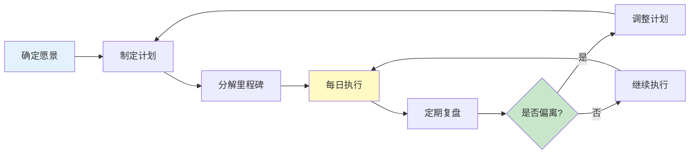
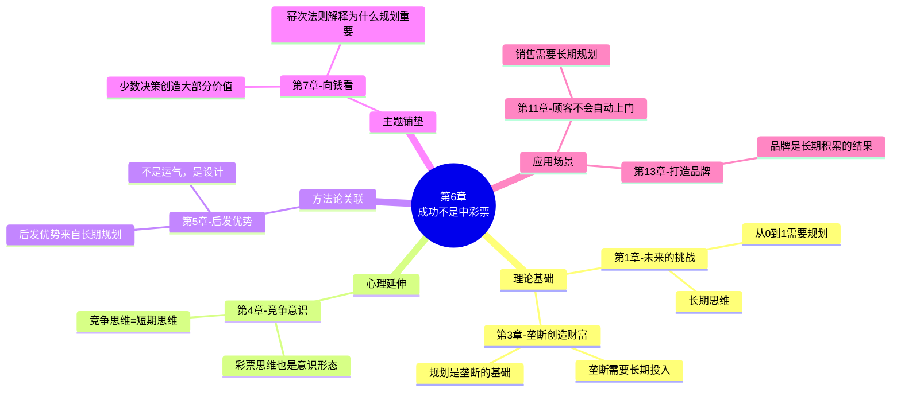

# 第6章：成功不是中彩票（You Are Not A Lottery Ticket）

> **章节主题**：长期规划的力量——成功来自设计而非运气
> **核心论点**：把成功归于运气，是对自己人生的最大欺骗
> **拆解日期**：2026-02-28

---

## 一、章节定位

### 1.1 在全书中解决什么问题？

**核心问题**：成功究竟是运气还是设计的结果？

第4章讲"竞争是意识形态"，第5章讲"如何建立垄断"。但第6章要回答一个更根本的问题：
> **如果你找到了垄断机会，你能保证成功吗？还是一切只是运气？**

本章揭示了两种人生观的冲突——"彩票思维"vs"设计思维"。

### 1.2 章节结构

```
第6章结构：
├── 引言：两种思维——"你能计划你的未来吗？"
├── 彩票思维
│   ├── 成功=运气的产物
│   ├── 长期规划=徒劳
│   └── 硅谷的"敏捷"陷阱
├── 设计思维
│   ├── 长期规划=可能
│   ├── 成功=设计的结果
│   └── 苹果、特斯拉的长期主义
├── 四种人生观矩阵
│   ├── 乐观+确定=工程师思维
│   ├── 乐观+不确定=创业者思维
│   ├── 悲观+确定=宿命论者
│   └── 悲观+不确定=虚无主义者
└── 结论：相信设计，相信长期规划
```

### 1.3 与其他章节的关联

| 章节 | 关联类型 | 关联逻辑 |
|------|----------|----------|
| [[第1章-未来的挑战]] | 思维基础 | 第1章讲"从0到1"→第6章讲"从0到1需要长期规划" |
| [[第3章-所有成功的企业都是不同的]] | 理论延伸 | 第3章讲"垄断创造财富"→第6章讲"垄断需要长期规划" |
| [[第4章-竞争意识]] | 心理延伸 | 第4章讲"竞争是意识形态"→第6章讲"彩票思维也是意识形态" |
| [[第5章-后发优势]] | 方法论延伸 | 第5章讲"如何建立垄断"→第6章讲"长期规划是垄断的基础" |
| 第7章"向钱看" | 主题铺垫 | 第6章讲"成功需要规划"→第7章讲"幂次法则解释为什么规划重要" |

---

## 二、核心观点（三层提取）

### 观点1：成功不是彩票，是设计的结果

#### 【表层】现象层

**两种思维的表现**：

| 场景 | 彩票思维 | 设计思维 |
|------|----------|----------|
| 创业 | "看运气，试试再说" | "我要创造特定的未来" |
| 职业 | "看机会，走一步算一步" | "我知道5年后我要成为什么" |
| 投资 | "看市场，随机应变" | "我有长期的投资策略" |
| 人生 | "命运决定一切" | "我的人生是我设计出来的" |

**硅谷的"敏捷"陷阱**：
- "敏捷开发"被误解为"不用规划"
- "精益创业"被误读为"随机试错"
- "快速迭代"变成了"没有方向"

#### 【中层】机制层

**彩票思维的来源**：

```mermaid
flowchart LR
    A[不确定性增加<br/>世界变化快] --> B[短期主义<br/>只看眼前]
    B --> C[放弃规划<br/>随机应变]
    C --> D[彩票思维<br/>成功=运气]
    D --> E[行为后果<br/>不做长期投入]
    E --> F[结果验证<br/>"果然是运气"]

    style D fill:#ffcdd2
    style F fill:#ff8a80
```

**设计思维的核心**：
1. **相信未来是可以被塑造的**：不是被动等待，而是主动创造
2. **长期规划是可能的**：即使世界变化，方向可以不变
3. **成功是累积的结果**：每一个选择都在塑造未来

#### 【底层】规律层

> **设计定律**：成功不是彩票的结果，而是长期规划的产物。把成功归于运气，是对自己人生的最大逃避。

**蒂尔的洞见**：
- 苹果的成功不是运气，是乔布斯1976年就开始的长期规划
- 特斯拉的成功不是运气，是马斯克2006年就公开的"秘密宏图"
- PayPal的成功不是运气，是蒂尔团队对电子支付未来的设计

#### 【当下连接】2026场景

|----------|----------|----------|
| "创业要不要all in？" | 取决于你有没有长期规划 | "原来问题是规划，不是运气" |
| "投资要不要长期持有？" | 长期规划决定长期持有 | "方向感清晰了" |
| "职业怎么规划？" | 5年规划比短期跳槽更重要 | "重新思考职业" |
| "人生是不是命运？" | 你的人生是你设计的结果 | "责任回归自己" |

---

### 观点2：四种人生观矩阵

#### 【表层】现象层

**蒂尔的四象限模型**：

```
                    对未来乐观
                        ↑
                        │
    乐观+确定           │         乐观+不确定
    （工程师思维）       │         （创业者思维）
    相信未来会更好       │         相信未来可以更好
    知道怎么到达         │         但不知道怎么到达
                        │
    ──────────────────────────────────→ 确定未来
                        │
    悲观+确定           │         悲观+不确定
    （宿命论者）         │         （虚无主义者）
    知道未来不好         │         不知道未来会怎样
    知道改变没用         │         也不知道怎么改变
                        │
                        ↓
                    对未来悲观
```

**四象限的特征**：

| 象限 | 心态 | 典型表现 | 案例 |
|------|------|----------|------|
| 乐观+确定 | 工程师思维 | 制定计划，执行计划 | 中国的五年计划 |
| 乐观+不确定 | 创业者思维 | 乐观但灵活，迭代试错 | 硅谷创业 |
| 悲观+确定 | 宿命论者 | 放弃努力，接受命运 | 某些欧洲国家 |
| 悲观+不确定 | 虚无主义者 | 没有方向，得过且过 | 当代年轻人的"躺平" |

#### 【中层】机制层

**四象限的行为差异**：


**蒂尔的诊断**：
- 1950-1970年代的美国：乐观+确定（工程师思维）
- 1970年后的美国：逐渐滑向乐观+不确定（创业者思维）
- 当前的风险：滑向悲观+不确定（虚无主义）

#### 【底层】规律层

> **人生观定律**：你的人生观决定了你的行为模式。乐观+确定的人制定长期计划，悲观+不确定的人随波逐流。

**关键洞见**：
- 最危险的是"悲观+不确定"——没有方向，得过且过
- 最理想的是"乐观+确定"——相信未来，知道路径
- 从"乐观+不确定"到"乐观+确定"，需要的是长期规划能力

#### 【当下连接】2026场景

| 读者类型 | 当前象限 | 如何升级 |
|----------|----------|----------|
| 焦虑的年轻人 | 悲观+不确定 | 找到相信的方向，制定计划 |
| 硅谷式创业者 | 乐观+不确定 | 从短期迭代转向长期规划 |
| 稳定型职场人 | 乐观+确定 | 保持，但要有创新思维 |
| 躺平族 | 悲观+不确定 | 找到一件值得长期投入的事 |

---

### 观点3：长期规划是可能且必要的

#### 【表层】现象层

**有长期规划vs没有长期规划**：

| 维度 | 有长期规划 | 没有长期规划 |
|------|------------|--------------|
| 决策 | 每个决策都指向目标 | 决策随机，互相矛盾 |
| 资源 | 集中资源做关键事 | 资源分散，事倍功半 |
| 耐心 | 能忍受短期痛苦 | 追求即时满足 |
| 结果 | 累积效应，复利增长 | 零散成果，难以持续 |

**案例对比**：

| 公司 | 长期规划 | 结果 |
|------|----------|------|
| 苹果 | 1976年乔布斯的愿景，持续迭代 | 成为全球最有价值公司 |
| 特斯拉 | 2006年马斯克的"秘密宏图"，按计划执行 | 定义了电动车行业 |
| 亚马逊 | 贝佐斯"长期主义"，20年不盈利 | 电商巨头 |
| 某些创业公司 | 没有长期规划，追逐热点 | 3年内倒闭 |

#### 【中层】机制层

**长期规划的机制**：



**为什么长期规划困难？**

1. **短期反馈的诱惑**：即时满足vs延迟满足
2. **不确定性的恐惧**：世界变化快，计划赶不上变化
3. **社会的质疑**：被嘲笑"不现实"
4. **缺乏榜样**：周围都是短期主义者

#### 【底层】规律层

> **长期规划定律**：长期规划不是预测未来，而是确定方向。世界在变，方向可以不变。

**蒂尔的三个洞见**：

1. **长期规划≠预测**：
   - 预测是"世界会怎样"
   - 规划是"我要让世界怎样"

2. **不确定性≠不能规划**：
   - 不确定的是路径
   - 确定的是方向

3. **敏捷≠没有方向**：
   - 敏捷是实现目标的手段
   - 不是放弃目标的借口

#### 【当下连接】2026场景

| 场景 | 短期思维 | 长期规划思维 |
|------|----------|--------------|
| AI学习 | 每天追新工具 | 3年成为AI领域专家 |
| 创业 | 追逐热点赛道 | 定义一个行业 |
| 投资 | 追涨杀跌 | 5-10年持有优质资产 |
| 职业 | 频繁跳槽涨薪 | 10年成为某领域权威 |

---

## 三、降维翻译

### 核心概念翻译对照表

| 原表达 | 降维表达 | 翻译技巧 |
|--------|----------|----------|
| "成功不是彩票" | "成功不是买彩票中奖，是你一步步设计出来的" | 用具体场景替代抽象概念 |
| "长期规划" | "5年后你要成为什么样的人，现在就开始做那件事" | 用时间维度具体化 |
| "乐观确定" | "相信未来会更好，而且知道怎么到达" | 拆解为两个维度 |
| "悲观不确定" | "不知道未来会怎样，也不知道怎么办" | 口语化描述状态 |
| "彩票思维" | "把成功归给运气，是对自己人生的最大逃避" | 直击本质 |

### 一句话降维金句

1. **成功的本质**：
> 成功不是运气，是你每天都在做的事累积出来的结果。

2. **长期规划**：
> 5年后你要成为什么样的人，今天就在做那件事。

3. **四象限**：
> 相信未来更好，而且知道怎么到达——这是最好的人生状态。

4. **敏捷陷阱**：
> 敏捷是手段，不是方向。没有方向的敏捷，只是更快的迷路。

5. **2026年启示**：
> AI时代变化更快，但方向比速度更重要。

---

## 四、金句库

### 原书金句

1. "成功不是彩票，是设计的结果。"

2. "长期规划不是预测未来，而是确定方向。"

3. "把成功归于运气，是对自己人生的最大逃避。"

4. "乐观+确定是最理想的状态：相信未来，而且知道怎么到达。"

5. "悲观+不确定是最危险的状态：没有方向，得过且过。"

6. "敏捷是手段，不是放弃方向的借口。"

7. "你不能控制未来，但你可以塑造未来。"

8. "苹果的成功不是运气，是乔布斯1976年就开始的长期愿景。"

### 降维金句

9. "成功是你每天都在做的事，不是天上掉下来的馅饼。"

10. "5年后你想成为什么样的人？今天就在做那件事。"

11. "没有方向的敏捷，只是更快的迷路。"

12. "相信未来，而且知道怎么到达——这是最好的人生状态。"

13. "把失败归于运气不好，是最廉价的自我安慰。"

14. "长期主义者不是不看眼前，而是眼前的选择都指向未来。"

15. "彩票思维的本质是逃避——逃避对自己的责任。"

## 五、当下映射（2026场景）

### 职业焦虑场景

| 痛点 | 本章解答 | 可执行建议 |
|------|----------|------------|
| "35岁危机" | 你用彩票思维过了10年 | 制定5年职业规划 |
| "职业迷茫" | 没有长期方向 | 确定5年后要成为什么样的人 |
| "跳槽涨薪" | 短期思维，没有累积 | 找到能长期积累的领域 |

### 创业焦虑场景

| 痛点 | 本章解答 | 可执行建议 |
|------|----------|------------|
| "创业靠运气吗？" | 运气有，但设计更重要 | 制定3年规划，分解里程碑 |
| "要不要追AI风口？" | 追风口=彩票思维 | 问：5年后AI行业会怎样？ |
| "敏捷开发=不规划？" | 敏捷是手段，方向是根本 | 先有愿景，再敏捷执行 |

### AI时代场景

| 场景 | 彩票思维 | 长期规划思维 |
|------|----------|--------------|
| AI学习 | 每天追新工具，焦虑 | 3年成为AI领域专家 |
| AI创业 | 做AI应用，竞争红海 | 定义AI在某个垂直领域的未来 |
| AI职业 | 担心被替代 | 培养AI无法替代的独特能力 |

### 人生选择场景

| 问题 | 彩票思维回答 | 设计思维回答 |
|------|--------------|--------------|
| "人生是命运吗？" | "是的，看运气" | "不，人生是我设计出来的" |
| "成功靠什么？" | "运气+机会" | "长期规划+持续执行" |
| "怎么规划未来？" | "走一步算一步" | "5年愿景+3年规划+1年目标" |

---

## 六、章节关联

### 6.1 与其他章节的关联



### 6.2 与其他书籍的关联

| 书籍 | 关联类型 | 关联逻辑 |
|------|----------|----------|
| [[纳瓦尔宝典-乔根森-拆解记录]] | 思维共鸣 | 长期主义+专长知识=设计思维 |
| 《原则》 | 方法论互补 | 长期规划需要系统化原则 |
| 《穷查理宝典》 | 跨学科验证 | 长期思维+复利效应 |
| 《黑天鹅》 | 辩证视角 | 不确定性≠不能规划，方向可以确定 |
| 《反脆弱》 | 策略补充 | 在不确定性中建立长期优势 |

---

## 七、问答设计（读者可能的困惑）

### Q1: "世界变化这么快，怎么长期规划？"

**A**: 区分"预测"和"规划"：
- 预测：世界5年后会怎样？（很难）
- 规划：5年后我要成为什么样的人？（可以确定）

**关键洞见**：
> 世界在变，方向可以不变。马斯克2006年说"电动车是未来"，今天还是这个方向。

**可执行建议**：
1. 确定5年后你要成为什么样的人
2. 确定不变的价值观（如：创造价值、帮助他人）
3. 路径可以调整，方向保持不变

### Q2: "敏捷开发和长期规划矛盾吗？"

**A**: 不矛盾，关键是区分"方向"和"方法"：
- 方向：长期不变（如：成为AI领域专家）
- 方法：短期敏捷（如：每周学习新工具）

**蒂尔的原意**：
> 敏捷是手段，不是放弃方向的借口。没有方向的敏捷，只是更快的迷路。

**比喻**：
- 长期规划=确定目的地
- 敏捷开发=根据路况调整路线
- 没有目的地的"敏捷"，只是原地打转

### Q3: "如果规划失败了呢？"

**A**: 规划的价值不在于100%实现，而在于：
1. 提供决策框架（每个选择都问：这有助于我达到目标吗？）
2. 聚焦资源（把有限资源用在关键事上）
3. 建立复利（每一天的努力都累积）

**真相**：
> 即使只实现了50%的规划，也比没有规划的100%随机应变强。

### Q4: "四象限中，哪个最好？"

**A**: 蒂尔的分析：
- **乐观+确定**（工程师思维）：最理想，相信未来而且知道路径
- **乐观+不确定**（创业者思维）：次优，相信未来但需要摸索路径
- **悲观+确定**（宿命论者）：危险，接受糟糕的未来
- **悲观+不确定**（虚无主义者）：最危险，没有方向，得过且过

**可执行建议**：
- 如果你现在在"悲观+不确定"，先找到一件值得相信的事
- 如果你现在在"乐观+不确定"，从短期迭代转向长期规划
- 目标是达到"乐观+确定"的状态

### Q5: "怎么开始做长期规划？"

**A**: 蒂尔的三步法：

1. **确定愿景**（5年）：
   - 5年后你要成为什么样的人？
   - 5年后你的公司要成为什么样的公司？

2. **制定计划**（3年）：
   - 要达到5年愿景，3年内需要完成什么？
   - 分解为3-5个关键里程碑

3. **每日执行**（今天）：
   - 今天做什么，能让你离目标更近？
   - 每天问：这件事指向我的长期目标吗？

---

## 八、章节精华速查

### 核心概念速查表

| 概念 | 定义 | 案例 |
|------|------|------|
| **彩票思维** | 把成功归于运气，放弃规划 | "创业靠运气" |
| **设计思维** | 成功是长期规划的产物 | 苹果、特斯拉的长期愿景 |
| **乐观+确定** | 相信未来，知道路径 | 工程师思维 |
| **悲观+不确定** | 不相信未来，不知道路径 | 虚无主义 |
| **长期规划** | 确定方向，持续迭代 | 马斯克的"秘密宏图" |

### 四象限对比表

| 象限 | 心态 | 行为 | 结果 |
|------|------|------|------|
| 乐观+确定 | 相信未来+知道路径 | 制定计划+执行 | 累积成功 |
| 乐观+不确定 | 相信未来+不知道路径 | 试错+迭代 | 可能成功 |
| 悲观+确定 | 不相信未来+知道改变不了 | 接受现状 | 维持现状 |
| 悲观+不确定 | 不相信未来+不知道怎么办 | 随波逐流 | 持续失败 |

### 长期规划vs短期思维

| 维度 | 长期规划 | 短期思维 |
|------|----------|----------|
| 决策 | 每个决策指向目标 | 决策随机 |
| 资源 | 集中资源 | 资源分散 |
| 反馈 | 接受延迟满足 | 追求即时满足 |
| 结果 | 复利增长 | 零散成果 |
| 案例 | 苹果、特斯拉 | 追热点的创业公司 |

---

## 九、行动清单

### 今天完成

- [ ] 反思：你今天的选择，指向5年后的目标吗？
- [ ] 写下：5年后你要成为什么样的人（一句话）

### 本周完成

- [ ] 诊断：你现在处于四象限的哪个位置？
- [ ] 制定：3年内需要完成的3-5个里程碑

### 本月完成

- [ ] 完成：一份5年职业/事业规划（1-2页）
- [ ] 执行：每天做一件指向长期目标的事

---
