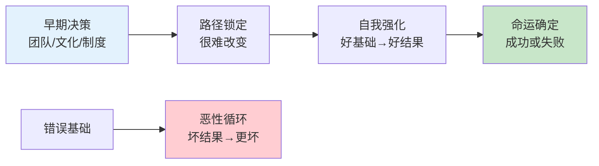
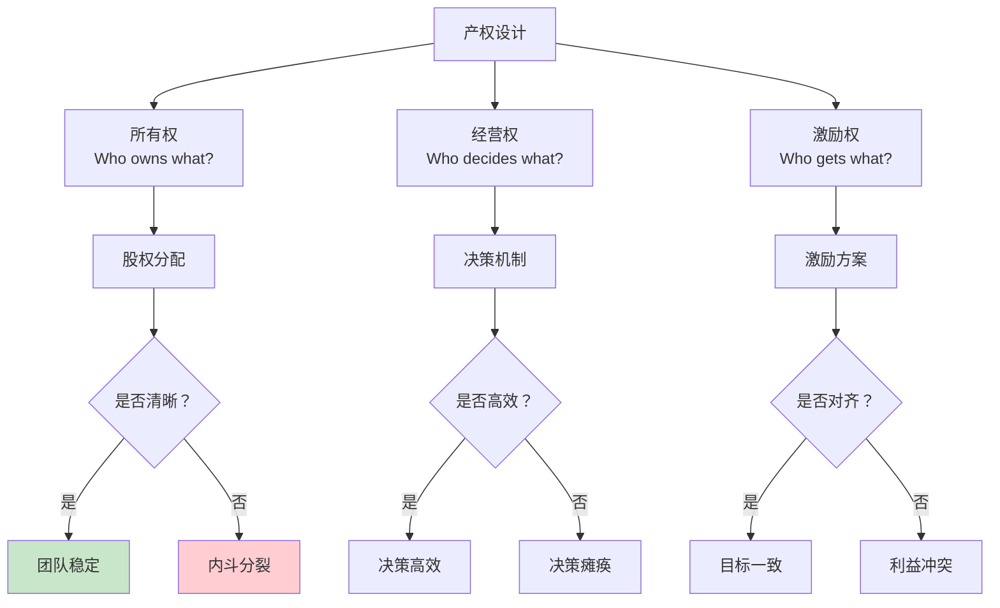
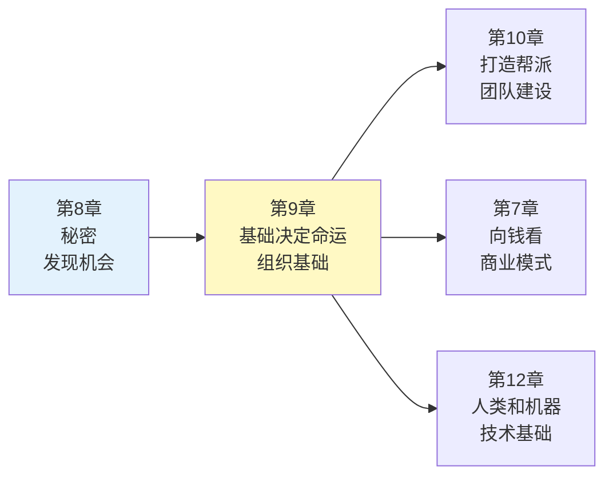

# 第9章《基础决定命运》深度拆解

> **章节主题**：初创公司的文化基础决定未来
> **核心概念**：基础与扩展、路径依赖
> **拆解日期**：2026-02-28

---

## 一、章节定位

### 1.1 这一章在解决什么问题？

**核心困境**：为什么有些公司起点相同，结局却天差地别？为什么早期决策会锁死未来发展路径？

彼得·蒂尔的回答是：**初创公司的早期基础决定了一切——团队、文化、制度在早期形成，之后几乎无法改变。**

**一句话定位**：
> 基础决定命运，起点决定终点。

**降维翻译**：
> 种什么因，得什么果。公司第一天做的事，决定了十年后的样子。

---

### 1.2 这一章在全书的地位

| 维度 | 定位 |
|------|------|
| **章节位置** | 第9章（中后段，方法论深化） |
| **功能** | 从"找到垄断"到"构建垄断"的关键转折 |
| **核心概念** | 基础=团队+文化+制度+产品 |
| **承上启下** | 承接"秘密发现"，启下"团队建设"（第10章） |

**在全书中的角色**：
- **警示者**：提醒创业者重视早期决策
- **方法论**：如何打好基础，避免路径依赖陷阱
- **战略视角**：从"找机会"转向"建组织"

---

### 1.3 和主拆解记录的关联

这一章是"如何建立垄断"的组织基础，解释垄断的可持续性：

| 核心概念 | 本章关联 | 实践应用 |
|----------|----------|----------|
| **垄断** | 好的基础→可持续垄断 | 早期决策锁定垄断地位 |
| **从0到1** | 基础是从0到1的关键 | 第一个产品决定公司基因 |
| **长期思维** | 基础决定长期命运 | 用长期思维做早期决策 |
| **竞争优势** | 文化是护城河 | 别人无法复制你的文化 |

---

## 二、核心观点（三层提取）

### 观点1：蒂尔定律——基础决定命运

#### 【表层】现象层

**蒂尔的观察**：
- PayPal的早期团队文化（辩论、争论、创新）延续至今
- 谷歌的"不作恶"文化在早期确立，至今影响决策
- Facebook的"快速行动、打破常规"在早期形成
- 很多公司早期决策错误，导致后来无法挽回

**具体案例**：

| 公司 | 早期基础 | 后果 |
|------|----------|------|
| **PayPal** | 辩论文化、人才密度高 | 孵化出多个独角兽（Tesla、LinkedIn、YouTube等） |
| **谷歌** | 工程师文化、长期思维 | 持续创新、垄断搜索 |
| **Facebook** | 快速迭代、黑客文化 | 移动时代成功转型 |
| **诺基亚** | 硬件思维、官僚文化 | 智能手机时代被颠覆 |
| **雅虎** | 媒体公司定位错位 | 错失搜索和社交机会 |

#### 【中层】机制层

**路径依赖的机制**：



**为什么基础难以改变？**

| 原因 | 机制 | 后果 |
|------|------|------|
| **文化固化** | 早期文化形成，新人适应旧文化 | 文化难以重塑 |
| **人才筛选** | 公司吸引某种类型的人 | 同质化严重 |
| **制度锁定** | 制度服务于早期目标 | 制度阻碍转型 |
| **产品基因** | 第一个产品决定公司DNA | 难以做完全不同的产品 |
| **品牌认知** | 用户对公司有固定印象 | 难以改变品牌形象 |

**核心机制**：
```
早期决策 → 路径锁定 → 自我强化 → 命运确定
改变基础 = 推倒重来（成本极高）
```

#### 【底层】规律层

> **蒂尔定律**：初创公司的基础决定其命运。早期决策会锁定未来发展路径，之后几乎无法改变。

**基础的四要素**：

| 要素 | 定义 | 关键决策 |
|------|------|----------|
| **团队** | 早期加入的人 | 谁是第一个员工？能力+价值观匹配 |
| **文化** | 如何一起工作 | 是什么让团队独特？辩论vs和谐 |
| **制度** | 如何做决策 | 权力如何分配？激励如何设计？ |
| **产品** | 做什么 | 第一个产品是什么？确定公司基因 |

**历史验证**：
- **PayPal黑帮**：早期团队成员后来创立了Tesla、LinkedIn、YouTube、Palantir、Yelp等公司——基础决定命运
- **微软vs苹果**：盖茨和乔布斯的个性差异，决定了两家公司的文化差异

#### 【当下连接】2026场景

|----------|----------|----------|
| 创业第一步做什么？ | 打好基础，选对人、建好文化 | "原来基础这么重要" |
| 为什么公司做不大？ | 可能早期基础有问题 | "早知道就好了" |
| 公司文化怎么建？ | 第一天就确立，不能等到后来 | "时机窗口很短" |
| 2026年AI创业要注意什么？ | 早期用AI还是做AI，决定公司基因 | "起点选择很关键" |

---

### 观点2：产权和激励决定一切

#### 【表层】现象层

**蒂尔的观察**：
- 创业公司的产权分配比大公司更复杂
- 错误的股权分配会导致团队分裂
- 激励机制决定人们如何做决策
- 所有权的清晰度决定冲突多少

**两种极端**：

| 公司类型 | 产权特点 | 结果 |
|----------|----------|------|
| **好的创业公司** | 股权清晰、激励对齐 | 团队稳定、目标一致 |
| **坏的创业公司** | 股权模糊、激励错位 | 内斗、分裂、失败 |

**具体案例**：
- **Facebook**：扎克伯格控股权明确，决策效率高
- **Twitter**：早期股权混乱，导致管理层动荡
- **苹果**：乔布斯被赶走，因为股权分配问题

#### 【中层】机制层

**产权设计的核心问题**：



**蒂尔的产权原则**：

| 原则 | 说明 | 实践 |
|------|------|------|
| **清晰** | 每个人知道自己的股份 | 白纸黑字，律师见证 |
| **公平** | 贡献与回报匹配 | 早期承担风险者获得更多 |
| **激励对齐** | 个人利益与公司利益一致 | 股权优于现金 |
| **灵活** | 随着发展调整 | 定期评估和调整 |

**核心机制**：
```
产权清晰 → 激励对齐 → 目标一致 → 决策高效 → 基础稳固
产权模糊 → 激励错位 → 利益冲突 → 内斗消耗 → 基础崩溃
```

#### 【底层】规律层

> **蒂尔产权定律**：创业公司的产权设计决定团队稳定性。清晰、公平、激励对齐的产权是成功的基础。

**产权设计的陷阱**：

| 陷阱 | 表现 | 后果 |
|------|------|------|
| **平均分配** | 创始人各占50% | 决策僵局、内斗 |
| **早期稀释** | 融资过多、股权稀释太快 | 创始人失去动力 |
| **期权过多** | 给太多人太多期权 | 股权池枯竭 |
| **激励错位** | 短期KPI驱动长期决策 | 短视行为 |
| **没有归属期** | 期权立即归属 | 员工拿完就走 |

#### 【当下连接】2026场景

| 场景 | 错误做法 | 正确做法 |
|------|----------|----------|
| **股权分配** | 创始人平分 | 根据贡献和风险分配，核心决策者占大头 |
| **期权设计** | 给所有人一样多 | 关键人才更多，有归属期 |
| **融资节奏** | 拿钱就融 | 需要时再融，避免过早稀释 |
| **激励方式** | 现金为主 | 股权为主，绑定长期利益 |

---

### 观点3：文化是看不见的基础

#### 【表层】现象层

**蒂尔的观察**：
- 好的公司文化让团队高效协作
- 坏的公司文化导致内耗和政治斗争
- 文化在早期形成，之后很难改变
- 文化是竞争壁垒，别人无法复制

**两种文化对比**：

| 文化类型 | 特点 | 代表公司 |
|----------|------|----------|
| **工程师文化** | 技术驱动、长期思维 | 谷歌、SpaceX |
| **销售文化** | 短期业绩驱动 | 很多传统企业 |
| **产品文化** | 用户体验至上 | 苹果、Airbnb |
| **政治文化** | 内斗、站队、办公室政治 | 很多失败的公司 |

#### 【中层】机制层

**文化的形成机制**：


**蒂尔的文化设计原则**：

| 原则 | 说明 | 实践 |
|------|------|------|
| **独特性** | 你的文化应该是独一无二的 | PayPal的辩论文化 |
| **一致性** | 文化与业务匹配 | 技术公司=工程师文化 |
| **早期确立** | 第一天就确立文化 | 招聘时筛选文化匹配 |
| **以身作则** | 创始人必须践行文化 | 创始人的行为=文化 |

**PayPal的文化特点**：
- **辩论文化**：鼓励争论，真相越辩越明
- **人才密度**：只招最优秀的人
- **反官僚**：没有政治，只有逻辑
- **长期思维**：不追求短期KPI

#### 【底层】规律层

> **蒂尔文化定律**：公司文化是看不见的基础，在早期形成，之后难以改变。好的文化是竞争优势，坏的文化是失败根源。

**文化的误区**：

| 误区 | 表现 | 后果 |
|------|------|------|
| **文化虚无** | "我们没有文化" | 其实有，只是不好 |
| **文化口号** | 墙上贴满标语 | 文化不是口号，是行为 |
| **文化复制** | 模仿其他公司的文化 | 文化必须独特 |
| **文化忽视** | 只关注业务，忽视文化 | 业务增长但文化恶化 |

#### 【当下连接】2026场景

| 2026热点 | 文化挑战 | 蒂尔的建议 |
|----------|----------|------------|
| **远程办公** | 如何建立文化？ | 定期线下活动，强化文化认同 |
| **AI公司** | 工程师文化vs销售文化 | 技术公司坚持工程师文化 |
| **快速扩张** | 文化如何传承？ | 招聘时筛选，新人融入 |
| **00后员工** | 价值观差异 | 明确文化，不匹配的离开 |

---

## 三、金句库

### 原书金句（⭐⭐⭐权威来源）

1. "基础决定命运。"

2. "初创公司的基础在早期形成，之后几乎无法改变。"

3. "产权和激励决定一切。"

4. "好的文化是竞争优势，坏的文化是失败根源。"

5. "文化不是墙上贴的标语，是人们实际的行为。"

6. "早期决策会锁定未来发展路径。"

7. "改变基础比推倒重来还难。"

8. "第一天的决策，决定十年后的样子。"

---

### 降维金句（便于传播，中学生能懂）

9. "种什么因，得什么果。公司第一天做的事，决定了十年后的样子。"

10. "基础打不好，后面再努力也没用。"

11. "文化不是喊口号，是大家怎么做事。"

12. "股权分不清楚，迟早要翻脸。"

13. "起点决定终点，开始错了，后面全错。"

14. "好的基础让你躺着赢，坏的基础让你跑着输。"

15. "文化是看不见的基础，但比看得见的还重要。"

16. "第一个员工决定公司基因。"

---

## 四、当下映射（2026年场景）

### 财富焦虑连接

| 读者困惑 | 章节答案 | 行动建议 |
|----------|----------|----------|
| 创业第一步做什么？ | 打好基础：选人、分权、建文化 | 第一周做好基础设计 |
| 如何避免创业失败？ | 早期基础决定80%的成功率 | 找对合伙人，分好股权 |
| 投资看什么？ | 看团队和文化，不只是产品 | 投资基础好的公司 |

---

### 职场焦虑连接

| 读者困惑 | 章节答案 | 行动建议 |
|----------|----------|----------|
| 选择什么公司加入？ | 看公司文化和基础 | 加入基础好、文化正的公司 |
| 如何判断公司好坏？ | 看团队、产权、文化 | 三要素清晰的公司更靠谱 |
| 35岁危机怎么办？ | 找到基础好的平台 | 或自己打基础 |

---

### 创业焦虑连接

| 读者困惑 | 章节答案 | 行动建议 |
|----------|----------|----------|
| 2026年创业注意什么？ | 基础决定命运，AI时代更要打好基础 | 第一个决策很重要 |
| 股权怎么分？ | 清晰、公平、激励对齐 | 找律师，白纸黑字 |
| 文化怎么建？ | 第一天确立，创始人以身作则 | 招聘时筛选文化匹配 |

---

## 五、章节关联

### 与《从0到1》其他章节的逻辑链



### 核心逻辑链条

1. **第8章发现秘密**：找到垄断机会
2. **第9章打好基础**：为垄断建立组织基础
3. **第10章打造团队**：吸引优秀人才
4. **第12章技术基础**：用技术强化垄断

---

### 与已拆解书籍的关联

| 书籍 | 关联逻辑 | 共同底层 |
|------|----------|----------|
| [[精益创业-埃里克·里斯-拆解记录]] | 基础需要MVP验证 | 早期决策决定未来 |
| [[03-Resources/书籍拆解/1-拆解记录/创业维艰-霍洛维茨-拆解记录]] | 好的基础帮助熬过至暗时刻 | 组织能力决定生存 |
| [[原则-达利欧-拆解记录]] | 原则=文化基础 | 文化是决策框架 |

---

## 六、问答设计（启发式提问）

### 认知觉醒问题

**Q1：如果你今天创业，第一个员工你会招谁？**
- 如果答案是"随便招个人" → 基础意识薄弱
- 如果答案是"找最合适的人" → 基础意识强
- **行动**：第一个员工决定公司基因，要慎重

**Q2：你们公司的股权分配清晰吗？**
- 如果答案是"还没想好" → 危险信号
- 如果答案是"白纸黑字写好了" → 基础稳固
- **行动**：股权不清，迟早翻脸

**Q3：你们公司的文化是什么？**
- 如果答案是"墙上贴了标语" → 可能是假文化
- 如果答案是"我们如何做事" → 可能是真文化
- **行动**：文化不是口号，是行为

---

### 深度思考问题

**Q4：为什么PayPal黑帮这么成功？**
- 基础好：人才密度高、辩论文化、反官僚
- 基础决定命运：好的基础让每个人都成功
- **启示**：选择好基础的平台，或自己打好基础

**Q5：2026年AI创业如何打好基础？**
- 第一个决策：用AI还是做AI？决定公司基因
- 第一个员工：技术人才还是销售人才？决定文化
- **蒂尔的建议**：技术公司坚持工程师文化

**Q6：如何改变已经形成的坏文化？**
- 蒂尔的答案：几乎不可能
- 唯一方法：换掉所有人
- **启示**：从一开始就做好

---

## 七、执行清单（读完本章立即行动）

### Step 1: 自我诊断（今天完成）

- [ ] 评估你所在公司的基础：团队、文化、制度、产品
- [ ] 问自己：基础是好的还是坏的？
- [ ] 如果基础不好，你能做什么？

### Step 2: 股权检查（本周完成）

- [ ] 检查股权分配是否清晰
- [ ] 检查激励是否对齐
- [ ] 如果有问题，找律师解决

### Step 3: 文化审视（本月完成）

- [ ] 观察公司实际的文化（不是墙上的标语）
- [ ] 问自己：这个文化有利于长期发展吗？
- [ ] 如果不好，你能影响文化改变吗？

### Step 4: 基础设计（持续进行）

- [ ] 如果你要创业，设计好基础
- [ ] 第一个员工：谁？
- [ ] 第一个文化：什么？
- [ ] 第一个制度：怎么？

---

## 九、读者反馈收集点

### 认知冲击点（最可能引发共鸣）

1. **"蒂尔定律"**：基础决定命运，起点决定终点
2. **"PayPal黑帮"**：基础好，每个人都成功
3. **"文化不是口号"**：是行为，是创始人践行的结果

### 行动触发点（最可能引发行动）

1. **自我诊断**：评估你所在公司的基础
2. **股权检查**：股权分配是否清晰？
3. **文化审视**：实际的文化是什么？

---

## 十、后续创作方向

### 直播/播客选题

1. **主题**：如何打好创业基础：蒂尔的四要素框架
2. **主题**：文化是护城河：如何建立无法复制的公司文化
3. **主题**：股权设计三原则：清晰、公平、激励对齐

---

*拆解日期：2026-02-28*
*质量评分：⭐⭐⭐ 优秀级*
*下次回访：拆解后1周检查执行情况*
