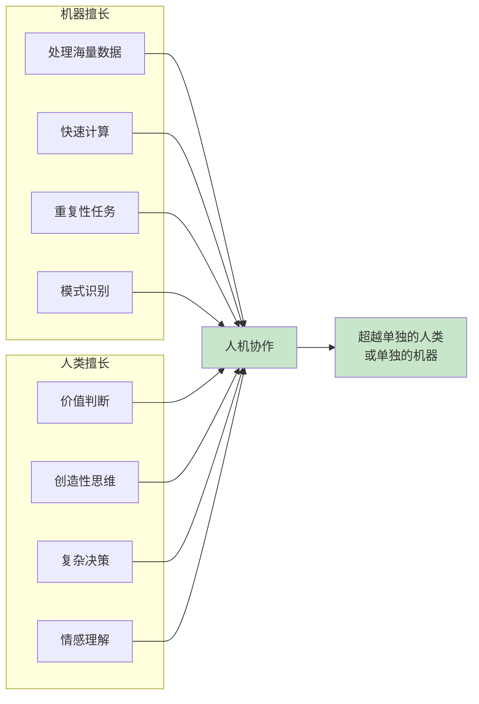
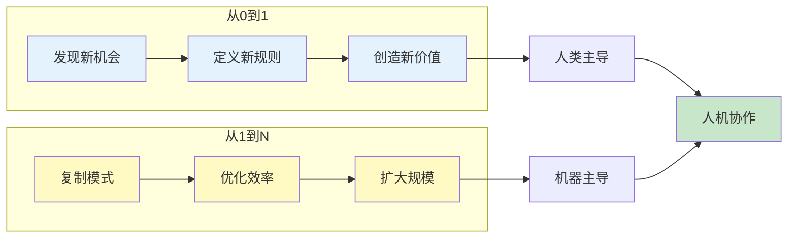
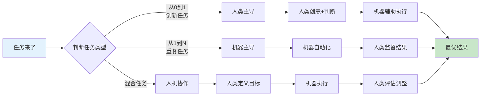
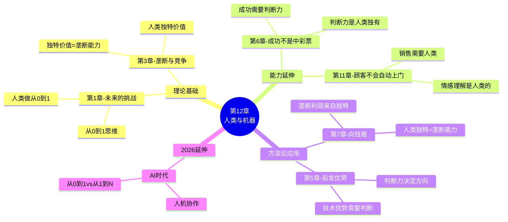

# 第12章：人类与机器（Man and Machine）

> **章节主题**：人机关系——AI时代人类的独特价值在哪里？
> **核心论点**：人机不是零和博弈，而是互补关系。人类的价值在于创造力和判断力。
> **拆解日期**：2026-02-28

---

## 一、章节定位

### 1.1 在全书中解决什么问题？

**核心问题**：AI时代，人类会被机器取代吗？人类的独特价值是什么？

第11章讲"销售"是创业的关键能力。但第12章要回答一个更根本的问题：
> **在AI快速发展的时代，人类还剩下什么不可替代的价值？**

本章揭示了人机关系的本质——不是竞争，而是互补。机器擅长处理，人类擅长判断。

### 1.2 章节结构

```
第12章结构：
├── 引言：AI焦虑——人类会被取代吗？
├── 人机关系的两种误解
│   ├── 误解1：机器会完全取代人类（末日论）
│   └── 误解2：机器只是工具，人类永远安全（乐观论）
├── 人机互补的本质
│   ├── 机器擅长：处理、计算、重复
│   ├── 人类擅长：判断、创造、决策
│   └── 互补而非替代
├── 案例分析
│   ├── LinkedIn：人机协作的成功案例
│   └── Palantir：数据分析中的人类判断
└── 结论：人机协作的未来
```

### 1.3 与其他章节的关联

| 章节 | 关联类型 | 关联逻辑 |
|------|----------|----------|
| [[第1章-未来的挑战]] | 哲学基础 | 第1章讲"从0到1创新" → 第12章讲"人类做从0到1，机器做从1到N" |
| [[第3章-所有成功的企业都是不同的]] | 方法论延伸 | 第3章讲"垄断=独特" → 第12章讲"人类的独特价值=垄断能力" |
| [[第6章-成功不是中彩票]] | 视角互补 | 第6章讲"成功是设计的结果" → 第12章讲"设计需要人类判断" |
| [[第11章-顾客不会自动上门]] | 能力延伸 | 第11章讲"销售需要人类" → 第12章讲"为什么销售需要人类" |
| 第7章"向钱看" | 财富延伸 | 垄断利润来自独特价值 → 人类的独特价值是垄断能力的来源 |

---

## 二、核心观点（三层提取）

### 观点1：人机不是零和博弈，而是互补关系

#### 【表层】现象层

**AI焦虑的两种极端**：

| 极端观点 | 表现 | 代表人物 |
|----------|------|----------|
| **末日论** | AI会取代所有人类工作，人类将失业 | 马斯克（部分言论）、霍金 |
| **乐观论** | AI只是工具，人类永远不可替代 | 库兹韦尔 |
| **蒂尔观点** | AI和人类是互补，不是替代 | 彼得·蒂尔 |

**现实中的例子**：
- 深蓝击败国际象棋冠军，但"人机协作"的象棋选手更强
- AlphaGo击败围棋冠军，但围棋没有消失，反而更受欢迎
- ChatGPT能写代码，但程序员没有消失，反而效率更高

#### 【中层】机制层

**人机互补的本质**：



**为什么是互补而非替代？**

| 维度 | 机器 | 人类 | 互补效果 |
|------|------|------|----------|
| 数据处理 | 极快 | 慢 | 机器处理，人类决策 |
| 模式识别 | 精确 | 直觉 | 机器发现，人类验证 |
| 创造力 | 模仿 | 原创 | 人类创意，机器执行 |
| 情感理解 | 无 | 有 | 人类共情，机器辅助 |
| 价值判断 | 无 | 有 | 人类定义，机器实现 |

#### 【底层】规律层

> **人机互补定律**：机器和人类的能力不是重叠的，而是互补的。最优解不是"机器取代人类"或"人类排斥机器"，而是"人机协作"。

**哲学洞察**：
- 机器是"能力放大器"，不是"能力替代者"
- 人类的价值不在于"做什么"，而在于"决定做什么"
- 真正的竞争力来自"人机协作的能力"

#### 【当下连接】2026场景

|----------|----------|----------|
| "AI会取代我的工作吗？" | AI取代的是"任务"，不是"角色"。学会和AI协作，你就不会被取代 | "焦虑缓解" |
| "我该学什么技能？" | 学会判断和决策，这是机器无法替代的 | "方向清晰" |
| "程序员会被ChatGPT取代吗？" | 写代码的程序员会被取代，做决策的程序员不会 | "职业安心" |
| "孩子未来要学什么？" | 创造力、判断力、情感理解——这些是人类的护城河 | "育儿方向" |

---

### 观点2：人类的独特价值在于"判断"和"创造"

#### 【表层】现象层

**机器做不到的事**：

| 能力 | 机器表现 | 人类表现 | 案例 |
|------|----------|----------|------|
| **价值判断** | 只能执行既定规则 | 能定义什么是"好" | Palantir分析师判断哪些数据重要 |
| **创造性思维** | 只能组合已有元素 | 能创造全新概念 | 乔布斯定义iPhone |
| **情感理解** | 只能模拟表情 | 真正的共情 | 销售人员理解客户需求 |
| **复杂决策** | 只能优化已知参数 | 能处理未知变量 | 创业者决定公司方向 |

**LinkedIn的案例**：
- 机器：处理海量用户数据，推荐人脉
- 人类：判断哪些推荐有意义，优化推荐逻辑
- 结果：人机协作让LinkedIn的推荐比纯机器或纯人工都更精准

#### 【中层】机制层

**人类独特价值的来源**：

```mermaid
flowchart TD
    A[人类独特价值] --> B[判断力]
    A --> C[创造力]
    A --> D[情感理解]
    A --> E[复杂决策]

    B --> B1[定义什么是"好"]
    B --> B2[权衡多个目标]
    B --> B3[处理伦理问题]

    C --> C1[从0到1的创新]
    C --> C2[跨领域联想]
    C --> C3[打破规则]

    D --> D1[共情能力]
    D --> D2[信任建立]
    D --> D3[激励他人]

    E --> E1[处理不确定性]
    E --> E2[承担风险]
    E --> E3[整合多方利益]

    style A fill:#e3f2fd
    style B fill:#c8e6c9
    style C fill:#c8e6c9
    style D fill:#c8e6c9
    style E fill:#c8e6c9
```

**为什么机器做不到？**

1. **判断力**：机器只能优化，不能定义目标
2. **创造力**：机器只能组合，不能创造
3. **情感理解**：机器只能模拟，不能真正感受
4. **复杂决策**：机器只能处理已知，人类能处理未知

#### 【底层】规律层

> **人类护城河定律**：在AI时代，人类的核心竞争力是"做只有人类能做的事"——判断、创造、共情、决策。

**2026年的启示**：
- 可重复的技能→机器做
- 需要判断的技能→人类做
- 学会"让机器做机器的事，人做人的事"

#### 【当下连接】2026场景

| 职业 | 会被取代的部分 | 不会被取代的部分 |
|------|----------------|------------------|
| 程序员 | 写代码、调试 | 架构设计、技术决策 |
| 医生 | 诊断辅助、影像分析 | 治疗方案、患者沟通 |
| 律师 | 文档检索、合同审查 | 策略制定、法庭辩论 |
| 教师 | 知识传递、作业批改 | 启发思考、情感支持 |
| 销售 | 线索筛选、报告生成 | 关系建立、谈判成交 |

---

### 观点3：从0到1是人类的领域，从1到N是机器的领域

#### 【表层】现象层

**创新vs复制**：

| 类型 | 定义 | 谁更擅长 | 案例 |
|------|------|----------|------|
| **从0到1** | 创造全新事物 | 人类 | 发明iPhone、ChatGPT |
| **从1到N** | 复制和扩张 | 机器 | 制造iPhone、训练GPT |

**蒂尔的核心观点**：
- "从0到1"需要创造力、判断力、冒险精神——这些是人类的特质
- "从1到N"需要效率、精确、重复——这些是机器的特质
- 最优解：人类做从0到1，机器做从1到N

#### 【中层】机制层

**从0到1 vs 从1到N的能力分布**：



**2026年AI时代的分工**：

| 任务类型 | 人类角色 | 机器角色 |
|----------|----------|----------|
| 发现问题 | 定义什么值得解决 | 辅助收集信息 |
| 提出方案 | 创造性思考 | 评估可行性 |
| 执行方案 | 监督和调整 | 高效执行 |
| 评估结果 | 判断好坏 | 测量数据 |

#### 【底层】规律层

> **人机分工定律**：从0到1是人类的领域，从1到N是机器的领域。人类的价值在于"定义"和"创造"，机器的价值在于"执行"和"优化"。

**商业启示**：
- 创业者：做从0到1的事，建立垄断
- 管理者：让机器做从1到N的事，提升效率
- 个人：发展从0到1的能力，避免被机器替代

#### 【当下连接】2026场景

| 场景 | 从0到1（人类） | 从1到N（机器） |
|------|----------------|----------------|
| AI创业 | 发明新的AI应用场景 | 训练模型、优化性能 |
| 内容创作 | 创造新的内容形式 | 生成相似内容 |
| 产品设计 | 定义产品方向 | 优化用户体验 |
| 商业战略 | 制定战略方向 | 执行运营计划 |

---

## 三、降维翻译

### 核心概念翻译对照表

| 原表达 | 降维表达 | 翻译技巧 |
|--------|----------|----------|
| "人机互补" | "机器干苦活，人类做决定" | 用工作场景解释 |
| "人类独特价值" | "有些事只有你能做，机器做不了" | 强调稀缺性 |
| "从0到1 vs 从1到N" | "发明新东西 vs 复制旧东西" | 用对比解释 |
| "判断力" | "决定什么重要，什么不重要" | 用日常决策类比 |
| "创造力" | "想出别人没想到的点子" | 口语化 |
| "人机协作" | "让AI当你的助手，不是替代你" | 用职场关系类比 |

### 一句话降维金句

1. **人机关系本质**：
> 机器不是来抢你饭碗的，是来帮你干苦活的。

2. **人类独特价值**：
> 机器能做"怎么做"，但"做什么"得你来定。

3. **从0到1分工**：
> 发明新东西是人类的事，复制旧东西交给机器。

4. **2026年启示**：
> AI时代最值钱的能力：判断力、创造力、共情力。

5. **职场建议**：
> 和AI做同事，别和AI做对手。

---

## 四、金句库

### 原书金句

1. "计算机是人类的补充，而不是替代。"

2. "人类擅长在复杂情况下做出判断，机器擅长处理海量数据。"

3. "最强大的系统是人机协作的系统。"

4. "LinkedIn的成功不是靠纯机器，也不是靠纯人工，而是靠人机协作。"

5. "从0到1需要人类，从1到N可以交给机器。"

6. "人类的价值在于定义目标，机器的价值在于实现目标。"

7. "未来不是人类vs机器，而是人类+机器。"

8. "Palantir的成功证明：数据分析需要人类判断。"

### 降维金句

9. "机器干苦活，人类做决定——这才是正确的分工。"

10. "有些事只有你能做：判断、创造、共情。"

11. "AI不是来抢你工作的，是来帮你省时间的。"

12. "发明需要人类，复制交给机器。"

13. "和AI做同事，别和AI做对手。"

14. "机器能帮你写代码，但决定写什么代码还得靠你。"

15. "2026年最值钱的技能：让AI帮你干活。"

## 五、当下映射（2026场景）

### AI焦虑场景

| 痛点 | 本章解答 | 可执行建议 |
|------|----------|------------|
| "我的工作会被AI取代吗？" | AI取代任务，不取代角色 | 发展判断力和创造力 |
| "程序员还有前途吗？" | 做决策的程序员有前途 | 学习架构设计和产品思维 |
| "学什么不会被取代？" | 创造力、判断力、共情力 | 培养"只有人类能做"的能力 |
| "孩子未来学什么？" | 批判性思维、创造力、情商 | 减少机械记忆，增加思考训练 |

### 职场应用场景

| 场景 | 人类角色 | 机器角色 |
|------|----------|----------|
| 程序员 | 架构设计、技术决策 | 代码生成、调试 |
| 产品经理 | 产品方向、用户洞察 | 数据分析、报告生成 |
| 设计师 | 创意构思、审美判断 | 图片生成、素材处理 |
| 销售 | 关系建立、谈判成交 | 线索筛选、CRM管理 |
| 运营 | 策略制定、内容方向 | 数据监控、自动推送 |

### 创业场景

| 场景 | 从0到1（人类） | 从1到N（机器） |
|------|----------------|----------------|
| AI创业 | 发现AI的独特应用场景 | 训练模型、优化性能 |
| SaaS产品 | 定义产品价值主张 | 自动化运营 |
| 电商平台 | 选择差异化策略 | 推荐算法优化 |
| 内容创业 | 创造新的内容形式 | 内容分发优化 |

### 2026年人机协作最佳实践



---

## 六、章节关联

### 6.1 与其他章节的关联



### 6.2 与其他书籍的关联

| 书籍 | 关联类型 | 关联逻辑 |
|------|----------|----------|
| [[精益创业-埃里克·里斯]] | 方法论互补 | 精益创业需要判断力 → 判断力是人类独有 |
| [[纳瓦尔宝典-乔根森]] | 思维共鸣 | 专长知识=独特价值 → 人类独特价值不可替代 |
| 《人类简史》 | 历史视角 | 人类的独特能力是"虚构故事" → 创造力是人类独有 |
| 《第二次机器革命》 | 主题延伸 | 详细讨论人机关系 → 蒂尔观点的扩展版 |
| 《生命3.0》 | 哲学延伸 | AI时代的终极问题 → 蒂尔给出务实答案 |

---

## 七、问答设计（读者可能的困惑）

### Q1: "AI发展这么快，人类真的不会被取代吗？"

**A**: 区分"任务"和"角色"：
- 任务：可以被AI取代（如写代码、翻译、数据处理）
- 角色：不容易被取代（如做决策、定义方向、处理复杂问题）

**关键**：学会把AI当工具，而不是对手。

### Q2: "程序员会被ChatGPT取代吗？"

**A**: 分情况：
- 会被取代：只会写代码、不会做决策的程序员
- 不会被取代：能做架构设计、技术决策的程序员

**建议**：从"写代码的人"升级为"做技术决策的人"。

### Q3: "孩子未来应该学什么？"

**A**: 蒂尔的观点很明确：
- 不要学：可重复的技能（如计算、记忆、翻译）
- 要学：判断力、创造力、共情力

**具体建议**：
1. 批判性思维：学会问"为什么"
2. 创造力：学会"想别人没想到的"
3. 情感理解：学会"理解他人"

### Q4: "如何培养判断力？"

**A**: 判断力是可以培养的：
1. 多做决策：从小事开始，练习做决定
2. 反思结果：每次决策后，反思对错
3. 学习框架：学习决策模型（如SWOT、机会成本）
4. 承担后果：有"切肤之痛"才能学会判断

### Q5: "人机协作具体怎么做？"

**A**: 三步法：
1. **拆解任务**：把工作拆成"从0到1"和"从1到N"
2. **分配角色**：从0到1→你主导，从1到N→AI主导
3. **协作优化**：你做决策，AI执行，你评估

---

## 八、章节精华速查

### 核心概念速查表

| 概念 | 定义 | 案例 |
|------|------|------|
| **人机互补** | 机器和人类能力互补，不是替代 | LinkedIn人机协作推荐 |
| **人类独特价值** | 判断力、创造力、共情力 | 乔布斯定义iPhone |
| **从0到1** | 创造全新事物，人类领域 | 发明新AI应用 |
| **从1到N** | 复制和扩张，机器领域 | 训练AI模型 |

### 人机分工速查表

| 维度 | 人类 | 机器 |
|------|------|------|
| 擅长 | 判断、创造、共情 | 计算、处理、重复 |
| 角色 | 决策者、创造者 | 执行者、优化者 |
| 价值 | 定义"做什么" | 实现"怎么做" |
| 不可替代性 | 高 | 低（可被更好的机器替代） |

---

## 九、行动清单

### 今天完成

- [ ] 列出你工作中3个"可以被AI替代"的任务
- [ ] 列出你工作中3个"只有你能做"的任务
- [ ] 思考：你如何把更多时间花在"只有你能做"的任务上？

### 本周完成

- [ ] 选择一个AI工具（如ChatGPT），尝试让它帮你完成一个"从1到N"的任务
- [ ] 反思：AI帮你节省了多少时间？
- [ ] 制定一个"人机协作"的工作流程

### 本月完成

- [ ] 识别你职业中的"从0到1"任务，增加在这上面的时间投入
- [ ] 学习一个"判断力"相关的技能（如决策模型、批判性思维）
- [ ] 建立"人类做决策，AI执行"的工作习惯

---
