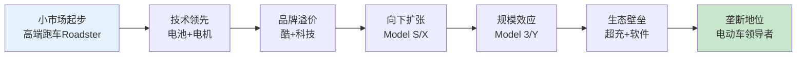
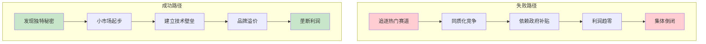
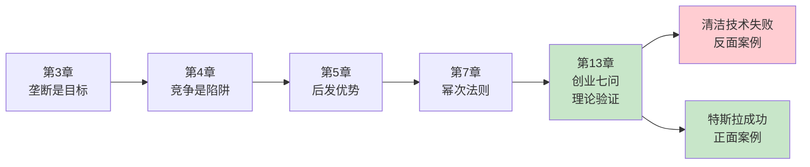

# 第13章《绿色能源与特斯拉》深度拆解

> **章节主题**：清洁技术为什么失败，特斯拉为什么成功
> **核心概念**：创业七问（7个维度检验垄断潜力）
> **拆解日期**：2026-02-28

---

## 一、章节定位

### 1.1 这一章在解决什么问题？

**核心困境**：2000年代，清洁技术成为硅谷最热门的投资领域，无数创业公司和数十亿美元涌入，结果呢？几乎全部失败。为什么清洁技术公司集体崩塌，而特斯拉却成为唯一赢家？

彼得·蒂尔的答案是：**大多数清洁技术公司只是从1到N的复制，没有建立真正的垄断壁垒。特斯拉成功，是因为它在7个维度上都通过了检验。**

**一句话定位**：
> 清洁技术不是问题，没有垄断思维才是问题。

**降维翻译**：
> 同样是造电动车，为什么特斯拉成了，其他公司都死了？因为它在七个关键维度上做到了别人做不到的事。

---

### 1.2 这一章在全书的地位

| 维度 | 定位 |
|------|------|
| **章节位置** | 第13章（案例章，理论的应用） |
| **功能** | 用清洁技术案例验证垄断理论 |
| **核心概念** | 创业七问（7个检验维度） |
| **承上启下** | 前面理论的实战验证 |

**在全书中的角色**：
- **验证者**：用真实案例验证垄断理论
- **方法论者**：提供创业七问作为检验工具
- **警示者**：告诉创业者"好赛道"不等于"好生意"

---

### 1.3 和主读书笔记的关联

这一章是全书理论的最佳实践案例，将前12章的垄断思维、竞争意识、后发优势等概念全部串联：

| 前置章节 | 关联逻辑 |
|----------|----------|
| **第3章 所有成功的企业都是不同的** | 特斯拉为什么与众不同 |
| **第4章 竞争意识** | 清洁技术公司陷入同质化竞争 |
| **第5章 后发优势** | 特斯拉如何建立持久优势 |
| **第7章 向钱看** | 幂次法则：投中唯一赢家的回报 |

---

## 二、核心观点（三层提取）

### 观点1：清洁技术失败的真正原因

#### 【表层】现象层

**蒂尔的观察**：
- 2000年代，清洁技术成为硅谷最热门赛道
- Solyndra（太阳能）融资10亿美元后破产
- Better Place（电动车换电）融资8.5亿美元后倒闭
- A123 Systems（电池）融资超过10亿美元后被低价收购
- 无数公司倒闭，投资者血本无归

**失败公司清单**：
| 公司 | 领域 | 融资金额 | 结局 |
|------|------|----------|------|
| Solyndra | 太阳能 | 10亿美元 | 破产 |
| Better Place | 换电 | 8.5亿美元 | 破产 |
| A123 Systems | 电池 | 10亿美元 | 低价出售 |
| Fisker | 电动车 | 14亿美元 | 破产 |
| Abound Solar | 太阳能 | 4亿美元 | 破产 |

#### 【中层】机制层

**清洁技术失败的四大原因**：

| 维度 | 失败原因 | 具体表现 |
|------|----------|----------|
| **时机问题** | 进入太早或太晚 | 2000年代油价高涨时入场，页岩油革命后需求暴跌 |
| **竞争问题** | 同质化竞争严重 | 所有公司都在做同样的太阳能板，没有差异化 |
| **技术问题** | 没有技术壁垒 | 技术容易被复制，无法建立垄断 |
| **政策依赖** | 依赖政府补贴 | 补贴退坡后，公司失去生存能力 |

**核心机制**：
```
清洁技术泡沫 = 好赛道 + 无垄断思维 + 同质化竞争 + 政策依赖
            = 集体失败
```

**失败公司的共同特点**：
1. 都在追逐"热门赛道"
2. 都在做从1到N的复制
3. 都没有技术壁垒
4. 都依赖政府补贴
5. 都陷入同质化竞争

#### 【底层】规律层

> **蒂尔赛道定律**：好赛道不等于好生意。如果没有垄断思维，再好的赛道也会变成竞争红海。

**2026年的验证**：
- **AI应用开发**：2023-2025年大量涌入，2026年大量倒闭
- **Web3项目**：2021-2022年热潮，2023年后大批死亡
- **社区团购**：2020-2021年烧钱大战，2022年后剩者为王

**蒂尔的警示**：
> "不要因为一个行业很热就进入。热门行业意味着竞争激烈，利润微薄。"

#### 【当下连接】2026场景

|----------|----------|----------|
| 为什么我追的热门赛道都不赚钱？ | 热门赛道竞争激烈，没有垄断 | "原来如此" |
| AI应用还能做吗？ | 问自己：你有垄断优势吗？没有就别做 | "方向清晰" |
| 为什么别人成功我失败？ | 别人建立了垄断，你只是跟风 | "醍醐灌顶" |

---

### 观点2：特斯拉为什么成功——创业七问

#### 【表层】现象层

**特斯拉的成功数据**：
- 2010年上市，股价从17美元涨到2025年超过300美元
- 市值一度超过丰田+大众之和
- 成为全球最有价值的汽车公司
- 唯一盈利的电动车公司（2020年后）

**与其他清洁技术公司的对比**：
| 维度 | 特斯拉 | 其他公司 |
|------|--------|----------|

#### 【中层】机制层

**创业七问（7个检验维度）**：

| 问题 | 清洁技术公司 | 特斯拉 | 说明 |
|------|-------------|--------|------|

**特斯拉的垄断路径图**：



**特斯拉成功的关键**：
1. **技术领先**：电池技术、电机效率、自动驾驶
2. **小市场起步**：从高端跑车开始，而非大众市场
3. **品牌差异化**：酷、科技、环保三位一体
4. **渠道控制**：直销模式，控制用户体验
5. **生态壁垒**：超充网络、OTA升级、软件生态

#### 【底层】规律层

> **蒂尔创业七问定律**：一个成功的创业公司必须在7个维度上都通过检验。如果任何一个维度失败，整个创业都可能失败。

**2026年的应用**：

| 创业领域 | Q1工程 | Q2时机 | Q3垄断 | Q4人员 | Q5分销 | Q6耐久 | Q7秘密 | 成功概率 |
|----------|--------|--------|--------|--------|--------|--------|--------|----------|

#### 【当下连接】2026场景

| 场景 | 错误做法 | 正确做法（特斯拉模式） |
|------|----------|------------------------|
| **AI创业** | 直接做应用（从1到N） | 研发核心模型（从0到1） |
| **新能源创业** | 进入大众市场 | 从小市场建立垄断 |
| **硬件创业** | 依赖渠道销售 | 直销模式控制体验 |
| **技术创业** | 只关注技术 | 技术同时建品牌壁垒 |

---

### 观点3：从清洁技术学到的教训

#### 【表层】现象层

**清洁技术的教训**：
- 好意图≠好生意
- 政府补贴≠可持续
- 热门赛道≠赚钱机会
- 环保情怀≠商业成功

**特斯拉的启示**：
- 酷比环保更重要（先做酷的车，再做环保的车）
- 小市场比大市场更安全
- 控制渠道比依赖渠道更关键
- 技术壁垒比情怀更可靠

#### 【中层】机制层

**失败路径vs成功路径**：



**关键差异**：
| 维度 | 失败公司 | 特斯拉 |
|------|----------|--------|
| **起点** | 热门赛道 | 独特秘密 |
| **市场** | 大众市场 | 小市场起步 |
| **技术** | 小改进 | 10倍改进 |
| **情感** | 环保情怀 | 酷+科技 |
| **渠道** | 依赖经销商 | 直销控制 |
| **壁垒** | 无 | 多重壁垒 |

#### 【底层】规律层

> **蒂尔教训定律**：好的意图+错误的商业模式=失败。成功需要的是独特洞察+正确执行+垄断思维。

**2026年的警示**：
- **不要追逐热门赛道**：AI应用、Web3、元宇宙都可能重蹈清洁技术覆辙
- **问自己七个问题**：任何一个维度不过关，就要重新考虑
- **小市场起步**：不要一开始就想改变世界
- **建立壁垒**：技术、品牌、渠道、生态，至少有一个

#### 【当下连接】2026场景

| 热门赛道 | 当年清洁技术 | 今天的风险 | 如何避免 |
|----------|--------------|------------|----------|
| **AI应用** | 太阳能板 | 同质化竞争 | 做技术壁垒 |
| **Web3** | 清洁技术 | 政策风险 | 合规先行 |
| **社区团购** | 电动车换电 | 烧钱大战 | 盈利优先 |
| **预制菜** | 生物燃料 | 消费者抗拒 | 品质优先 |

---

## 三、金句库

### 原书金句（⭐⭐⭐权威来源）

1. "清洁技术公司的问题不是技术，而是商业模式。"

2. "特斯拉成功，是因为它在七个维度上都通过了检验。"

3. "好的意图不能保证好的商业结果。"

4. "环保主义者开普锐斯，酷的人开特斯拉。"

5. "不要因为一个行业很热就进入。"

6. "小市场比大市场更安全。"

7. "控制渠道比依赖渠道更关键。"

---

### 降维金句（便于传播，中学生能懂）

8. "热门赛道是坟墓，冷门赛道是金矿。"

9. "酷比特效重要，环保比情怀值钱。"

10. "同样是造车，特斯拉建了壁垒，其他公司只建了工厂。"

11. "七问不过关，创业就是送钱。"

12. "好赛道不等于好生意，好意图不等于好结果。"

13. "小池塘里做大鱼，比大海洋里做小鱼更安全。"

14. "依赖补贴的公司，补贴一停就死。"

15. "马斯克卖的是酷，不是环保。"

---

## 四、当下映射（2026年场景）

### AI创业连接

| 读者困惑 | 章节答案 | 行动建议 |
|----------|----------|----------|
| AI应用还能做吗？ | 问七问，过不了就别做 | 只做有技术壁垒的AI |
| AI创业方向怎么选？ | 小市场起步，建立垄断 | 不要直接做大模型应用 |
| 为什么我的AI项目不赚钱？ | 可能在从1到N，竞争激烈 | 问自己：我有秘密吗？ |

---

### 新能源连接

| 读者困惑 | 章节答案 | 行动建议 |
|----------|----------|----------|
| 储能还能创业吗？ | 问七问，看有没有垄断机会 | 技术突破是关键 |
| 充电桩生意怎么做？ | 不要只做充电桩，要建生态 | 超充网络+服务生态 |
| 氢能源有戏吗？ | 问七问，看时机对不对 | 技术成熟度是关键 |

---

### 创业焦虑连接

| 读者困惑 | 章节答案 | 行动建议 |
|----------|----------|----------|
| 热门赛道要不要追？ | 别追，追了就是韭菜 | 寻找冷门的秘密 |
| 如何判断创业方向？ | 用创业七问检验 | 七个问题都过再动手 |
| 为什么别人成功我失败？ | 别人有垄断，你只有努力 | 建立壁垒，不是努力工作 |

---

## 五、章节关联

### 与前置章节的逻辑链



### 核心逻辑链条

1. **第3章提出理论**：成功的企业都是垄断的
2. **第4章分析原因**：竞争扼杀创新
3. **第5章给出方案**：后发优势
4. **第7章强调重点**：幂次法则，投中唯一赢家
5. **第13章验证理论**：清洁技术失败vs特斯拉成功

---

### 与已拆解书籍的关联

| 书籍 | 关联逻辑 | 共同底层 |
|------|----------|----------|
| [[精益创业-埃里克·里斯]] | 创业七问是验证工具，精益创业是迭代方法 | 小步快跑，验证假设 |
| [[纳瓦尔宝典-乔根森]] | 特斯拉垄断≈专长知识+杠杆 | 独特价值+规模效应 |
| [[大败局-吴晓波]] | 清洁技术泡沫=中国90年代企业泡沫 | 追逐热门=集体失败 |

---

## 六、创业七问详解（实操工具）

### Q1：工程问题——你能创造10倍改进吗？

**检验标准**：
- 你的技术是否比现有方案好10倍以上？
- 如果只是小改进，用户不会切换

**特斯拉案例**：

**2026应用**：
- AI模型：是否比GPT-4好10倍？
- 量子计算：是否比传统计算快10倍？
- 新能源：是否比现有方案便宜10倍？

---

### Q2：时机问题——现在是正确时机吗？

**检验标准**：
- 技术是否成熟？
- 市场是否准备好？
- 政策是否支持？

**特斯拉案例**：

**2026应用**：
- Web3：技术待完善，政策不明，时机⚠️
- 量子计算：技术不成熟，时机❌

---

### Q3：垄断问题——你能从小市场起步吗？

**检验标准**：
- 你能找到一个小市场并主导它吗？
- 不要一开始就进入大市场

**特斯拉案例**：

**2026应用**：
- AI应用：直接进入大市场❌

---

### Q4：人员问题——你有正确的团队吗？

**检验标准**：
- 你的团队是技术驱动还是情怀驱动？
- 工程师文化>环保主义文化

**特斯拉案例**：

**2026应用**：
- 任何创业：执行力>愿景

---

### Q5：分销问题——你能控制渠道吗？

**检验标准**：
- 你能直接触达用户吗？
- 还是依赖中间商？

**特斯拉案例**：

**2026应用**：
- 传统行业：可能需要渠道，但尽量控制

---

### Q6：耐久问题——你能建立持久壁垒吗？

**检验标准**：
- 10年后你还能保持领先吗？
- 你的护城河是什么？

**特斯拉案例**：

**2026应用**：
- AI模型：技术壁垒⚠️（可能被超越）
- AI应用：几乎无壁垒❌

---

### Q7：秘密问题——你发现了独特机会吗？

**检验标准**：
- 你有没有发现别人没看到的真相？
- 这个秘密是反主流但正确的吗？

**特斯拉案例**：

**2026应用**：
- AI的秘密是什么？（还没人知道）
- Web3的秘密是什么？（去中心化价值？）
- 你的创业秘密是什么？（需要你自己发现）

---

## 七、问答设计（启发式提问）

### 认知觉醒问题

**Q1：如果你今天创业，你能通过创业七问吗？**
- Q1：你有10倍技术改进吗？
- Q2：时机对吗？
- Q3：你能从小市场起步吗？
- **行动**：七个问题都答不上来，就别创业

**Q2：你所在的行业有"清洁技术泡沫"吗？**
- AI应用开发？
- Web3项目？
- 社区团购？
- **行动**：如果是泡沫，赶紧退出

**Q3：特斯拉成功是因为环保，还是因为酷？**
- 大多数人买特斯拉因为酷，不是因为环保
- **启发**：情感价值>功能价值>道德价值

---

### 深度思考问题

**Q4：为什么清洁技术公司集体失败，只有特斯拉成功？**
- 原因1：特斯拉有技术壁垒，其他公司没有
- 原因2：特斯拉从小市场起步，其他公司直接进入大市场
- 原因3：特斯拉控制渠道，其他公司依赖渠道
- **启发**：垄断思维>努力工作

**Q5：2026年有哪些"清洁技术泡沫"？**
- AI应用开发：大量涌入，大量倒闭
- Web3项目：热潮退去，大量死亡
- **行动**：不要追热点，要追秘密

**Q6：如果你有1000万，会投清洁技术吗？**
- 蒂尔的答案：不会，除非有垄断
- **启发**：好赛道≠好生意

---

## 八、执行清单（读完本章立即行动）

### Step 1: 七问自检（今天完成）

- [ ] Q1：我的技术/产品比现有方案好10倍吗？
- [ ] Q2：现在进入的时机对吗？
- [ ] Q3：我能从小市场起步并主导它吗？
- [ ] Q4：我有正确的团队吗？
- [ ] Q5：我能控制分销渠道吗？
- [ ] Q6：我能建立持久壁垒吗？
- [ ] Q7：我发现了独特秘密吗？

### Step 2: 方向评估（本周完成）

- [ ] 分析你所在的行业：有没有"清洁技术泡沫"？
- [ ] 列出3个你想进入的热门赛道
- [ ] 用七问检验每个赛道，看哪个值得进入

### Step 3: 战略调整（本月完成）

- [ ] 如果七问不过，考虑换方向
- [ ] 如果在小市场，思考如何建立垄断
- [ ] 如果在大市场，思考如何找到细分利基

---

## 十、读者反馈收集点

### 认知冲击点（最可能引发共鸣）

1. **"创业七问"**：七个维度检验垄断潜力
2. **"酷比环保更值钱"**：情感价值>道德价值
3. **"热门赛道是坟墓"**：追热点=送钱

### 行动触发点（最可能引发行动）

1. **七问自检**：用创业七问检验自己的项目
2. **方向评估**：分析所在行业有没有泡沫
3. **战略调整**：七问不过就换方向

---
