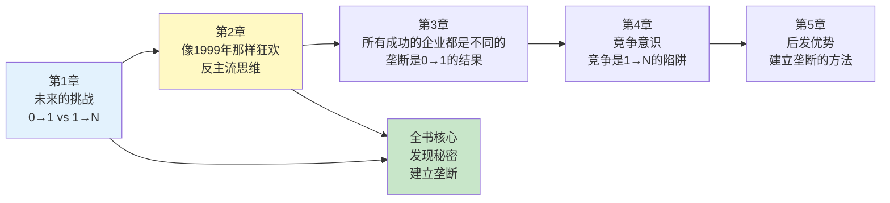

# 第2章《像1999年那样狂欢》深度拆解

> **章节主题**：创业需要反主流思维
> **核心概念**：反主流、逆向思考、从0到1的思维基础
> **拆解日期**：2026-02-27

---

## 一、章节定位

### 1.1 这一章在解决什么问题？

**核心困境**：为什么大多数创业者的想法都差不多？为什么"从0到1"的创新如此稀缺？

彼得·蒂尔的答案是：**因为大多数人都在追随主流，而真正的创新需要反主流思维。**

**一句话定位**：
> 最反主流的行动，不是抵制潮流，而是在潮流中不迷失自己。

**降维翻译**：
> 别人往东你往西，不是叛逆，是找到自己的路。

---

### 1.2 这一章在全书的地位

| 维度 | 定位 |
|------|------|
| **章节位置** | 第2章（承接第1章，展开方法论） |
| **功能** | 回答"如何培养从0到1的思维" |
| **核心概念** | 反主流思维、逆向思考 |
| **承上启下** | 从"为什么要从0到1"到"如何从0到1" |

**在全书中的角色**：
- **思维训练者**：教你如何思考"反主流"
- **破除迷思者**：揭示1999年互联网泡沫的教训
- **方法论铺垫**：为"发现秘密"章节做准备

---

### 1.3 和主读书笔记的关联

这一章是全书方法论的核心，解释了"从0到1"背后的思维基础：

| 主拆解概念 | 本章对应 | 关联逻辑 |
|------------|----------|----------|
| 从0到1 | 反主流思维的结果 | 不反主流，就无法从0到1 |
| 秘密 | 反主流但正确的信念 | 秘密就是"别人不信但你信" |
| 垄断 | 反主流创业的目标 | 反主流路径才能建立垄断 |
| 竞争 | 主流思维的陷阱 | 主流思维导致竞争红海 |

---

## 二、核心观点（三层提取）

### 观点1：反主流思维是从0到1的基础

#### 【表层】现象层

**蒂尔的观察**：
- 1999年互联网泡沫时期，人人都说"新经济"来了
- 泡沫破裂后，人人都说"互联网是骗局"
- 两种极端都是错的，真相在中间

**具体案例**：
- **1999年的疯狂**：纳斯达克指数从1995年的1000点涨到2000年的5000点
- **2000年的崩溃**： Pets.com、Webvan等明星公司破产
- **2004年的PayPal**：蒂尔在泡沫破裂后创立PayPal，用反主流思维成功

**两个极端的错误**：
```
极端1（1999年）：传统商业规律不再适用
  → 错！商业规律永远适用

极端2（2001年）：互联网是骗局
  → 错！互联网改变了世界

真相：互联网重要，但商业规律依然重要
```

#### 【中层】机制层

**主流vs反主流对比表**：

| 维度 | 主流思维 | 反主流思维 |
|------|----------|------------|
| **定义** | 跟随大多数人的想法 | 质疑大多数人的想法 |
| **风险** | 表面安全，实际平庸 | 表面危险，实际机会 |
| **结果** | 进入竞争红海 | 发现垄断机会 |
| **例子** | 1999年投资互联网公司 | 2004年创立PayPal |
| **财富** | 分蛋糕 | 造蛋糕 |

**核心机制**：
```
主流思维 → 模仿 → 竞争 → 利润归零
反主流思维 → 创新 → 垄断 → 超额利润
```

**反主流的本质**：
- 不是"别人往东我往西"（那是叛逆）
- 而是"别人看到的，我也看到；别人没看到的，我看到了"（那是洞察）
- 关键是：**在潮流中保持独立思考**

#### 【底层】规律层

> **蒂尔反主流定律**：最反主流的行动不是抵制潮流，而是在潮流中不迷失自己。

**深层含义**：
1. **不是叛逆**：反主流不是"反对一切"
2. **是独立**：反主流是"有自己的判断"
3. **是坚持**：反主流是"相信别人不信但正确的事"

**历史验证**：
- **2008年金融危机**：主流恐慌，巴菲特抄底
- **2020年疫情**：主流抛售，聪明人买入
- **2022年AI寒冬**：主流看衰，OpenAI坚持

#### 【当下连接】2026场景

|----------|----------|----------|
| 大家都说AI要颠覆一切，我该怎么办？ | 别跟风，找你独特的角度 | "方向感" |
| 我要不要做AI创业？ | 问自己：我看到别人没看到的了吗？ | "冷静思考" |
| 为什么我的想法和别人一样？ | 主流教育培养的是从众者 | "醍醐灌顶" |
| 2026年有什么反主流机会？ | 气候技术、空间探索、长寿科技 | "启发" |

---

### 观点2：1999年的教训是"四个商业原则"

#### 【表层】现象层

**蒂尔的四个教训**：

1. **循序渐进**：不要狂妄自大，从小步开始
2. **保持精简**：精益创业，不要过度扩张
3. **在竞争中改进**：不要试图创造新市场，在现有市场做得更好
4. **专注于产品**：不要专注于销售

**这四个教训的问题**：
- 看起来很合理
- 但实际上扼杀了创新
- 因为它们都是"从1到N"的思维

#### 【中层】机制层

**四个教训 vs 反教训对比**：

| 1999年教训 | 为什么对 | 为什么错 | 反教训（蒂尔） |
|------------|----------|----------|----------------|
| 循序渐进 | 避免狂妄 | 扼杀野心 | 大胆尝试，即使是坏计划也好过没有计划 |
| 保持精简 | 避免浪费 | 避免创新 | 创新需要资源，垄断需要规模 |
| 在竞争中改进 | 降低风险 | 进入红海 | 竞争是留给失败者的 |
| 专注于产品 | 产品重要 | 销售也重要 | 好产品需要好销售 |

**核心机制**：
```
四个教训 = 风险规避思维 = 从1到N思维 = 竞争思维
反教训 = 创新思维 = 从0到1思维 = 垄断思维
```

**蒂尔的反直觉**：
> "狂妄自大"比"没有野心"好
> "坏计划"比"没有计划"好
> "竞争市场"是最差的起点
> "销售"和"产品"一样重要

#### 【底层】规律层

> **蒂尔创业定律**：坏计划比没有计划好，竞争市场是最差的起点，销售和产品一样重要。

**深层逻辑**：
1. **野心是创新的起点**：没有野心，就没有从0到1
2. **计划是思维的工具**：即使计划错了，思考过程也有价值
3. **垄断是目标**：竞争市场利润归零
4. **销售是价值传递**：好产品没人知道，等于没价值

**2026年的验证**：
- **AI创业**：大多数人在做"从1到N"的应用（竞争激烈）
- **气候技术**：需要"从0到1"的创新（机会稀缺）
- **生物科技**：需要大胆的计划和资源（风险高但回报大）

#### 【当下连接】2026场景

| 场景 | 1999年教训（错误） | 蒂尔反教训（正确） |
|------|------------------|-------------------|
| AI创业 | 做AI应用，在竞争中改进 | 发明新AI模型，建立垄断 |
| 副业 | 循序渐进，保持精简 | 大胆尝试，找到独特价值 |
| 投资 | 专注产品，不关注销售 | 好公司需要好销售 |
| 职业发展 | 在竞争中改进 | 找到垄断你的利基市场 |

---

### 观点3：反主流不是叛逆，是独立判断

#### 【表层】现象层

**蒂尔的区分**：

**不是反主流**：
- 别人说东，你说西
- 别人买苹果，你买华为
- 别人看多，你看空

**是反主流**：
- 别人看到的，你也看到
- 别人没看到的，你看到了
- 别人不信但你信的事，你验证了

**具体案例**：
- **PayPal（1999-2000）**：互联网泡沫时期，蒂尔创立PayPal
  - 别人说"互联网改变一切" → 蒂尔知道商业规律依然重要
  - 别人说"互联网是骗局" → 蒂尔知道数字支付是未来
  - **反主流洞察**：数字支付重要，但要用正确的方式做

#### 【中层】机制层

**叛逆 vs 独立判断对比**：

| 维度 | 叛逆 | 独立判断（反主流） |
|------|------|-------------------|
| **动机** | 反对别人 | 寻找真相 |
| **方法** | 反着来 | 独立分析 |
| **结果** | 可能错，可能对 | 基于逻辑和证据 |
| **价值** | 没有价值 | 发现秘密 |
| **例子** | 别人买苹果，我买华为 | 别人没看到的，我看到了 |

**核心机制**：
```
反主流 = 独立思考 + 验证假设 + 坚持判断
       = 别人没看到的 + 我看到了 + 我验证了 + 我坚持了
```

**反主流的四个步骤**：
1. **观察**：别人在看什么？没看什么？
2. **质疑**：主流观点真的对吗？
3. **验证**：我的不同看法有证据吗？
4. **坚持**：即使别人不信，我也要坚持

#### 【底层】规律层

> **蒂尔独立判断定律**：反主流的价值不在于"反对"，而在于"独立"。真正的反主流是看到别人没看到的真相。

**深层含义**：
1. **独立思考是稀缺的**：大多数人是"从众动物"
2. **独立判断需要勇气**：即使别人不信，也要坚持
3. **独立判断需要能力**：不是乱猜，是基于证据和逻辑

**历史验证**：
- **巴菲特**：别人恐慌我贪婪，别人贪婪我恐慌
- **马斯克**：电动车是未来（2004年没人信）
- **张一鸣**：短视频是未来（2012年没人信）

#### 【当下连接】2026场景

|----------|----------|----------|
| 我怎么知道自己对不对？ | 独立思考+验证假设 | "方法论" |
| 别人都不信我，我该坚持吗？ | 有证据就坚持，没证据就修正 | "勇气" |
| 如何培养独立判断能力？ | 质疑主流观点，寻找反面证据 | "启发" |
| 2026年有什么反主流机会？ | 别人看衰的领域（Web3、传统行业） | "方向" |

---

## 三、金句库

### 原书金句（⭐⭐⭐权威来源）

1. "最反主流的行动，不是抵制潮流，而是在潮流中不迷失自己。"

2. "狂妄自大比没有野心好。"

3. "坏计划比没有计划好。"

4. "竞争市场是最差的起点。"

5. "销售和产品一样重要。"

6. "1999年的教训是：循序渐进、保持精简、在竞争中改进、专注于产品。但这些教训扼杀了创新。"

7. "最反主流的公司，往往成为最成功的公司。"

8. "独立思考比反对更重要。"

---

### 降维金句（便于传播，中学生能懂）

9. "别人往东你往西，不是叛逆，是找到自己的路。"

10. "反主流不是"对着干"，是"看得远"。"

11. "狂妄自大比没野心强一百倍。"

12. "坏计划比没计划好，没计划等于瞎搞。"

13. "竞争市场是创业者的坟墓，垄断市场是创业者的天堂。"

14. "好产品不会自己卖出去，好销售和好产品一样重要。"

15. "独立判断的人，看到别人看不到的机会。"

16. "1999年的教训是错的，它教的是"从1到N"，不是"从0到1"。"

17. "反主流的终点不是反对，是发现真相。"

18. "别人不信但你信的事，就是你的秘密。"

---

## 四、当下映射（2026年场景）

### 财富焦虑连接

| 读者困惑 | 章节答案 | 行动建议 |
|----------|----------|----------|
| 大家都说AI能赚钱，我该跟风吗？ | 跟风只能分蛋糕，创新才能造蛋糕 | 问自己：我能创造什么新价值？ |
| 投资应该投什么？ | 投反主流但正确的领域 | 气候技术、生物科技、空间探索 |
| 副业怎么选方向？ | 别模仿成功项目，找反主流机会 | 问自己：别人不信但我信的是什么？ |

---

### 职场焦虑连接

| 读者困惑 | 章节答案 | 行动建议 |
|----------|----------|----------|
| AI会替代我的工作吗？ | 从众的工作会被替代，独立判断的不会 | 培养独立思考能力 |
| 35岁危机怎么办？ | 一直在从众，没有独立判断 | 找到你的反主流价值 |
| 如何在职场脱颖而出？ | 不是做得更多，是看得更远 | 培养独立判断，发现别人没看到的 |

---

### 创业焦虑连接

| 读者困惑 | 章节答案 | 行动建议 |
|----------|----------|----------|
| 2026年创业方向是什么？ | 寻找反主流机会 | 气候技术、空间探索、长寿科技 |
| 为什么我的创业项目不成功？ | 你可能在做从1到N的事 | 问自己：我在创造新事物，还是复制旧模式？ |
| 如何找到创业机会？ | 不在主流市场，在反主流领域 | 问自己：别人不信但我信的是什么？ |

---

## 五、章节关联

### 与前后章节的逻辑链



### 核心逻辑链条

1. **第1章提出问题**：为什么创新越来越少？
2. **第2章分析原因**：我们被主流思维困住了
3. **第3章给出方案**：用垄断思维替代竞争思维
4. **第4章深入分析**：竞争意识的危害
5. **第5章展开方法**：如何建立垄断

---

### 与已拆解书籍的关联

| 书籍 | 关联逻辑 | 共同底层 |
|------|----------|----------|
| [[精益创业-埃里克·里斯]] | 反主流是战略选择，精益创业是验证方法 | 独立思考，反对盲目跟风 |
| [[纳瓦尔宝典-乔根森]] | 反主流≈专长知识，垄断≈杠杆规模效应 | 创造独特价值 |
| [[大败局-吴晓波]] | 大败局案例多是盲目从众的失败 | 从众的危险 |

---

## 六、问答设计（启发式提问）

### 认知觉醒问题

**Q1：你最近做的决定，有多少是"从众"，有多少是"独立判断"？**
- 如果大多数是"从众" → 你可能在从1到N
- 如果大多数是"独立判断" → 你可能在从0到1
- **行动**：回顾最近3个重要决定，分析动机

**Q2：你有没有"别人不信但你信"的事？**
- 如果没有 → 你可能没有"秘密"
- 如果有 → 验证它，可能就是你的机会
- **行动**：列出3个你相信但别人不信的事

**Q3：1999年的四个教训，你在用吗？**
- 循序渐进？保持精简？在竞争中改进？专注于产品？
- 如果是 → 你可能在从1到N
- **行动**：问自己"我能创造什么新事物？"

---

### 深度思考问题

**Q4：为什么"狂妄自大"比"没有野心"好？**
- 没有野心 = 没有创新 = 从1到N
- 狂妄自大 = 有野心 = 可能在从0到1
- **蒂尔的逻辑**：坏计划比没有计划好

**Q5：为什么"竞争市场"是最差的起点？**
- 竞争市场 = 利润归零 = 疲于生存
- 垄断市场 = 超额利润 = 持续创新
- **行动**：问自己"我能在哪个利基市场建立垄断？"

**Q6：如果你能穿越回1999年，你会做什么？**
- 不是买互联网股票（泡沫会破）
- 而是创立像PayPal这样的公司（反主流洞察）
- **启示**：在泡沫中保持独立判断

---

## 七、反主流思维训练法

### 训练1：质疑主流观点（每天5分钟）

**步骤**：
1. 选择一个主流观点（如"AI将改变一切"）
2. 问自己：这个观点真的对吗？
3. 寻找反面证据（如"AI目前无法做什么？"）
4. 形成你的独立判断

**示例**：
- 主流：AI将替代所有工作
- 质疑：AI能替代什么？不能替代什么？
- 独立判断：AI替代重复性工作，但创造力和判断力难以替代

---

### 训练2：发现反主流机会（每周1次）

**步骤**：
1. 列出3个"别人不信但我信"的事
2. 问自己：有证据吗？
3. 如果有证据，问自己：我能从中创造价值吗？

**2026年示例**：
- 别人看衰Web3 → 你看到去中心化的价值
- 别人说传统行业没机会 → 你看到数字化改造的机会
- 别人说气候技术太难 → 你看到长期价值

---

### 训练3：验证独立判断（每月1次）

**步骤**：
1. 回顾你1个月前的独立判断
2. 问自己：预测对了吗？
3. 如果错了，问自己：哪里分析错了？
4. 如果对了，问自己：我能从中创造价值吗？

**目的**：
- 提高独立判断的准确率
- 培养独立思考的习惯

---

## 八、执行清单（读完本章立即行动）

### Step 1: 自我诊断（今天完成）

- [ ] 回顾最近3个重要决定，分析是"从众"还是"独立判断"
- [ ] 列出3个你相信但别人不信的事
- [ ] 问自己：我有没有"反主流"的机会？

### Step 2: 思维转换（本周完成）

- [ ] 每天5分钟质疑一个主流观点
- [ ] 停止模仿成功项目，开始思考"我能创造什么"
- [ ] 问3个朋友："你觉得我最独特的价值是什么？"

### Step 3: 验证判断（本月完成）

- [ ] 选择1个反主流观点，收集证据验证
- [ ] 关注别人看衰的领域（Web3、传统行业、气候技术）
- [ ] 问自己："我能在这个领域创造什么新事物？"

---

## 十、读者反馈收集点

### 认知冲击点（最可能引发共鸣）

1. **"反主流不是叛逆"**：区分"叛逆"和"独立判断"
2. **"四个教训是错的"**：1999年的教训扼杀创新
3. **"狂妄自大比没野心好"**：野心是创新的起点

### 行动触发点（最可能引发行动）

1. **质疑主流观点**：每天5分钟训练
2. **发现反主流机会**：别人不信但你信的事
3. **验证独立判断**：每月回顾预测准确率

---
