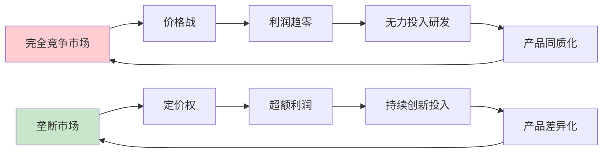
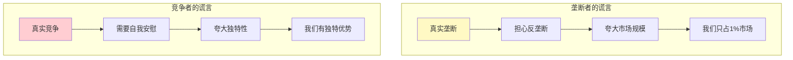
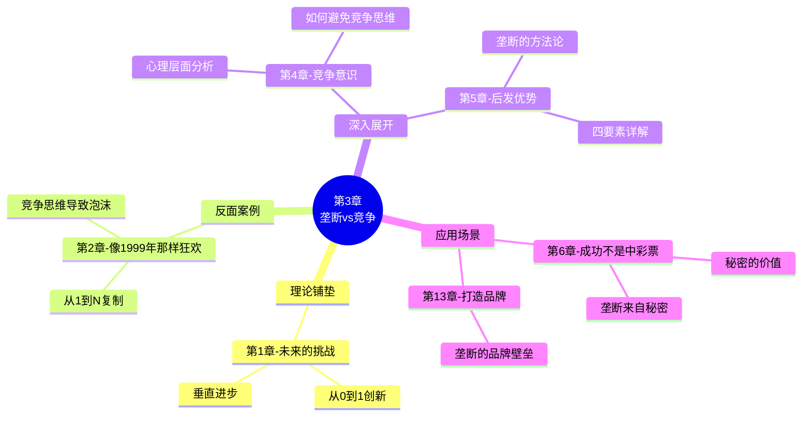

# 第3章：所有成功的企业都是不同的

> **章节主题**：垄断vs竞争——为什么垄断才是成功企业的目标
> **核心论点**：竞争扼杀利润，垄断创造财富
> **拆解日期**：2026-02-27

---

## 一、章节定位

### 1.1 在全书中解决什么问题？

**核心问题**：创业者应该追求什么目标？

传统观点认为"竞争是好事"，但蒂尔颠覆性地提出：
> **竞争是留给失败者的，垄断才是创业者的目标。**

本章是全书的理论基石，回答了"为什么大多数创业公司失败"的根本原因。

### 1.2 章节结构

```
第3章结构：
├── 引言：美国人神话般的竞争执念
├── 核心论证：竞争vs垄断的本质区别
├── 案例对比：谷歌vs航空公司
├── 垄断的谎言：垄断者如何伪装成竞争者
├── 竞争的谎言：竞争者如何假装自己是独特的
└── 结论：选择垄断，避免竞争
```

### 1.3 与其他章节的关联

| 章节 | 关联类型 | 关联逻辑 |
|------|----------|----------|
| [[第1章-未来的挑战]] | 理论铺垫 | 第1章讲"从0到1创新" → 第3章讲"垄断是创新的结果" |
| [[第2章-像1999年那样狂欢]] | 反面案例 | 第2章讲"1999年泡沫" → 第3章讲"为什么会失败（竞争思维）" |
| 第4章"竞争意识" | 深入展开 | 第3章讲"垄断好" → 第4章讲"如何避免竞争思维" |
| 第5章"后发优势" | 方法论延伸 | 第3章讲"为什么要垄断" → 第5章讲"如何建立垄断" |

---

## 二、核心观点（三层提取）

### 观点1：垄断vs竞争——利润的真相

#### 【表层】现象层

**两个极端案例的对比**：

| 维度 | 谷歌（垄断者） | 美国航空公司（竞争者） |
|------|---------------|---------------------|
| 市场地位 | 搜索市场绝对垄断 | 完全竞争市场 |
| 净利润率 | 25%+（2025年超700亿美元） | 约3%（百年累计利润几乎为零） |
| 定价权 | 完全控制广告价格 | 被迫打价格战 |
| 创新投入 | 持续投入研发 | 疲于生存，无力创新 |
| 长期规划 | 可以布局10年 | 只能关注下一季度 |

**生活中的例子**：
- 餐厅竞争：一条街10家餐厅，每家利润微薄
- 微信垄断：社交领域绝对主导，利润丰厚
- 出租车vs网约车：放开管制前后的利润变化

#### 【中层】机制层

**为什么竞争扼杀利润？**



**竞争的心理陷阱**：
1. 竞争让人只关注对手，忽略真正的客户需求
2. 竞争让人模仿，而非创新
3. 竞争让人疲于应付短期，无法长期规划

#### 【底层】规律层

> **蒂尔垄断定律**：在商业中，要么成为垄断者享受超额利润，要么在竞争中挣扎求生。第三条路不存在。

**经济学视角的反转**：
- 传统经济学：完全竞争是"理想状态"
- 蒂尔观点：完全竞争是"死亡陷阱"
- 真相：传统经济学关注"社会福利最大化"，蒂尔关注"创业者利益最大化"

#### 【当下连接】2026场景

|----------|----------|----------|
| "为什么我的餐厅不赚钱？" | 你在红海竞争，利润被消耗 | "原来不是我笨" |
| "创业应该选什么方向？" | 寻找能建立垄断的利基市场 | "方向感来了" |
| "为什么大平台那么赚钱？" | 他们有垄断地位和定价权 | "原来如此" |
| "AI时代怎么创业？" | 别跟风做AI应用，去做AI模型 | "醍醐灌顶" |

---

### 观点2：垄断者vs竞争者的谎言

#### 【表层】现象层

**垄断者的谎言**：
- 谷歌说："我们只占全球广告市场的一小部分"
- 真相：谷歌占搜索广告市场90%+，但通过定义更大的"市场"来稀释份额
- 目的：避免反垄断调查

**竞争者的谎言**：
- 一家普通餐厅说："我们有独特配方"
- 真相：和街上其他9家餐厅几乎没有区别
- 目的：说服自己"我与众不同"

#### 【中层】机制层

**为什么需要谎言？**



**核心洞察**：
- 垄断者害怕政府，所以假装竞争
- 竞争者害怕自己，所以假装独特
- 两者都在说谎，但方向相反

#### 【底层】规律层

> **谎言定律**：垄断者编造谎言隐藏垄断，竞争者编造谎言掩盖平庸。

**商业真相**：
- 成功的企业都是垄断的（在某个细分领域）
- 失败的企业都在竞争（但没有护城河）
- 关键是：选择做哪种垄断者？

#### 【当下连接】2026场景

| 场景 | 谎言类型 | 真相 |
|------|----------|------|
| 美团说"我们只是服务平台" | 垄断者的谎言 | 本地生活服务绝对垄断 |
| 你的同事说"我有独特方法" | 竞争者的谎言 | 和其他人一样卷 |
| AI应用开发者说"我们有壁垒" | 竞争者的谎言 | 只是调用GPT的API |

---

### 观点3：创造性垄断vs掠夺性垄断

#### 【表层】现象层

**两种垄断的对比**：

| 类型 | 创造性垄断 | 掠夺性垄断 |
|------|-----------|-----------|
| 定义 | 通过创新建立垄断 | 通过资源/政策建立垄断 |
| 代表 | 谷歌、苹果、特斯拉 | 某些平台型巨头 |
| 特征 | 为用户创造新价值 | 靠收租获利 |
| 社会评价 | 受到尊重 | 受到批评 |
| 可持续性 | 较高 | 较低（面临反垄断） |

#### 【中层】机制层

**创造性垄断的特征**：
1. **专有技术**：比现有方案好10倍以上
2. **网络效应**：用户越多，价值越大
3. **规模经济**：成本随规模降低
4. **品牌优势**：品牌构建护城河

**掠夺性垄断的特征**：
1. 利用市场地位收租（高额佣金）
2. 二选一等排他性条款
3. 大数据杀熟
4. 依靠政策保护

#### 【底层】规律层

> **垄断质量定律**：好的垄断是创新的结果，坏的垄断是权力的滥用。

**2026年反垄断启示**：
- 携程被查、平台收租被限制
- 说明：掠夺性垄断不可持续
- 创业者应该追求创造性垄断

#### 【当下连接】2026场景

|----------|----------|----------|
| "垄断不是坏事吗？" | 创造性垄断推动进步，掠夺性垄断损害利益 | "原来要区分" |
| "2026年还能做平台吗？" | 可以，但要创造价值而非收租 | "边界清晰了" |
| "如何避免成为掠夺者？" | 持续创新，而非依赖垄断地位 | "方向明确" |

---

## 三、降维翻译

### 核心概念翻译对照表

| 原表达 | 降维表达 | 翻译技巧 |
|--------|----------|----------|
| "竞争是留给失败者的" | "在红海里厮杀，最后大家一起死" | 用结果反推 |
| "垄断创造财富" | "成为市场上唯一的选择，定价权在你手里" | 用场景替代概念 |
| "完全竞争市场" | "10家餐厅挤在一条街，每家都不赚钱" | 用生活例子 |
| "创造性垄断" | "做别人做不了的事" | 用行动替代定义 |
| "掠夺性垄断" | "当数字地主收租" | 用类比 |
| "定价权" | "你说多少钱就是多少钱" | 口语化 |
| "利润趋零" | "辛苦一年，利润被竞争吃掉" | 用感受替代术语 |

### 一句话降维金句

1. **竞争的本质**：
> 别在红海里厮杀，去寻找蓝海的垄断。

2. **垄断的真相**：
> 好生意不是做最好的，而是做唯一的。

3. **利润的来源**：
> 财富来自差异化，同质化只能赚辛苦钱。

4. **创业的方向**：
> 与其在红海做第10名，不如在蓝海做第1名。

5. **2026年启示**：
> AI时代，要么垄断技术，要么被技术垄断。

---

## 四、金句库

### 原书金句

1. "竞争是留给失败者的。"（Competition is for losers.）

2. "所有成功的企业都是不同的，所有失败的企业都是相同的。"

3. "垄断者编造谎言隐藏垄断，竞争者编造谎言掩盖失败。"

4. "在商业中，均衡意味着静态，静态意味着死亡。"

5. "创造性垄断是新产品让大众受益，同时也为创造者带来可持续利润。"

6. "非垄断者通过把市场定义得很小来夸大自己的独特性。"

7. "垄断者通过把市场定义得很大来隐藏自己的垄断。"

8. "竞争让企业只关注对手，忽略真正的机会。"

### 降维金句

9. "在红海里做最好的，不如在蓝海里做唯一的。"

10. "竞争的终点是利润归零。"

11. "垄断不是坏事，恶性竞争才是。"

12. "定价权是垄断者的特权，也是财富的来源。"

13. "10家餐厅挤一条街，每家都不赚钱——这就是竞争的真相。"

14. "谷歌赚700亿，航空公司赚3%——这就是垄断vs竞争。"

## 五、当下映射（2026场景）

### 财富焦虑场景

| 痛点 | 本章解答 | 可执行建议 |
|------|----------|------------|
| "做生意利润越来越薄" | 你在红海竞争 | 寻找利基市场，建立差异化 |
| "投资什么能赚钱" | 找有护城河的企业 | 看垄断特征：技术/网络/品牌 |
| "副业怎么做" | 别做红海副业 | 找小众但高利润的领域 |

### 职场焦虑场景

| 痛点 | 本章解答 | 可执行建议 |
|------|----------|------------|
| "工作越来越卷" | 你在和别人竞争 | 建立独特技能，成为不可替代 |
| "35岁危机" | 你的技能同质化 | 找到你的"垄断领域" |
| "跳槽去哪" | 选有垄断地位的公司 | 看公司的护城河 |

### 创业焦虑场景

| 痛点 | 本章解答 | 可执行建议 |
|------|----------|------------|
| "AI时代创业方向" | 别做AI应用，做AI模型 | 从0到1创新，建立技术壁垒 |
| "选什么赛道" | 找竞争少的利基市场 | 小市场起步，建立垄断 |
| "如何避免失败" | 别进入红海 | 问自己：这个领域有垄断者吗？ |

---

## 六、章节关联

### 6.1 与其他章节的关联



### 6.2 与其他书籍的关联

| 书籍 | 关联类型 | 关联逻辑 |
|------|----------|----------|
| [[精益创业-埃里克·里斯]] | 方法论互补 | 蒂尔讲"找垄断机会" → 里斯讲"快速验证" |
| [[纳瓦尔宝典-乔根森]] | 财富哲学 | 垄断≈专长知识+杠杆 |
| [[大败局-吴晓波]] | 对立观点 | 蒂尔推崇垄断 → 吴晓波警惕垄断 |
| 《蓝海战略》 | 视角互补 | 蓝海≈垄断市场 |
| 《护城河》 | 方法论延伸 | 护城河≈垄断特征 |

---

## 七、问答设计（读者可能的困惑）

### Q1: "垄断不是违法的吗？"

**A**: 区分"垄断地位"和"垄断行为"：
- 垄断地位：不违法（谷歌是垄断的，但不违法）
- 垄断行为：可能违法（滥用垄断地位排挤竞争）
- 蒂尔推崇的是"创造性垄断"——通过创新获得垄断地位
- 不是"掠夺性垄断"——利用垄断地位收租

**2026年案例**：
- 携程被查：不是因为有垄断地位，而是滥用垄断行为（二选一）
- 苹果被罚：不是因为iOS垄断，而是滥用App Store规则

### Q2: "小公司怎么可能垄断？"

**A**: 垄断是相对的，关键是选择战场：
- 小市场也可以垄断（如：某城市的高端宠物服务）
- 谷歌起步时也只是"更好的搜索引擎"
- 亚马逊起步时只是"网上书店"
- 关键是：找到你能成为第一的小市场

**可执行建议**：
1. 列出你所在行业的细分领域
2. 问：哪个细分领域还没有绝对领导者？
3. 从那里起步

### Q3: "竞争不是促进创新吗？"

**A**: 这是最大的误解：
- 竞争促进的是"改进"，不是"创新"
- iPhone的发明不是"和诺基亚竞争"的结果，而是"重新定义手机"
- ChatGPT的发明不是"和搜索引擎竞争"，而是"创造新物种"
- 真正的创新来自"从0到1"，不是"从1到N"

**案例对比**：
- 竞争思维：做一个更好的手机 → 小米的性价比之路
- 垄断思维：重新定义手机 → iPhone的触屏革命

### Q4: "如何判断一个领域是否有垄断机会？"

**A**: 用"垄断四要素"检验：

| 要素 | 问题 | 判断标准 |
|------|------|----------|
| 专有技术 | 你能比别人好10倍吗？ | 技术壁垒 |
| 网络效应 | 用户越多越有价值吗？ | 平台属性 |
| 规模经济 | 规模越大成本越低吗？ | 边际成本 |
| 品牌优势 | 用户会认你的品牌吗？ | 品牌认知 |

如果一个都不满足，这个领域很难建立垄断。

### Q5: "垄断会不会让企业变懒惰？"

**A**: 这是好问题，蒂尔在书中也回答了：
- 创造性垄断不会变懒惰——因为创新者热爱创新
- 掠夺性垄断会变懒惰——因为收租比创新更容易
- 微软在PC时代的垄断让它错过了移动互联网
- 谷歌的垄断没有让它停止创新（Waymo、DeepMind）

**关键区别**：
- 创新驱动的垄断：持续投入研发
- 利润驱动的垄断：躺平收租

---

## 八、章节精华速查

### 核心概念速查表

| 概念 | 定义 | 例子 |
|------|------|------|
| **垄断** | 市场唯一或主导者 | 谷歌、苹果、微信 |
| **完全竞争** | 多家企业争夺同一市场 | 餐厅、航空公司 |
| **创造性垄断** | 通过创新建立垄断 | 特斯拉、SpaceX |
| **掠夺性垄断** | 利用地位收租 | 某些平台巨头 |
| **定价权** | 控制价格的能力 | 垄断者的特权 |

### 利润对比速查

| 企业类型 | 利润率 | 原因 |
|----------|--------|------|
| 谷歌（垄断） | 25%+ | 定价权+网络效应 |
| 苹果（垄断） | 25%+ | 品牌+生态系统 |
| 美国航空（竞争） | 3% | 价格战+同质化 |
| 餐厅（竞争） | 5-10% | 同质化+门槛低 |

---

## 九、行动清单

### 今天完成

- [ ] 用"垄断四要素"检验你当前的业务/职业
- [ ] 列出3个你所在领域的利基市场

### 本周完成

- [ ] 分析你竞争对手的"谎言"（他们真的独特吗？）
- [ ] 找到1个你可以成为第一的小市场

### 本月完成

- [ ] 制定"建立垄断"的12个月计划
- [ ] 选择1个利基市场开始深耕

---
