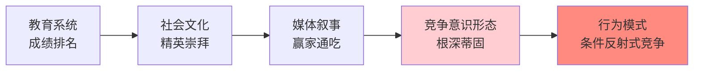
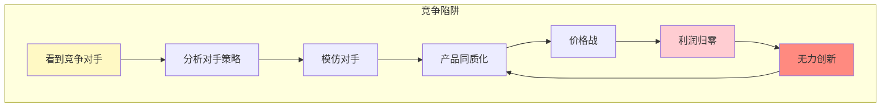
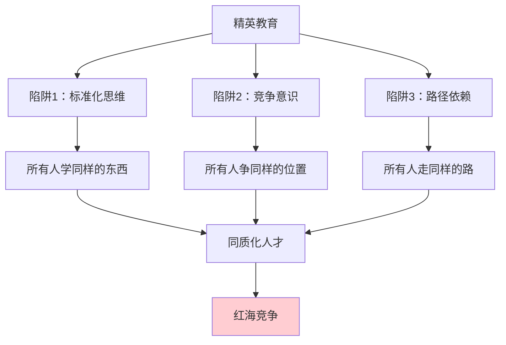
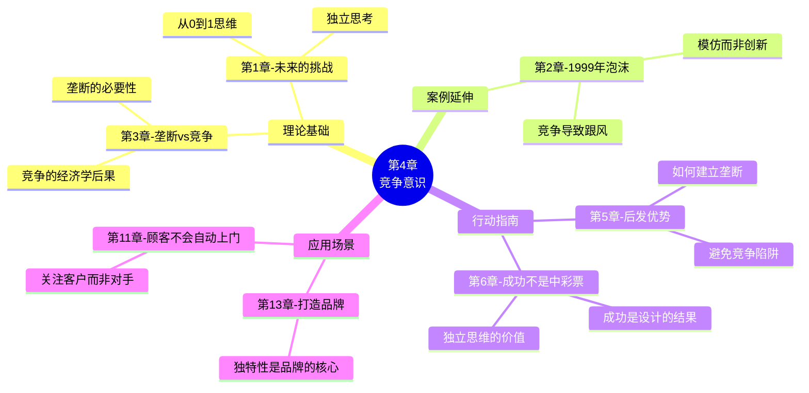

# 第4章：竞争意识（The Ideology of Competition）

> **章节主题**：竞争的陷阱——为什么竞争会毁掉创新
> **核心论点**：竞争不是自然法则，而是一种根深蒂固的意识形态
> **拆解日期**：2026-02-27

---

## 一、章节定位

### 1.1 在全书中解决什么问题？

**核心问题**：为什么明明知道竞争不好，我们还是习惯性地竞争？

第3章讲"垄断好，竞争不好"是理性的结论。但第4章要回答一个更深层的问题：
> **为什么我们被训练成竞争者？竞争思维是如何根植于我们的大脑？**

本章揭示了竞争的"意识形态"本质——竞争不是自然法则，而是一种社会建构。

### 1.2 章节结构

```
第4章结构：
├── 引言：竞争在我们的教育中根深蒂固
├── 教育系统的竞争陷阱
│   ├── 成绩排名的荒谬
│   ├── 标准化考试的竞争
│   └── 精英教育的悖论
├── 竞争扭曲思维的三个层面
│   ├── 模仿而非创新
│   ├── 关注对手而非客户
│   └── 短期博弈而非长期规划
├── 硅谷案例：PayPal vs X.com
│   ├── 竞争导致双输
│   └── 合并后才能专注创新
└── 结论：逃离竞争意识形态
```

### 1.3 与其他章节的关联

| 章节 | 关联类型 | 关联逻辑 |
|------|----------|----------|
| [[第3章-所有成功的企业都是不同的]] | 理论基础 | 第3章讲"垄断vs竞争"的经济学 → 第4章讲"竞争思维"的心理根源 |
| [[第2章-像1999年那样狂欢]] | 案例延伸 | 第2章讲"1999年泡沫" → 第4章讲"为什么大家都在跟风" |
| [[第1章-未来的挑战]] | 思维基础 | 第1章讲"从0到1思维" → 第4章讲"为什么从0到1思维如此稀缺" |
| 第5章"后发优势" | 行动指南 | 第4章讲"避免竞争" → 第5章讲"如何建立垄断" |
| 第6章"成功不是中彩票" | 哲学延伸 | 第4章讲"竞争是意识形态" → 第6章讲"成功是设计的结果" |

---

## 二、核心观点（三层提取）

### 观点1：竞争是一种意识形态，不是自然法则

#### 【表层】现象层

**教育系统的竞争训练**：
- 从幼儿园开始，我们被教育"要争第一"
- 小学排名、中考、高考，人生就是一场接一场的竞争
- 哈佛、斯坦福的录取率低到极点，但我们还是前仆后继
- MBA项目用案例教学法，教我们"如何打败竞争对手"

**生活中的竞争执念**：
- 职场：和同事竞争晋升
- 创业：和竞争对手争夺市场份额
- 投资：比别人赚更多钱
- 甚至健身：要比别人跑得更快

#### 【中层】机制层

**竞争意识形态的来源**：



**为什么竞争意识形态危险？**

| 竞争思维的后果 | 表现 | 案例 |
|----------------|------|------|
| 模仿而非创新 | 看对手做什么，跟着做 | 1999年互联网泡沫，人人做电商 |
| 关注对手而非客户 | 把精力花在打败对手上 | 微软vs谷歌的搜索大战 |
| 短期博弈 | 为了赢，牺牲长期利益 | 价格战导致的利润归零 |
| 心理负担 | 焦虑、压力、内耗 | 创业者的"竞争焦虑症" |

#### 【底层】规律层

> **竞争意识形态定律**：竞争不是自然选择的结果，而是社会建构的产物。我们被训练成竞争者，但我们可以选择退出竞争。

**哲学反思**：
- 达尔文说"物竞天择"——但这说的是自然选择，不是商业竞争
- 经济学说"完全竞争是最优状态"——但这忽略了创新的必要性
- 真正的创业者应该"选择战场"，而非"被动应战"

#### 【当下连接】2026场景

|----------|----------|----------|
| "为什么我总是在和别人比？" | 你被教育系统训练成这样 | "原来不是我的错" |
| "为什么创业越来越卷？" | 大家都被竞争意识形态困住 | "看清真相了" |
| "怎么才能不焦虑？" | 停止竞争，寻找自己的独特价值 | "有方向了" |
| "教育孩子应该怎么做？" | 培养独立思考，而非竞争意识 | "育儿新思路" |

---

### 观点2：竞争让人失去独立性，变成模仿者

#### 【表层】现象层

**竞争导致的模仿陷阱**：

- 1999年：所有人都在做电商
- 2015年：所有人都在做O2O
- 2021年：所有人都在做社区团购
- 2026年：所有人都在做AI应用

**PayPal vs X.com的案例**：

| 阶段 | 竞争状态 | 结果 |
|------|----------|------|
| 1999-2000 | PayPal和X.com激烈竞争 | 两败俱伤，都在烧钱 |
| 2000 | 合并成一家公司 | 停止内耗，专注产品 |
| 2002 | 专注创新，快速增长 | 以15亿美元卖给eBay |

蒂尔说："合并之前，我们把所有精力都花在打败对方上。合并之后，我们才开始真正专注于产品。"

#### 【中层】机制层

**竞争→模仿的恶性循环**：



**为什么竞争导致模仿？**

1. **注意力有限**：关注对手，就无法关注客户
2. **恐惧心理**：怕落后，所以跟着做
3. **路径依赖**：别人证明了这条路可行，所以我走
4. **社会认同**：大家都在做，肯定没错

#### 【底层】规律层

> **模仿定律**：竞争的本质是模仿。当你盯着竞争对手时，你已经失去了独立性。

**商业真相**：
- 真正的创新来自"不听别人的话"
- 微软的衰落：太关注和谷歌竞争，错过了移动互联网
- 苹果的崛起：乔布斯说"我们不研究竞争对手"

#### 【当下连接】2026场景

| 场景 | 竞争思维 | 独立思维 |
|------|----------|----------|
| AI创业 | 跟风做AI应用 | 发现AI的"秘密"用途 |
| 职业发展 | 和同事竞争晋升 | 建立独特技能组合 |
| 投资理财 | 追涨杀跌 | 独立判断价值 |
| 内容创作 | 模仿爆款选题 | 创造新的内容形式 |

---

### 观点3：竞争的教育根源——精英教育的悖论

#### 【表层】现象层

**精英教育的竞争逻辑**：

| 教育阶段 | 竞争形式 | 结果 |
|----------|----------|------|
| 小学 | 成绩排名 | 孩子学会比较 |
| 中学 | 中考/高考 | 学会"千军万马过独木桥" |
| 大学 | 绩点排名 | 学会和同学竞争 |
| 研究生 | 名校录取率低到极点 | 学会"赢家通吃" |
| MBA | 案例教学法 | 学会"打败竞争对手" |

**悖论**：
- 精英教育培养的是"竞争者"，不是"创新者"
- 哈佛商学院的案例教学法，本质上是在教"如何竞争"
- 但真正的创新者（如乔布斯、马斯克）都是"反竞争者"

#### 【中层】机制层

**精英教育的三重陷阱**：



**蒂尔的反思**：
- 他在斯坦福法学院时，是班级前几名
- 但他最终没有成为律师，而是成为创业者
- 他说："法学院教我的是如何竞争，但创业需要的是如何不竞争"

#### 【底层】规律层

> **精英教育悖论**：精英教育培养的是"竞争中获胜的人"，而不是"创造价值的人"。两者不是一回事。

**2026年的启示**：
- AI时代，标准化技能越来越不值钱
- 竞争思维培养的"同质化人才"面临AI替代风险
- 独立思维和创新能力才是稀缺资源

#### 【当下连接】2026场景

|----------|----------|----------|
| "孩子应该上名校吗？" | 名校培养竞争者，不一定培养创新者 | "教育焦虑缓解" |
| "学历还重要吗？" | 重要的是独特技能，不是标准化成绩 | "重新定义成功" |
| "怎么培养孩子的创新力？" | 鼓励独立思考，减少竞争训练 | "育儿新方向" |
| "35岁危机怎么办？" | 重新学习独立思维，走出竞争陷阱 | "走出迷茫" |

---

## 三、降维翻译

### 核心概念翻译对照表

| 原表达 | 降维表达 | 翻译技巧 |
|--------|----------|----------|
| "竞争是一种意识形态" | "竞争是你被洗脑的结果" | 用大白话拆穿本质 |
| "竞争意识形态" | "从小到大，你被训练成竞争机器" | 用成长经历连接 |
| "竞争扭曲思维" | "盯着对手，你就看不见客户" | 用因果关系解释 |
| "精英教育悖论" | "名校教你如何竞争，不教你如何创造" | 用对比揭示矛盾 |
| "模仿定律" | "看别人做什么，你就做什么——这就是竞争" | 用行为描述定义 |
| "独立性" | "不听别人的话，走自己的路" | 口语化 |

### 一句话降维金句

1. **竞争的本质**：
> 竞争不是自然法则，是你从小到大被洗脑的结果。

2. **竞争的后果**：
> 盯着竞争对手，你就看不见真正的机会。

3. **教育反思**：
> 名校教你如何赢过别人，但创业需要的是如何不做别人做的事。

4. **PayPal案例**：
> 合并之前，我们把精力花在打败对方；合并之后，我们才开始真正做产品。

5. **2026年启示**：
> AI时代，竞争思维培养的"同质化人才"最容易被替代。

---

## 四、金句库

### 原书金句

1. "竞争是一种意识形态——这种意识形态会扭曲我们的思想。"

2. "我们在教育中学习的竞争，让我们忘记了如何独立思考。"

3. "精英教育的悖论：它培养的是竞争中的获胜者，而不是创新者。"

4. "PayPal和X.com的合并，让我们终于停止内耗，专注于产品。"

5. "竞争让你模仿，而非创新。"

6. "当你盯着竞争对手时，你已经失去了方向。"

7. "真正的创新来自'不听别人的话'。"

8. "竞争不是自然选择，而是社会建构。"

### 降维金句

9. "竞争是你被训练出来的条件反射，不是天生的本能。"

10. "看对手做什么，你就做什么——这就是竞争的死循环。"

11. "名校教你打败同学，但创业需要的是发现独特价值。"

12. "合并之前我们互相消耗，合并之后我们开始创造。"

13. "竞争的本质是模仿，垄断的本质是独特。"

14. "盯着竞争对手，就像开车只看后视镜。"

15. "教育系统培养了无数竞争者，但世界需要的是创新者。"

## 五、当下映射（2026场景）

### 教育焦虑场景

| 痛点 | 本章解答 | 可执行建议 |
|------|----------|------------|
| "孩子要不要上名校？" | 名校培养竞争者，不一定培养创新者 | 重视独立思考能力 |
| "要不要卷成绩？" | 成绩排名是竞争思维的训练 | 关注孩子的独特兴趣 |
| "学区房值得买吗？" | 学区=竞争的入场券，不是创新的保障 | 评估长期价值 |

### 职场焦虑场景

| 痛点 | 本章解答 | 可执行建议 |
|------|----------|------------|
| "同事太卷了" | 他们被竞争意识形态困住 | 专注你的独特价值 |
| "35岁危机" | 你被训练成竞争者，但市场需要创新者 | 学习独立思维 |
| "晋升无望" | 晋升是零和博弈，创造价值是正和博弈 | 找到能创造独特价值的岗位 |

### 创业焦虑场景

| 痛点 | 本章解答 | 可执行建议 |
|------|----------|------------|
| "竞争对手太强" | 盯着他们，你就输了 | 专注客户需求，而非对手动作 |
| "行业太卷" | 这是竞争意识形态的集体表现 | 找到利基市场，建立垄断 |
| "要不要做AI应用" | 所有人都在做，这是典型的竞争陷阱 | 问：AI的"秘密"用途是什么？ |

### 2026年AI时代场景

| 场景 | 竞争思维 | 独立思维 |
|------|----------|----------|
| AI应用开发 | 模仿ChatGPT做应用 | 发现AI在垂直领域的独特价值 |
| 职业选择 | 挤进热门行业 | 培养AI无法替代的独特技能 |
| 内容创作 | 模仿爆款选题 | 创造新的内容形式 |
| 教育孩子 | 卷成绩、卷名校 | 培养独立思考和创新能力 |

---

## 六、章节关联

### 6.1 与其他章节的关联



### 6.2 与其他书籍的关联

| 书籍 | 关联类型 | 关联逻辑 |
|------|----------|----------|
| [[精益创业-埃里克·里斯]] | 方法论互补 | 竞争思维让你模仿 → 精益创业让你验证假设 |
| [[纳瓦尔宝典-乔根森]] | 思维共鸣 | 竞争意识形态 → 纳瓦尔的"专长知识"也是反竞争 |
| 《蓝海战略》 | 视角互补 | 竞争=红海 → 垄断≈蓝海 |
| 《乌合之众》 | 心理学延伸 | 竞争意识形态=群体思维的产物 |
| 《牧羊少年奇幻之旅》 | 哲学共鸣 | "走自己的路"vs"竞争的路径" |

---

## 七、问答设计（读者可能的困惑）

### Q1: "不竞争，不是会落后吗？"

**A**: 区分"竞争"和"进步"：
- 竞争：和别人比，模仿别人
- 进步：和自己比，超越自己
- 真正的进步来自"专注自己的路"，而非"盯着别人"

**案例**：
- 苹果从不研究竞争对手，但一直是最创新的公司
- 特斯拉不关心传统车企做什么，但定义了电动车行业

### Q2: "公司里不竞争，怎么晋升？"

**A**: 这是好问题，现实确实存在竞争。但你可以选择"超越竞争"：
- 竞争思维：和同事争夺有限的位置
- 创造思维：找到能创造独特价值的岗位

**可执行建议**：
1. 问自己：这个岗位的本质是什么？
2. 找到只有你能做的事
3. 创造价值，而非争夺位置

### Q3: "教育系统短期内不会改变，孩子怎么办？"

**A**: 蒂尔在书中也讨论了这个问题：
- 短期：接受现实，但培养孩子的独立思考能力
- 长期：鼓励孩子探索独特兴趣，而非标准化成绩
- 根本：家庭教育的价值观可以抵消学校的影响

**蒂尔奖学金的启示**：
- 蒂尔设立了奖学金，鼓励年轻人跳过大学直接创业
- 他认为：真正的教育来自实践，而非课堂

### Q4: "PayPal和X.com的合并，是不是说明大公司合并是好事？"

**A**: 不是的，关键在于合并的目的是什么：
- 好的合并：停止内耗，专注创新（PayPal+X.com）
- 坏的合并：消除竞争，躺平收租（某些平台合并）

**判断标准**：
- 合并后是"更专注于客户"还是"更专注于利润"？
- 合并后是"持续创新"还是"躺平收租"？

### Q5: "如何在竞争激烈的环境中保持独立性？"

**A**: 蒂尔给出三个建议：

1. **问"为什么"**：
   - 别人都在做的事，真的值得做吗？
   - 这是我真正想要的，还是社会期望的？

2. **关注客户，而非对手**：
   - 客户的痛点是什么？
   - 竞争对手忽略了什么？

3. **长期思维**：
   - 短期竞争让所有人疲惫
   - 长期专注让你成为唯一

---

## 八、章节精华速查

### 核心概念速查表

| 概念 | 定义 | 案例 |
|------|------|------|
| **竞争意识形态** | 竞争被内化为"自然法则"的思维模式 | 教育系统的成绩排名 |
| **模仿定律** | 竞争导致模仿，而非创新 | 1999年互联网泡沫 |
| **精英教育悖论** | 精英教育培养竞争者，而非创新者 | 哈佛商学院的案例教学法 |
| **独立性** | 不被竞争思维绑架的思维能力 | 乔布斯不研究竞争对手 |

### 竞争vs独立对比表

| 维度 | 竞争思维 | 独立思维 |
|------|----------|----------|
| 关注点 | 对手做什么 | 客户需要什么 |
| 行为模式 | 模仿 | 创新 |
| 时间维度 | 短期博弈 | 长期规划 |
| 心理状态 | 焦虑 | 专注 |
| 结果 | 同质化 | 差异化 |
| 利润 | 趋于零 | 可垄断 |

---

## 九、行动清单

### 今天完成

- [ ] 反思：你今天有没有在和别人比较？
- [ ] 列出3个你"模仿别人"而不是"独立思考"的场景

### 本周完成

- [ ] 找出你工作/生活中一个"竞争陷阱"
- [ ] 问自己：这件事的真正目的是什么？

### 本月完成

- [ ] 制定一个"专注独立价值"的计划
- [ ] 减少关注竞争对手的频率（如取消竞品监控）

---
