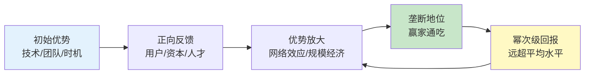
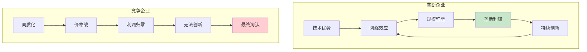
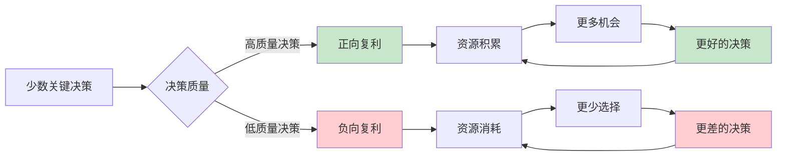
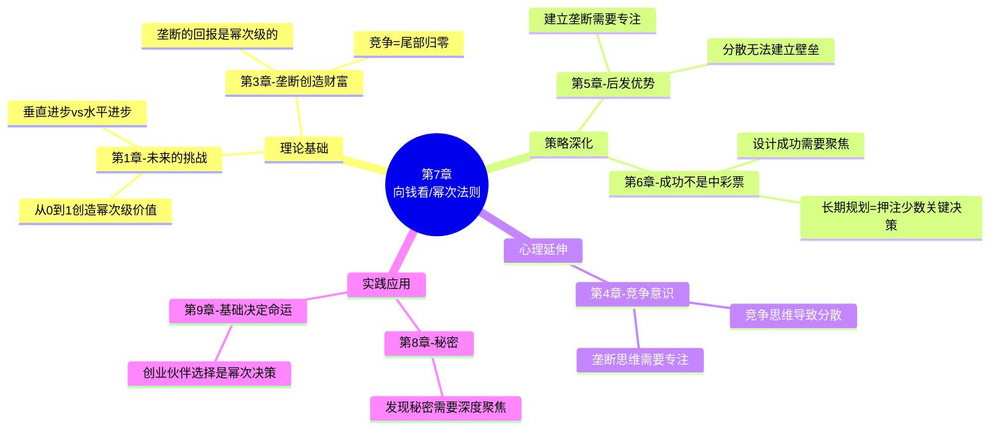

# 第7章：向钱看（Follow the Money）

> **章节主题**：幂次法则——为什么少数决策创造大部分价值
> **核心论点**：风险投资的回报遵循幂次法则，少数投资创造大部分回报
> **拆解日期**：2026-02-28

---

## 一、章节定位

### 1.1 在全书中解决什么问题？

**核心问题**：为什么风险投资总是失败多成功少？为什么少数公司创造大部分价值？

第6章讲"成功需要长期规划"，但第7章要回答一个更深层的问题：
> **如果成功是设计的，为什么90%的创业公司还是失败？**

本章揭示了商业世界的一个残酷真相——**幂次法则**。

### 1.2 章节结构

```
第7章结构：
├── 引言：风险投资的悖论
│   └── 为什么分散投资反而更危险？
├── 幂次法则的本质
│   ├── 二八定律的极端版本
│   ├── 少数投资创造大部分回报
│   └── Facebook一个项目回报整个基金
├── 创业公司的幂次法则
│   ├── 少数公司创造大部分价值
│   ├── 垄断企业的幂次分布
│   └── 为什么"平均"没有意义
├── 个人选择的幂次法则
│   ├── 少数决策决定人生轨迹
│   ├── 职业、婚姻、投资都遵循幂次
│   └── 为什么"分散"是错的
└── 结论：专注少数关键决策，拒绝平庸分散
```

### 1.3 与其他章节的关联

| 章节 | 关联类型 | 关联逻辑 |
|------|----------|----------|
| [[第1章-未来的挑战]] | 理论延伸 | 第1章讲"从0到1"→第7章讲"从0到1创造幂次级价值" |
| [[第3章-所有成功的企业都是不同的]] | 机制解释 | 第3章讲"垄断创造财富"→第7章讲"垄断遵循幂次分布" |
| [[第5章-后发优势]] | 策略深化 | 第5章讲"建立垄断"→第7章讲"垄断的回报是幂次级的" |
| [[第6章-成功不是中彩票]] | 概念澄清 | 第6章讲"成功是设计的"→第7章讲"设计的成功遵循幂次法则" |
| [[第4章-竞争意识]] | 后果解释 | 第4章讲"竞争导致平庸"→第7章讲"平庸分布在幂次曲线的尾部" |

---

## 二、核心观点（三层提取）

### 观点1：风险投资遵循幂次法则

#### 【表层】现象层

**幂次法则的极端表现**：

| 基金案例 | 投资项目 | 成功项目 | 回报分布 |
|----------|----------|----------|----------|
| Founders Fund早期基金 | 10+ | 2-3个 | Facebook一个项目回报超过整个基金 |
| 红杉资本 | 100+ | 5-10个 | 谷歌、苹果、YouTube少数项目创造大部分回报 |
| Y Combinator | 1000+ | 10-20个 | Airbnb、Dropbox、Stripe创造绝大部分价值 |

**幂次法则 vs 正态分布**：

```
【正态分布】          【幂次分布】
    ▲                     ▲
   █ █                   █│
  ████│                 ██│
 ███████              ████│
█████████          ████████████
─────────          ───────────────
大部分在中部        少数在头部，大部分在尾部
（如身高、体重）    （如财富、公司价值）
```

#### 【中层】机制层

**幂次法则的生成机制**：



**为什么幂次法则在商业中如此普遍？**

1. **网络效应**：用户越多，产品越有价值，吸引更多用户
2. **规模经济**：规模越大，成本越低，利润越高
3. **品牌效应**：知名度越高，获客成本越低
4. **人才聚集**：成功公司吸引顶尖人才，更强竞争力

#### 【底层】规律层

> **幂次定律**：在商业世界，价值创造不是正态分布，而是幂次分布。少数公司创造大部分价值，大多数公司价值趋近于零。

**蒂尔的洞见**：
- 风险投资不是"分散风险"，而是"押注头部"
- 成功的基金不是平均分布在很多项目，而是集中在少数头部项目
- Facebook的回报让其他投资的失败变得无关紧要

#### 【当下连接】2026场景

|----------|----------|----------|
| "创业要不要All in？" | 幂次法则下，分散=平庸 | "原来专注是对的" |
| "投资要不要分散？" | 分散投资=放弃头部回报 | "重新思考投资策略" |
| "职业要不要多尝试？" | 少数关键决策决定人生 | "聚焦重要选择" |
| "为什么90%创业失败？" | 幂次法则：少数创造大部分价值 | "理解商业规律" |

---

### 观点2：创业公司的幂次分布

#### 【表层】现象层

**创业公司价值分布**：

| 分层 | 占比 | 特征 | 案例 |
|------|------|------|------|
| 头部（独角兽） | 0.1% | 估值10亿美元+ | 字节跳动、SpaceX、Stripe |
| 上层（成功退出） | 1% | IPO或被收购 | Instagram、WhatsApp |
| 中层（生存） | 10% | 活着但不温不火 | 大多数小公司 |
| 尾部（失败） | 88.9% | 倒闭或零价值 | 90%的创业公司 |

**幂次法则的残酷**：
- 1%的公司创造99%的价值
- 头部公司的价值=尾部10000家公司的总和
- "平均值"在幂次分布中毫无意义

#### 【中层】机制层

**垄断vs竞争的幂次效应**：



**为什么幂次分布如此极端？**

1. **赢家通吃**：第一名拿走大部分市场（搜索领域的谷歌、电商领域的亚马逊）
2. **复利效应**：成功带来资源，资源带来更大成功
3. **网络效应**：用户聚集形成壁垒，后来者难以超越
4. **品牌溢价**：头部品牌享受溢价，尾部只能打价格战

#### 【底层】规律层

> **创业幂次定律**：创业公司的价值分布不是钟形曲线，而是长尾分布。0.1%的独角兽创造99%的价值，90%的创业公司归零。

**蒂尔的核心观点**：
- 不是"成为更好的公司"，而是"成为唯一的公司"
- 不是"在竞争中获胜"，而是"避免竞争"
- 不是"平均分布在很多赛道"，而是"押注一个垄断机会"

#### 【当下连接】2026场景

| 2026场景 | 平庸思维 | 幂次思维 |
|----------|----------|----------|
| AI创业 | 做10个AI应用 | 押注一个垂直领域垄断 |
| 投资选择 | 买100只股票 | 押注3-5个核心标的 |
| 职业发展 | 每年换赛道 | 10年深耕一个领域 |
| 学习方向 | 什么都学 | 成为某个细分领域专家 |

---

### 观点3：个人选择的幂次法则

#### 【表层】现象层

**人生中的幂次决策**：

| 决策类型 | 少数关键决策 | 影响 |
|----------|--------------|------|
| **职业** | 选对行业、跟对人、做对项目 | 决定80%的职业价值 |
| **投资** | 押注少数核心资产 | 决定80%的财富 |
| **婚姻** | 选对伴侣 | 决定80%的生活质量 |
| **创业** | 选对赛道、找对合伙人 | 决定80%的成败 |
| **学习** | 掌握少数核心技能 | 决定80%的专业价值 |

**幂次法则的反直觉**：
- 大多数人认为"分散=安全"
- 但在幂次分布下，"分散=平庸"
- 真正的价值来自押注少数关键决策

#### 【中层】机制层

**个人选择的幂次效应**：



**为什么大多数人选择分散？**

1. **风险厌恶**：害怕All in失败，选择"安全"的分散
2. **短期思维**：追求即时满足，不愿等待幂次级回报
3. **社会压力**：周围都是"普通人"，"正常"选择就是平庸
4. **认知盲区**：不理解幂次法则，以为世界是正态分布

#### 【底层】规律层

> **人生幂次定律**：人生的价值创造不是均匀分布，而是集中在少数关键决策。做出正确的少数决策，比做对大多数普通决策更重要。

**蒂尔的洞见**：
- 你的一生，只有5-10个真正重要的决策
- 这5-10个决策，决定了你80%的人生质量
- 与其分散精力做100个平庸决策，不如聚焦做对5个关键决策

#### 【当下连接】2026场景

| 人生领域 | 分散策略 | 幂次策略 |
|----------|----------|----------|
| **职业** | 每年跳槽涨薪 | 10年深耕一个领域，成为头部 |
| **投资** | 买100只基金 | 押注3-5个核心资产 |
| **学习** | 学10门技能 | 深耕1-2个核心能力 |
| **社交** | 认识1000个人 | 深交10个关键人物 |
| **项目** | 同时做5个项目 | 专注做1个核心项目 |

---

## 三、降维翻译

### 核心概念翻译对照表

| 原表达 | 降维表达 | 翻译技巧 |
|--------|----------|----------|
| "幂次法则" | "80%的价值来自20%的选择，在商业世界里更极端——1%创造99%的价值" | 用数字具体化 |
| "Power Law" | "赢家通吃，输家归零" | 用结果描述本质 |
| "风险投资" | "押注少数可能成为垄断者的公司" | 用行为定义 |
| "分散投资" | "平均=平庸，分散=放弃头部回报" | 用等式揭示真相 |
| "幂次分布" | "不是钟形曲线，而是一条长尾——头部拿走一切" | 用图形可视化 |

### 一句话降维金句

1. **幂次法则本质**：
> 商业世界里，1%的公司创造99%的价值，90%的公司价值趋近于零。

2. **风险投资逻辑**：
> 成功的基金不是分散押注，而是集中押注少数头部项目。

3. **个人选择启示**：
> 人生只有5-10个真正重要的决策，做对这些，其他都不重要。

4. **分散的陷阱**：
> 在幂次分布的世界里，分散=平庸，专注=头部。

5. **2026年启示**：
> AI时代，赢家通吃效应更强，要么成为头部，要么归零。

---

## 四、金句库

### 原书金句

1. "风险投资的回报不是正态分布，而是幂次分布。"

2. "成功的基金，少数投资创造大部分回报。"

3. "Facebook一个项目的回报，超过整个基金。"

4. "在幂次分布的世界里，平均值毫无意义。"

5. "不是成为更好的公司，而是成为唯一的公司。"

6. "分散投资是承认你不知道什么重要。"

7. "你的一生，只有少数几个真正重要的决策。"

8. "押注少数，专注核心，拒绝平庸分散。"

### 降维金句

9. "1%的公司创造99%的价值，这是商业世界的残酷真相。"

10. "平均值在幂次分布中毫无意义——你不会想让你的孩子'平均'。"

11. "分散=平庸，在幂次分布的世界里尤其如此。"

12. "成功的秘密不是做很多事，而是做对少数关键的事。"

13. "你的人生只有5-10个真正重要的决策，做对这些就够了。"

14. "风险投资不是分散风险，而是押注头部。"

15. "赢家通吃，输家归零——这就是幂次法则。"

16. "在AI时代，赢家通吃效应更强，头部拿走一切。"

## 五、当下映射（2026场景）

### 投资焦虑场景

| 痛点 | 本章解答 | 可执行建议 |
|------|----------|------------|
| "买指数基金对吗？" | 平均回报=平庸回报 | 押注3-5个你真正理解的核心资产 |
| "要不要分散投资？" | 分散=放弃头部 | 聚焦你最有认知优势的领域 |
| "投资怎么选？" | 找幂次级机会 | 问：这个资产5年后可能是现在的10倍吗？ |

### 创业焦虑场景

| 痛点 | 本章解答 | 可执行建议 |
|------|----------|------------|
| "要不要同时做多条线？" | 分散=平庸 | 专注一个核心项目，做到垄断 |
| "赛道太多怎么选？" | 选幂次级赛道 | 问：这个赛道能诞生垄断者吗？ |
| "创业成功率这么低？" | 幂次法则：多数归零 | 目标不是"提高成功率"，而是"成为头部" |

### AI时代场景

| 场景 | 分散思维 | 幂次思维 |
|------|----------|----------|
| AI学习 | 学10个AI工具 | 深耕1个垂直领域，成为头部 |
| AI创业 | 做10个AI应用 | 押注1个垂直领域的垄断机会 |
| AI投资 | 买AI ETF | 押注1-2家真正有壁垒的AI公司 |
| AI职业 | 每年换赛道 | 10年深耕AI某个细分领域 |

### 人生选择场景

| 问题 | 分散思维 | 幂次思维 |
|------|----------|----------|
| "职业怎么选？" | 多尝试，找到喜欢的 | 找到能成为头部的领域，深耕10年 |
| "投资怎么选？" | 分散买100只股票 | 押注3-5个核心资产 |
| "学习怎么选？" | 什么都学一点 | 深耕1-2个核心能力 |
| "社交怎么选？" | 认识更多人 | 深交10个关键人物 |

---

## 六、章节关联

### 6.1 与其他章节的关联



### 6.2 与其他书籍的关联

| 书籍 | 关联类型 | 关联逻辑 |
|------|----------|----------|
| 《黑天鹅》 | 概念互补 | 极端事件创造极端价值，幂次法则是黑天鹅的数学表达 |
| 《反脆弱》 | 策略互补 | 从不确定性中获益，押注幂次级机会 |
| 《纳瓦尔宝典》 | 思维共鸣 | 专长知识+杠杆=幂次级财富创造 |
| 《穷查理宝典》 | 方法论验证 | 多元思维模型帮助识别幂次机会 |
| 《原则》 | 决策框架 | 系统化决策提高押注准确率 |

---

## 七、问答设计（读者可能的困惑）

### Q1: "幂次法则和'不要把鸡蛋放在一个篮子里'矛盾吗？"

**A**: 表面矛盾，但本质不同：
- "不要把鸡蛋放在一个篮子里"是针对**正态分布**世界（如掷硬币）
- 幂次法则是针对**赢家通吃**世界（如商业、投资）

**关键洞见**：
> 在正态分布世界，分散降低风险。在幂次分布世界，分散降低回报。

**可执行建议**：
1. 判断你的领域是正态分布还是幂次分布
2. 创业、投资、职业发展——大多是幂次分布
3. 在幂次分布世界，押注少数头部机会

### Q2: "那我应该All in一个项目吗？"

**A**: 不完全是All in，而是"有认知的押注"：

**蒂尔的方法**：
1. **深度研究**：真正理解你押注的领域
2. **少数押注**：不是100个项目，而是3-5个核心项目
3. **长期持有**：幂次级回报需要时间积累
4. **动态调整**：根据信息调整押注权重

**关键区分**：
- All in = 盲目赌博
- 专注押注 = 有认知的集中

### Q3: "如果押错了怎么办？"

**A**: 这就是为什么需要深度研究，而不是盲目All in：

**降低错误的三个方法**：
1. **能力圈原则**：只押注你真正理解的领域
2. **非对称收益**：损失有限，收益无限
3. **多次押注**：不是一次押注，而是3-5次押注

**蒂尔的智慧**：
> 成功的基金不是100%成功，而是少数成功项目的回报覆盖所有失败。

### Q4: "个人怎么应用幂次法则？"

**A**: 识别你人生中的5-10个关键决策：

**幂次决策清单**：

| 决策 | 影响 | 建议 |
|------|------|------|
| 选行业 | 决定80%职业天花板 | 选择有幂次级机会的行业 |
| 选城市 | 决定80%的机会密度 | 去头部城市聚集 |
| 选伴侣 | 决定80%的生活质量 | 找到能共同成长的伴侣 |
| 选项目 | 决定80%的成败 | 选择有垄断潜力的项目 |
| 选技能 | 决定80%的专业价值 | 深耕稀缺技能 |

**关键**：在这5个决策上投入80%的精力。

### Q5: "AI时代，幂次法则会更极端吗？"

**A**: 是的，AI会放大赢家通吃效应：

**AI时代的幂次效应**：

| 领域 | AI前 | AI后 |
|------|------|------|
| 软件开发 | 10倍工程师存在，但有限 | AI让顶尖工程师效率放大100倍 |
| 内容创作 | 头部创作者赚最多 | AI让头部创作者垄断流量 |
| 投资 | 头部基金赚最多 | AI让头部基金更精准押注 |
| 创业 | 独角兽0.1% | AI可能让独角兽更少但更大 |

**2026年建议**：
- 在AI时代，成为头部的门槛更高，但回报也更大
- 不是"用AI做更多事"，而是"用AI成为头部"

---

## 八、章节精华速查

### 核心概念速查表

| 概念 | 定义 | 案例 |
|------|------|------|
| **幂次法则** | 1%创造99%价值 | Facebook回报覆盖整个基金 |
| **正态分布** | 大部分在中间 | 身高、体重 |
| **幂次分布** | 头部拿走一切 | 财富、公司价值、投资回报 |
| **分散陷阱** | 平均=平庸 | 买100只股票=放弃头部 |
| **专注押注** | 押注少数头部 | 3-5个核心资产 |

### 幂次分布 vs 正态分布

| 维度 | 正态分布 | 幂次分布 |
|------|----------|----------|
| 形状 | 钟形曲线 | 长尾分布 |
| 平均值 | 有意义 | 无意义 |
| 策略 | 分散降低风险 | 专注押注头部 |
| 案例 | 身高、体重 | 财富、公司价值 |
| 启示 | 做到平均就行 | 要么头部，要么归零 |

### 个人幂次决策清单

| 决策 | 占比 | 影响 |
|------|------|------|
| 选行业 | 1个决策 | 决定80%职业天花板 |
| 选伴侣 | 1个决策 | 决定80%生活质量 |
| 选项目 | 2-3个决策 | 决定80%创业成败 |
| 选投资 | 3-5个决策 | 决定80%财富 |
| 选技能 | 1-2个决策 | 决定80%专业价值 |

---

## 九、行动清单

### 今天完成

- [ ] 反思：你今天的选择，是分散还是聚焦？
- [ ] 写下：你人生中最重要的5个决策是什么？

### 本周完成

- [ ] 审视：你的投资组合，是分散还是押注头部？
- [ ] 调整：减少平庸选择，聚焦关键决策

### 本月完成

- [ ] 重构：你的职业/创业策略，是否遵循幂次法则？
- [ ] 执行：选定1个核心方向，深度聚焦

---
