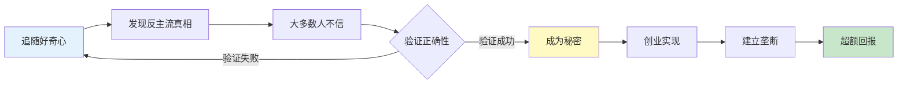
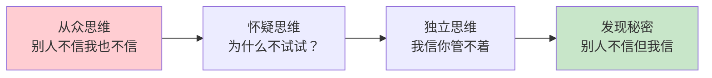
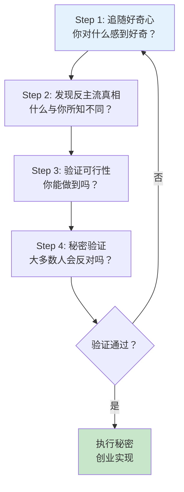
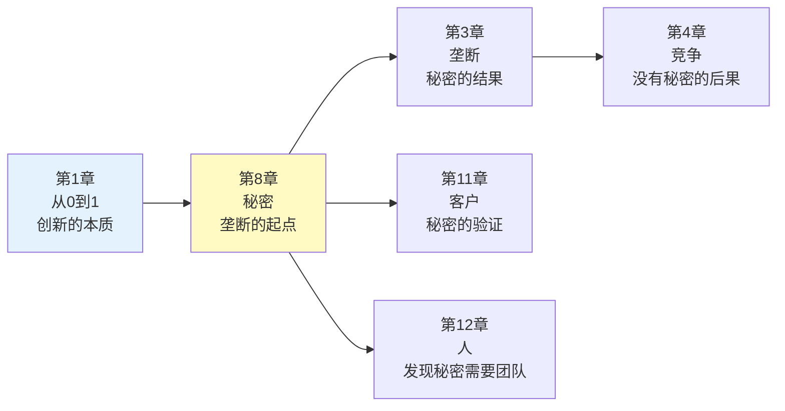

# 第8章《秘密》深度拆解

> **章节主题**：秘密是创新的源泉
> **核心概念**：反主流但正确的信念
> **拆解日期**：2026-02-28

---

## 一、章节定位

### 1.1 这一章在解决什么问题？

**核心困境**：为什么大多数创业者找不到好机会？为什么那些看似疯狂的想法最后反而成功了？

彼得·蒂尔的回答是：**真正的机会藏在"秘密"里——那些反主流但正确的信念，大多数人认为不对，但你知道对。**

**一句话定位**：
> 财富来自于你对真相的独特认知，秘密是创新的起点。

**降维翻译**：
> 别人都不信的事，你信了，你就有机会了。

---

### 1.2 这一章在全书的地位

| 维度 | 定位 |
|------|------|
| **章节位置** | 第8章（中段，方法论核心） |
| **功能** | 解释如何找到垄断机会 |
| **核心概念** | 秘密=反主流但正确的信念 |
| **承上启下** | 承接"垄断思维"，启下"小市场起步" |

**在全书中的角色**：
- **揭秘者**：垄断的起点是发现秘密
- **方法论**：如何找到别人没发现的机会
- **心态转变**：从"跟随"到"独立思考"

---

### 1.3 和主读书笔记的关联

这一章是"如何建立垄断"的方法论核心，解释垄断的来源：

| 核心概念 | 本章关联 | 实践应用 |
|----------|----------|----------|
| **垄断** | 秘密→垄断的起点 | 发现秘密→建立垄断 |
| **从0到1** | 秘密是从0到1的起点 | 秘密→创新→垄断 |
| **竞争优势** | 秘密是独特优势 | 别人没有的认知 |
| **财富创造** | 秘密是财富源泉 | 独特认知→超额回报 |

---

## 二、核心观点（三层提取）

### 观点1：每个成功的公司都基于一个秘密

#### 【表层】现象层

**蒂尔的观察**：
- Facebook的成功基于一个秘密：人们的真实身份可以网络化
- Airbnb的秘密：人们愿意住陌生人家
- Uber的秘密：普通人可以成为司机
- Google的秘密：搜索可以比目录更有效

**具体案例**：

| 公司 | 秘密 | 反主流之处 | 结果 |
|------|------|------------|------|
| **Facebook** | 真实身份网络化 | 2004年没人信社交网络 | 市值超1万亿美元 |
| **Airbnb** | 愿意住陌生人家 | 2008年没人信共享住宿 | 市值超1000亿美元 |
| **Uber** | 普通人可当司机 | 2009年没人信共享出行 | 颠覆出租车行业 |
| **Tesla** | 电动车可以比燃油车好 | 2003年没人信电动车 | 市值超8000亿美元 |
| **SpaceX** | 火箭可以回收 | 2002年没人信商业航天 | 改变航天产业 |

#### 【中层】机制层

**秘密的发现流程**：



**秘密的四个特征**：

| 特征 | 说明 | 例子 |
|------|------|------|
| **反主流** | 与主流观点相反 | 2004年"社交网络没前途" |
| **但正确** | 事实证明确实对 | Facebook现在市值超1万亿 |
| **少数人信** | 大多数人不信 | 只有扎克伯格等少数人信 |
| **可验证** | 可以被实践证明 | 用户增长证明了秘密正确 |

**核心机制**：
```
秘密 = 反主流观点 + 少数人相信 + 可验证正确
发现秘密 → 建立垄断 → 超额回报
```

#### 【底层】规律层

> **蒂尔秘密定律**：财富来自于你对真相的独特认知。当大多数人盲目跟风时，看到不同真相的人获得超额回报。

**秘密的本质**：
- **不是秘密本身值钱**，而是"你比别人早知道"
- **不是秘密难发现**，而是"大多数人不敢信"
- **不是秘密保证成功**，而是"提高成功的概率"

**历史验证**：
- **哥伦布**：地球是圆的（反主流但正确）
- **伽利略**：地球绕太阳转（反主流但正确）
- **爱迪生**：电力可以点亮世界（反主流但正确）
- **乔布斯**：人们需要智能手机（反主流但正确）

#### 【当下连接】2026场景

|----------|----------|----------|
| 好点子都被想完了？ | 秘密无处不在，只是你没发现 | "希望感" |
| 如何找到创业机会？ | 寻找别人不信但你信的事 | "启发" |
| 跟风是不是更容易？ | 跟风只能赚平均回报，秘密创造超额回报 | "认知反转" |
| 2026年还有秘密吗？ | AI时代秘密更多：AGI、长寿、星际移民 | "时代机遇" |

---

### 观点2：相信秘密很重要

#### 【表层】现象层

**蒂尔的观察**：
- 为什么大多数人找不到秘密？因为他们不相信秘密存在
- 为什么硅谷能持续创新？因为他们相信秘密
- 为什么传统行业停滞？因为他们认为"一切都被发现了"

**两种世界观的对比**：

| 世界观 | 核心信念 | 行为模式 | 结果 |
|--------|----------|----------|------|
| **秘密存在论** | 还有很多未发现的机会 | 主动寻找秘密 | 发现垄断机会 |
| **秘密不存在论** | 一切都被发现了 | 被动接受现状 | 陷入竞争红海 |

**具体案例**：
- **苹果**：相信人们需要更好的手机（秘密存在论）→ 发明iPhone
- **诺基亚**：认为手机已经够好了（秘密不存在论）→ 被颠覆
- **特斯拉**：相信电动车可以比燃油车好（秘密存在论）→ 颠覆汽车行业
- **传统车企**：认为电动车没前途（秘密不存在论）→ 被颠覆

#### 【中层】机制层

**为什么人们不相信秘密？**

| 原因 | 心理机制 | 后果 |
|------|----------|------|
| **从众心理** | 别人不信，我也不信 | 错过机会 |
| **风险规避** | 反主流=高风险 | 不敢尝试 |
| **教育系统** | 教我们"标准答案" | 丧失独立思考 |
| **社会压力** | 特立独行被嘲笑 | 不敢表达 |
| **短期思维** | 秘密需要长期验证 | 追求短期回报 |

**相信秘密的心态转变**：



**核心机制**：
```
相信秘密存在 → 主动寻找 → 发现秘密 → 建立垄断 → 超额回报
不相信秘密存在 → 被动接受 → 跟随竞争 → 利润归零 → 平庸
```

#### 【底层】规律层

> **蒂尔信念定律**：你的世界观决定了你能看到什么。相信秘密存在的人，才能发现秘密；认为一切都被发现的人，只能跟随。

**两种人生的分野**：
- **相信秘密的人**：创业者、发明家、投资人
- **不相信秘密的人**：执行者、跟随者、竞争者

**蒂尔的警示**：
> "如果你认为没有秘密了，你就不会去寻找。如果你不去寻找，你就永远不会发现。这是一个自我实现的预言。"

**2026年的启示**：
- **AI时代**：秘密更多了，不是更少了
- **生物科技**：长寿、基因编辑、脑机接口
- **空间探索**：火星移民、太空采矿
- **清洁能源**：核聚变、碳捕捉

#### 【当下连接】2026场景

| 场景 | 不相信秘密的人 | 相信秘密的人 |
|------|---------------|-------------|
| **AI创业** | 跟风做AI应用 | 寻找AI时代的秘密（AGI、AI意识） |
| **职业发展** | 模仿成功路径 | 找到自己的独特价值 |
| **投资** | 跟着热点投 | 寻找别人没发现的机会 |
| **教育** | 考高分、找好工作 | 培养独立思考能力 |

---

### 观点3：如何发现秘密

#### 【表层】现象层

**蒂尔的方法**：
- 追随好奇心：你对什么感到好奇？
- 问"为什么没人做这个"：寻找被忽视的领域
- 关注"不重要"的领域：大公司看不上，但有机会
- 交叉学科：把A领域的方法用到B领域

**秘密藏在哪里？**

| 秘密类型 | 藏在哪里 | 例子 |
|----------|----------|------|
| **技术秘密** | 前沿科技领域 | AI、生物科技、量子计算 |
| **商业模式秘密** | 被忽视的市场 | Airbnb、Uber |
| **认知秘密** | 反主流观点 | 地球是圆的、电动车有前途 |
| **组合秘密** | 跨领域组合 | iPhone=手机+电脑+相机 |

#### 【中层】机制层

**秘密发现四步法**：



**秘密评估框架**：

| 维度 | 问题 | 好的答案 |
|------|------|----------|
| **真实性** | 这个秘密是真的吗？ | 可以被验证 |
| **反主流性** | 大多数人反对吗？ | 是的，他们不信 |
| **重要性** | 这个秘密重要吗？ | 能改变行业或创造新市场 |
| **可执行性** | 你能做到吗？ | 有能力或资源实现 |

**核心机制**：
```
好奇心 → 发现反主流观点 → 验证正确性 → 评估重要性 → 执行实现
```

#### 【底层】规律层

> **蒂尔发现定律**：秘密不在大路上，在没人愿意走的小径里。追随好奇心，而不是跟随热门。

**秘密发现的障碍**：

| 障碍 | 表现 | 如何克服 |
|------|------|----------|
| **从众心理** | 别人不做我也不做 | 独立思考，敢于特立独行 |
| **短视思维** | 只看眼前利益 | 长期思维，耐心验证 |
| **舒适区** | 不愿意冒险 | 接受不确定性 |
| **教育枷锁** | 被标准答案束缚 | 培养质疑精神 |
| **社会压力** | 怕被嘲笑 | 不在意他人眼光 |

**纳瓦尔的补充**：
> 秘密往往藏在你的"专长知识"里——那些你做起来像玩、别人看起来像工作的事。

#### 【当下连接】2026场景

| 2026热点 | 潜在秘密 | 反主流之处 |
|----------|----------|------------|
| **AI** | AGI可能在5年内实现 | 大多数人认为还很远 |
| **长寿** | 人类可以活到120岁 | 大多数人认为不可能 |
| **星际移民** | 火星移民20年内可行 | 大多数人认为是科幻 |
| **核聚变** | 商业化核聚变10年内可能 | 大多数人认为遥遥无期 |
| **脑机接口** | 人机融合将改变人类 | 大多数人认为太疯狂 |

---

## 三、金句库

### 原书金句（⭐⭐⭐权威来源）

1. "每个成功的公司都有一个秘密。"

2. "秘密是反主流但正确的信念。"

3. "财富来自于你对真相的独特认知。"

4. "如果你认为没有秘密了，你就不会去寻找。"

5. "大多数人不相信的事，可能是对的。"

6. "秘密不在大路上，在没人愿意走的小径里。"

7. "相信秘密存在，是发现秘密的前提。"

8. "好奇心是发现秘密的起点。"

---

### 降维金句（便于传播，中学生能懂）

9. "别人都不信的事，你信了，你就有机会了。"

10. "秘密不在热门里，在冷门里。"

11. "大多数人知道的事，已经没有价值了。"

12. "跟着钱走，你会平庸；跟着秘密走，你会富有。"

13. "秘密是创新的起点，垄断是创新的终点。"

14. "不是秘密难发现，是你不敢信。"

15. "好奇心比聪明更重要。"

16. "别在大路上找秘密，去小径里。"

---

## 四、当下映射（2026年场景）

### 财富焦虑连接

| 读者困惑 | 章节答案 | 行动建议 |
|----------|----------|----------|
| 为什么努力工作还是不赚钱？ | 你可能在做大家都知道的事 | 寻找别人没发现的秘密 |
| 投资应该投什么？ | 投那些发现秘密的公司 | AI模型、生物科技、清洁能源 |
| 副业怎么做才赚钱？ | 找到你的独特认知 | 问自己：我知道什么别人不知道？ |

---

### 职场焦虑连接

| 读者困惑 | 章节答案 | 行动建议 |
|----------|----------|----------|
| 35岁危机怎么破？ | 找到你的独特价值（秘密） | 发展别人替代不了的能力 |
| 如何在职场脱颖而出？ | 不是做得更多，而是知道别人不知道的 | 培养独立思考能力 |
| AI会替代我吗？ | 如果你的工作没有秘密，会被替代 | 发展创造力和洞察力 |

---

### 创业焦虑连接

| 读者困惑 | 章节答案 | 行动建议 |
|----------|----------|----------|
| 2026年创业方向是什么？ | 寻找AI时代的秘密 | AGI、长寿、星际移民 |
| 好点子都被想完了？ | 秘密无处不在 | 追随你的好奇心 |
| 如何找到创业机会？ | 问自己：什么是我信但别人不信的？ | 独立思考，敢于反主流 |

---

## 五、章节关联

### 与《从0到1》其他章节的逻辑链



### 核心逻辑链条

1. **第1章提出问题**：为什么创新越来越少？
2. **第8章给出方法**：发现秘密
3. **第3章给出结果**：建立垄断
4. **第4章分析对立面**：没有秘密的后果是竞争

---

### 与已拆解书籍的关联

| 书籍 | 关联逻辑 | 共同底层 |
|------|----------|----------|
| [[纳瓦尔宝典-乔根森]] | 秘密≈专长知识，都是独特认知 | 独特价值创造超额回报 |
| [[精益创业-埃里克·里斯]] | 秘密需要MVP验证 | 发现后需要验证 |
| [[黑天鹅-塔勒布]] | 秘密往往是黑天鹅 | 稀有事件创造大机会 |
| [[第2章-随处可见的过度补偿和过度反应]] | 秘密发现需要反脆弱思维 | 从不确定性获益 |

---

### 与《纳瓦尔宝典》深度关联

| 维度 | 《纳瓦尔宝典》 | 第8章《秘密》 |
|------|---------------|--------------|
| **核心概念** | 专长知识 | 秘密 |
| **本质** | 做起来像玩、别人看起来像工作 | 反主流但正确的信念 |
| **发现方法** | 追随好奇心 | 追随好奇心 |
| **价值** | 专长知识创造财富 | 秘密创造超额回报 |
| **共同底层** | 独特认知=财富源泉 | |

**爆文角度**：
> "纳瓦尔告诉你什么是专长知识，蒂尔告诉你如何用专长知识发现秘密。
> 两者的共同底层：独特认知创造超额回报。"

---

## 六、问答设计（启发式提问）

### 认知觉醒问题

**Q1：如果你今天发现了一个秘密，你会做什么？**
- 如果你选择"告诉所有人" → 可能不是真正的秘密
- 如果你选择"自己默默做" → 可能是真正的秘密
- **行动**：问自己"我愿意为这个秘密承担风险吗？"

**Q2：你最独特的事情是什么？**
- 如果答案是"我很努力" → 这不是独特性
- 如果答案是"我知道X但别人不知道" → 可能是秘密
- **行动**：问3个朋友"你觉得我最独特的价值是什么？"

**Q3：你最近一次对什么感到好奇？**
- 如果没有 → 可能你停止了探索
- 如果有但没行动 → 可能你缺乏执行力
- **行动**：追随你的好奇心，不要让它消失

---

### 深度思考问题

**Q4：为什么大多数人错过秘密？**
- 从众心理：别人不信我也不信
- 风险规避：反主流=高风险
- 短视思维：只看眼前利益
- **行动**：培养独立思考能力，敢于特立独行

**Q5：2026年还有秘密吗？**
- AI时代秘密更多：AGI、长寿、星际移民
- 不是秘密变少了，是发现门槛变高了
- **蒂尔的判断**：相信秘密存在的人，才能发现秘密

**Q6：如何验证一个秘密是否正确？**
- Step 1：它反主流吗？（大多数人不信）
- Step 2：它可验证吗？（可以被实践证明）
- Step 3：它重要吗？（能改变行业或创造新市场）
- **行动**：用这三个标准评估你的秘密

---

## 七、执行清单（读完本章立即行动）

### Step 1: 自我诊断（今天完成）

- [ ] 问自己：我知道什么别人不知道的事？
- [ ] 列出3个你信但别人不信的观点
- [ ] 评估这些观点：反主流吗？可验证吗？重要吗？

### Step 2: 追随好奇心（本周完成）

- [ ] 回忆小时候你痴迷做什么
- [ ] 找到你做起来像玩、别人看起来像工作的事
- [ ] 问自己：这个好奇心背后藏着什么秘密？

### Step 3: 独立思考（本月完成）

- [ ] 阅读你平时不关注的领域
- [ ] 与不同背景的人交流
- [ ] 问自己：什么是我信但主流观点反对的？

### Step 4: 验证秘密（持续进行）

- [ ] 用MVP方法验证你的秘密
- [ ] 观察市场反应
- [ ] 根据反馈调整或放弃

---

## 九、读者反馈收集点

### 认知冲击点（最可能引发共鸣）

1. **"秘密的价值"**：别人不信但你信，别人不做但你做
2. **"相信秘密很重要"**：你的世界观决定了你能看到什么
3. **"AI时代秘密更多"**：不是更少了，是发现门槛变高了

### 行动触发点（最可能引发行动）

1. **自我诊断**：我知道什么别人不知道的事？
2. **追随好奇心**：你最近一次对什么感到好奇？
3. **独立思考**：什么是我信但主流观点反对的？

---
