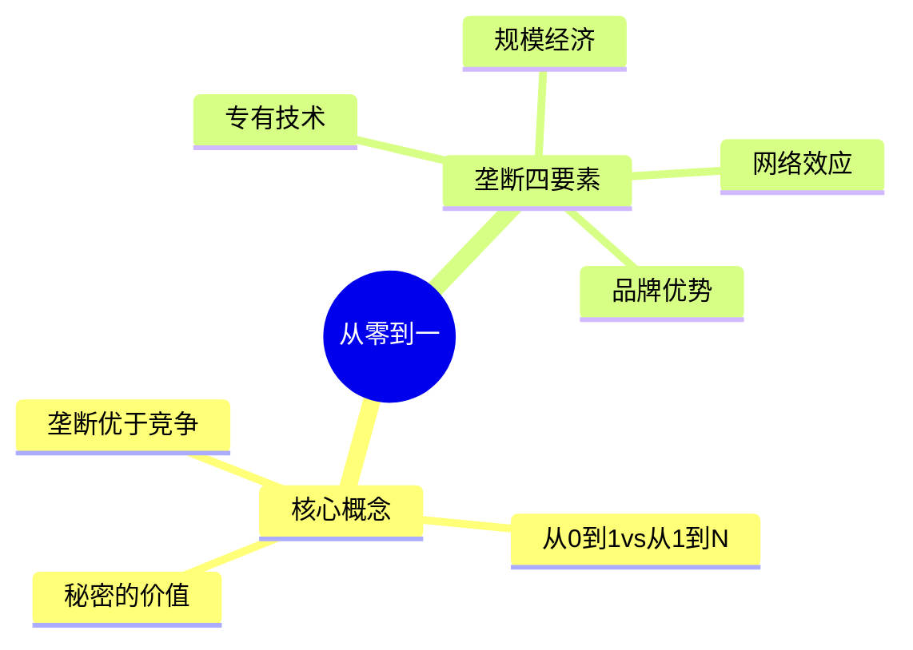

# 《从零到一》读书笔记

## 这本书要解决什么问题？

**核心困境**：为什么大多数创业公司会失败？为什么竞争让我们变得越来越平庸？

彼得·蒂尔的回答颠覆常识：真正的成功来自垄断，而非竞争。创业公司应该追求从0到1的创新，而非从1到N的复制。

**一句话定位**：
> 竞争是留给失败者的，垄断才是创业者的目标。

### 作者站在什么位置说这些话？

| 维度 | 定位 |
|------|------|
| 主领域 | 创业方法论、商业战略、创新哲学 |
| 跨界领域 | 经济学（垄断理论）、技术哲学（进步观） |
| 作者背景 | PayPal联合创始人、Palantir创始人、Facebook首位外部投资人 |
| 独特贡献 | 颠覆传统经济学"完全竞争"理论，提出垄断的正面价值 |

### 和其他书有什么关系？

| 关联书籍 | 关联关系 | 共同底层逻辑 |
|----------|----------|--------------|
| [[精益创业-埃里克·里斯]] | 方法论互补 | 蒂尔：找到垄断机会 → 里斯：快速验证假设 |
| [[纳瓦尔宝典-乔根森]] | 财富哲学 | 纳瓦尔：专长知识+杠杆 → 蒂尔：秘密+垄断 |
| [[穷查理宝典]] | 思维模型 | 芒格：多元思维模型 → 蒂尔：逆向思考问题 |

### 知识网络图

---

## 作者的核心论点

### 竞争是留给失败者的

谷歌在搜索领域垄断，2025年净利润超700亿美元，可以投入巨资研发AI。美国航空业百年历史累计利润为零，净利率仅3%。餐饮业完全竞争，90%的餐厅在第一年倒闭。

| 维度 | 完全竞争 | 创造性垄断 |
|------|----------|------------|
| 利润 | 利润趋近于零 | 超额利润 |
| 定价权 | 无定价权 | 完全定价权 |
| 创新投入 | 无力创新 | 有资源投入研发 |
| 长期规划 | 只能关注短期 | 可以进行长期布局 |

> **蒂尔垄断定律**：在商业中，要么成为垄断者享受超额利润，要么在竞争中挣扎求生。第三条路不存在。

你不需要打败竞争对手，你需要的是没有竞争对手。好生意不是做最好的，而是做唯一的。

这个观点打碎了我对"竞争"的假设。我一直以为竞争是好事，但蒂尔告诉我：竞争的终点是利润归零。

### 从0到1 vs 从1到N

从0到1：发明iPhone、发明ChatGPT、发明新商业模式。质变，非线性回报。

从1到N：复制已有模式、中国制造、AI应用开发。量变，线性回报或亏损。

| 维度 | 从0到1 | 从1到N |
|------|--------|--------|
| 本质 | 创造新事物 | 复制已有模式 |
| 效果 | 质变 | 量变 |
| 财富创造 | 创造蛋糕 | 分蛋糕 |
| 竞争程度 | 无竞争（初期） | 竞争激烈 |
| 回报 | 指数级 | 线性或亏损 |

> **幂次法则**：最成功的那一个赌注，其回报通常超过所有其他赌注的总和。

从0到1是创造，从1到N是复制。创造者吃肉，复制者喝汤。

### 秘密是财富的源泉

Facebook的秘密：人们的真实身份可以网络化（2004年反主流观点）。Airbnb的秘密：人们愿意住陌生人家。特斯拉的秘密：电动车可以比燃油车更好。

秘密的特征：反主流但正确的信念。大多数人认为不对，但你知道对。发现秘密需要独立思考。

> **秘密定律**：财富来自于你对真相的独特认知。当大多数人盲目跟风时，看到不同真相的人获得超额回报。

蒂尔的逆向思考问题："在什么重要问题上，你与其他人有不同看法？"

别人都知道的事情，已经没有价值了。财富藏在别人不信但你信的地方。

### 后发优势比先发优势更重要

Facebook不是第一个社交网络，谷歌不是第一个搜索引擎，iPhone不是第一部智能手机。但它们都是最后的赢家。

国际象棋大师卡帕布兰卡："要研究残局。"

关键不是第一个进入市场，而是最后一个占领市场。

> **后发优势定律**：在技术快速迭代的行业，后发者可以学习前人教训，选择正确技术路径，以更低成本建立垄断。

先发不一定赢，后发不一定输。关键是你能不能成为最后的赢家。

---

## 这本书的局限

| 批评点 | 谁在批评 | 怎么说 |
|--------|---------|--------|
| 特权盲视 | 学术批评 | 蒂尔作为硅谷天使投资人，有资本承担风险；普通人无法轻易"寻找垄断机会" |
| 技术封建主义 | 书评 | 垄断导致"数字地主"收租，创新服务于聚敛数据而非提升生产力 |
| 幸存者偏差 | 统计学者 | 只看到"用这套方法成功的人"，没有失败者的数据 |

**一句话总结局限性**：
> 蒂尔的方法论提高成功概率，但不保证成功。把它当作思维框架，不是成功配方。

---

## 最值得记住的话

**原书说的**：
1. "竞争是留给失败者的。"
2. "垄断者编造谎言隐藏垄断，竞争者编造谎言掩盖失败。"
3. "在什么重要问题上，你与其他人有不同看法？"
4. "今天最好的实践等于明天的死胡同。"
5. "你不是一张彩票。"

**翻译成人话**：
1. 别在红海里厮杀，去寻找蓝海的垄断
2. 好生意不是做最好的，而是做唯一的
3. 财富来自于与众不同的真相
4. 竞争的终点是利润归零
5. 从0到1是创新，从1到N只是复制

---

## 讲给没读过的人听

为什么你的生意不赚钱？

彼得·蒂尔会说：因为你太"正常"了。你在竞争红海里厮杀，利润被竞争消耗殆尽。

看看谷歌：在搜索领域垄断，每年净利润几百亿美元，可以投入巨资研发AI。看看美国航空业：百年历史，累计利润为零。

竞争的终点是利润归零。

蒂尔的核心观点：要么成为垄断者享受超额利润，要么在竞争中挣扎求生。第三条路不存在。

怎么建立垄断？四个要素：专有技术（好10倍以上）、网络效应（用户越多价值越大）、规模经济（成本随规模降低）、品牌优势。

怎么发现垄断机会？寻找秘密——反主流但正确的信念。Facebook的秘密是"人们的真实身份可以网络化"，当时没人信。

别人都知道的事情，已经没有价值了。财富藏在别人不信但你信的地方。

---

## 用来检验理解的问题

**基础回忆**：
1. Q: 为什么蒂尔说"竞争是留给失败者的"？
   A: 在完全竞争市场，利润趋近于零。垄断者才有超额利润投入创新。

2. Q: 垄断的四大特征是什么？
   A: 专有技术（好10倍以上）、网络效应、规模经济、品牌优势。

**理解验证**：
1. Q: 从0到1和从1到N的区别是什么？
   A: 从0到1是创造新事物（质变、指数回报），从1到N是复制已有模式（量变、线性回报）。

2. Q: 什么是"秘密"？
   A: 反主流但正确的信念。大多数人认为不对，但你知道对。发现秘密需要独立思考。

---

## 和其他书的对话

里斯告诉你怎么验证假设，蒂尔告诉你找什么假设。精益创业是方法论，从零到一是战略选择。两者结合：方向+验证=创业成功。

纳瓦尔告诉你如何创造财富，蒂尔告诉你如何保护财富。纳瓦尔讲"如何拥有"，蒂尔讲"如何独有"。专长知识+杠杆+垄断=财富自由。

芒格用100个模型看世界，蒂尔用逆向思考找到秘密。多元思维+逆向思维=独立思考能力。

---

*拆解日期：2026-03-08*
*下次回访：1周后回顾「讲给没读过的人听」和「检验问题」*