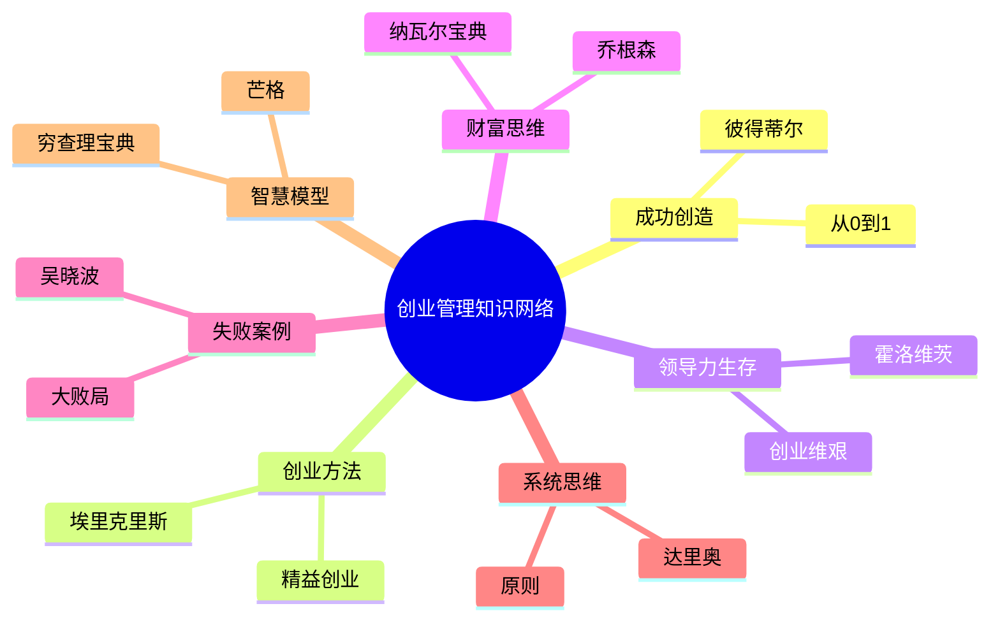
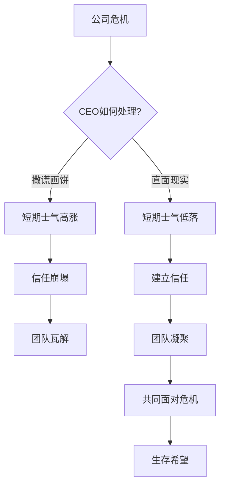
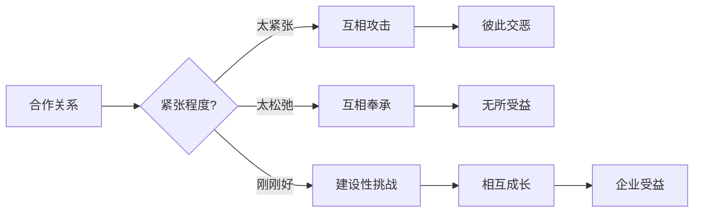

# 《创业维艰》读书笔记

## 这本书要解决什么问题？

**核心困境**：市面上绝大多数管理类书籍都在描绘通往成功的线性蓝图。但没人告诉你"当一切都搞砸了怎么办"。当公司濒临破产、团队士气低落、现金流断裂时，CEO该怎么办？

霍洛维茨自己经历过这一切。他从网景到Loudcloud到Opsware，一路都在挣扎求生。他裁过员、卖过公司、失眠过无数个夜晚。这本书不是成功指南，是生存手册。

**一句话定位**：
> 领导力不是在顺境中高歌猛进，而是在逆境中于灰烬里寻找微光，并带领团队活下去的非凡勇气。

### 作者站在什么位置说这些话？

| 维度 | 定位 |
|------|------|
| 主领域 | 创业管理、领导力 |
| 跨界领域 | 危机管理、组织行为学 |
| 作者背景 | 硅谷顶级创投a16z创始人之一，实战派CEO（网景、Loudcloud、Opsware） |

### 和其他书有什么关系？

| 关联书籍 | 关联关系 | 共同底层逻辑 |
|----------|----------|--------------|
| [[从0到1-彼得蒂尔]] | 互补视角 | 创造价值 vs 生存管理 |
| [[精益创业-埃里克·里斯]] | 互补视角 | 试错方法 vs 失败后果 |
| [[纳瓦尔宝典-乔根森]] | 互补视角 | 财富思维 vs 领导执行 |
| [[大败局-吴晓波]] | 互补视角 | 失败案例 vs 失败后生存 |
| [[原则]] | 互补视角 | 系统思维 vs 危机应对 |
| [[穷查理宝典]] | 互补视角 | 思考模型 vs 行动指南 |

---

## 作者的核心论点

### 没有成功秘诀，只有挣扎求生

凌晨4点，霍洛维茨又一次从噩梦中醒来。Loudcloud濒临破产，客户在流失，现金在燃烧，团队在动摇。他盯着天花板，脑子里只有一个问题：明天该怎么办？

他找不到答案。翻遍了所有管理书籍，没有一本告诉他"当公司快死的时候该怎么做"。那些书都在讲成功，没人讲失败。

霍洛维茨自己就是这样过来的。他从网景到Loudcloud到Opsware，一路都在挣扎求生。他裁过员、卖过公司、失眠过无数个夜晚。他发现一个真相：那些光鲜亮丽的成功故事，都是事后剪辑的版本。真正的创业过程，是无数次挣扎求生。你看到的成功是结果，你没看到的是过程中的地狱。

他引用拳击教练Cus D'Amato的话区分英雄与懦夫：二者的内心感受是一样的，都充满恐惧，但英雄选择用意志力克服怯懦，继续行动。

> **霍洛维茨生存定律**：CEO最重要的能力，不是那些可以条分缕析的模型或框架，而是"专心致志的能力和在无路可走时选择最佳路线的能力"。

这个观点打碎了我对"成功方法论"的迷信。以前觉得成功有公式，学了公式就能复制。霍洛维茨告诉我：没有公式，只有勇气。那些成功的人不是找到秘诀，是在没有秘诀的情况下活下来了。

下次遇到困境，我不会再问"成功CEO是怎么做的"，而是问"我能不能像他们一样活下去"。成功不是学会了什么，是熬过了什么。

---

### 武士道原则：直面现实，不要撒谎

如果你刚刚接手一家濒临破产的公司，财务状况糟糕透顶，你会怎么做？给员工画饼说"一切都会好起来的"？

霍洛维茨提出"武士道第一条原则"：永远不要说"一切都会好起来的"，因为你知道不会。

当他接手Opsware时，公司面临巨大的财务危机。他没有给员工画饼，而是直接告诉大家处境，并做出艰难的决定——裁员、降成本、找买家。

很多人觉得这样做会打击士气。霍洛维茨发现恰恰相反：坦诚建立信任，画饼摧毁信任。员工知道真相后，反而更愿意一起战斗。因为他们相信：这个CEO不会骗我。

> **信任定律**：信任建立需要很久，摧毁只需要一个谎言。在危机中，坦诚比虚假的希望更有力量。

这个观点颠覆了传统领导力教科书上"正面激励"的观点。以前觉得危机时要鼓舞士气，霍洛维茨告诉我：危机时要说真话。士气崩不崩，取决于信不信任我。虚假的希望只是安慰剂，真正的战斗力来自信任。

---

### 黄金张力：最好的合作关系让人不舒服

"大多数合作关系要么变得过于紧张而令人难以忍受，要么紧张不足而缺乏效率。人们要么相互挑战，导致彼此交恶，要么陶醉于彼此的奉承之词而无所受益。"

霍洛维茨这句话，说出了合伙关系的困境：太紧张会吵架，太松弛会敷衍。

他与联合创始人马克·安德烈森的合作是个例外：即使18年后，马克依然会对他的想法吹毛求疵，让他感到烦恼，他对此亦是如此。但事实证明，这种方式对企业的发展有益无害。

为什么"让人不舒服"反而是好的合作关系？霍洛维茨的解释：互相奉承 → 看不到问题 → 问题积累 → 最终爆发。互相挑战 → 及时发现问题 → 问题修正 → 企业受益。

关键是"建设性挑战"。不是互相攻击，而是互相挑毛病但依然信任。挑毛病是为了改进，不是为了否定。

> **黄金张力定律**：最好的合作关系，是在"让你不舒服的坦诚"和"让你信任的尊重"之间找到平衡点。

这个观点推翻了传统管理中"和谐团队"的迷思。以前觉得团队要和谐，霍洛维茨告诉我：真正的合作必须包含健康的冲突。和谐不是没有冲突，是冲突有质量。

下次遇到合伙人吵架，我不会觉得"我们有问题"，而是问"我们吵得有建设性吗"。好的合作不是不吵架，是吵架后还能一起干。

---

### 正确地做正确的事：勇气比智商更重要

深夜，你独自坐在办公室里，手里握着一份裁员名单。每个名字背后都是一个家庭、一份生计。你必须裁员，否则整个公司都会死。你怎么做？

在面临必须裁员、降薪、卖公司的艰难决策时，霍洛维茨强调：即使这会伤害自己、伤害团队、伤害所有人，你也必须做正确的事。

例如，当他不得不裁掉大部分员工时，他确保公平、公正地对待那些即将离开的人。他说："如果我们不能公平、公正地对待那些即将离开公司的人，那些留下的人就永远不会再信任我了。"

为什么"正确地做正确的事"这么难？霍洛维茨发现：正确的事往往很痛苦——裁员痛苦、降薪痛苦、卖公司痛苦。错误的事往往很舒服——拖延舒服、画饼舒服、等奇迹舒服。大多数CEO选择舒服的错误，而不是痛苦的正确。

但正确的做法有一个关键：怎么做比做什么更重要。裁员本身是痛苦的决定，但如果处理得公平、透明、体面，留下的团队反而更信任你。

| 情境 | 错误选择 | 正确选择 |
|------|----------|----------|
| 公司快破产了 | 等待奇迹 | 立即裁员，保存实力 |
| 必须裁掉员工 | 拖延、模糊承诺 | 公平、透明、体面地处理 |
| 员工对公司不满 | 压制、粉饰太平 | 直接沟通，承认问题 |
| 必须卖掉公司 | 为了股价拖延 | 为了团队果断出售 |

> **勇气优先定律**：在极端困境中，做正确的事比做容易的事重要100倍。勇气比智商更关键。

这个观点与传统管理理论中"效率优先"形成鲜明对比。霍洛维茨告诉我：在生死关头，道德和勇气是最后的底线。正确地做正确的事，留下的团队会记住；错误地做正确的事，留下的团队会离开。

下次面对艰难决定，我不会问"怎么做最舒服"，而是问"怎么做最正确"。正确的事本身已经够难了，但正确地做才能保住最重要的东西——信任。

---

## 这本书的局限

| 批评点 | 谁在批评 | 怎么说 | 实际情况 |
|--------|---------|--------|---------|
| 只适合大危机 | 小创业者 | 这些方法只在公司濒临破产时才有用 | 没错，但危机管理是每个创业者都要学的 |
| 过于强调勇气 | 理论派 | 勇气不能替代战略和执行 | 勇气是前提，不是替代；有勇气才能执行战略 |
| 案例集中在硅谷 | 非科技创业者 | 其他行业不一定适用 | 硅谷案例有特殊性，但危机管理的逻辑普适 |

**一句话总结局限性**：
> 霍洛维茨的方法最适合"生死存亡"时刻，日常管理可以参考《原则》《精益创业》等。

---

## 最值得记住的话

**原书说的**：
1. "当一名成功的CEO的秘诀是什么？遗憾的是，根本没有秘诀。"
2. "英雄和懦夫内心感受是一样的——都充满恐惧。区别在于，英雄用意志力克服了恐惧，继续行动。"
3. "武士道第一条原则：永远不要说'一切都会好起来的'，因为你知道不会。"
4. "如果你不能公平、公正地对待那些即将离开公司的人，那些留下的人就永远不会再信任你了。"
5. "专心致志的能力和在无路可走时选择最佳路线的能力，是CEO最重要的技能。"

**翻译成人话**：
1. 创业书都在教你怎么赢，只有这本教你怎么输得起
2. 勇气不是不害怕，是害怕也继续走
3. 在危机中，真相比鸡汤更有力量
4. 裁员不是为了省成本，是为了留下的人能活下去
5. CEO不是全知全能的英雄，是和你一样害怕但依然行动的普通人
6. 正确地做正确的事，比做什么正确的事更重要
7. 最好的合作关系是每天互相挑毛病但依然信任对方

---

## 讲给没读过的人听

你有没有发现，市面上创业书都在教你如何成功？

但没人告诉你"当一切都搞砸了怎么办"。当公司濒临破产、团队士气低落、现金流断裂时，CEO该怎么办？

霍洛维茨自己经历过这一切。他从网景到Loudcloud到Opsware，一路都在挣扎求生。他裁过员、卖过公司、失眠过无数个夜晚。他发现一个真相：那些光鲜亮丽的成功故事，都是事后剪辑的版本。真正的创业过程，是无数次挣扎求生。

霍洛维茨说："没有成功秘诀，只有挣扎求生。"勇气不是不害怕，是害怕也继续走。在危机中，真相比鸡汤更有力量。正确地做正确的事，比做什么正确的事更重要。

这本书最适合谁读？正在创业的人、带团队的人、正处在困境中的人。它不会给你打鸡血，但会告诉你：你经历的痛苦是正常的，你不是一个人在战斗。

核心收获三点：第一，勇气比智商更关键；第二，真相比鸡汤更有力量；第三，最好的合作关系包含健康的冲突。

---

## 用来检验理解的问题

**基础回忆**：
1. Q: 霍洛维茨的核心观点是什么？
   A: 没有成功秘诀，只有挣扎求生。勇气比智商更重要。

2. Q: 什么是"武士道第一条原则"？
   A: 永远不要说"一切都会好起来的"，因为你知道不会。坦诚比画饼更有力量。

3. Q: 为什么"让人不舒服"反而是好的合作关系？
   A: 互相挑战发现问题，互相奉承看不到问题。好的合作需要建设性冲突。

**理解验证**：
1. Q: 为什么"正确地做正确的事"这么难？
   A: 正确的事往往很痛苦，错误的事往往很舒服。大多数人选择舒服的错误。

2. Q: 信任为什么比士气更重要？
   A: 士气短期高可以画饼实现，但画饼摧毁信任。信任建立很久，摧毁只需要一个谎言。

**实际应用**：
1. Q: 如何用霍洛维茨的方法处理当下的危机？
   A: 先问"真相是什么"，再问"正确的事是什么"，最后问"如何正确地做"。

---

## 和其他书的对话

彼得蒂尔（从0到1）和霍洛维茨站在创业的两个极端。彼得蒂尔教你怎么从0到1创造价值，霍洛维茨教你怎么在1后面活下去。彼得蒂尔是进攻手册，霍洛维茨是防守手册。创业需要两者：先学会创造，再学会生存。

埃里克·里斯（精益创业）和霍洛维茨互补。精益创业教你如何快速试错，创业维艰教你如何处理失败的后果。一个教你如何犯错，一个教你如何从错误中活下来。

达利欧（原则）和霍洛维茨方法不同。达利欧是"理性+系统"，建立决策系统避免犯错；霍洛维茨是"勇气+直觉"，在没有系统时靠勇气活下来。达利欧教你建立系统，霍洛维茨教你系统失效时怎么办。

芒格（穷查理宝典）和霍洛维茨视角互补。芒格教你怎么思考——多元思维模型；霍洛维茨教你怎么行动——在困境中做决策。思考是准备，行动是实战。

---

*拆解日期：2026-03-04*

*下次回访：1周后回顾「讲给没读过的人听」和「检验问题」*