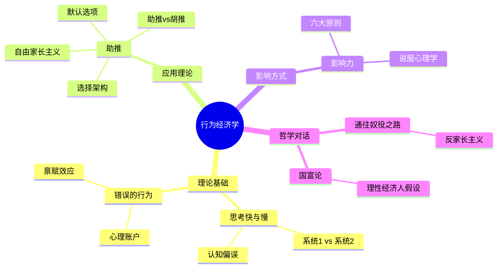

# 《助推》拆解记录

## 这本书要解决什么问题？

**核心困境**：传统经济学假设人是"理性经济人"，会计算、会优化、追求利益最大化。但现实是，人会受到偏见、诱惑、注意力限制的影响，做出糟糕决策——抽烟、不存钱、冲动消费、拖延体检。问题不是人不想做好选择，是选择的环境在悄悄推着他们往坏的方向走。

**一句话定位**：
> 如何在保留自由选择权的前提下，通过"选择架构"轻轻推一把，引导人们做出对自己更有利的决策？

### 作者站在什么位置说这些话？

| 维度 | 定位 |
|------|------|
| 主领域 | 行为经济学、公共政策设计 |
| 跨界领域 | 认知心理学、政治哲学、商业设计 |
| 作者背景 | 理查德·塞勒，2017年诺贝尔经济学奖得主；卡斯·桑斯坦，哈佛大学法学院教授。塞勒是行为经济学的应用派，不是象牙塔理论家，是和政策制定者一起干活的人 |
| 历史语境 | 2008年初版，2021年出终极版。金融危机后全球对"理性人"假设的信心崩塌，塞勒站出来说：人不是理性的，但我们不需要强迫你，只需要把好的选择放在你面前 |

### 和其他书有什么关系？

| 关联书籍 | 关联关系 | 共同底层逻辑 |
|----------|----------|--------------|
| [[错误的行为-理查德·塞勒-拆解记录]] | 同作者延伸 | 《错误的行为》讲理论，《助推》讲应用 |
| [[思考快与慢-丹尼尔·卡尼曼-拆解记录]] | 同源理论 | 卡尼曼的系统1/2理论是助推的心理学基础 |
| [[通往奴役之路-哈耶克-拆解记录]] | 对立互补 | 哈耶克反家长主义，塞勒主张"自由家长主义" |
| [[非对称风险-塔勒布-拆解记录]] | 互补视角 | 塔勒布讲风险承担者必须决策，塞勒讲如何设计决策环境 |
| [[影响力-西奥迪尼-拆解记录]] | 互补应用 | 西奥迪尼讲说服技巧，塞勒讲环境设计 |

### 知识网络图

---

## 作者的核心论点

### 选择架构：你无法避免"被设计"

阿姆斯特丹机场的男厕所做过一件事：在小便池里蚀刻了一只苍蝇图案。结果男士会下意识瞄准苍蝇"射击"，外溢率减少了80%，成本几乎为零。这就是"助推"——通过设计选择环境，引导人们做出更好的行为，但不强迫。

类似的例子到处都是：奥地利器官捐献同意率99%，德国只有12%，差别不在国民素质，在制度——奥地利是默认同意制，德国是默认不同意制。退休储蓄计划中，自动加入比主动加入参与率高得多。食堂里把健康食品放在视线平行位置，不健康食品放角落，人们的饮食结构就会改变。

塞勒总结了选择设计的六大原则：动机（明确正负激励）、理解映射（帮人理解选择与结果的对应关系）、默认选项（人倾向维持现状）、反馈（告诉人选择的效果）、预期失误（人会犯错，设计要容错）、结构性复合选择（简化复杂选择）。

核心发现是：任何选择环境都是"被设计"的，不存在"中立"的环境。超市把牛奶放最里面让你穿过更多商品，APP把"同意"按钮做大"拒绝"按钮做小，菜单把贵的菜放右上角做价格锚定。既然设计无法避免，不如设计得好一点。

> **选择架构定律**：任何选择环境都在引导某种行为。不存在"中立"的设计——要么是好的引导，要么是坏的引导，要么是无意识的混乱。

这个观点打碎了我的一个假设——我一直以为自己做决定是"完全自由"的。但事实上，你每天做的选择，都被环境悄悄设计过了。意识到这一点，才是真正的自由起点。

但这还没完，作者进一步指出——既然设计无法避免，那谁来设计、用什么原则设计，才是真正的问题。

### 自由家长主义：我不强迫你做对的事，但我让对的事更容易做

塞勒把干预分成三种：强迫（禁止卖高糖饮料）、助推（把健康饮料放显眼位置）、不干预（不管人们吃什么）。助推的黄金标准是：保留选择权、不显著改变经济诱因、可以轻易回避。

这个立场是冲着谁说的？哈耶克。《通往奴役之路》的核心观点是反家长主义——政府不应该替人们做选择，自由市场最懂。弗里德曼也持同样立场：家长主义会导致集权。塞勒的回应很巧妙：人确实需要帮助，但帮助不等于强迫。人是有限理性的，会犯错、会后悔、会受偏见影响。自由家长主义的逻辑是：让"更好的选择"更容易被选中，但如果你真的想要"不好的选择"，仍然可以选。

桑斯坦有句名言："如果你认为家长主义总是错的，那你就否认了人类需要帮助的事实。"

> **自由家长主义定律**：绝对自由导致认知偏差损害自身，绝对家长主义侵犯自由选择权。两条路都有问题，中间地带是——保留自由，但通过设计引导更好的选择。

有了自由家长主义的哲学基础，塞勒接下来揭示了一个强大的工具——默认选项。

### 默认选项的力量：人是"懒"的

奥地利器官捐献同意率99%，德国12%。同一种族、同一文化圈、甚至语言都相通，差距为什么这么大？答案只有两个字：默认。

奥地利是默认同意——不想捐才主动退出。德国是默认不同意——想捐才主动加入。人的惰性加上损失厌恶加上认知成本，让绝大多数人选择"不改变现状"。401(k)退休计划也一样：自动加入比主动加入参与率高很多。软件安装时默认选项总是被最多人选择。手机出厂设置大部分人从来不改，网站隐私条款没人读直接点"同意"，APP订阅自动续费比主动续费人多得多。

塞勒的解释很清楚：惰性让人倾向不改变现状，损失厌恶让改变感觉像"失去"，认知成本让主动选择需要额外思考。大脑能量有限，省着用——人是"认知吝啬鬼"。

应用的两条原则：把对人们有利的选项设为默认，让退出选项仍然可得但需要主动操作。

> **默认效应定律**：如果"好的选择"是默认选项，大部分人会保持默认。设计默认选项，就是设计大多数人的行为。

下次遇到选择环境的设计，我不会再只问"给了用户什么选项"，而是先问"默认选项是什么"——因为大部分人根本不会改默认。

X只是硬币的一面，另一面是Y——默认选项可以用来行善，也可以用来作恶。

### 助推vs胡推：善良的设计和邪恶的设计

2021年终极版新增了一个重要概念：胡推（Sludge）。助推是让好的选择更容易，胡推是让坏的选择更容易。

健身房会员网上报名一键搞定，取消必须到现场——胡推。软件订阅一键点击，取消入口藏得找不到——胡推。购买时说"30天免费退货"，退货时各种门槛——胡推。这些设计的共同特征：让你做对商家有利的事很方便，让你退出很麻烦。

检验标准只有一个："这个设计对谁有利？"对你有利的就是助推，对设计者有利而损害你的就是胡推。塞勒警告："情境的微小改变能够极大地产生影响，可以用来为善，也可以用来作恶。"

"中立"是神话——任何选择架构都反映了某种价值观。不是改变人，而是改变人面对的环境。环境不变，人很难变。

> **助推vs胡推定律**：选择架构本身没有善恶，善恶取决于设计者的意图。同一个心理机制，助推帮你，胡推害你。

这引出了另一个问题——识别助推和胡推，然后重新设计自己的环境。

---

## 这本书的局限

> 塞勒的助推体系是从行为经济学理论和政策实践中提炼的，这套方法有它的边界。

| 批评点 | 谁在批评 | 怎么说 | 实际情况 |
|--------|---------|--------|---------|
| 谁来决定什么是"好"的选择 | 哈耶克主义者 | "自由家长主义"的"家长"二字暴露了精英替你做主的本质 | 确实存在价值判断问题，但默认选项的退出成本低，比强制好得多 |
| 助推效果被夸大 | 学术界 | 部分实验无法复制，真实政策环境中效果打折 | 默认效应确实强大，但其他助推手段效果因场景而异 |
| 文化差异 | 跨文化学者 | 基于美国制度设计，不同文化对"默认"的反应不同 | 核心机制普适，但具体设计需要本地化 |
| 被商业滥用 | 消费者保护者 | 企业学到的不是助推而是胡推，用选择架构赚钱 | 这是事实，但恰恰说明识别胡推更重要 |
| 忽视结构性问题 | 社会学家 | 用个体行为设计回避了收入不平等、制度缺陷等根本问题 | 助推是工具不是万能药，不能替代制度改革 |

**一句话总结局限性**：
> 助推是低成本高效果的工具，但它解决的是个体行为层面的问题，不能替代制度改革和结构性变革。

---

## 最值得记住的话

**原书说的**：
1. "一个助推，是选择架构的任何方面，它以可预测的方式改变人们的行为，而不禁止任何选择或显著改变他们的经济诱因。"
2. "如果我们面对的选择是经过精心设计的，我们就能过得更好、更长寿、更健康。"
3. "助推不是强制性的。把水果放在眼睛的高度算作助推。禁止垃圾食品则非。"
4. "选择架构无处不在，并且它会影响我们的决策。既然它无法避免，我们就应该让它变得更好。"
5. "默认选项具有惊人的影响力，因为人们倾向于维持现状。"
6. "自由家长主义：既不强迫，也不放任，而是通过设计引导更好的选择。"
7. "人作为社会性动物，不可避免地受到他人的影响。明智的选择架构会利用这一点。"
8. "情境的微小改变能够极大地产生影响，可以用来为善，也可以用来作恶。"

**翻译成人话**：
1. 你每天做的选择都不是完全自由的，而是被环境悄悄设计过的
2. 我不强迫你做对的事，但我让对的事变得更容易做
3. 人是"懒"的——如果不主动选择，就会默认保持原样
4. 默认选项选什么，大部分人就选什么——这不是巧合，是设计
5. 助推是推你一把，胡推是拖你后腿
6. 如果你认为"中立"的环境存在，那你已经被设计了
7. 最好的政策不是禁止，是摆放——把好的放显眼，坏的藏起来
8. 不是改变人，而是改变人面对的环境
9. 选择架构是中立的？不，它总偏向某方——问题是偏向谁
10. 识别胡推，比学会助推更紧急

---

## 讲给没读过的人听

你有没有想过，为什么超市的牛奶总是放在最里面？为什么APP的"同意"按钮总是比"拒绝"按钮大？为什么你办了健身卡却从来不去？

塞勒说，这不是你的错，是设计的问题。你每天做的选择，都不是完全自由的——环境在悄悄推着你走。

阿姆斯特丹机场在小便池里画了一只苍蝇，男士们会下意识瞄准它，外溢率减少了80%。这就是"助推"：不强迫你，只是把好的选择放在你面前。奥地利器官捐献率99%，德国只有12%，不是因为奥地利人更有爱心，是因为奥地利默认同意，德国默认不同意。人的"懒"决定了默认选项就是最终选项。

但助推可以行善，也可以作恶。健身房报名一键搞定，取消必须到现场——这不是助推，是"胡推"。订阅容易、退订难，购买容易、退货难，这些都是胡推。

所以塞勒的核心思想很简单：你不强迫人，不放任人，而是把正确的选择放在人们面前，让好行为自然发生。

---

## 用来检验理解的问题

**基础回忆**：
1. Q: 助推的三个核心标准是什么？
   A: 保留选择权、不显著改变经济诱因、可以轻易回避。

2. Q: 选择架构的六大原则是什么？
   A: 动机、理解映射、默认选项、反馈、预期失误、结构性复合选择。

3. Q: 助推和胡推的区别是什么？
   A: 助推让对选择者有利的选择更容易，胡推让对设计者有利的选择更容易。检验标准是"这对谁有利？"

**理解验证**：
1. Q: 为什么奥地利器官捐献率99%，德国只有12%？
   A: 不是文化差异，是默认选项不同。奥地利默认同意，德国默认不同意。人不改变默认。

2. Q: 自由家长主义和哈耶克的反家长主义对立在哪里？
   A: 哈耶克认为政府不应替人做选择，塞勒认为人需要帮助但不需要强迫。争议在于"谁来决定什么是好选择"。

3. Q: 为什么"中立的选择环境"是神话？
   A: 任何选择架构都有默认选项、排列顺序、呈现方式，这些都在引导行为。不存在不引导的设计。

**实际应用**：
1. Q: 列出3个影响你日常决策的"助推"或"胡推"设计。
   A: 检验标准：这个设计的默认选项对谁有利？退出成本高不高？

2. Q: 选一个你想改变的习惯，设计一个"助推环境"。
   A: 不要靠意志力，而是改变环境——把好的选择设为默认，把坏的选择增加阻力。

**深度分析**：
1. Q: 塞勒和塔勒布应对不确定性的本质区别？
   A: 塔勒布构建反脆弱系统——从混乱中获益；塞勒设计选择架构——减少混乱发生的概率。一个教你活，一个教你少犯错。

2. Q: 助推理论在AI推荐算法时代的意义是什么？
   A: 算法推荐本质上是一种"胡推"——让对平台有利（更多停留时间）的选择更容易。识别这种设计，是2026年最重要的能力之一。

---

## 和其他书的对话

卡尼曼是塞勒的理论底座。《思考，快与慢》告诉你系统1和系统2怎么运作、认知偏误有哪些；塞勒拿这些发现开药方——用选择架构和默认选项来弥补系统1的缺陷。卡尼曼诊断病情，塞勒开药方。没有卡尼曼的理论，助推就失去了根基。

《错误的行为》是塞勒的前作，讲行为经济学理论——禀赋效应、心理账户这些发现；《助推》是理论的应用版，讲怎么把这些发现用到政策设计和日常生活中。先读前者理解"人为什么会犯错"，再读前者学会"如何帮助人少犯错"。

哈耶克和塞勒是一场跨越70年的辩论。哈耶克在《通往奴役之路》中说：任何家长主义都会滑向集权。塞勒回应：我同意自由很重要，但人确实不是完全理性的，需要"轻轻推一把"。两人的共识是重视自由，分歧在于——不干预的后果，是否比温和干预更糟。

塔勒布和塞勒是应对不确定性的两个流派。塔勒布的杠铃策略让你在暴风雨中活下来还能获益；塞勒的选择架构让你在日常生活中少犯错。一个教你从混乱中获益，一个教你减少混乱发生的概率。

西奥迪尼和塞勒在说同一件事的不同面。《影响力》讲的是说服技巧——如何改变一个人的想法；《助推》讲的是环境设计——如何改变一个人面对的选择。一个是改变人的态度，一个是改变人的行为条件。很多时候，改环境比改态度更有效。

亚当·斯密在《国富论》里假设人是"理性经济人"，这个假设支撑了200多年的经济学。塞勒直接挑战了这个假设：人不是理性的，至少不是完全理性的。这不是否定斯密，而是在斯密的基础上加了层真实。

弗里德曼在《自由选择》里说市场最懂、政府别管。塞勒说：市场确实比政府聪明，但市场也在利用人的非理性赚钱（胡推）。自由选择很重要，但选择的"架构"谁来设计？

宫本武藏的"空心"状态和助推有意外呼应。武藏追求消除内心干扰、让正确行动自然发生；塞勒追求消除环境干扰、让正确选择自然发生。一个修心，一个修境，殊途同归。

---

*拆解日期：2026-02-14*
*下次回访：1周后回顾「讲给没读过的人听」和「检验问题」*