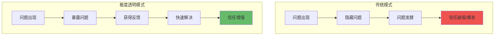
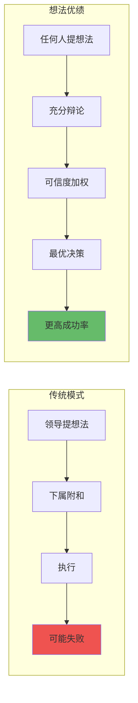
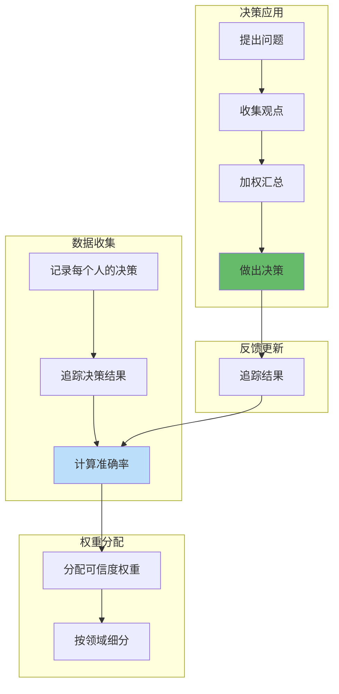
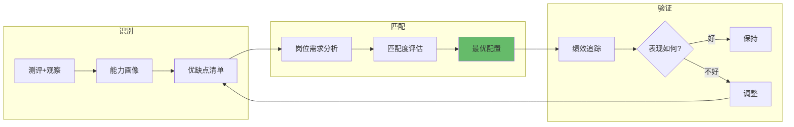

# 第3章 工作原则

## 章节定位

### 3.1 本章在全书中位置

```
《原则》三部分结构：
├── 第1章 我的历程（铺垫：达里奥如何形成这些原则）
├── 第2章 生活原则（核心：个人成长的系统性指导）
└── 第3章 工作原则（延伸：组织管理的系统性指导） ← 本章
```

**一句话定位**：
> 本章将生活原则扩展到组织层面——教你如何建立一个"想法优绩主义"的团队，让最好的想法胜出。

### 3.2 本章核心问题

| 问题 | 达里奥的答案 |
|------|-------------|
| 如何让组织高效决策？ | 想法优绩主义 + 可信度加权 |
| 如何建立信任文化？ | 极度真实 + 极度透明 |
| 如何让团队持续进化？ | 问题日志 + 复盘机制 + 原则体系 |
| 如何用人？ | 把人当机器零件，识别优缺点，人岗匹配 |

### 3.3 章节关联

| 关联章节 | 关系 | 共同逻辑 |
|----------|------|----------|
| [[第1章-我的历程]] | 源头 | 工作原则从达里奥的失败中提炼 |
| [[第2章-生活原则]] | 基础 | 个人原则是组织原则的原型 |
| [[第五项修炼-圣吉-拆解记录]] | 延伸 | 学习型组织与透明文化理念相通 |

---

## 核心观点一：极度真实与极度透明

### 【表层】现象层

**达里奥的核心表述**：
> "Radical Truth and Radical Transparency"（极度真实 + 极度透明）

**桥水的实践**：
- 所有会议录音，全员可听
- 任何人都可评价任何人（包括达里奥本人）
- 问题直接说，不绕弯子
- 失败案例公开分享，绝不隐瞒

**日常场景**：
- 老板的决策有问题，你敢说吗？
- 同事的方案有漏洞，你会指出吗？
- 自己犯了错，你会主动承认吗？

**传统模式 vs 极度透明**：

| 情境 | 传统模式 | 极度透明模式 |
|------|----------|-------------|
| 发现问题 | 私下吐槽 | 公开指出 |
| 上级犯错 | 不敢说 | 直接反馈 |
| 自己失误 | 尽量隐藏 | 主动暴露 |
| 决策过程 | 少数人知道 | 全员可见 |

### 【中层】机制层

**极度透明的心理机制**：



**为什么要极度透明？**：
1. 隐藏的问题，别人看得到，但不会告诉你
2. 暴露问题 = 获得反馈的机会
3. 透明 = 高效的问题解决机制
4. 隐瞒 = 问题发酵 + 信任崩塌

**透明的代价与收益**：

| 维度 | 代价 | 收益 |
|------|------|------|
| 短期 | 不适感、尴尬、冲突 | 无 |
| 长期 | 无 | 信任、效率、进化 |

### 【底层】规律层

> **极度透明定律**：真相不会因为你不喜欢而改变。你能接受多痛苦的真相，你就能建立多高效的组织。短期的尴尬，换来长期的解脱。

**降维翻译**：
> 暂时的尴尬，
> 比永久的问题更可取。
> 透明的伤口会愈合，
> 隐藏的脓包会溃烂。

### 【当下连接】

|----------|----------|----------|
| 为什么团队效率低？ | 问题被藏着，得不到解决 | "原来问题在这里" |
| 为什么老板听不进意见？ | 可能是文化问题，不是人 | "有方向了" |
| 如何建立信任？ | 先透明，信任自来 | "原来这么简单" |

---

## 核心观点二：想法优绩主义

### 【表层】现象层

**达里奥的核心表述**：
> "Idea Meritocracy"（想法优绩主义）——让最好的想法胜出，而不是让职位最高的人胜出。

**桥水的实践**：
- 任何人的想法都可以被质疑
- 职级高低不影响观点的对错
- 决策靠"可信度加权"而非投票
- 让最懂这件事的人做决策

**日常场景**：
- 老板的想法一定对吗？不对时多数人敢说吗？
- 团队讨论，是头脑风暴还是一言堂？
- 你的想法被否定，是因为想法不好还是因为你人微言轻？

**传统决策 vs 想法优绩**：

| 维度 | 传统决策 | 想法优绩 |
|------|----------|----------|
| 决策依据 | 职位高低 | 想法质量 |
| 讨论方式 | 下属附和 | 充分辩论 |
| 结果 | 可能错误 | 更高准确率 |

### 【中层】机制层

**想法优绩主义的机制**：



**可信度加权的关键**：
- 不是一人一票
- 而是根据你在该领域的"可信度"加权
- 可信度 = 过去决策的准确率
- 领域相关：在A领域可信，在B领域不一定可信

**实施难点**：
1. 如何量化"可信度"？
2. 谁来判断谁更可信？
3. 文化惯性：人们习惯了服从权威

### 【底层】规律层

> **想法优绩定律**：群体智慧优于个人智慧，前提是：1）充分开放讨论；2）按可信度加权而非按职级。独断是创意的杀手，开放是创新的温床。

**降维翻译**：
> 一个人再聪明，
> 也比不过一群聪明人的充分讨论。
> 职位高不代表想法对，
> 位置次不代表见解浅。

### 【当下连接】

|----------|----------|----------|
| 为什么团队创新不足？ | 可能是一言堂，没充分讨论 | "原来需要辩论" |
| 如何提高决策质量？ | 让最懂的人做决策 | "可信度加权" |
| 我的想法总被忽视？ | 要么提升可信度，要么换环境 | "有方向了" |

---

## 核心观点三：可信度加权决策

### 【表层】现象层

**达里奥的核心表述**：
> "Believability-Weighted Decision Making"——不是一人一票，而是按可信度加权投票。

**具体做法**：
1. 记录每个人在各个领域的决策准确率
2. 讨论时，让可信度高的人意见权重更大
3. 动态调整：每次决策后更新可信度

**案例：投资决策**：
- A分析师过去预测准确率80%
- B分析师过去预测准确率50%
- A的票权重 = B的1.6倍

**日常场景**：
- 公司战略决策：谁更懂市场？
- 技术选型：谁更懂技术？
- 人事决策：谁更懂人？

### 【中层】机制层

**可信度加权系统**：



**关键原则**：
1. 可信度是动态的，不是永久的
2. 不同领域的可信度不同
3. 自我评估的可信度不可信
4. 数据说话，不用感觉

### 【底层】规律层

> **可信度加权定律**：群体决策的质量，取决于两个因素：1）参与者的可信度；2）加权机制的公平性。一人一票在专业问题上往往是低效的。

**降维翻译**：
> 不是每个人的意见都一样重要，
> 在专业问题上，
> 听专家的比听多数的更靠谱。

### 【当下连接】

|----------|----------|----------|
| 为什么团队决策总出错？ | 可能没让最懂的人做决定 | "原来要加权" |
| 如何判断谁是专家？ | 看过去决策的准确率 | "有标准了" |
| 我如何提高可信度？ | 持续做对决策，积累记录 | "知道怎么做了" |

---

## 核心观点四：人像机器零件

### 【表层】现象层

**达里奥的核心表述**：
> 把人当作机器的零件，了解每个人的优缺点，放到最适合的位置。

**桥水的做法**：
- 用心理测评了解每个人的特点
- 建立每个人的"能力画像"
- 人岗匹配：让每个人发挥长处
- 不求全才，但求匹配

**日常场景**：
- 有人擅长创意，不擅长执行
- 有人擅长分析，不擅长沟通
- 有人擅长开拓，不擅长守成

**错误做法**：
- 要求每个人都是全才
- 忽视差异，一刀切管理
- 只看短板，不看长板

### 【中层】机制层

**人岗匹配机制**：



**关键洞察**：
1. 没有完美的人，只有完美的组合
2. 承认短板，发挥长板
3. 团队互补 > 个人全能
4. 用对人比培养人更重要

### 【底层】规律层

> **人岗匹配定律**：组织效率的最大化，来自于每个人的"长板"被充分利用，而不是每个人的"短板"都被补齐。扬长避短 > 取长补短。

**降维翻译**：
> 不要试图把每个人都变成全才，
> 把每个人放到最能发挥的位置，
> 才是最高效的管理。

### 【当下连接】

|----------|----------|----------|
| 为什么团队效率低？ | 可能是人岗不匹配 | "原来要匹配" |
| 如何用人？ | 用长板，不补短板 | "有方法了" |
| 我适合什么岗位？ | 先了解自己的优缺点 | "要先自知" |

---

## 金句库

### 原书金句

1. "最好的想法获胜，而不管这想法来自谁"
2. "极度透明带来最优质的合作"
3. "暂时的尴尬比永久的问题更可取"
4. "可信度比职级更能衡量观点有效性"
5. "职位高不代表想法对，位置次不代表见解浅"
6. "透明的伤口会愈合，隐藏的脓包会溃烂"
7. "过于温和的批评是在纵容不佳的表现"
8. "知道你不知道的是智慧的开端"

### 降维金句

1. **极度透明**："透明的伤口会愈合，隐藏的脓包会溃烂"
2. **想法优绩**："职位高不代表想法对，位置次不代表见解浅"
3. **可信度加权**："不是每个人的意见都一样重要，在专业问题上，听专家的比听多数的更靠谱"
4. **人岗匹配**："不要试图把每个人都变成全才，把每个人放到最能发挥的位置，才是最高效的管理"
5. **批评文化**："过于温和的批评是在纵容不佳的表现"

## 当下映射

### 财富焦虑连接

|----------|----------|----------|
| 想法优绩 | 创业团队如何高效决策？ | "有方法论了" |
| 人岗匹配 | 如何组建赚钱团队？ | "扬长避短" |
| 极度透明 | 投资决策如何避免盲区？ | "透明减少风险" |

### 职场焦虑连接

|----------|----------|----------|
| 可信度加权 | 如何在团队中建立话语权？ | "积累可信度" |
| 极度透明 | 如何与领导建立信任？ | "透明是捷径" |
| 人岗匹配 | 如何找到适合自己的岗位？ | "先了解自己" |

### 管理焦虑连接

|----------|----------|----------|
| 想法优绩 | 如何避免团队一言堂？ | "制度设计" |
| 极度透明 | 如何建立团队信任文化？ | "透明是基础" |
| 人岗匹配 | 如何组建高效团队？ | "互补是关键" |

---

## 章节关联

### 与主拆解记录的关联

| 主拆解观点 | 本章体现 |
|------------|----------|
| 痛苦+反思=进化 | 组织层面的问题日志+复盘机制 |
| 极度透明 | 从个人扩展到组织的透明文化 |
| 原则+进化 | 组织原则体系+持续进化机制 |

### 与其他章节的关联

```mermaid
flowchart LR
    subgraph 第1章：我的历程
        A[失败经验] --> B[提炼原则]
    end
    
    subgraph 第2章：生活原则
        B --> C[个人原则体系]
        C --> D[5步流程]
    end
    
    subgraph 第3章：工作原则
        C --> E[组织原则体系]
        E --> F[极度透明]
        E --> G[想法优绩]
        E --> H[可信度加权]
    end
    
    style A fill:#bbdefb
    style B fill:#fff9c4
    style E fill:#66bb6a
```

### 与已拆解书籍的关联

| 书籍 | 关联点 |
|------|--------|
| [[第五项修炼-圣吉-拆解记录]] | 学习型组织 + 系统思考 ≈ 桥水的进化文化 |
| [[思考快与慢-丹尼尔·卡尼曼-拆解记录]] | 认知偏误 → 可信度加权可减少偏误 |
| [[从优秀到卓越-科林斯-拆解记录]] | 先人后事 ≈ 达里奥的人岗匹配 |

---

## 问答设计

### Q1：极度透明会不会伤害员工尊严？

**A**：关键在于区分"对人"和"对事"。

| 维度 | 做法 |
|------|------|
| 对事 | 极度透明，问题直接说 |
| 对人 | 保持尊重，就事论事 |
| 目的 | 帮助成长，不是羞辱 |

**核心原则**：
> 批评是为了改进，不是为了打击。
> 反馈要具体，不要人身攻击。

### Q2：小团队如何实施想法优绩？

**A**：从小处开始，逐步推进。

| 阶段 | 做法 |
|------|------|
| 第一步 | 在无风险讨论中实践（如头脑风暴） |
| 第二步 | 建立反馈培训，学会接受批评 |
| 第三步 | 领导者身先示范，接受质疑 |
| 第四步 | 逐步扩展到重要决策 |

**关键**：文化改变需要时间，不能急于求成。

### Q3：如何量化可信度？

**A**：桥水的做法是记录和追踪。

```
1. 记录每个人的观点和决策
2. 追踪这些决策的结果
3. 计算准确率（预测对的比例）
4. 按领域分类（A领域准，B领域不一定）
5. 定期更新，动态调整
```

**简化版**：没有系统时，可以凭过往表现做大致判断。

### Q4：极度透明适合中国企业文化吗？

**A**：需要本土化调整。

| 维度 | 挑战 | 调整方向 |
|------|------|----------|
| 面子文化 | 直接批评伤面子 | 私下+公开结合 |
| 等级观念 | 下级不敢质疑上级 | 领导先示范 |
| 关系导向 | 怕影响关系 | 强调"对事不对人" |

**核心**：原则不变，方式可以调整。

### Q5：如何在团队中建立信任文化？

**A**：达里奥的建议是三步走。

| 步骤 | 做法 | 效果 |
|------|------|------|
| 第一步 | 领导先透明 | 打破恐惧 |
| 第二步 | 鼓励反馈 | 建立安全感 |
| 第三步 | 表彰透明行为 | 强化文化 |

**关键洞察**：
> 信任不是喊出来的，是做出来的。
> 领导先透明，团队才敢透明。

---
