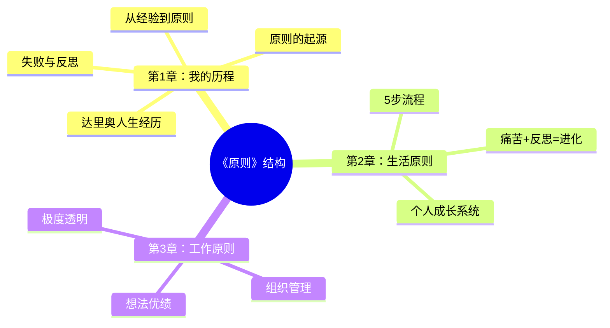
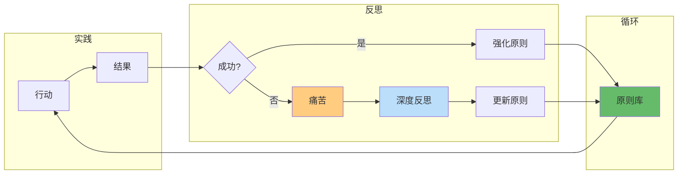
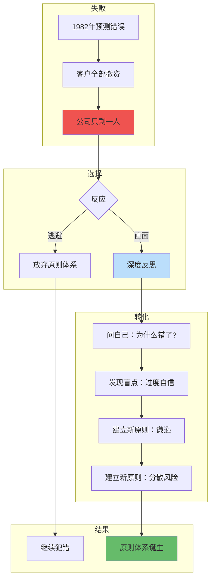
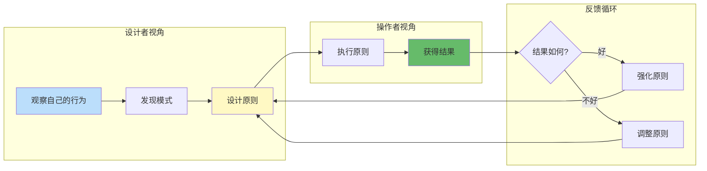
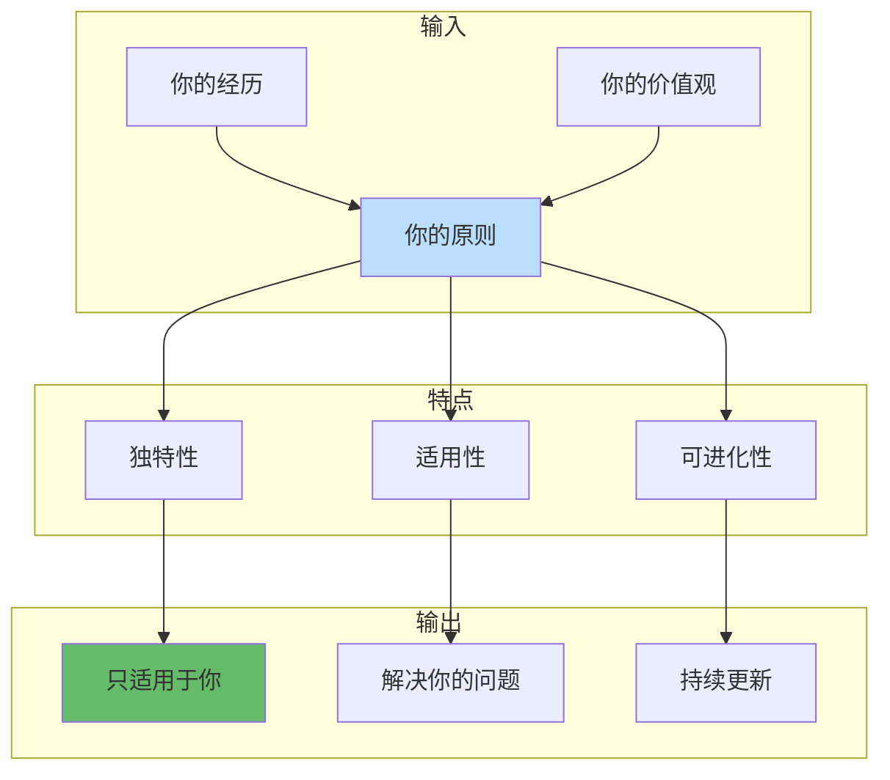

# 《原则》第1章：我的历程 - 深度拆解

## 章节定位

### 1.1 本章在全书的位置



### 1.2 本章核心主题

| 维度 | 内容 |
|------|------|
| 核心主题 | 原则来自实践，不是理论 |
| 关键转折 | 1982年大失败 → 深度反思 → 原则体系诞生 |
| 人生隐喻 | 把自己当成一台机器来设计和优化 |
| 核心洞见 | 失败+反思=原则，不是成功=原则 |

### 1.3 章节价值定位

> **一句话概括**：这不是达里奥的回忆录，而是他用自己的人生做实验，告诉你"原则是怎么炼成的"。

**阅读价值**：
- 理解原则不是凭空产生的，而是从血泪中提炼的
- 看到"失败"如何变成"进化"
- 学习如何从人生经历中提炼自己的原则

---

## 二、核心观点（三层提取）

### 观点1：原则来自实践，不是理论

#### 【表层】现象层

**达里奥的经历**：
- 8岁开始送报纸、打零工
- 12岁用当球童赚的钱买第一只股票（东北航空公司）
- 高中对市场着迷，用零花钱炒股
- 大学期间学习金融，同时实践交易
- 26岁创立桥水，从小公寓起步

**关键洞察**：
> "我的原则不是从书本上学来的，而是从一次次失败中提炼出来的。"

**生活类比**：
- 游泳：看再多的书也学不会，必须下水
- 原则：听再多道理也没用，必须用血泪换

#### 【中层】机制层

**原则形成的机制**：



**机制关键**：
1. 原则是"事后总结"，不是"事前设计"
2. 每次失败都是原则的"原料"
3. 反思是"炼金术"，把失败变成原则

#### 【底层】规律层

> **实践原则定律**：任何有效的原则，都是"用真金白银（或血泪）换来的"。纸上得来终觉浅，绝知此事要躬行。

**降维翻译**：
> 原则不是写在书里的，
> 是刻在骨子里的。
> 没疼过，就没有真正的原则。

#### 【当下连接】

|----------|----------|----------|
| 为什么我懂那么多道理，还是过不好？ | 你只是"知道"，没有"体悟" | "原来差在这里" |
| 如何建立自己的原则？ | 从失败中提炼，不是从书里抄 | "有方法了" |
| 为什么别人的原则对我没用？ | 每个人的原则都是独特的 | "可以不用复制别人了" |

---

### 观点2：1982年大失败 - 原则的诞生地

#### 【表层】现象层

**1982年的灾难**：
- 达里奥预测美国经济会崩溃
- 大量押注做空美国市场
- 结果：美国经济反弹，市场大涨
- 损失：几乎所有客户撤资
- 公司：只剩他一个人
- 状态：甚至需要向父亲借钱

**达里奥的原话**：
> "这是我人生中最痛苦的经历，但也是最有价值的经历。"

**失败后的选择**：
- 逃避？放弃？转行？
- 达里奥选择了：反思

#### 【中层】机制层

**失败→原则的转化机制**：



**转化的关键**：
1. 不逃避痛苦，而是拥抱痛苦
2. 问"为什么"而不是"凭什么"
3. 把"我错了"变成"我学到了"

#### 【底层】规律层

> **失败转化定律**：失败本身没有价值，失败+反思才有价值。同样的失败，有人归咎运气，有人提炼原则。区别在于反思。

**降维翻译**：
> 失败是免费的课程，
> 反思是消化课程的过程。
> 你不反思，失败就白疼了。

#### 【当下连接】

|----------|----------|----------|
| 失败后很痛苦，怎么办？ | 痛苦是进化的信号 | "原来痛苦有价值" |
| 为什么我总犯同样的错？ | 你只失败，没反思 | "缺了这一步" |
| 失败后应该怎么做？ | 问自己"为什么错了"，提炼原则 | "有行动指南了" |

---

### 观点3：把自己当机器 - 人生工程思维

#### 【表层】现象层

**达里奥的核心隐喻**：

> "把自己想象成一台机器，你是这台机器的设计者和操作者。"

**机器的两个角色**：
1. **设计者**：设计这台机器的运行规则（原则）
2. **操作者**：执行这些规则，并根据结果调整

**生活中的类比**：
- 你不是"你"，你是"你的CEO"
- 你的行为、情绪、习惯是"员工"
- 原则是"公司制度"

#### 【中层】机制层

**机器思维的机制**：



**机器思维的关键**：
1. 抽离：从"我"变成"我的观察者"
2. 设计：主动设计而不是被动接受
3. 优化：持续改进，而不是一次定终

#### 【底层】规律层

> **机器思维定律**：把自己当主体，你只能看到"我失败了"；把自己当客体，你能看到"这台机器哪里出了问题"。视角决定进化的速度。

**降维翻译**：
> 你不是你的失败，
> 你是失败的分析师。
> 把自己抽离出来，
> 才能真正进化。

#### 【当下连接】

|----------|----------|----------|
| 为什么我总是陷入情绪？ | 你把自己当主体，不是观察者 | "原来视角问题" |
| 如何客观看待自己的问题？ | 把自己想象成一台机器 | "有方法了" |
| 如何持续改进自己？ | 建立反馈循环，持续优化 | "有框架了" |

---

### 观点4：原则是独特的 - 每个人都有自己的原则

#### 【表层】现象层

**达里奥强调**：
> "我的原则是我的，不是你的。你必须找到自己的原则。"

**为什么原则必须独特**：
- 每个人的经历不同
- 每个人的价值观不同
- 每个人面对的环境不同

**达里奥的例子**：
- 他的原则来自投资界的生死考验
- 你的原则可能来自完全不同的经历
- 可以借鉴，不能复制

#### 【中层】机制层

**原则独特性的机制**：



**关键洞察**：
1. 别人的原则是"参考答案"，不是"标准答案"
2. 最有效的原则是你自己提炼的
3. 原则会随着你的经历而进化

#### 【底层】规律层

> **原则独特性定律**：原则越是个性化，越是有效。复制别人的原则，就像穿别人的鞋子——能穿，但不合脚。

**降维翻译**：
> 别人的原则是地图，
> 你的原则是脚下的路。
> 地图可以参考，
> 路必须自己走。

#### 【当下连接】

|----------|----------|----------|
| 为什么照抄别人的原则没用？ | 原则必须个性化 | "不是我的问题" |
| 如何找到自己的原则？ | 从自己的经历中提炼 | "有方向了" |
| 达里奥的原则能直接用吗？ | 可以借鉴，不能照搬 | "理解了" |

---

## 三、金句库

### 原书金句

1. "我的原则不是从书本上学来的，而是从一次次失败中提炼出来的。"
2. "这是我人生中最痛苦的经历，但也是最有价值的经历。"（指1982年失败）
3. "把自己想象成一台机器，你是这台机器的设计者和操作者。"
4. "我的原则是我的，不是你的。你必须找到自己的原则。"
5. "如果你不觉得一年前的自己是个傻瓜，那你这一年没怎么学习。"
6. "我知道我可能是错的，这让我保持谦逊。"
7. "失败告诉了我什么行不通，这本身就是有价值的信息。"

### 降维金句

1. **原则来源**："原则不是写在书里的，是刻在骨子里的——没疼过，就没有真正的原则"
2. **失败价值**："失败是免费的课程，反思是消化课程的过程——你不反思，失败就白疼了"
3. **机器思维**："你不是你的失败，你是失败的分析师——把自己抽离出来，才能真正进化"
4. **原则独特**："别人的原则是地图，你的原则是脚下的路——地图可以参考，路必须自己走"
5. **1982教训**："最痛苦的经历，往往是最有价值的——前提是你愿意反思"

## 四、当下映射

### 财富焦虑连接

|----------|----------|----------|
| 失败+反思=原则 | 投资亏损怎么办？ | "亏损是进化的学费" |
| 原则来自实践 | 为什么学了很多理财知识还是亏？ | "知道≠做到" |
| 机器思维 | 如何避免情绪化交易？ | "抽离自己，看机器" |

### 职场焦虑连接

|----------|----------|----------|
| 1982年失败 | 职业低谷怎么办？ | "低谷是转折点" |
| 原则独特性 | 别人的成功经验为什么不适合我？ | "找到自己的路" |
| 把自己当机器 | 如何持续提升？ | "设计→执行→反馈→优化" |

### 生活焦虑连接

|----------|----------|----------|
| 痛苦是信号 | 生活不如意怎么办？ | "痛苦告诉你哪里需要改变" |
| 原则体系 | 如何建立人生方向？ | "用经历提炼原则" |
| 机器思维 | 如何不被情绪控制？ | "你是设计者，不是情绪本身" |

---

## 五、章节关联

### 与主读书笔记的关联

| 主拆解观点 | 本章体现 |
|------------|----------|
| 痛苦+反思=进化 | 1982年失败 → 反思 → 原则体系 |
| 极度透明 | 承认自己的错误，不逃避 |
| 原则+进化 | 从失败中提炼原则，持续进化 |

### 与其他章节的关联

```mermaid
flowchart LR
    subgraph 第1章：我的历程
        A[经历与失败] --> B[提炼原则]
    end
    
    subgraph 第2章：生活原则
        B --> C[生活原则体系]
        C --> D[5步流程]
    end
    
    subgraph 第3章：工作原则
        C --> E[工作原则体系]
        E --> F[极度透明]
        E --> G[想法优绩]
    end
    
    style A fill:#bbdefb
    style B fill:#fff9c4
    style C fill:#66bb6a
```

### 与已拆解书籍的关联

| 书籍 | 关联点 |
|------|--------|
| [[穷查理宝典]] | 芒格的"反过来想" ≈ 达里奥的"从失败中学习" |
| [[思考快与慢]] | 系统1导致犯错 → 需要原则来纠正 |
| [[影响力-西奥迪尼]] | 了解自己的弱点 → 建立原则防御 |

---

## 六、问答设计

### Q1: 为什么达里奥要讲自己的经历，而不是直接讲原则？

**答案**：
> 原则不是凭空产生的。达里奥想告诉你：每一条原则背后，都有血泪。只有理解了原则是怎么来的，你才能真正理解原则的价值。这不是自传，是"原则是怎么炼成的"教学。

**降维版**：
> 他不是在炫耀经历，
> 是在告诉你：
> 原则不是天上掉下来的，
> 是从坑里爬出来时记住的。

### Q2: 1982年的失败为什么这么重要？

**答案**：
> 这次失败几乎摧毁了达里奥——客户全部撤资，公司只剩他一人，甚至需要向父亲借钱。但正是这次失败，让他开始真正反思，从而诞生了他的原则体系。没有这次失败，就没有今天的桥水。

**降维版**：
> 这是他人生中最痛的一天，
> 也是最有价值的一天。
> 痛苦是进化的入场券，
> 但你得愿意进场。

### Q3: 为什么要把自己当机器？

**答案**：
> 当你是"自己"时，你会情绪化、会逃避、会找借口。当你把自己当"机器"时，你可以客观地观察、分析、优化。这种抽离感，是进化的关键。

**降维版**：
> 把自己抽离出来，
> 你才能看到自己的问题。
> 你不是你的情绪，
> 你是情绪的观察者。

### Q4: 我应该如何从自己的经历中提炼原则？

**答案**：
1. 回顾你人生中的重大失败
2. 问自己：为什么会失败？根本原因是什么？
3. 问自己：如果再遇到类似情况，我会怎么做？
4. 把答案写下来，这就是你的原则
5. 在未来验证和更新这条原则

**降维版**：
> 问自己三个问题：
> 1. 发生了什么？
> 2. 为什么会发生？
> 3. 下次怎么办？
> 
> 答案就是你的原则。

### Q5: 达里奥的原则可以直接用吗？

**答案**：
> 可以借鉴，但不能照搬。达里奥的原则来自他的经历，适合他的情况。你必须从自己的经历中提炼原则，这样原则才是"活"的，才能真正指导你的生活。

**降维版**：
> 别人的原则是地图，
> 你的原则是脚下的路。
> 地图可以参考，
> 路必须自己走。
