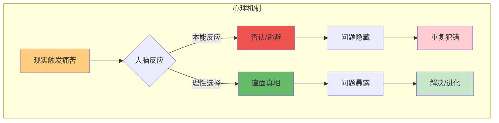
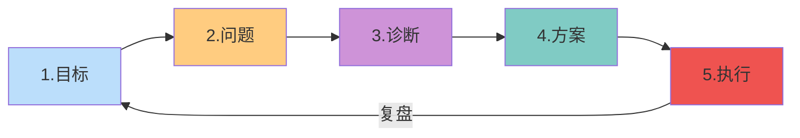
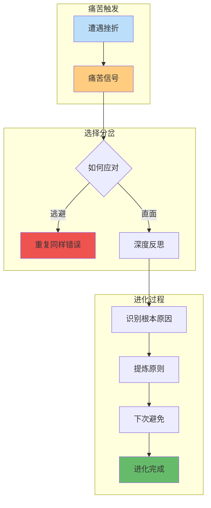

# 第2章 生活原则

## 章节定位

### 2.1 本章在全书中位置

```
《原则》三部分结构：
├── 第1章 我的历程（铺垫：达里奥如何形成这些原则）
├── 第2章 生活原则（核心：个人成长的系统性指导） ← 本章
└── 第3章 工作原则（延伸：组织管理的系统性指导）
```

**一句话定位**：
> 本章是全书的核心方法论——教你如何建立自己的人生系统，实现持续进化。

### 2.2 本章核心问题

| 问题 | 达里奥的答案 |
|------|-------------|
| 如何做出更好的人生决策？ | 建立原则，让原则替你决策 |
| 如何持续成长？ | 痛苦+反思=进化，五步流程循环 |
| 如何面对不确定性？ | 拥抱现实，尤其是痛苦的真相 |

### 2.3 章节关联

| 关联章节 | 关系 | 共同逻辑 |
|----------|------|----------|
| [[第1章-我的历程]] | 铺垫 | 达里奥如何从失败中提炼这些原则 |
| [[第3章-工作原则]] | 延伸 | 生活原则的组织化应用 |

---

## 核心观点一：拥抱现实

### 【表层】现象层

**达里奥的核心表述**：
> "拥抱现实，尤其是那些你不想要的真相。"

**生活场景**：
- 你的项目失败了 → 逃避原因 → 下次重复失败
- 你被批评了 → 否认问题 → 能力永远不提升
- 市场环境变了 → 固守旧方法 → 被时代淘汰

**错误态度 vs 正确态度**：

| 情境 | 错误态度 | 正确态度 |
|------|----------|----------|
| 面对批评 | "他不懂我" | "他说的是不是真的？" |
| 项目失败 | "运气不好" | "哪里出了问题？" |
| 投资亏损 | "市场错了" | "我的判断哪里错了？" |
| 能力短板 | "我不需要这个" | "这是我的弱点，需要补" |

### 【中层】机制层

**为什么拥抱现实这么难？**



**认知偏误障碍**：
1. **确认偏误**：只看支持自己观点的证据
2. **自利归因**：成功归自己，失败归环境
3. **沉没成本**：不愿承认过去的错误

### 【底层】规律层

> **拥抱现实定律**：你越早接受痛苦的真相，进化的成本越低。逃避真相的人，最终要支付更高的代价。

**降维翻译**：
> 真相不会因为你不喜欢而消失，
> 但会因为你的逃避而变得更糟。
> 与其让现实打你的脸，
> 不如主动面对它。

### 【当下连接】

|----------|----------|----------|
| 为什么我总在同一个坑里跌倒？ | 你没面对真相 | "原来是我自己在逃避" |
| 为什么别人进步比我快？ | 他们拥抱了你逃避的现实 | "差距在这里" |
| 如何快速成长？ | 每天问自己一个不想面对的问题 | "有方法了" |

---

## 核心观点二：五步流程

### 【表层】现象层

**达里奥的五步流程**：

```
1. 设定目标（Goals）     → 明确你要什么
2. 识别问题（Problems）  → 障碍是什么
3. 诊断根源（Diagnosis） → 为什么有这些障碍
4. 设计方案（Design）    → 找到解决路径
5. 执行复盘（Doing）     → 行动并持续改进
```

**案例：想升职**

| 步骤 | 具体内容 |
|------|----------|
| 1. 目标 | 3年内成为部门经理 |
| 2. 问题 | 缺乏管理经验、没有核心项目、人脉不足 |
| 3. 诊断 | 从未主动争取机会、技能树不完整、不敢表达 |
| 4. 方案 | 主动请缨带小项目、学习管理课程、建立跨部门人脉 |
| 5. 执行 | 每月复盘进度、调整策略、寻求反馈 |

### 【中层】机制层

**五步流程系统**：



**每一步的致命错误**：

| 步骤 | 最常见错误 | 正确做法 |
|------|------------|----------|
| 设定目标 | 目标太多/太模糊 | 一个最核心的目标 |
| 识别问题 | 否认问题的存在 | 诚实面对所有问题 |
| 诊断根源 | 只看表面原因 | 问5个"为什么" |
| 设计方案 | 只有一条路 | 至少设计3条路径 |
| 执行复盘 | 执行不力/不复盘 | 严格执行+每周复盘 |

**关键洞察**：
- 大多数人失败在第2步（不愿承认问题）和第5步（执行不力）
- 诊断比方案更重要——诊断错误，方案再好也没用
- 每一步都需要不同的思维方式

### 【底层】规律层

> **五步流程定律**：任何目标都可以通过这五步实现。跳过任何一步都会导致失败。这不是建议，这是系统。

**降维翻译**：
> 不要盲目行动，
> 先回答这5个问题：
> 要什么？障碍？根源？路径？行动？
> 一个一个回答完，
> 答案自然就出来了。

### 【当下连接】

|----------|----------|----------|
| 为什么我总是半途而废？ | 你可能跳过了某一步 | "原来有完整流程" |
| 为什么努力没有结果？ | 检查你在哪一步出问题 | "能定位问题了" |
| 如何实现大目标？ | 用五步流程拆解 | "大目标变可执行" |

---

## 核心观点三：痛苦+反思=进化

### 【表层】现象层

**达里奥的核心公式**：
> Pain + Reflection = Progress（痛苦 + 反思 = 进化）

**生活中的验证**：

| 痛苦来源 | 逃避者 | 反思者 |
|----------|--------|--------|
| 项目失败 | 怪环境，重复错误 | 复盘，建立原则 |
| 投资亏损 | 怪市场，不再投资 | 反思，改进策略 |
| 关系破裂 | 怪对方，模式重复 | 反思，升级沟通 |
| 身体问题 | 怪体质，继续透支 | 反思，改变习惯 |

**关键区别**：
- 只痛苦不反思 = 白疼
- 只反思不痛苦 = 纸上谈兵
- 痛苦+反思 = 进化

### 【中层】机制层

**进化机制**：



**反思的三个层次**：
1. **表层反思**：这件事我哪里做错了？
2. **中层反思**：为什么会犯这个错误？
3. **深层反思**：我的什么原则需要更新？

### 【底层】规律层

> **进化定律**：痛苦是进化的信号，反思是进化的转化器。没有痛苦的信号，你不知道要改什么；没有反思的转化，痛苦只是痛苦。

**降维翻译**：
> 痛苦是免费的课程，
> 反思是消化课程的过程。
> 你不反思，
> 痛苦就白疼了。

### 【当下连接】

|----------|----------|----------|
| 为什么我总犯同样的错？ | 你只痛苦没反思 | "原来缺了这一步" |
| 痛苦有什么意义？ | 痛苦是进化的入场券 | "痛苦有价值" |
| 如何加速成长？ | 把每次痛苦都变成原则 | "有方法了" |

---

## 金句库

### 原书金句

1. "拥抱现实，尤其是那些你不想要的真相。"
2. "痛苦 + 反思 = 进化"
3. "如果你不觉得一年前的自己是个傻瓜，那你这一年没怎么学习。"
4. "原则是你行动的根本法则。"
5. "真相不会因为你不喜欢而改变。"

### 降维金句

1. **拥抱现实**："真相不会因为你不喜欢而消失，但会因为你的逃避而变得更糟"
2. **五步流程**："不要盲目行动，先问自己5个问题：要什么？障碍？根源？路径？执行？"
3. **痛苦进化**："痛苦是免费的课程，反思是消化课程的过程"
4. **反思层次**："问'哪里错了'是表层，问'为什么错'是中层，问'原则怎么改'是深层"
5. **诊断重要性**："诊断比方案更重要——诊断错误，方案再好也没用"

## 问答设计

### Q1：五步流程和其他目标管理方法有什么区别？

**A**：核心区别在"诊断"这一步。

| 方法 | 侧重 |
|------|------|
| SMART目标 | 强调目标设定 |
| OKR | 强调目标对齐 |
| GTD | 强调执行管理 |
| **五步流程** | **强调问题诊断** |

达里奥认为：大多数人的问题不是不知道目标，而是不知道为什么做不到。诊断是关键。

### Q2：如果我不确定自己的目标怎么办？

**A**：从"识别问题"开始。

```
不确定目标 → 先识别你不想要的
不想要什么 → 反过来就是你想要的
想要什么 → 就是你的目标
```

**操作步骤**：
1. 列出你现在最不满意的3件事
2. 问：如果这些解决了，我会是什么状态？
3. 那个状态，就是你的目标方向

### Q3：如何做到"拥抱现实"而不崩溃？

**A**：分三步来：

| 阶段 | 做法 |
|------|------|
| 第一步 | 从小真相开始——承认一个无关紧要的错误 |
| 第二步 | 寻求反馈——问信任的人"我有什么问题" |
| 第三步 | 建立"真相优先"原则——任何决策前先确认事实 |

**关键心态**：
> 痛苦是暂时的，逃避的代价是持续的。
> 短痛胜过长痛。

### Q4：反思具体应该怎么做？

**A**：达里奥的反思模板：

```markdown
## [日期] 反思记录

### 发生了什么？
[客观描述事件]

### 我的感受是什么？
[诚实记录情绪]

### 根本原因是什么？
[问5个为什么]

### 我的原则需要更新吗？
[是/否，如何更新]

### 下次遇到类似情况怎么办？
[具体行动指南]
```

### Q5：五步流程可以用在哪些场景？

**A**：几乎所有需要实现目标的场景：

| 场景 | 应用 |
|------|------|
| 职业发展 | 升职/转行/创业 |
| 投资理财 | 制定投资策略 |
| 学习成长 | 掌握新技能 |
| 人际关系 | 改善沟通方式 |
| 健康管理 | 养成运动习惯 |

**核心**：任何"想要A但现在是B"的情况，都适用五步流程。

---
