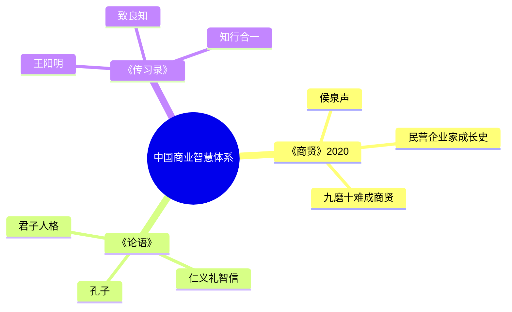

# 《商贤》拆解记录

## 这本书要解决什么问题？

**核心困境**：中国民营企业家如何从"逐利商人"蜕变为"商界圣贤"？如何在商海沉浮中完成人格成长和精神升华？

**一句话定位**：
> 商贤不是天生的，是"九磨十难"炼成的——财富是修行的道场，商海是灵魂的熔炉。

### 作者站在什么位置说这些话？

| 维度 | 定位 |
|------|------|
| 主领域 | 中国商业智慧 / 民营企业家成长 |
| 跨界领域 | 传统文化（儒佛思想）、商业管理、心理成长 |
| 作者背景 | 侯泉声，30年商战阅历民营企业家，"全国创业之星" |
| 文学地位 | 被誉为"商界《西游记》"、"中国版《钢铁是怎样炼成的》" |

### 和其他书有什么关系？

| 关联书籍 | 关联关系 | 共同底层逻辑 |
|----------|----------|--------------|
| [[富爸爸穷爸爸-清崎-拆解记录]] | 互补 | 清崎讲西方财富启蒙，侯泉声讲东方商道修行 |
| [[穷查理宝典-查理·芒格-拆解记录]] | 精神传承 | 芒格以"穷查理"致敬富兰克林，侯泉声以韦达人诠释东方商道 |
| [[纳瓦尔宝典-乔根森-拆解记录]] | 对立 | 纳瓦尔：财富=睡后收入；韦达人：财富=修行道场 |

### 知识网络图

---

## 作者的核心论点

### 九磨十难——商贤的炼成之路

韦达人的九重磨难：创业被骗（两万元血本无归）、鸭苗冻死（首批6000只雏鸭全部冻死）、龙卷风袭击、禽流感打击、家庭内讧、体制压抑、牢狱之灾、失子之痛、美国反倾销调查。

九次磨难，每一次都足以击垮普通人。但韦达人每次都站起来了。

> **商贤炼成定律**：商贤不是天生的，是"九磨十难"炼成的——每一次危机都是成长的契机，每一次挫折都是智慧的学费。

你不需要一帆风顺，你只需要在每次跌倒后爬起来。磨难不是惩罚，是礼物——它让你成为商贤。

这打碎了我对"成功"的假设。我一直以为成功是一帆风顺的结果，但韦达人告诉我：真正的成功是在九次跌倒后，第十次站起来。

### 以传统文化为魂——商道即人道

韦达人在商战中学习儒佛思想，实现心智的解脱、重构、升华。书名"商贤"两字：商=商业、商人、商道；贤=贤人、圣贤、德行。商贤=既有商业智慧，又有贤人德行的企业家。

| 传统智慧 | 商业应用 | 韦达人实践 |
|----------|----------|------------|
| 儒家仁义 | 君子喻于义 | 宁可破产，不让农户吃亏 |
| 佛家慈悲 | 敬天爱人 | 打造幸福企业，员工共同致富 |
| 道家无为 | 顺势借力 | 化解危机，借势发展 |

> **商道人道定律**：商道即人道——商业的终极成功不是财富积累，而是人格升华。

孔子说"君子喻于义"，韦达人在商战中践行——面对利益，先问"这样做对吗？"

下次遇到利益和道义的冲突，我不会再问"哪个更赚钱"，而是问"这样做对吗"。

### 从"动物的人"到"精神的人"——灵魂的复活

韦达人的人格蜕变：早期单纯、鲁莽、被骗、失败；中期骄傲、坠落、声色犬马；后期传统文化洗礼，完成灵魂复活。

书中描述："韦达人经过传统文化的洗礼，在情与欲、生与死、名与利的涅槃中，完成了一次良心发现，一次情感复活，一次道德的自我修为、自我完善和自我提升，最终从'动物的人'向'精神的人'转变。"

| 阶段 | 特征 | 关键事件 |
|------|------|----------|
| 动物的人 | 逐利、欲望、迷失 | 创业被骗、声色犬马 |
| 磨难洗礼 | 反思、学习、成长 | 九磨十难、接触国学 |
| 精神的人 | 义利统一、敬天爱人 | 成为商贤、回馈社会 |

> **灵魂复活定律**：商业成功不是终点，人格成长才是——从"动物的人"到"精神的人"，是商人真正的成功。

你不需要成为圣人，你只需要在赚了钱之后问自己："我是谁？我要成为什么样的人？"财富是工具，人格才是目的。

### 家国情怀——商人的责任担当

韦达人热心公益、真做慈善。宁愿企业破产，也不能让养鸭农户吃亏。宁愿舍弃一生累积财富，也要带领员工共同致富。在美国商务部反倾销听证会上慷慨陈词，为国争光。

美国反倾销一战：韦达人在听证会上一番慷慨激昂的讲话令美方颜面扫地，在全美掀起一股中国旋风，被众多外国政要称为"东方奇迹"。

| 责任层级 | 具体表现 | 韦达人实践 |
|----------|----------|------------|
| 个人 | 个人成功 | 摘取"亚洲鸭王"桂冠 |
| 员工 | 员工幸福 | 打造幸福企业，共同致富 |
| 行业 | 农户利益 | 宁可破产，不让农户吃亏 |
| 国家 | 为国争光 | 反倾销胜诉，东方奇迹 |

> **家国情怀定律**：真正的商贤，不仅为自己赚钱，更为员工谋福、为行业担当、为国家争光。

---

## 这本书的局限

| 批评点 | 谁在批评 | 怎么说 |
|--------|---------|--------|
| 文学性争议 | 文学评论者 | 作为小说，文学性可能不如专业作家作品 |
| 时代局限性 | 读者 | 书中描述的是1978-2020年的商业环境，2026年可能不同 |
| 个案代表性 | 学术评论 | 韦达人是理想化人物，不是所有民营企业家都能成为"商贤" |

**一句话总结局限性**：
> 商业环境会变，但商人的精神和人格不会变。这本书讲的是"道"，不是"术"。

---

## 最值得记住的话

**原书说的**：
1. "敬天爱人"——韦达人的人生哲学
2. "断剑重铸"——面对挫折的态度
3. "九磨十难"——商贤炼成的必经之路
4. "宁可企业破产，也不能让养鸭农户吃亏"
5. "菩萨般的心灵，钢铁般的意志"

**翻译成人话**：
1. 商贤不是天生的，是九磨十难炼成的
2. 你不需要一帆风顺，你只需要每次跌倒后爬起来
3. 敬天爱人——这是商人最好的风水
4. 赚钱和做人不矛盾，义利可以统一
5. 财富是工具，人格才是目的
6. 商人的最高境界：为国争光，东方奇迹

---

## 讲给没读过的人听

你知道什么是"商贤"吗？

商贤=商人+贤人。既有商业智慧，又有贤人德行。

韦达人是中国民营企业家的缩影。他经历过九次足以击垮普通人的磨难：被骗、鸭苗冻死、龙卷风、禽流感、家庭内讧、牢狱之灾、失子之痛、美国反倾销调查……

但他每次都站起来了。他说："磨难不是惩罚，是礼物——它让你成为商贤。"

他从"动物的人"变成"精神的人"——早期逐利、欲望、迷失，后期义利统一、敬天爱人。

他宁可企业破产，也不让养鸭农户吃亏。他宁愿舍弃一生累积财富，也要带领员工共同致富。他在美国反倾销听证会上慷慨陈词，为国争光。

这就是东方商道：财富是修行的道场，商海是灵魂的熔炉。

---

## 用来检验理解的问题

**基础回忆**：
1. Q: 什么是"九磨十难"？
   A: 韦达人经历的九次重大挫折：被骗、鸭苗冻死、龙卷风、禽流感、家庭内讧、体制压抑、牢狱之灾、失子之痛、反倾销调查。

2. Q: "商贤"两字的含义是什么？
   A: 商=商业、商人、商道；贤=贤人、圣贤、德行。商贤=既有商业智慧，又有贤人德行的企业家。

**理解验证**：
1. Q: 为什么说"商道即人道"？
   A: 商业的终极成功不是财富积累，而是人格升华。传统文化是商人的精神根基。

2. Q: 韦达人和传统商人的区别是什么？
   A: 传统商人逐利，韦达人义利统一。他宁可破产也不让农户吃亏，用"敬天爱人"诠释东方商道。

---

## 和其他书的对话

清崎教你什么是资产，侯泉声教你什么是商贤。清崎是财富启蒙，侯泉声是精神升华。两者结合，财富人格双丰收。

孔子在《论语》中说"君子喻于义"，韦达人在《商贤》中践行。儒家仁义思想在商业中的实践：面对利益，先问"这样做对吗？"

王阳明说"致良知"，韦达人在商战中实现。外在的磨难是镜子，照出内在的良知。九磨十难唤醒了韦达人的良知。

纳瓦尔说财富=睡后收入，韦达人说财富=修行道场。两种财富观：一个追求财务自由，一个追求人格升华。

---

*拆解日期：2026-02-14*
*下次回访：1周后回顾「讲给没读过的人听」和「检验问题」*