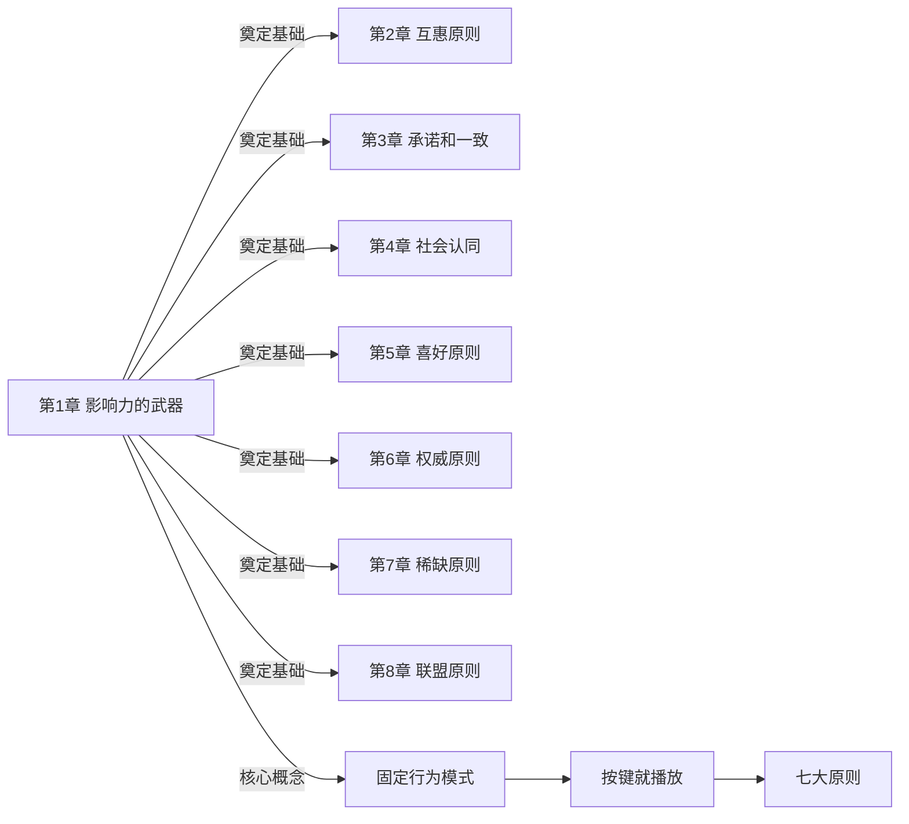
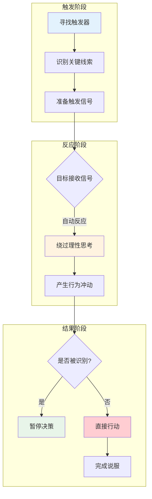
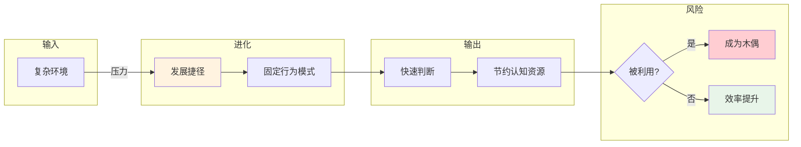
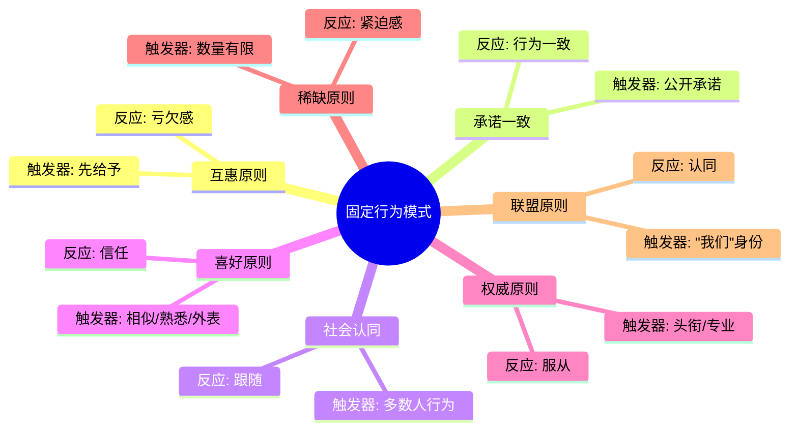

# 第1章 影响力的武器

## 📍 章节定位

### 全书位置

**核心问题**：为什么有些人能够"说服"别人，而大多数人只能"请求"？

**章节回答的问题**：人类大脑中存在哪些"自动反应"的开关？一旦被触发，就会不假思索地答应别人？

**一句话总结**：本书的开篇，西奥迪尼用"固定行为模式"揭示了说服的本质——找到那个能触发响应的"开关"，然后"按一下就播放"。

**在本书结构中的角色**：**理论奠基**——为后面七大原则提供底层逻辑框架。

### 章节核心概念

**固定行为模式（Fixed Action Patterns）**：
- 自然界中动物按特定线索触发固定行为
- 人类虽复杂，但同样存在大量"按一下就播放"的自动化反应
- 这些模式是千百年进化形成的"心理捷径"

---

## 🎯 核心观点：三层提取

### 第一层：表层案例——自然界和人类的"自动播放"

#### 案例1：雌火鸡的"咕咕"声
- **现象**：雌火鸡只关心"叽叽"叫声，不关心幼崽是否真的健康
- **机制**：只要听到"叽叽"声，就会触发母性行为；没有这个声音，即使看到幼崽也會攻击
- **启示**：动物靠单一线索行动，人类也类似

#### 案例2：雄性知更鸟的"红色胸羽"
- **实验**：在雄性知更鸟领地放红色胸羽，即使没有真正的"敌人"，它也会发起攻击
- **机制**：红色=领地威胁的固定线索，触发战斗反应
- **启示**：一个特征就能触发复杂行为

#### 案例3：人类购物行为
- **场景**：原价1000，现价500，"再不买就亏了"
- **机制**：大脑自动把"高价"锚定为价值参照，看到"优惠"就兴奋
- **数据**：限时折扣的转化率通常是正常价格的2-3倍

#### 案例4：酒店的"小费"
- **场景**：服务员把小费账单和找零一起递给客人
- **机制**：账单金额成为"参考价格"，客人倾向于留下整数找零作为小费
- **结果**：传统方式小费约15%，新方式小费约23%

#### 案例5：房地产销售策略
- **场景**：先把客户带看高价房，再看目标房源
- **机制**：高价房锚定客户的心理价位，目标房源显得"划算"
- **数据**：这种"对比效应"能让成交率提升30%以上

---

### 第二层：心理机制——为什么我们会"不假思索"

#### 机制1：认知效率的进化逻辑
```
复杂环境 → 进化出"快速判断"能力 → 节约认知资源 → 形成自动反应
```

**为什么人类需要捷径？**
1. **生存压力**：远古时代需要快速判断食物、威胁、伴侣
2. **信息过载**：现代信息量远超大脑处理能力
3. **能量节省**：理性思考极其耗能，自动反应更节能

#### 机制2：捷径的两面性
```
正确使用捷径 → 效率爆表（快速决策、节约时间）
被他人操控捷径 → 成为提线木偶（被利用而不自知）
```

**西奥迪尼的核心洞察**：
> 捷径不是bug，是人类进化的伟大成就。但问题是——有人正在利用这些捷径来操控你。

#### 机制3：触发响应的"按钮"
```
刺激信号（Trigger） → 自动反应（Response） → 不经大脑思考
```

**常见"按钮"类型**：
| 按钮类型 | 触发信号 | 自动反应 |
|---------|---------|---------|
| 价格锚定 | 高价参照 | "捡便宜"心理 |
| 社会认同 | 多数人行为 | 跟随 |
| 权威暗示 | 头衔/专业 | 服从 |
| 稀缺信号 | 数量有限 | 紧迫感 |
| 承诺表达 | 公开声明 | 行为一致 |

---

### 第三层：底层规律——影响力运作的永恒法则

#### 规律1：模式是进化给的，不是你想改就能改
- 人类进化出固定行为模式是为了生存，不是为了让你"理性"
- 这些模式根植于大脑深层结构，绕过理性思考
- 意识到不等于能控制——这是"系统1"的领地

#### 规律2：谁掌握触发器，谁就掌握了主动权
- 生活中充满了"按钮"，但大部分人不知道按钮在哪
- 说服高手不是"请求"你，而是"触发"你
- 军事上：特种部队寻找"节点"；说服中：高手寻找"触发点"

#### 规律3：自动化反应=可预测=可利用
- 既然人类行为有模式，就能被预测
- 既然能被预测，就能被设计
- **关键问题**：你愿意被操控，还是学会识别？

#### 规律4：影响力是杠杆，放大微小信号
- 一个微小的信号（价格标签、排队人数、专家头衔）
- 触发一个自动反应（购买、跟随、服从）
- 结果可能是巨大的行为改变（消费决策、人生选择）
- **这就是"影响力的武器"**——用微小代价撬动巨大行为

---

## 💬 降维翻译

### 原文核心

> "在很多情况下，只要能从认知世界的进化过程中找到一些关键点，我们就能获得巨大的成果。"
> —— 西奥迪尼

### 中学生能懂的版本

人和动物一样，大脑里有很多"快捷方式"。比如你看到"打折"两个字，钱包就自动打开了；看到很多人排队，你就会想去看看卖什么。这些"快捷方式"帮我们省了很多脑细胞，但是也被很多人利用来让我们花钱、听话。

### 奶奶能懂的版本

人呢，都有毛病，就是不爱动脑子。骗子就利用你这个毛病，先给你下个套：比如"最后3个"、"专家推荐"、 "大家都买"，你一听就上钩了。其实你静下来想想，这些话术都是骗人的，但是当时大脑不转了呀，就自动上当了。

---

## ✨ 金句库

### 原书金句

1. "固定行为模式包括一系列复杂的行为，但触发它只需要一个简单的线索。"
2. "雌火鸡听到'叽叽'声就会表现出母性行为，即使那只是一只臭鼬玩具。"
3. "认知效率的进化让我们找到了生存的捷径，但这些捷径也让我们变得可预测。"
4. "在很多情况下，人类的行为就像动物一样，可以被简单的线索所触发。"
5. "影响力本质上是一种杠杆——用微小的信号，撬动巨大的行为改变。"

### 降维金句

1. "人脑里有'自动驾驶'模式，说服就是找到正确的'启动键'。"
2. "捷径是进化给的，你想改？先问问你的基因答不答应。"
3. "不是你不明白，是敌人太奸——他们知道你的按钮在哪。"
4. "一个'便宜'就能让你下单，资本家看了都流泪。"
5. "99%的决定都是'自动驾驶'做的，只有1%是你以为的'理性思考'。"

## 🔗 当下映射：现实应用

### 💰 财富/营销场景

| 场景 | 触发器 | 自动化反应 | 经典案例 |
|------|--------|-----------|---------|
| 双11购物 | "限时特价"、"已售10万+" | 紧迫感+从众 | 熬夜抢单、冲动消费 |
| 奢侈品定价 | 高价锚定 | "贵=好"心理 | 奢侈品展厅先看高价款 |
| 直播间话术 | "321上链接"、"仅剩50单" | 紧迫感+损失厌恶 | 弹幕刷屏、秒空 |
| 会员续费 | "免费试用3天" | 互惠+损失厌恶 | 忘记取消、自动扣费 |
| 理财产品 | "历史收益XX%" | 锚定收益、忽视风险 | 银行理财经理推销 |

### 💼 职场场景

| 场景 | 触发器 | 自动化反应 | 应对建议 |
|------|--------|-----------|---------|
| 面试 | "我们团队都是名校出身" | 权威暗示 | 看清楚是氛围还是能力 |
| 谈薪资 | "这个岗位预算有限" | 锚定效应 | 先说数字，别被引导 |
| 汇报 | "老板，这个方案业界都在用" | 社会认同 | 问"谁在用"而非"多少人用" |
| 跨部门协作 | "李总也同意了这个方案" | 权威+社会认同 | 核实李总是否真的同意 |
| 拒绝需求 | "这个需求很简单" | 低估难度 | 请对方详细说明 |

### 🏠 生活场景

| 场景 | 触发器 | 自动化反应 | 破解方法 |
|------|--------|-----------|---------|
| 直播带货 | "家人们，上车！" | 群体狂热 | 冷静3秒再决定 |
| 朋友圈微商 | "好评如潮"、"断货" | 社会认同+稀缺 | 查真实销量 |
| 租房买房 | 中介说"这套很多人看中了" | 紧迫感+从众 | 多看多比较 |
| 健身卡推销 | "今天最后一天优惠" | 稀缺+紧迫感 | 设定冷静期 |
| 点外卖 | "好评返现" | 互惠 | 按真实体验评价 |

### 72小时行动计划

1. **今天**：记录3次你"不假思索"做决定的情况，识别是什么触发了你
2. **本周**：在重要决策前，强制自己暂停10秒，问"这是我要的还是被影响的？"
3. **本月**：观察身边至少5个"影响力武器"的案例，记录触发器和效果

---

## 🕸️ 章节关联

### 与前后章节的关系



**承接关系**：
- 第1章：介绍"为什么可以被影响"（理论基础）
- 第2-8章：展示"怎么被影响"的具体手段（应用层面）
- **第1章是全书的"总纲"**，后面7章都是"固定行为模式"的具体案例

### 与整书的关系

**核心地位**：第1章建立了全书的核心框架
- "固定行为模式" = 底层机制
- 七大原则 = 7种具体触发器
- 全书 = "如何找到按钮"+"如何按下按钮"

**一句话概括**：
> 第1章告诉你"为什么"，第2-8章告诉你"怎么做"。

### 跨书关联

| 书籍 | 关联点 |
|------|--------|
| 《思考快与慢》 | 系统1的自动反应，绕过理性思考 |
| 《助推》 | 默认选项设计，利用自动选择 |
| 《穷查理宝典》 | "芒格"的人类误判心理学 |
| 《乌合之众》 | 群体中的自动反应更强 |
| 《系统之美》 | 系统思维与反馈回路 |

---

## ❓ 问答设计：认知层次递进

### 第一层：记忆（基础认知）

1. **什么是固定行为模式？**
   - 进化形成的自动反应机制，由特定线索触发

2. **雌火鸡实验说明了什么？**
   - 单一线索（声音）可以触发复杂行为（母性行为）

3. **人类有哪些常见的固定行为模式？**
   - 价格锚定、从众、权威服从、稀缺抢购等

### 第二层：理解（概念消化）

4. **为什么人类需要固定行为模式？**
   - 生存压力、信息过载、认知节能三大原因

5. **固定行为模式有什么两面性？**
   - 正确使用提高效率，被利用则成为木偶

6. **"按钮-反应"模式在生活中有哪些例子？**
   - 打折→购买、排队→跟随、专家→相信

### 第三层：分析（机制拆解）

7. **为什么一个微小的信号能触发巨大的行为改变？**
   - 捷径绕过了理性评估，直接触发情感反应

8. **说服高手和普通人的区别是什么？**
   - 高手找"按钮"，常人"请求"

9. **如何识别自己正在被"触发"？**
   - 问自己：没有这个信号，我还会这样做吗？

### 第四层：应用（实践转化）

10. **如何把"固定行为模式"应用到销售中？**
    - 找到目标人群的"按钮"（价格/权威/稀缺等）

11. **在谈判中如何利用锚定效应？**
    - 先报价，把谈判范围"锚定"在有利区间

12. **直播电商的核心逻辑是什么？**
    - 稀缺（限量）+紧迫（倒计时）+从众（销量）

### 第五层：评估（批判思考）

13. **固定行为模式能否被完全克服？**
    - 几乎不可能，这是进化的产物；但可以识别和暂停

14. **是应该利用这些模式，还是应该防御？**
    - 理解是防御的第一步；了解机制才能避免被操控

15. **在什么情况下，"自动化反应"反而是好事？**
    - 紧急避险、经验判断、情感交流等需要快速响应的场景

---

## 📊 可视化总结

### 影响力武器运作模型



### 固定行为模式的进化逻辑



### 七大原则与固定行为模式的关系



---

## 🛡️ 防御策略

### 三步识别法

**Step 1：暂停**
- 任何让你"立即决定"的信号都是警告
- 心里默念10秒，让系统2介入

**Step 2：追问**
- 问自己：没有这个信号，我会怎么选？
- 问对方：这个和别的选择有什么区别？

**Step 3：验证**
- 查数据：销量是真的吗？评价是真的吗？
- 问第三人：旁观者清

### 核心心态

> "我不是被说服的，我只是被触发的。"
> 认识到这一点，就是防御的开始。

---

## 📌 本章要点速记

| 概念 | 一句话 |
|------|--------|
| 固定行为模式 | 按一下就播放的自动反应 |
| 触发器 | 启动自动反应的单一线索 |
| 捷径两面性 | 效率来源or被操控入口 |
| 影响力本质 | 用微小信号撬动巨大行为 |
| 防御核心 | 暂停→追问→验证 |

---

## 🔖 延伸思考

1. **AI时代**：当AI比你自己更懂你的偏好，推荐算法是否成了新的"触发器"？
2. **伦理边界**：利用固定行为模式是营销智慧还是认知操控？
3. **自我认知**：你最容易被哪种"按钮"触发？自我了解是防御的第一步。
4. **教育意义**：是否应该从小教育孩子识别这些"心理捷径"？

---

*创建日期：2026-02-26*
*整书拆解：[[影响力-西奥迪尼-拆解记录]]*
*章节导航：[[影响力-章节拆解/_导航]]*