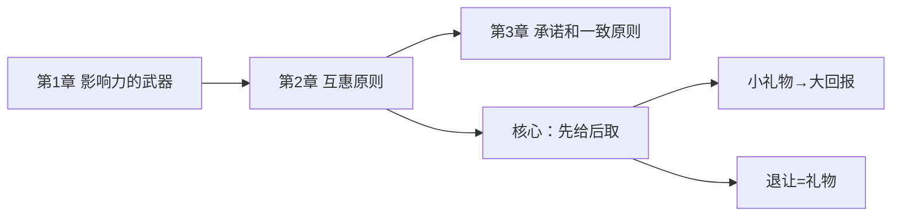
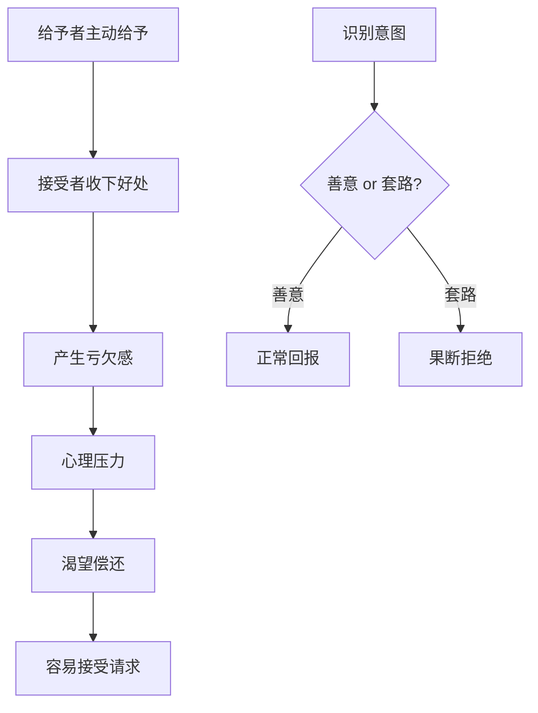
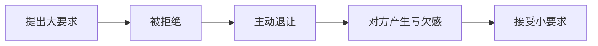

# 第2章 互惠原则

## 📍 章节定位

**在全书中回答的问题**：为什么我们总觉得欠别人的，一定要还？

**一句话总结**：人类社会最基本的交换规则，被说服者利用后变成强大的影响力武器。

**核心概念**：互惠原理（Reciprocity）—— 先给予，再索取。

---

## 🎯 核心观点：三层提取

### 第一层：经典案例

#### 案例1：克利须那协会的"先赠后求"
- **场景**：机场里，协会成员强行塞给路人一朵花
- **结果**：路人收下花后，几乎无法拒绝捐款请求
- **机制**：小礼物创造亏欠感，让你不好意思拒绝

#### 案例2：安利的"免费试用"
- **场景**：安利给潜在客户免费试用套装
- **数据**：销量大幅提升
- **机制**：试用=欠人情，买产品=还人情

#### 案例3：政治家的"人情债"
- **场景**：议员之间互相帮忙投票
- **结果**：即使立场对立，也会投桃报李
- **机制**：政治是人情市场，欠的迟早要还

#### 案例4：水门事件的荒谬决策
- **场景**：为什么共和党高层批准了一个明显愚蠢的窃听计划？
- **原因**：提出者Gordon Liddy之前主动把预算从100万降到25万
- **机制**：拒绝-退让策略，他的"退让"让对方觉得欠他人情

---

### 第二层：心理机制

#### 机制1：亏欠感的心理压力
```
收到好处 → 产生亏欠感 → 心理不舒服 → 渴望"还债" → 容易被操控
```

**为什么亏欠感如此强大？**
1. **社会规训**：从小被教育"欠债还钱，天经地义"
2. **信任基础**：互惠是人类合作的基石，违反者会被群体排斥
3. **心理负担**：亏欠感像块石头压在心头，不还就难受

#### 机制2：不平等交换的必然性
- 给予者可以控制"给予"的内容和时机
- 接受者往往要付出更大的代价来"偿还"
- 一朵花的价值 < 捐款的金额

#### 机制3：拒绝-退让策略
```
提出大要求 → 被拒绝 → 主动退让 → 对方觉得欠你人情 → 接受小要求
```

**关键洞察**：
- 不是要求变小了，而是"退让"本身成了礼物
- 你拒绝了我的大要求，我让步了，你欠我的

---

### 第三层：底层规律

#### 规律1：互惠是文明的基石
- 没有互惠，人类无法合作
- 社会建立在"你帮我，我帮你"的基础上
- 这个本能如此根深蒂固，以至于我们可以被利用

#### 规律2：给予者永远占主动
- 谁先给，谁就掌握了主动权
- 给予可以是物质的（礼物），也可以是心理的（让步）
- 主动示好的人，往往能获得超额回报

#### 规律3：文化差异很小
- 互惠原理在所有人类社会中都存在
- 不同文化可能表达方式不同，但核心机制一样
- 这是人类的"出厂设置"

---

## 💬 降维翻译

### 原文核心
> "我们应当尽量以类似的方式报答他人为我们所做的一切。"

### 中学生能懂的版本
别人给了你好处，你就会觉得自己欠他的，想找机会还。骗子就是利用这个心理，先给你点小恩小惠，然后让你掏大钱。

### 奶奶能懂的版本
你帮我一把，我帮你一把，这是做人最基本的道理。但是有些人坏得很，故意帮你一点小事，然后让你帮他大忙。记住，天上不会掉馅饼。

---

## ✨ 金句库

### 原书金句
1. "互惠原理让接受者产生了亏欠感，这种感觉让人很不舒服，只有偿还之后才能消除。"
2. "即使是一个我们不喜欢的、不认识的、不值得信任的人，只要他先给了我们好处，我们就会觉得欠他的。"
3. "拒绝-退让策略之所以有效，是因为退让本身被当作了一种礼物。"

### 降维金句
1. "人情债比高利贷还难还。"
2. "免费的东西最贵。"
3. "他退了一步，不是他善良，是他想让你也退一步。"

## 🔗 当下映射：现实应用

### 营销场景

| 策略 | 形式 | 心理机制 |
|------|------|----------|
| 免费试用 | 7天免费会员 | 试用期满，你已产生亏欠感 |
| 小样赠送 | 化妆品小样、食品试吃 | 小恩惠撬动大消费 |
| 先提供服务 | 免费咨询、免费诊断 | 你不好意思白嫖 |
| 会员特权 | 先给你体验VIP | 体验过就不想失去 |
| 销售让步 | "我去申请下折扣" | 让步=礼物，你欠他 |

### 职场场景

| 场景 | 行为 | 应对 |
|------|------|------|
| 同事帮忙 | 主动帮你做PPT | 留意他会不会提要求 |
| 领导关心 | 请你吃饭、嘘寒问暖 | 可能期待你站队 |
| 客户示好 | 送礼、请客 | 公私分明，有记录 |
| 竞争对手 | 主动分享信息 | 可能在套取情报 |

### 生活场景

| 场景 | 陷阱 | 破解 |
|------|------|------|
| 朋友圈 | 陌生人点赞评论后推销 | 识别目的性社交 |
| 乞丐乞讨 | 先给你塞东西 | 果断退还 |
| 亲戚借钱 | 以前帮过你 | 帮忙是帮忙，借贷是借贷 |
| 社交应酬 | 频繁请客 | 轮流买单，保持平衡 |

---

## 🕸️ 章节关联

### 与前后章节的关系



**承接关系**：
- 第1章介绍"固定行为模式"，互惠就是最典型的固定模式
- 互惠创造了承诺的机会（第3章）

**互补关系**：
- 互惠：欠别人的
- 承诺一致：欠自己的
- 两者结合，说服力倍增

### 与整书的关系
- 互惠是七大原则中最基础的
- 其他原则往往和互惠组合使用
- 理解互惠，才能理解说服的底层逻辑

### 跨书关联

| 书籍 | 关联点 |
|------|--------|
| 《助推》 | 默认选项设计，利用互惠心理 |
| 《思考快与慢》 | 系统1的自动反应，不假思索 |
| 《穷查理宝典》 | 芒格的"回馈倾向"人类误判心理 |
| 《乌合之众》 | 群体中的互惠强化 |

---

## ❓ 问答设计：认知层次递进

### 第一层：理解
1. **什么是互惠原理？**
   - 收到好处后，觉得有义务回报的心理机制

2. **为什么互惠原理如此强大？**
   - 它是人类社会合作的基石，违反者会被群体排斥

### 第二层：分析
3. **互惠原理和普通交换有什么区别？**
   - 普通交换是自愿的、对等的
   - 互惠是被动的、往往不对等

4. **"拒绝-退让"为什么有效？**
   - 退让被当作礼物，接受者产生亏欠感
   - 不是要求变小了，是"让步"本身值钱

### 第三层：应用
5. **如何识别别人在利用互惠原理操控你？**
   - 问自己：如果他没有给我这个好处，我还会答应吗？
   - 区分善意礼物和有目的的"诱饵"

6. **商家常用的互惠策略有哪些？**
   - 免费试用、小样赠送、先服务后收费、会员体验

### 第四层：防御
7. **如何防御互惠原理被滥用？**
   - 识别意图：是善意还是套路？
   - 果断拒绝不想要的好处
   - 把"礼物"和"请求"分开看

8. **如果已经接受了好处，如何避免被操控？**
   - 承认亏欠感，但评估回报的合理性
   - 可以用感谢代替实质性回报
   - 把人情和交易分开

### 第五层：反思
9. **互惠原理本身是好是坏？**
   - 它是人类合作的基石，本身是好的
   - 被利用时才是坏的
   - 关键是识别意图

10. **在什么情况下，互惠原理会失效？**
    - 接受者识别出对方的目的
    - 给予的东西没有价值
    - 社会文化背景差异巨大

---

## 🎭 拒绝-退让策略详解

### 策略结构
```
第一步：提出一个你预期会被拒绝的大要求
第二步：对方拒绝
第三步：你主动退让，提出真实的小要求
第四步：对方因为你的"让步"而接受小要求
```

### 为什么有效？
1. **让步=礼物**：你的退让被视为一种馈赠
2. **社会契约**：我让了一步，你也该让一步
3. **心理对比**：小要求和大要求相比，显得不那么过分

### 经典实验
- 实验者请求：带少年犯去动物园一日游（大要求）
- 被拒绝后：至少做个两周的大哥哥？（小要求）
- 结果：小要求接受率从17%提升到50%

### 现实应用
| 场景 | 大要求 | 真实小要求 |
|------|--------|-----------|
| 销售赊账 | 全款 | 分期付款 |
| 借钱 | 借1万 | 借1000 |
| 谈判 | 涨薪50% | 涨薪20% |
| 邀约 | 全程参与 | 来看一下 |

---

## 🛡️ 防御策略

### 三步防御法

**Step 1：识别**
- 问自己：他为什么给我这个好处？
- 判断：是善意还是有目的？

**Step 2：重新定义**
- 把"礼物"重新定义为"销售工具"
- 心理上把它和后续请求分开

**Step 3：果断行动**
- 如果是套路，果断拒绝后续请求
- 如果已经接受，可以用感谢代替实质性回报

### 关键心态
> "我接受你的善意，但不代表我欠你的。真正的善意不求回报。"

---

## 📊 可视化总结

### 互惠原理运作流程



### 拒绝-退让策略流程



---

## 📌 本章要点速记

| 概念 | 一句话 |
|------|--------|
| 互惠原理 | 先给后取，欠债必还 |
| 亏欠感 | 收到好处后的心理压力 |
| 拒绝-退让 | 让步本身是礼物 |
| 防御核心 | 区分善意与套路 |

---

## 🔖 延伸思考

1. **互惠与道德**：互惠原理是否意味着"没有无缘无故的爱"？
2. **文化差异**：中国的人情往来和西方的互惠有何异同？
3. **商业伦理**：免费试用是营销智慧还是道德绑架？
4. **反向应用**：如何用互惠原理建立良好的长期关系？

---

*创建日期：2026-02-26*
*整书拆解：[[影响力-西奥迪尼-拆解记录]]*
*章节导航：[[影响力-章节拆解/_导航]]*
