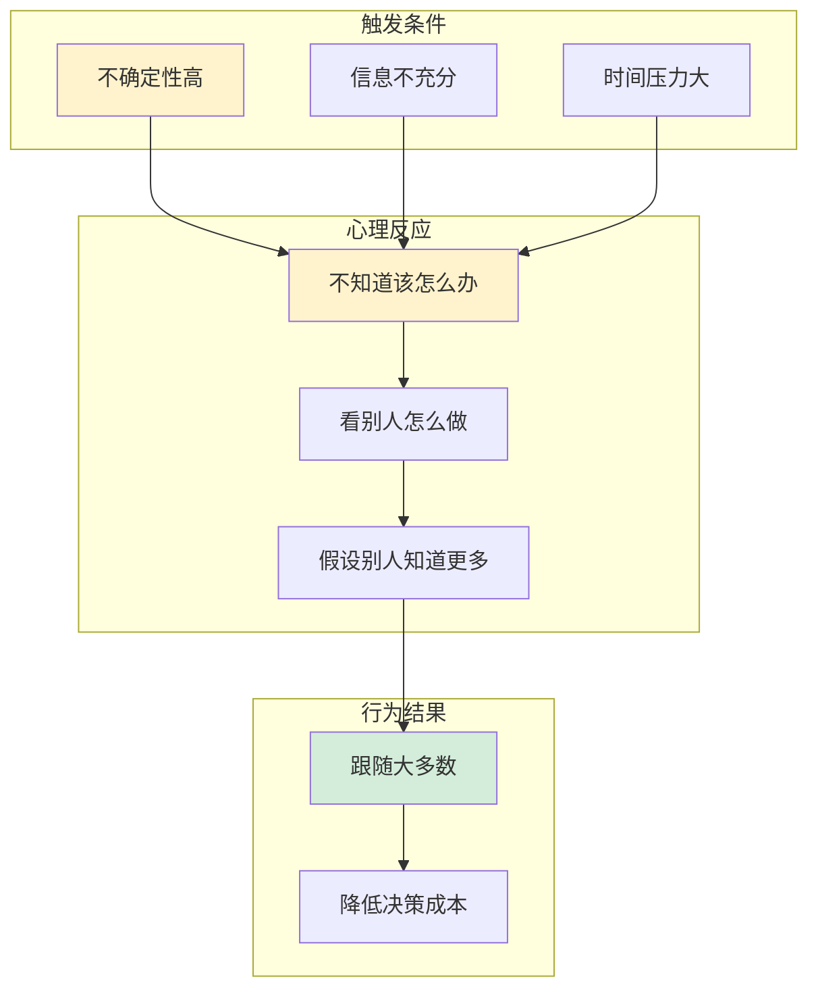
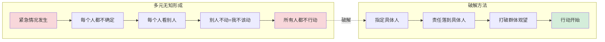
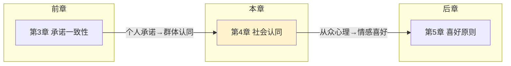
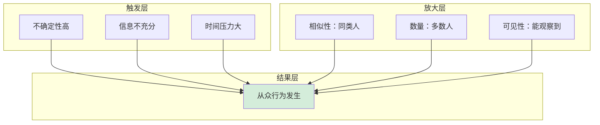

# 第4章 社会认同原则

## 📍 章节定位

### 在全书中回答的问题

> **"为什么'大家都在做'比'你应该做'更有说服力？"**

| 维度 | 定位 |
|------|------|
| 在全书中的位置 | 七大原则中的第三大原则 |
| 解决的核心问题 | 从众心理如何被利用来影响他人 |
| 适用的典型场景 | 不确定环境、信息不充分、需要快速决策时 |
| 与其他章节的关系 | 上承"承诺一致性"（个人→群体），下启"喜好原则"（认同→情感） |

### 核心公式

```
社会认同效力 = 不确定性 × 相似性 × 数量
```

---

## 🎯 核心观点（三层提取）

### 观点1：从众本能——不确定时看别人

#### 【表层】现象层

**经典实验：街头抬头实验**
- 1人抬头看天空 → 4%路人停下
- 5人抬头看天空 → 18%路人停下  
- 15人抬头看天空 → 40%路人停下

**电梯实验**
- 实验演员故意背对电梯门站立
- 被试者在不明情况下，也逐渐跟着背对门站
- 即使这看起来很荒谬

**阿希从众实验（经典）**
- 7名演员+1名真被试者
- 演员故意说出明显错误的答案
- 75%的被试者至少跟随过一次错误答案
- 结论：9个人说错，你也很可能会跟着说错

#### 【中层】机制层



**为什么从众？三个底层逻辑：**

| 逻辑 | 解释 | 进化意义 |
|------|------|----------|
| 效率逻辑 | 别人已经帮我想过了 | 节省认知资源 |
| 安全逻辑 | 大多数人不会错 | 避免成为"异类" |
| 社交逻辑 | 跟随群体才能融入 | 群体归属感 |

#### 【底层】规律层

> **从众定律**：当人们对某个情况不确定时，会参考他人的行为来判断什么是正确的。这是一种认知捷径，帮助我们在信息不足时快速决策。

**降维翻译**：
> 你不需要证明自己是对的，
> 你只需要让更多人"已经相信"了，
> 从众效应会自然带他们来。
> 
> **"大家都在做"比"你应该做"更有说服力。**

---

### 观点2：不确定性放大——越不确定越从众

#### 【表层】现象层

**基蒂·吉诺维斯悲剧（多元无知案例）**
- 1964年纽约，一女子在公寓楼下被刺杀
- 38名目击者，无人报警
- 媒体报道：纽约人冷漠无情
- **真实原因**：每个人都看到别人没动，以为别人知道"这不是大事"

**旁观者效应的真相**：
- 不是人们冷漠
- 而是"多元无知"：每个人都看别人，没人行动
- 结果：所有人都不行动

**如何破解？指定具体人**：
- 错误："谁来帮帮我！"
- 正确："穿蓝衣服的你，帮我报警！"
- 原理：打破多元无知，让责任具体化

#### 【中层】机制层



**不确定性放大的三个条件：**

| 条件 | 说明 | 案例 |
|------|------|------|
| 情况模糊 | 不知道是否紧急 | 街头有人倒地，是醉酒还是发病？ |
| 缺乏专业知识 | 不知道如何判断 | 医疗紧急情况、技术故障 |
| 陌生人环境 | 没有熟人可参考 | 旅游景点、地铁车厢 |

#### 【底层】规律层

> **多元无知定律**：在不确定的紧急情况下，每个人都会观察他人的反应来判断严重程度。如果所有人都不行动，就会形成"这应该不是大事"的错误共识。

**降维翻译**：
> 紧急时刻，不要喊"谁来帮忙"，
> 要喊"穿红衣服的你，打120！"
> 
> 责任一旦具体化，人就会行动。

---

### 观点3：相似性增强——像自己的人更有说服力

#### 【表层】现象层

**广告实验**
- 青少年看到同龄人代言 → 更可能购买
- 看到成年人代言 → 影响力大幅下降
- 结论：同年龄段代言人的说服力远高于"权威人士"

**募捐实验**
- 听说捐赠者与自己背景相似 → 捐款意愿提升
- 听说捐赠者是"有钱人/名人" → 影响力反而降低
- 结论："像我的人在捐"比"有钱人在捐"更有力

**恐怖袭击报道效应**
- 本地发生恐袭 → 行为改变明显
- 国外发生恐袭 → 行为改变较小
- 结论：地理和心理距离越近，社会认同效应越强

#### 【中层】机制层

```mermaid
flowchart TD
    subgraph 相似性来源
        A[年龄相似]
        B[职业相似]
        C[背景相似]
        D[兴趣相似]
        E[地域相似]
    end

    subgraph 心理反应
        F[他是"自己人"] --> G[他懂我的处境]
        G --> H[他的选择适合我]
    end

    subgraph 行为结果
        H --> I[更愿意跟随]
        I --> J[说服效力↑↑]
    end

    A --> F
    B --> F
    C --> F
    D --> F
    E --> F

    style F fill:#cce5ff
    style J fill:#d4edda
```

**相似性 vs 数量：哪个更重要？**

| 因素 | 重要性 | 适用场景 |
|------|--------|----------|
| 相似性 | ⭐⭐⭐⭐⭐ | 决策涉及个人偏好、价值观 |
| 数量 | ⭐⭐⭐⭐ | 决策涉及安全、标准化产品 |
| 组合使用 | ⭐⭐⭐⭐⭐ | 最强说服力 |

#### 【底层】规律层

> **相似性定律**：社会认同的影响力与行为者的相似程度成正比。我们更愿意跟随"像我们"的人，而不是"比我们强"的人。

**降维翻译**：
> 1个同类用户的好评，
> 胜过10个专家的推荐。
> 
> 人更信"同类"，不信"权威"。

---

### 观点4：维特效应——模仿的阴暗面

#### 【表层】现象层

**命名来源**：
- 歌德小说《少年维特之烦恼》出版后
- 欧洲出现模仿维特自杀的风潮
- 部分国家甚至禁止该书

**实证研究**：
- 自杀事件被大篇幅报道后
- 当地自杀率显著上升
- 死亡人数与报道篇幅正相关

**交通意外数据**：
- 自杀新闻报道后
- 涉及单辆车的"意外事故"增加
- 很多"意外"实为模仿自杀

#### 【中层】机制层

```mermaid
flowchart LR
    A[自杀报道] --> B[形成"解决方案"模板]
    B --> C[心理脆弱者获得"方法"]
    C --> D[模仿行为发生]
    D --> E[更多类似案例]

    subgraph 传播路径
        F[媒体报道] --> G[公众关注]
        G --> H[社会认同形成]
        H --> I[边缘人群被影响]
    end

    style A fill:#f8d7da
    style E fill:#f8d7da
```

**媒体的伦理责任**：
- 避免详细描述自杀方法
- 避免过度渲染和美化
- 提供应对方式、求助渠道
- 减少对自杀者的"英雄化"叙事

#### 【底层】规律层

> **维特定律**：社会认同不仅影响购买决策，还能影响生死攸关的行为。高度宣传某种行为（包括负面行为），可能引发模仿效应。

**降维翻译**：
> 媒体报道什么，人们就可能模仿什么。
> 
> 社会认同是把双刃剑——
> 能让人排队买奶茶，也能让人模仿极端行为。

---

## 💬 降维翻译汇总

### 原文 → 中学生版

| 原文概念 | 中学生能懂 |
|----------|-----------|
| 社会认同原理 | 别人怎么做，我就怎么做 |
| 多元无知 | 大家都看别人，结果谁都不动 |
| 维特效应 | 看到别人自杀，也有人会模仿 |
| 相似性原理 | 跟你像的人，说服力更强 |

### 中学生版 → 奶奶版

| 中学生版 | 奶奶能懂 |
|----------|----------|
| 别人怎么做，我就怎么做 | 羊群效应嘛，羊往哪跑就跟着跑 |
| 大家都看别人，结果谁都不动 | 三个和尚没水喝，都想等别人先动 |
| 跟你像的人，说服力更强 | 老乡见老乡，说话就是好听 |

### 一句话总结

> **"大家都在做的，不一定对——但你很难不跟着做。"**

---

## ✨ 金句库

### 原书金句

1. "在不确定的条件下，人们会根据他人的行为来决定自己的行为。"
2. "当我们不确定时，我们最愿意相信大多数人的行为是正确的。"
3. "社会认同最强大的地方在于它的自动性——我们甚至意识不到它在影响我们。"
4. "相似性是社会认同的放大器——越像我们的人，影响力越大。"

### 降维金句（便于传播）

1. "1个同类的好评，胜过10个专家的推荐"
2. "紧急时刻别喊'谁来帮忙'，要喊'穿红衣服的你，打120！'"
3. "排队的秘密：不是东西好，是社会认同在起作用"
4. "不确定性是从众的催化剂——越不知道，越跟风"
5. "羊为什么跟着羊群跑？因为单独走太累、太危险、太孤单"

## 🔗 当下映射

### 营销场景

| 场景 | 社会认同的应用 | 底层原理 |
|------|---------------|----------|
| 电商平台 | "已售10万+"、"98%好评" | 数量+质量双重认同 |
| 直播带货 | "3万人正在看"、"最后100件" | 实时数量+稀缺性 |
| 网红店 | 故意制造排队、限制入店人数 | 从众+稀缺组合 |
| 众筹项目 | 显示"已有XX人支持" | 相似性认同 |
| 评论区 | "买了这个的人还买了..." | 关联性社会认同 |

### 职场场景

| 困惑 | 社会认同解法 |
|------|-------------|
| 如何让老板采纳方案？ | "行业内XX公司已经这样做了" |
| 如何推动团队变革？ | 先让意见领袖支持，形成"大家都在做"的氛围 |
| 如何建立个人影响力？ | 展示"类似你的人在关注/使用" |
| 如何说服客户？ | "和您同行业的客户选择了..." |

### 生活场景

| 场景 | 正确做法 | 错误做法 |
|------|----------|----------|
| 紧急求助 | 指定具体人："穿蓝衣服的你" | 泛泛而喊："谁来帮帮" |
| 教育孩子 | 讲同龄人的正面榜样 | 只说"你应该" |
| 消费决策 | 问"如果没有这些好评，我还会买吗" | 被"爆款"标签影响 |
| 投资决策 | 独立分析价值 | "大家都在买，我也要买" |

---

## 🕸️ 章节关联

### 与前后章节的关联



**关联逻辑：**
- 上承承诺一致性：个人说"我会做" → 群体说"大家都在做"
- 下启喜好原则：认同群体 → 喜欢群体中的人

### 与整书的关联

| 关联维度 | 具体内容 |
|----------|----------|
| 在七大原则中的位置 | 个人→群体的转折点 |
| 常与其他原则组合使用 | 稀缺+社会认同（限量+抢购）、权威+社会认同（专家+大多数人） |
| 影响力强度 | ⭐⭐⭐⭐⭐（日常最高频使用） |
| 防御难度 | ⭐⭐⭐⭐（几乎自动化，难以察觉） |

### 与其他书籍的关联

| 书籍 | 关联点 |
|------|--------|
| 《乌合之众》 | 勒庞揭示了群体非理性，西奥迪尼给出了利用方法 |
| 《思考快与慢》 | 社会认同是系统1的自动反应，无需系统2参与 |
| 《助推》 | 社会认同是最常用的"助推"工具之一 |
| 《清醒思考的艺术》 | 从众偏误是社会认同的"漏洞版" |

---

## ❓ 问答设计

### 基础认知层

1. **Q：什么是社会认同原理？**
   A：当人们不确定该如何行动时，会参考他人的行为来判断什么是正确的。

2. **Q：社会认同什么时候最有效？**
   A：不确定性高、信息不充分、时间压力大的时候。

3. **Q：相似性和数量，哪个更重要？**
   A：涉及个人偏好时，相似性更重要；涉及安全/标准品时，数量更重要。

### 深度理解层

4. **Q：为什么紧急情况下围观者越多越没人帮忙？**
   A：多元无知——每个人都看别人不动，就以为"这不是大事"。破解方法是指定具体人。

5. **Q：为什么"同类用户的好评"比"专家推荐"更有效？**
   A：相似性增强社会认同——人们认为同类人的需求、处境和自己一样，他们的选择更适合自己。

6. **Q：社会认同有什么阴暗面？**
   A：维特效应——高度宣传某种负面行为可能引发模仿，如自杀报道后自杀率上升。

### 应用实践层

7. **Q：如何在营销中正确使用社会认同？**
   A：展示真实的社会认同（销量、好评、用户数），强调相似性（"和你一样的用户"），避免造假（会损害信任）。

8. **Q：如何避免被社会认同操控？**
   A：问自己"如果没有这些'大家都在做'的信息，我还会选择这个吗？" 区分真实认同和伪造认同。

9. **Q：紧急情况下如何正确求助？**
   A：指定具体人——"穿蓝衣服的你，帮我报警"，打破多元无知的僵局。

### 批判思考层

10. **Q：社会认同的伦理边界在哪里？**
    A：真实的社会认同是用户自发形成的，可以展示；伪造社会认同（刷单、假好评）是欺骗；利用社会认同操控他人做伤害自己的事，是滥用。

---

## 📊 可视化总结

### 社会认同效力公式

```
社会认同效力 = 不确定性 × 相似性 × 数量
```

### 三层影响机制



---

## 📝 章节要点速查

| 要点 | 一句话总结 |
|------|-----------|
| 核心原理 | 别人怎么做，我就怎么做 |
| 触发条件 | 不确定、不知道、不熟悉 |
| 放大因素 | 相似性、数量多、可见性高 |
| 典型案例 | 排队效应、电商销量、直播带货 |
| 阴暗面 | 多元无知、维特效应 |
| 防御策略 | 问"没有这些信息，我会怎么做？" |
| 正向应用 | 指定具体人求助、展示真实用户反馈 |

---

*拆解日期：2026-02-26*
*整书拆解：[[影响力-西奥迪尼-拆解记录]]*
*质量等级：⭐⭐⭐优秀级*
