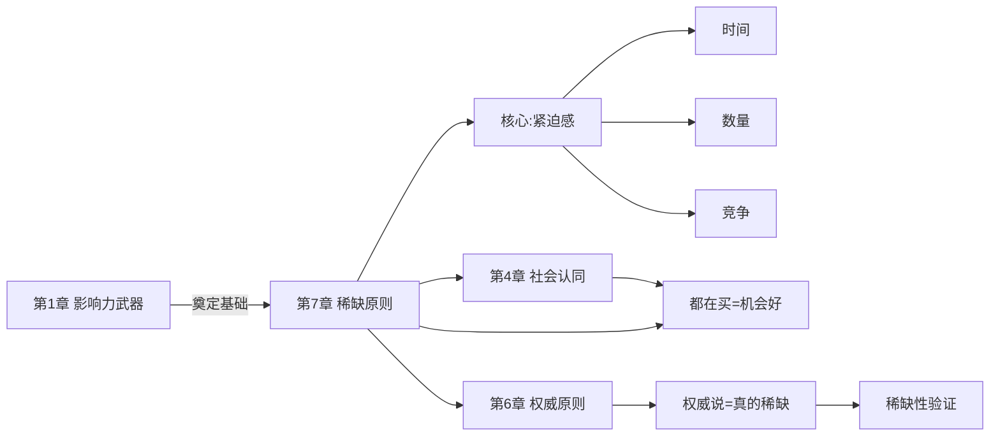
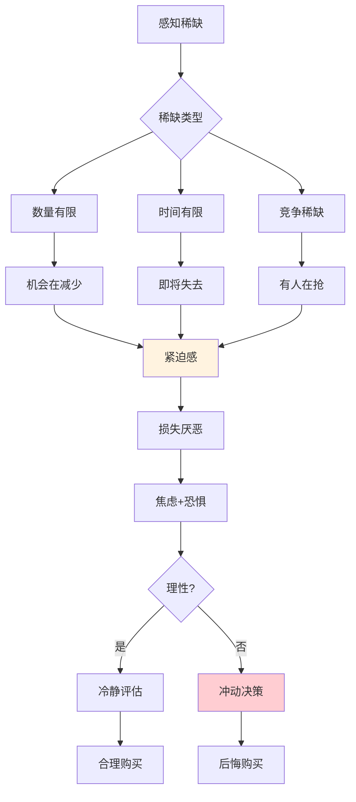

# 第7章 稀缺原则

## 📍 章节定位

### 全书位置

**核心问题**：为什么"限量"、"限时"、"最后机会"这些词能让人失去理智？失去一件东西的痛苦，为什么比得到它的快乐更强烈？

**章节回答的问题**：稀缺如何影响我们的判断？什么是"稀缺性"的两大维度？为什么越稀缺的东西，我们越觉得它有价值？

**一句话总结**：稀缺原则揭示了人类对"损失"的原始恐惧——得不到的永远在骚动，失去的痛苦是获得的快乐的两倍。

**在本书结构中的角色**：**最后一块拼图**——从"情感连接"进阶到"心理紧迫"。

### 章节核心概念

**稀缺原理（Scarcity Principle）**：
- 稀缺的东西更吸引人
- 稀缺+紧迫=更强的吸引力
- 稀缺不仅增加价值感知，还会导致非理性决策

---

## 🎯 核心观点：三层提取

### 第一层：表层案例——稀缺的N种伪装

#### 案例1：菲律宾的"椰子战争"
- **现象**：政府免费发椰子，但居民不要；限量供应后，居民排队抢购
- **机制**：免费=无价值，稀缺=有价值
- **启示**：东西还是那个东西，价值却因稀缺而不同

#### 案例2：拍卖会的疯狂
- **场景**：两个人竞价一幅画
- **结果**：成交价往往是预估的10倍以上
- **机制**：竞争让稀缺升级，情绪战胜理性
- **洞察**：稀缺+竞争=失控

#### 案例3："限时优惠"的陷阱
- **场景**："最后3个！限时24小时！"
- **机制**：稀缺制造紧迫，紧迫阻止思考
- **数据**：限时促销转化率是正常的2-3倍

#### 案例4："独家信息"的价值
- **现象**：同样的信息，加上"独家"、"内部"就值钱
- **机制**：信息稀缺=信息价值
- **应用**：知识付费、內幕消息

#### 案例5："数量有限"vs"时间有限"
- **实验**：两组消费者，一组被告知"数量有限"，一组被告知"时间有限"
- **结果**：两组转化率相当，但"时间有限"感觉更紧迫
- **洞察**：两种稀缺同样有效，"即将失去"比"已经失去"更痛苦

---

### 第二层：心理机制——为什么稀缺如此有效

#### 机制1：损失厌恶（Loss Aversion）
```
失去的痛苦 = 获得的快乐 × 2
```

**核心发现**（卡尼曼前景理论）：
- 人对损失的敏感度是对收益的2倍以上
- 失去100块的痛苦，需要获得200块才能弥补
- **这就是为什么**：稀缺（即将失去）比稀缺（已经拥有）更有效

#### 机制2：逆反心理
```
机会越少 → 越想要 → 逆反心理 → 非理性决策
```

**心理逻辑**：
- "选择权被剥夺"激发逆反
- 限制反而增加吸引力
- 越得不到越想要

#### 机制3：稀缺的价值赋予
```
稀缺 → 高价值 → 渴望 → 购买
```

**价值来源**：
- 稀缺=质量好（质量稀缺）
- 稀缺=机会好（时间稀缺）
- 稀缺=独特（数量稀缺）

#### 机制4：竞争升级效应
```
发现别人也在抢 → 紧张感上升 → 竞价失控
```

**为什么拍卖失控？**
- 对方出价=我的机会在减少
- 情绪战胜理性
- "不能输"的心态

---

### 第三层：底层规律——稀缺背后的进化逻辑

#### 规律1：稀缺是进化的警报器
- 远古时代：资源稀缺=生存威胁
- 进化结果：对稀缺敏感的人活下来了
- **现代**：这种敏感被营销利用

#### 规律2：稀缺是"相对"的不是"绝对"的
- 东西的价值不在于它本身，而在于"别人也在抢"
- 稀缺比较级：限量10个>限量100个
- **核心洞察**：稀缺感知比稀缺事实更重要

#### 规律3："即将失去"比"已经失去"更痛苦
```
已经失去 → 接受现实 → 痛苦但可控
即将失去 → 不确定性 → 焦虑+恐惧 → 冲动决策
```

#### 规律4：任何东西都能被"稀缺化"
- 时间：限时、倒计时
- 数量：限量、绝版
- 信息：独家、机密
- 资格：会员、内部价
- **稀缺是一种可以被伪造的资源**

---

## 💬 降维翻译

### 原文核心

> "一样东西越稀缺，就显得越珍贵。"
> —— 西奥迪尼

### 中学生能懂的版本

人都有一个毛病：越少的东西越觉得好。街上排队的人越多，你越想去看看；商家说"最后3个"，你就着急了。为啥呢？因为你怕失去这个机会啊。人害怕失去东西，这种害怕比得到东西的开心还强烈。

### 奶奶能懂的版本

这个商家啊，最会搞"稀缺"这套了。什么"最后3个"啊，"今天特价"啊，"不买就没了"啊，都是骗你赶紧掏钱的。你越急越容易上当，他们就越赚钱。记住了，越是说稀奇的，越要想一想。

---

## ✨ 金句库

### 原书金句

1. "一样东西越稀缺，就显得越珍贵。"
2. "失去的痛苦是获得快乐的两倍。"
3. "稀缺不仅增加感知价值，还会导致非理性决策。"
4. "即将失去比已经失去更让人痛苦。"
5. "竞争会让稀缺升级，让理性崩溃。"

### 降维金句

1. "稀缺不是价值，是恐惧——害怕失去的恐惧。"
2. "商家最懂这个：不是'你有'，是'你快没有了'。"
3. "失去的痛苦是获得的两倍——这才是人性的真相。"
4. "限量不是给你省钱，是让你着急。"
5. "抢到的不一定是好的，但抢不到的一定是遗憾的。"

## 🔗 当下映射：现实应用

### 💰 财富/营销场景

| 场景 | 稀缺策略 | 机制 | 效果 |
|------|---------|------|------|
| 电商大促 | 限时特价、倒计时 | 时间稀缺 | 冲动消费 |
| 奢侈品 | 限量款、绝版 | 数量稀缺 | 溢价 |
| 房产 | "仅剩3套" | 数量稀缺 | 紧迫成交 |
| 知识付费 | "限额100名" | 资格稀缺 | 早鸟效应 |
| 会员 | "今天最后一天" | 时间稀缺 | 续费率提升 |

### 💼 职场场景

| 场景 | 稀缺策略 | 机制 | 应用 |
|------|---------|------|------|
| 面试 | "这个岗位很抢手" | 竞争稀缺 | 抬高身价 |
| 谈薪资 | "猎头也在联系我" | 选择稀缺 | 争取更高Offer |
| 项目争取 | "这个资源有限" | 资源稀缺 | 优先分配 |
| 销售 | "月底冲业绩" | 时间稀缺 | 促成交易 |
| 投资 | "额度有限" | 额度稀缺 | 引导决策 |

### 🏠 生活场景

| 场景 | 陷阱 | 破解 |
|------|------|------|
| 双11 | "限时特价" | 真的需要吗？ |
| 抢购 | "排队排到天亮" | 真的是最后一批？ |
| 演唱会 | "票已售罄" | 黄牛真的在卖 |
| 房产 | "再不买就涨价" | 真的会涨？ |
| 求职 | "这个岗位很抢手" | 真的很多人竞争？ |

### 72小时行动计划

1. **今天**：记录3次你因为"稀缺"而冲动消费的经历
2. **本周**：在下单前问自己"如果没有'限时'、'限量'，我还会买吗？"
3. **本月**：尝试一次"刻意不抢购"的练习

---

## 🕸️ 章节关联

### 与前后章节的关系



**逻辑关系**：
- **组合使用**：稀缺+社会认同（"都在抢"）、稀缺+权威（"专家推荐+限量"）
- **递进**：从情感→专业→紧迫，层层加码

### 与整书的关系

**核心地位**：稀缺是"七大原则"的收官之作
- 最直接触发行动
- 最容易制造冲动
- 最需要理性防御

### 跨书关联

| 书籍 | 关联点 |
|------|--------|
| 《思考快与慢》 | 前景理论、损失厌恶 |
| 《助推》 | 选择架构中的稀缺利用 |
| 《穷查理宝典》 | "避免不一致"与稀缺 |
| 《噪声》 | 判断中的稀缺偏差 |

---

## ❓ 问答设计：认知层次递进

### 第一层：记忆

1. **稀缺原则的核心是什么？**
   - 稀缺的东西更吸引人

2. **什么是损失厌恶？**
   - 失去的痛苦是获得快乐的两倍

3. **稀缺的两种形式是什么？**
   - 数量有限、时间有限

### 第二层：理解

4. **为什么稀缺会增加价值？**
   - 物以稀为贵，进化的警报系统

5. **"即将失去"和"已经失去"有什么不同？**
   - 即将失去带来焦虑和恐惧，导致冲动决策

6. **为什么拍卖会让人失控？**
   - 竞争升级情绪，阻止理性思考

### 第三层：分析

7. **稀缺原则和社会认同原则如何结合？**
   - "都在抢"=社会认同+稀缺，效果倍增

8. **"限时特价"为什么有效？**
   - 时间稀缺制造紧迫感，阻止思考

9. **如何识别真假稀缺？**
   - 查历史价格、查真实库存、问"以后还会不会有"

### 第四层：应用

10. **如何用稀缺原则做营销？**
    - 限时限量、倒计时、竞争暗示

11. **如何在谈判中利用稀缺？**
    - "我还有其他选择"制造紧迫感

12. **如何让自己更理性地面对稀缺？**
    - 问"我真的需要吗"，不是"还有吗"

### 第五层：防御

13. **如何防御稀缺营销？**
    - 区分"需要"和"想要"，设置冷静期

14. **稀缺原则是优点还是缺点？**
    - 本身是进化优势，但被商业过度利用

15. **如何做到"从容"面对稀缺？**
    - 认识到"错过不是失去"，"还有下次"

---

## 📊 可视化总结

### 稀缺影响决策的心理链路



### 稀缺类型对比

| 类型 | 触发器 | 紧迫感 | 适用场景 |
|------|--------|--------|---------|
| 数量稀缺 | "仅剩3个" | 高 | 电商、房产 |
| 时间稀缺 | "24小时后涨价" | 极高 | 大促、会员 |
| 竞争稀缺 | "还有20人在看" | 极高 | 拍卖、抢票 |
| 资格稀缺 | "会员专属" | 中 | 知识付费 |

---

## 🛡️ 防御策略

### 三步防御法

**Step 1：识别信号**
- "仅剩"、"最后"、"限时"
- "别人也在抢"、"正在申请"
- 倒计时、库存显示

**Step 2：暂停+追问**
- 问自己：如果没有这个稀缺提示，我会买吗？
- 问自己：这是"需要"还是"想要"？
- 问自己：稀缺是真是假？

**Step 3：设置冷静期**
- 延迟24小时再决定
- 把"限时"变成"无限时"
- 记住：商家不急，你急什么？

### 关键心态

> "错过不是失去，只是一次选择的机会。"
> 真正稀缺的不是商品，是理性。

---

## 📌 本章要点速记

| 概念 | 一句话 |
|------|--------|
| 稀缺原则 | 越少越想要 |
| 损失厌恶 | 失去的痛苦是获得的两倍 |
| 逆反心理 | 越限制越想要 |
| 竞争稀缺 | 有人在抢=机会在减少 |
| 防御核心 | 区分需要和想要 |

---

## 🔖 延伸思考

1. **双11反思**：一年年的"双11"，你真的省到钱了吗？
2. **投资泡沫**：稀缺在投资市场中如何制造泡沫？
3. **信息时代**：当"信息过载"时，真正稀缺的是什么？
4. **自我认知**：你最容易被哪种"稀缺"触发？是什么心理需求？

---

*创建日期：2026-02-26*
*整书拆解：[[影响力-西奥迪尼-拆解记录]]*
*章节导航：[[影响力章节导航]]*