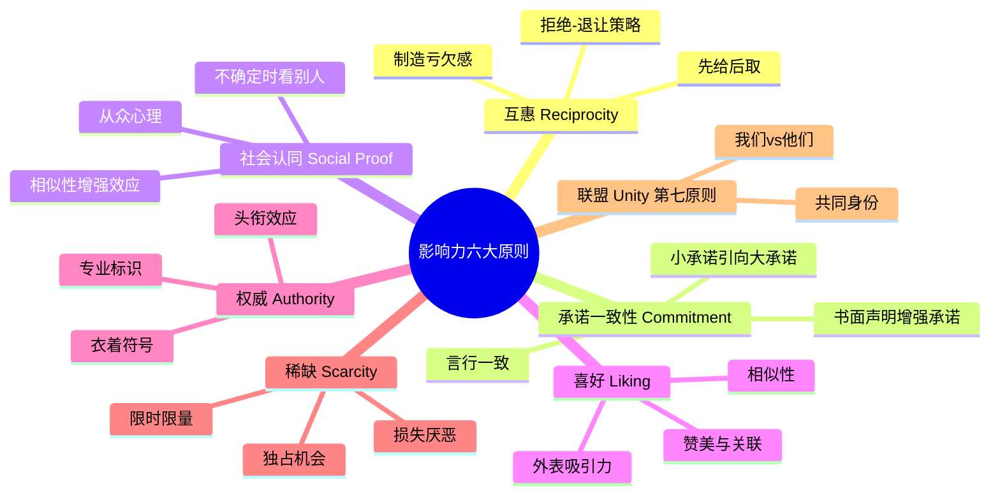

# 《影响力》拆解记录

## 这本书要解决什么问题？

**核心困境**：人们以为自己是在"理性决策"，但实际上90%的决策是由大脑的自动反应系统完成的。为什么有些人总能说服你？因为他们知道如何按下你大脑的"自动播放键"。

**一句话定位**：
> 人类的自动反应系统可以被六大（现为七大）原则影响——掌握这些原则，你就能让对方"自愿"接受你的影响，也能保护自己不被操控。

### 作者站在什么位置说这些话？

| 维度 | 定位 |
|------|------|
| 主领域 | 社会心理学 |
| 跨界领域 | 行为经济学、说服学、市场营销、谈判学 |
| 作者背景 | 亚利桑那州立大学心理学终身教授，说服心理学研究40年 |
| 历史语境 | 1984年初版，2021年新版扩展为七大原则。《财富》杂志"75本商业必读书" |

### 和其他书有什么关系？

| 关联书籍 | 关联关系 | 共同底层逻辑 |
|----------|----------|--------------|
| [[思考快与慢-拆解记录]] | 机制基础 | 系统1=自动反应机制，六大原则利用系统1的漏洞 |
| [[清醒思考的艺术-多贝里-拆解记录]] | 防御视角 | 认知偏误是被影响的"漏洞" |
| [[穷查理宝典-拆解记录]] | 延伸 | 芒格的"人类误判心理学"与六大原则高度重合 |
| [[助推-理查德·塞勒-卡斯·桑斯坦-拆解记录]] | 互补 | 助推是影响力的"善意应用" |

### 知识网络图

---

## 作者的核心论点

### 互惠原理——免费的东西最贵

教授给陌生人寄圣诞卡，收到大量陌生人回寄的贺卡。餐厅服务员先送薄荷糖，小费增加3.3%；送两颗，增加14%；送一颗后回头再给一颗，增加23%。

为什么？人类有强烈的互惠本能——当别人对我们好时，我们会感到有义务回报。这种本能是进化的产物，也是人类社会合作的基础。

更厉害的是"拒绝-退让"策略：志愿者先问大学生"是否愿意辅导少年犯两年"，几乎所有人拒绝；然后退让问"那能否带少年犯去动物园一次"，答应率从17%上升到50%。

> **互惠定律**：先给后取。你不需要强迫别人帮你，你只需要先帮对方一个忙，让对方感到"亏欠"，他们就会主动回报你。

免费的东西最贵——因为它让你欠了人情。

### 承诺一致性——让别人承诺，比直接要求更有效

朝鲜战争战俘营：美军战俘被要求写"美国不完美"的温和声明，逐步升级为反美声明，最终态度真的改变。海滩实验：研究者假装离开时请旁边人帮忙看收音机，95%的人会追赶小偷；没被请求时，只有20%会行动。

增强承诺的四种手段：书面声明（白纸黑字难以抵赖）、公众眼睛（社会监督压力）、付出努力（努力越多元就越珍视）、成为内心选择（"我选择"而非"我被要求"）。

> **承诺一致性定律**：人们有强烈的内在驱动力使自己的行为与先前的承诺保持一致。小承诺会引向大承诺。

让别人承诺，比直接要求更有效。先让人说"好的，我试试"，再让人说"我会尽力"，最后变成"这是我的责任"。

这个观点打碎了我对"说服"的理解——说服不是一次性的，而是分阶段的。小承诺是通往大承诺的桥梁。

### 社会认同——"大家都在做"比"你应该做"更有说服力

街头抬头实验：1人抬头，4%路人停下；5人抬头，18%停下；15人抬头，40%停下。电梯实验：演员背对门站，被试者也跟着背对门站。

社会认同的心理机制：在不确定环境下，人们会参考他人的行为来判断什么是正确的。我们越像那些人，这种影响力就越强。

最有效的公式：社会认同效力 = 相似性 × 数量 × 具体性。

> **社会认同定律**：你不需要证明自己是对的，你只需要让更多人"已经相信"了，从众效应会自然带他们来。

但这也解释了悲剧：基蒂·吉诺维斯案，38名目击者无人报警。因为每个人都在看别人怎么做——多元无知导致无人行动。危急时要指定具体人："穿蓝衣服的你，帮我报警"。

### 喜好——相似性是最好的破冰

特百惠聚会：从朋友那里买东西，销售额250万美元/天。汽车销售冠军吉拉德：每月寄贺卡写"我喜欢你"，年销13000辆车。

喜好的五个来源：外表吸引力（漂亮=好人的光环效应）、相似性（同乡、同好、同背景）、称赞（被夸的感觉太好）、接触与合作（熟悉即喜欢）、关联（把产品和好事联系起来）。

> **喜好定律**：人们更容易答应自己认识和喜欢的人的请求。

你不需要刻意讨好别人，你只需要找到共同点：同乡、同好、共同经历，让对方觉得"这人是自己人"，影响力自然提升。

### 权威——白大褂让人停止思考

米尔格拉姆电击实验：普通人被要求对"学习者"施加电击，实验者穿白大褂说"请继续"，65%的人施加了最高450伏电压（足以致死）。医院实验：护士接到陌生医生的电话要求给病人注射明显过量药物，95%的护士会照做。

权威的三大符号：头衔（博士/教授/专家）、衣着（白大褂/西装/制服）、外部标志（名车/名表/办公室大小）。

> **权威定律**：人们天生倾向服从权威，通过专业符号建立信任。这种服从可以提高决策效率，但也可能导致盲目顺从。

白大褂、西装、名车、头衔——这些符号让人自动停止思考。你不需要真的是权威，你只需要看起来像权威。但记住：真正的权威靠实力，不是符号。

### 稀缺——越难得越想要

饼干罐实验：罐里10块饼干，评分一般；罐里2块饼干，评分更高。心理逆反理论：当选择自由受到威胁时，人们会更加渴望那个选项。"禁止" = 更有吸引力。

> **稀缺定律**：当人们觉得某样东西稀缺或机会难得时，会立即采取行动。稀缺感会激活损失厌恶，使人们害怕"错过"，从而做出冲动的决定。

你不需要催促别人购买，你只需要制造"稀缺感"："只有3个名额"，"最后一天"，让人们觉得"不买就亏了"。但记住：稀缺必须真实，否则信任归零。

---

## 这本书的局限

| 批评点 | 谁在批评 | 怎么说 |
|--------|---------|--------|
| 案例过于戏剧化 | 部分读者 | 某些实验案例被质疑过于完美 |
| 六大原则是否足够 | 学术讨论 | 2021年西奥迪尼自己新增第七原则"联盟"，承认可以继续扩展 |
| 伦理问题 | 哈佛商业评论 | 影响力的使用与滥用，如何区分"帮助"和"操控" |
| 文化差异 | 跨文化研究 | 六大原则基于西方心理学研究，跨文化适用性需验证 |

**一句话总结局限性**：
> 掌握六大原则可以让你更有效地影响他人，但影响力是一把双刃剑——用于帮助是善意，用于操控是恶意。

---

## 最值得记住的话

**原书说的**：
1. "当我们请别人帮忙时，如果能提供一个理由，成功率会更高。"
2. "文明的进步，就是人们在不假思索就能完成的事情越来越多。"
3. "对失去的恐惧，比对获得的渴望更能激励人。"
4. "权威的压力能够压倒个人的良知。"

**翻译成人话**：
1. 免费的东西最贵——因为它让你欠了人情
2. 让别人承诺，比直接要求更有效
3. "大家都在做"比"你应该做"更有说服力
4. 相似性是最好的破冰——同乡、同好、同经历
5. 白大褂让人停止思考——符号比内容更有效
6. 不买就亏了——这是损失厌恶在骗你
7. "自己人"三个字，比任何说服技巧都管用

---

## 讲给没读过的人听

你有没有想过，为什么免费试吃让你不好意思不买？为什么网红店排队越长人越多？为什么"限时限量"总能让你冲动下单？

西奥迪尼花了40年研究这个问题，发现人类大脑有6个"自动播放键"：互惠、承诺、社会认同、喜好、权威、稀缺。销售员、营销人、骗子——所有想说服你的人，都在按这些按钮。

比如互惠原理：免费的东西最贵，因为它让你欠了人情。比如社会认同：你不需要证明自己是对的，你只需要让更多人"已经相信"了。比如稀缺：不买就亏了——这是损失厌恶在骗你。

知道这6个按钮，你可以更有效地影响他人，更重要的是，你可以识别别人在按你的按钮，保护自己不被操控。

---

## 用来检验理解的问题

**基础回忆**：
1. Q: 六大影响原则是哪些？
   A: 互惠、承诺一致性、社会认同、喜好、权威、稀缺（2021年新增第七原则"联盟"）。

2. Q: "拒绝-退让"策略是什么？
   A: 先提大请求被拒，然后退让提小请求，对方因亏欠感更可能答应。

**理解验证**：
1. Q: 为什么危急时要指定具体人帮忙？
   A: 避免"多元无知"——每个人都在看别人怎么做，导致无人行动。

2. Q: 如何识别营销中的"稀缺"陷阱？
   A: 问自己：如果没有人抢，我还会买吗？

---

## 和其他书的对话

卡尼曼告诉你大脑有什么"漏洞"，西奥迪尼告诉你如何"按下漏洞按钮"。理解漏洞才能防御，理解按钮才能影响。《思考快与慢》是诊断，《影响力》是药方。

多贝里告诉你认知偏误是什么，西奥迪尼告诉你这些偏误如何被利用。《清醒思考的艺术》是"漏洞清单"，《影响力》是"攻击手册"。防御需要两本都读。

芒格的"人类误判心理学"与西奥迪尼的六大原则高度重合，但芒格更强调"避免错误"，西奥迪尼更强调"如何影响"。一个防守，一个进攻。

助推是影响力的"善意应用"。两者共享同一套心理学机制，区别在于目的是"帮助"还是"操控"。塞勒用心理学帮助人做更好的决策，营销人用心理学让人买更多的东西。

---

*拆解日期：2026-02-14*
*下次回访：1周后回顾「讲给没读过的人听」和「检验问题」*