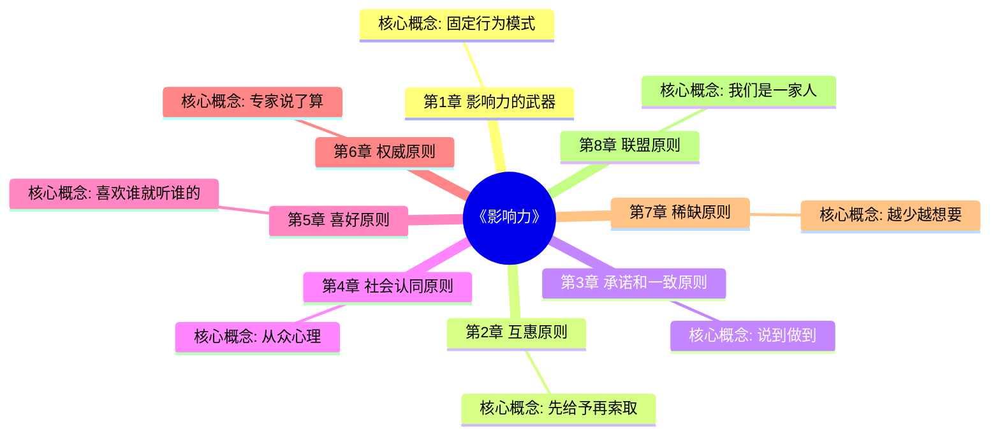

# 《影响力》章节导航

## 📊 基本信息

| 项目 | 内容 |
|------|------|
| 书名 | 《影响力》（Influence: The Psychology of Persuasion） |
| 作者 | 罗伯特·西奥迪尼（Robert Cialdini） |
| 总章节 | 8章（7大原则+开篇） |
| 已拆解 | 2章 |
| 整书拆解 | [[影响力-西奥迪尼]] |

---

## 🗺️ 章节结构图

---

## 📈 笔记进度

| 序号 | 章节 | 核心机制 | 典型应用 | 状态 | 链接 |
|------|------|----------|----------|------|------|

**进度**: 2/8 (25%)

⭐ = 优先拆解（核心章节）

---

## 🎯 拆解优先级

根据整书读书笔记和实用价值，优先拆解以下章节：

### 第一优先级（高频应用）
1. **第4章 社会认同原则** - 最常见的说服手段，销量/排队/好评
2. **第7章 稀缺原则** - 限时限量营销的核心原理
3. **第2章 互惠原则** - 免费试用、先给后取的商业逻辑

### 第二优先级（认知基础）
4. 第1章 影响力的武器 - 理解"按一下就播放"的底层机制
5. 第3章 承诺和一致原则 - 小承诺如何撬动大行动
6. 第6章 权威原则 - 为什么我们盲从专家

### 第三优先级（关系层面）
7. 第5章 喜好原则 - 外貌、相似性如何影响决策
8. 第8章 联盟原则 - "我们"的语言创造归属感

---

## 🔗 快速跳转

### 按章节跳转
- [[03-Resources/书籍拆解/1/商业类/影响力/第1章-影响力的武器]]
- [[第2章-互惠原则]]
- [[第3章-承诺和一致原则]]
- [[第4章-社会认同原则]]
- [[第5章-喜好原则]]
- [[第6章-权威原则]]
- [[第7章-稀缺原则]]
- [[第1章-哈吉斯]]

### 相关资源
- [[影响力-西奥迪尼]] - 整书拆解笔记
- [[助推-理查德·塞勒]] - 行为经济学经典
- [[穷查理宝典]] - 查理芒格的人类误判心理学

---

## 📝 七大原则速查表

| 原则 | 英文 | 核心机制 | 典型应用 | 防御策略 |
|------|------|----------|----------|----------|
| 互惠 | Reciprocity | 欠债感 | 免费试用 | 区分善意与套路 |
| 承诺一致 | Commitment | 自我一致 | 小承诺 | 警惕登门槛 |
| 社会认同 | Social Proof | 从众 | 排队、销量 | 问"这是我要的吗" |
| 喜好 | Liking | 情感 | 外貌、相似 | 把人和事分开 |
| 权威 | Authority | 服从 | 头衔、制服 | 核实真专家 |
| 稀缺 | Scarcity | 损失厌恶 | 限时限量 | 冷静评估真实需求 |
| 联盟 | Unity | 归属感 | "我们"语言 | 警惕群体绑架 |

---

## 📝 章节笔记说明

每个章节笔记将包含：
- 📍 **章节定位**：在全书中回答的问题
- 🎯 **核心观点**：三层提取（案例→机制→规律）
- 💬 **降维翻译**：原文→中学生能懂→奶奶能懂
- ✨ **金句库**：原书/降维/二创金句
- 🔗 **当下映射**：营销/职场/生活应用
- 🕸️ **章节关联**：前后章+整书+跨书关联
- ❓ **问答设计**：5-10个认知层次问题

---

*创建日期: 2026-02-26*
