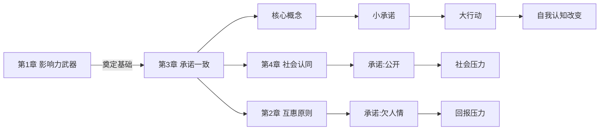
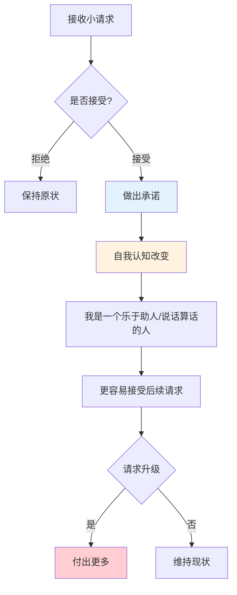
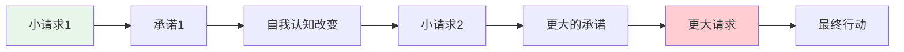

# 第3章 承诺和一致原则

## 📍 章节定位

### 全书位置

**核心问题**：为什么我们一旦做出承诺，就会努力让自己言行一致？这种"一致"如何被利用来说服我们？

**章节回答的问题**：小的口头承诺如何变成大的行动？登门槛效应为什么有效？所谓的"心口一致"是美德还是弱点？

**一句话总结**：承诺和一致原则揭示了人类对"言行一致"的病态追求，这种追求让我们愿意用更大的行动来证明之前的决定是正确的。

**在本书结构中的角色**：**进阶技巧**——从第1章的"触发"进阶到第3章的"自我说服"。

### 章节核心概念

**承诺和一致原理（Commitment and Consistency）**：
- 人一旦做出承诺（特别是公开承诺），就会倾向于保持一致
- 为了保持一致，人们愿意做出超出预期的事情
- 承诺不仅影响行为，还改变自我认知

---

## 🎯 核心观点：三层提取

### 第一层：表层案例——从小承诺到大行动

#### 案例1：赌马场的"聪明"策略
- **场景**：赌马前让赌客写下自己选的马
- **机制**：书面承诺让赌客更相信自己选的马
- **结果**：即使看到其他马表现更好，也不愿意改变选择
- **关键**：写下来=郑重承诺

#### 案例2：玩具公司的"圣诞困境"
- **场景**：圣诞节前广告玩具，孩子想要，家长不买
- **Next**：年后玩具公司发信"您的玩具已到货"
- **机制**：孩子曾承诺"要这个"，现在要证明自己说话算话
- **结果**：销量暴涨

#### 案例3：二手车商的"还价"游戏
- **场景**：买家出价太低，商贩"忍痛"同意
- **机制**：卖家"让步"让买家觉得成交是给对方面子
- **结果**：买家不好意思再压价，甚至自我感觉"捡便宜"

#### 案例4：健身房年卡策略
- **场景**："现在签约，赠送5次私教课"
- **机制**：消费者做出"长期承诺"后，为了"值回票价"会更频繁锻炼
- **数据**：年卡用户实际消费次数是月卡的3倍以上
- **洞察**：不是"便宜"让你消费，是"承诺"让你坚持

#### 案例5：政治游说中的"小要求"
- **实验**：请居民在窗口摆放小鸟雕塑（愿意的人很少）
- **进阶**：两周后请在草坪立"安全驾驶"标志（接受率大增）
- **机制**：第一个小请求建立了"热心市民"的身份认同
- **结论**：承诺会改变自我认知，进而影响后续行为

---

### 第二层：心理机制——为什么"一致"如此重要

#### 机制1：认知失调的自我修正
```
做出承诺 → 行为与认知不符 → 产生不适 → 调整认知或行为 → 恢复一致
```

**费斯廷格的认知失调理论**：
- 言行不一致让人难受
- 为了消除这种难受，人要么改变行为，要么改变认知
- 通常改变认知更容易（"我就是这样的人"）

#### 机制2："承诺一致性"的进化价值
```
远古群体 → 可靠的人被尊重 → 一致=信任=生存优势 → 写入基因
```

**为什么人类如此看重一致？**
1. **社会信任**：言而无信的人在远古社会无法生存
2. **认知节能**：不需要每次重新评估，省脑细胞
3. **自我形象**："我是一个说话算话的人"是核心身份认同

#### 机制3：登门槛效应（Foot-in-the-Door）
```
小请求 → 接受 → 自我认知改变 → 更容易接受大请求
```

**关键心理链**：
```
第一步：帮个小忙（成本低）
第二步：我是个"乐于助人"的人
第三步：再帮个大忙（不帮=违背自我认知）
```

#### 机制4：书面承诺的权威性
- 文字比口头更有约束力
- 公开承诺比私下承诺更有力
- **原理**：写下来=存档，无法轻易否认

---

### 第三层：底层规律——一致性背后的生存逻辑

#### 规律1：一贯性是社会运转的基石
- 没有一致性，就没有信任
- 没有信任，就没有合作
- 没有合作，就没有文明
- **但是**：这种进化来的本能，正在被商人利用

#### 规律2：主动承诺比被动接受更有力
- **被动接受**：你告诉我该买什么 → 抵触
- **主动承诺**：我自己说想要 → 买单时毫无心理负担
- **营销密钥**：让客户自己说出来

#### 规律3：承诺会"长脚"
- 小的口头承诺会"长大"成大的行动承诺
- 公开的书面承诺会"长大"成不可逆的决定
- **关键洞察**：重要的不是承诺的大小，而是承诺的形式

#### 规律4：最有效的承诺是"自己选的"
- 让自己相信"这是我的选择"
- 然后为了证明"我的选择是对的"
- 付出比预期更多的代价
- **这就是"沉没成本"的表亲——"沉没尊严"**

---

## 💬 降维翻译

### 原文核心

> "一旦我们做出了承诺（主动选择、公开声明），就会面临内外双重压力，迫使我们的行为与承诺保持一致。"
> —— 西奥迪尼

### 中学生能懂的版本

人特别爱面子，说到就要做到。要是你先答应了一件小事，人家让你做大事的时候，你就不好意思拒绝了——因为你要证明自己是个说话算话的人。商家就利用这个，先让你答应一点点，然后一步一步让你花更多钱。

### 奶奶能懂的版本

这个人哪，都是死要面子活受罪。明明不想买东西，售货员说"您眼光真好"，你一高兴就答应了。完了之后人家说"再加点这个吧"，你想想刚才都买了不好意思拒绝，就又掏钱。这就是一步一步套牢你。

---

## ✨ 金句库

### 原书金句

1. "一旦我们做出承诺，就会采取实际行动来证明我们的承诺是正确的。"
2. "书面的承诺要比口头的承诺更有效，因为文字更难被否认。"
3. "登门槛效应表明，一个小请求往往是更大请求的前奏。"
4. "承诺不仅影响行为，还会改变自我认知。"
5. "认知失调会让人不舒服，为了消除这种不舒服，人们会调整自己的行为或认知。"

### 降维金句

1. "说出来的话，泼出去的水——覆水难收。"
2. "先让你点头，再让你掏钱。"
3. "不是他强奸了你的意志，是你自己的尊严绑架了自己。"
4. "书面承诺比口头承诺更'值钱'，因为矢口否认的成本更高。"
5. "每一次'来都来了'、'买都买了'、'答应都答应了'，都是承诺一致在作祟。"

## 🔗 当下映射：现实应用

### 💰 财富/营销场景

| 场景 | 策略 | 机制 | 效果 |
|------|------|------|------|
| 免费试用 | "先试试，不喜欢随时退" | 小承诺→大消费 | 试用转化率60%+ |
| 问卷调查 | "填问卷送礼品" | 参与=承诺 | 后续推销接受度高 |
| 众筹预售 | "支持XX元，获得XX" | 预购=承诺 | 锁定用户 |
| 会员注册 | "先注册，再领券" | 信息承诺 | 后续转化成本降低 |
| 积分任务 | "签到领积分" | 行为惯性 | 培养使用习惯 |

### 💼 职场场景

| 场景 | 策略 | 机制 | 效果 |
|------|------|------|------|
| 面试 | "您今天过来就算成功了50%" | 面试官暗示 | 候选人更配合 |
| 任务分配 | "这个方案您看这样改行吗？" | 获得初步认可 | 难以推翻 |
| 团队建设 | "大家举手同意" | 公开承诺 | 后续执行更有力 |
| 绩效考核 | "年初自己定的目标" | 自我承诺 | 达成率更高 |
| 跨部门协作 | "李总也说这个方案好" | 利用已有承诺 | 减少阻力 |

### 🏠 生活场景

| 场景 | 陷阱 | 破解 |
|------|------|------|
| 健身房推销 | "今天办卡送私教" | 问自己：没有赠品还想不想办？ |
| 推销上门 | "我就进来喝口水" | 拒绝第一步，拒绝第九步 |
| 借钱 | "，借一点点都不行吗？" | 先拒绝，防止升级 |
| 求帮忙 | "帮个小忙" | 评估真实成本再决定 |
| 直播抢购 | "扣1表示需要" | 参与互动≠需要购买 |

### 72小时行动计划

1. **今天**：拒绝一个"小请求"时，思考这是否是一个"更大请求"的前奏
2. **本周**：在下重大决定前，问自己"如果没有之前的承诺，我会怎么选？"
3. **本月**：记录自己"买都买了"、"来都来了"的心理过程，识别承诺一致的影响

---

## 🕸️ 章节关联

### 与前后章节的关系



**逻辑关系**：
- **承接**：第1章的"固定行为模式" → 第3章的"自我触发"
- **并列**：承诺一致（欠自己的）vs 互惠（欠别人的）
- **递进**：承诺一致往往是社会认同的前奏

### 与整书的关系

**核心地位**：承诺和一致是"七大原则"的枢纽
- 可以独立使用（登门槛）
- 可以组合其他原则（互惠+承诺）
- 可以自我强化（承诺→行为→自我认知→更多行为）

**应用优先级**：高频实用技能

### 跨书关联

| 书籍 | 关联点 |
|------|--------|
| 《思考快与慢》 | 认知失调理论，系统1的自我辩护 |
| 《助推》 | 默认选项利用初始承诺 |
| 《穷查理宝典》 | "一致性倾向"人类误判心理 |
| 《刻意练习》 | 承诺→重复→专业 |

---

## ❓ 问答设计：认知层次递进

### 第一层：记忆

1. **什么是承诺和一致原理？**
   - 人一旦做出承诺，就会倾向于保持一致

2. **什么是登门槛效应？**
   - 先接受小请求，再接受大请求的倾向

3. **书面承诺为什么比口头承诺更有效？**
   - 文字更难否认，具有存档效应

### 第二层：理解

4. **为什么人类如此看重"一致"？**
   - 社会信任的基础，进化形成的本能

5. **认知失调是什么？**
   - 行为与认知不一致时产生的不适感

6. **承诺如何改变自我认知？**
   - 做出承诺后，人会调整自我认同以匹配行为

### 第三层：分析

7. **登门槛效应为什么有效？**
   - 小请求建立"身份认同"，拒绝大请求=违背自我

8. **为什么"众筹"比"直接卖"更容易成功？**
   - 支持者把自己当"参与者"而非"消费者"

9. **"沉没成本"和"承诺一致"有什么区别？**
   - 沉没成本：已经投入的难以放弃
   - 承诺一致：已经答应的要信守

### 第四层：应用

10. **如何用承诺一致原理做营销？**
    - 让客户自己说想要，从低价产品开始

11. **如何让孩子养成好习惯？**
    - 让孩子做出小承诺，然后逐步升级

12. **团队管理中如何利用承诺一致？**
    - 让团队成员参与目标制定，而非被动接受

### 第五层：评估与防御

13. **如何识别"登门槛"陷阱？**
    - 问：没有这个前提，我还会同意吗？

14. **承诺一致是优点还是缺点？**
    - 对他人：维护信用是美德
    - 对自己：警惕"死要面子活受罪"

15. **如何跳出"买了就要用"的陷阱？**
    - 区分"过去的承诺"和"现在的需求"

---

## 📊 可视化总结

### 承诺一致的心理链路



### 登门槛效应模型



### 承诺形式对比

| 形式 | 约束力 | 场景 | 示例 |
|------|--------|------|------|
| 口头 | 低 | 日常 | "下次请你吃饭" |
| 书面 | 中 | 半正式 | 签名、表格 |
| 公开 | 高 | 正式 | 演讲、媒体声明 |
| 行动 | 最高 | 实践 | 购买、使用 |

---

## 🛡️ 防御策略

### 三步防御法

**Step 1：识别信号**
- "就一个小请求"、"帮个小忙"
- "来都来了"、"买都买了"

**Step 2：独立判断**
- 问自己：没有之前的"承诺"，我会怎么做？
- 把"之前的投入"和"当前的决定"分开

**Step 3：允许反悔**
- 过去的承诺不等于现在的义务
- 真正的理性是"知道什么时候该放弃"

### 关键心态

> "我过去的承诺不代表我未来的选择。"
> 成熟的人，知道什么时候该坚持，什么时候该止损。

---

## 📌 本章要点速记

| 概念 | 一句话 |
|------|--------|
| 承诺一致 | 说到做到，说到就要做到 |
| 登门槛 | 一步一步套牢 |
| 认知失调 | 言行不一很难受 |
| 书面承诺 | 写下来=矢口否认成本高 |
| 防御核心 | 把"过去的承诺"和"现在的需求"分开 |

---

## 🔖 延伸思考

1. **社交媒体**：我们在朋友圈的"人设"是不是一种公开承诺？如何影响我们的行为？
2. **亲密关系**："我爱你"这句话有多大的约束力？
3. **教育孩子**：如何用承诺一致培养责任感，而不是压力？
4. **自我成长**：年初立flag是承诺一致的表现，为什么很难坚持？

---

*创建日期：2026-02-26*
*整书拆解：[[影响力-西奥迪尼]]*
*章节导航：[[影响力/_导航]]*