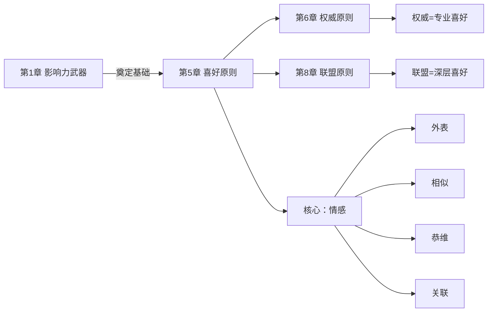
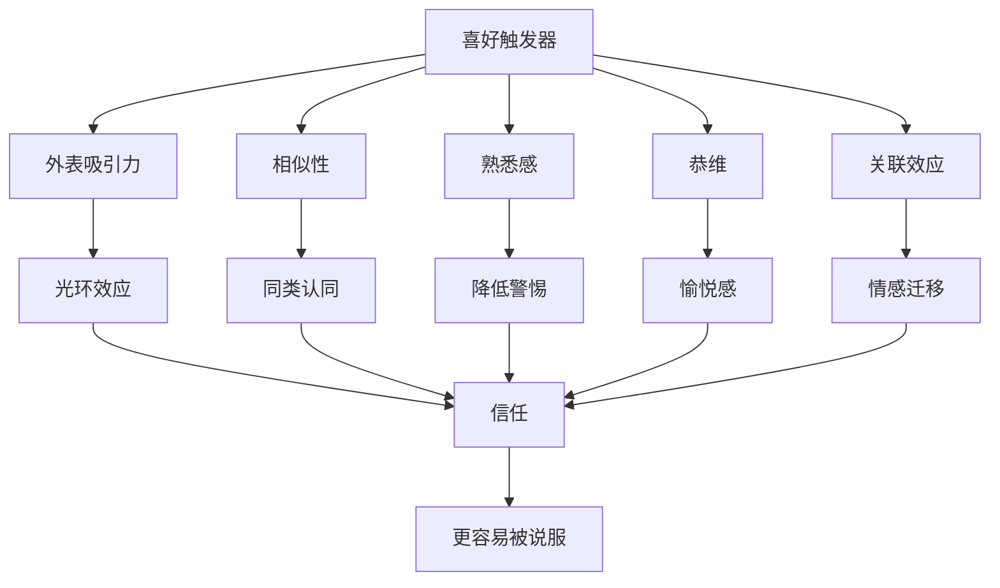
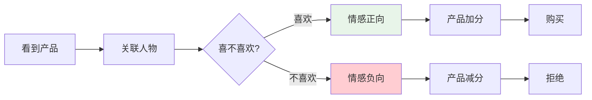

# 第5章 喜好原则

## 📍 章节定位

### 全书位置

**核心问题**：为什么我们更容易被自己喜欢的人说服？这种"喜欢"是如何被操控的？

**章节回答的问题**：外貌、相似性、熟悉感、恭维、关联——这五大"喜好触发器"如何绕过理性判断，让我们做出非理性决定？

**一句话总结**：喜好原则揭示了"爱屋及乌"的深层心理——我们不仅会被产品本身说服，更容易被与产品相关的人（或者看起来像朋友的人）说服。

**在本书结构中的角色**：**关系层说服**——从"机制触发"进阶到"情感连接"。

### 章节核心概念

**喜好原理（Liking Principle）**：
- 人更容易答应自己喜欢的人的请求
- "喜欢"可以由多种因素触发：外表、相似性、熟悉感、恭维、关联
- 这些因素往往与产品本身无关，却能极大影响决策

---

## 🎯 核心观点：三层提取

### 第一层：表层案例——五大喜好触发器

#### 触发器1：外表吸引力
- **案例**：招聘实验中，颜值高的简历通过率更高
- **数据**：同等能力下，颜值高者获得面试机会多14倍
- **机制**：光环效应——好看=有能力+诚信+善良
- **延伸**：整形广告、偶像经济、直播带货

#### 触发器2：相似性
- **案例**：销售员穿"同款"鞋，成交量提升30%
- **实验**："我也曾经历失业"比"我理解你的困难"更有效
- **机制**：相似=同类=可信
- **应用**：话术中的"我们都是..."

#### 触发器3：熟悉感
- **案例**：重复出现的名字更容易被喜欢（纯粹曝光效应）
- **实验**：让参与者看随机出现的汉字，喜欢的都是见过更多次的
- **机制**：熟悉=安全=可预测
- **应用**：广告重复播放、名前后对比

#### 触发器4：恭维
- **案例**："您眼光真好"让顾客购买欲提升
- **实验**：直接恭维vs暗示恭维，实验者被喜欢程度都提升
- **机制**：人都喜欢喜欢自己的人
- **洞察**：即使是虚假的恭维，也有效

#### 触发器5：关联效应
- **案例**：背景音乐影响酒的选择
- **实验**：法国+德语音乐→法国酒销量78%，反之亦然
- **机制**：情绪感受会转移到产品上
- **应用**：明星代言、体育赞助、情绪营销

---

### 第二层：心理机制——为什么"喜欢"如此有效

#### 机制1：情感迁移
```
看到喜欢的产品代言人 → 好感迁移到产品 → 购买决策被美化
```

**核心逻辑**：
- 消费者很难直接判断产品好坏
- 但容易判断"我喜欢这个代言人"
- 于是把"喜欢"当作"产品好"的证据

#### 机制2：光环效应的自动化
```
外表吸引力 → 自动推断其他优点 → 不自觉美化
```

**为什么我们意识不到？**
- 这是系统1的自动反应
- 进化逻辑：好看=健康=基因好=值得接近

#### 机制3：相似性的社会认同功能
```
你是我的同类 → 你值得信任 → 你的推荐可信
```

**相似性维度**：
- 外貌相似
- 背景相似（校友、老乡）
- 观点相似（"我也这么认为"）
- 行为相似（同步动作）

#### 机制4：恭维的神经奖励机制
```
被恭维 → 多巴胺分泌 → 愉悦感 → 喜欢恭维者
```

**关键洞察**：
- 人很难抗拒真诚的赞美
- **但问题是**：你已经知道对方有目的恭维，为什么还会上当？

---

### 第三层：底层规律——喜好背后的进化逻辑

#### 规律1："喜欢=安全"是进化给的
- 远古时代：陌生人不确定危险，熟悉的人/相似的人更安全
- 现代：见到"同类"自动降低警惕
- **这就是为什么**：推销员总是说"我理解你"

#### 规律2：情感比理性更影响决策
- 理性决策需要信息、时间、认知资源
- 情感反应是瞬间的、自动的
- **大多数消费决策是情感驱动的，理性只是事后找借口**

#### 规律3：关联效应无处不在
- 不仅产品与产品关联
- 人与产品关联
- 情绪与行为关联
- **一切皆可关联**：政治、广告、社交

#### 规律4：喜好可以伪造
- 外表可以化妆
- 相似性可以假装
- 恭维可以言不由衷
- **警惕**：当"喜欢"来的太容易时，它可能是假的

---

## 💬 降维翻译

### 原文核心

> "人们倾向于答应自己认识和喜欢的人提出的请求。"
> —— 西奥迪尼

### 中学生能懂的版本

你更容易听你喜欢的同学的话对不对？同样的道理，卖东西的人要是让你喜欢，你就会买他的东西。长得好看的人、跟你相似的人、夸你的人，都让你更容易相信他。

### 奶奶能懂的版本

这个人啊，都喜欢听好听的。你看那些卖保健品的，要么夸你身体好，要么说跟你有缘分，要么说他是你的老相识——都是为了让你喜欢他，然后买他的东西。

---

## ✨ 金句库

### 原书金句

1. "我们倾向答应自己认识和喜欢的人提出的请求。"
2. "即使是最肤浅的相似性，也能增加喜欢的程度。"
3. "恭维虽然可能言不由衷，但仍然能产生喜好。"
4. "关联效应让好的东西显得更好，让坏的东西显得更坏。"
5. "我们很难把对人的喜欢和对事的判断分开。"

### 降维金句

1. "颜值即正义——虽然不想承认，但它确实管用。"
2. "我不是在买产品，我是在支持我喜欢的人。"
3. "所有的恭维都是'有所图'，只是有时候你自己也愿意被图。"
4. "相似性是最好的亲和剂——千言万语不如一句'我懂你'。"
5. "你喜欢的不是产品，是喜欢产品背后的那张脸。"

## 🔗 当下映射：现实应用

### 💰 财富/营销场景

| 场景 | 触发器 | 具体策略 | 效果 |
|------|--------|---------|------|
| 直播带货 | 外表+熟悉 | 主播叫"家人"、展示生活 | 冲动消费 |
| 明星代言 | 关联效应 | 偶像同款 | 溢价30%+ |
| 母婴用品 | 相似性 | "新手妈妈都在用" | 转化率高 |
| 顾问销售 | 恭维+相似 | "跟您一样，我也..." | 建立信任 |
| 地推 | 熟悉感 | 重复出现 | 降低警惕 |

### 💼 职场场景

| 场景 | 触发器 | 策略 | 效果 |
|------|--------|------|------|
| 面试 | 外表 | 得体着装 | 首印象加分 |
| 团队合作 | 相似性 | 寻找共同点 | 快速破冰 |
| 汇报 | 关联 | "如各位所知..." | 建立认同 |
| 跨部门 | 熟悉感 | 定期刷脸 | 减少阻力 |
| 谈判 | 恭维 | "您非常专业" | 放松警惕 |

### 🏠 生活场景

| 场景 | 陷阱 | 破解 |
|------|------|------|
| 微商 | 朋友推荐 | 区分"我喜欢"和"产品好" |
| 网红打卡 | 关联效应 | 打卡≠产品好 |
| 相亲 | 颜值+相似 | 了解内核而非表面 |
| 保险推销 | 相似性 | "我跟你一样..." |
| 拼团 | 社交关联 | 朋友买≠我需要 |

### 72小时行动计划

1. **今天**：观察一个你最近"因为喜欢而购买"的例子，分析是哪个触发器
2. **本周**：在重要决策前，先问自己"我喜欢的这个人，跟这个产品有啥关系？"
3. **本月**：列出你"因为人买"的清单，看看哪些是智商税

---

## 🕸️ 章节关联

### 与前后章节的关系



**逻辑关系**：
- **相似递进**：喜好（情感）→ 权威（专业信任）→ 联盟（身份认同）
- **组合使用**：喜好+互惠、喜好+社会认同

### 与整书的关系

**核心地位**：喜好是"情感层"说服的代表
- 对比：互惠是"利益层"，权威是"认知层"
- 喜好是最"润物细无声"的

### 跨书关联

| 书籍 | 关联点 |
|------|--------|
| 《思考快与慢》 | 光环效应、系统1自动反应 |
| 《助推》 | 选择架构中的默认项设计 |
| 《穷查理宝典》 | "避免不一致"倾向 |
| 《社会心理学》 | 人际吸引的要素 |

---

## ❓ 问答设计：认知层次递进

### 第一层：记忆

1. **喜好原则的核心是什么？**
   - 人更容易答应自己喜欢的人的请求

2. **五大喜好触发器是什么？**
   - 外表、相似性、熟悉感、恭维、关联

3. **什么是纯粹曝光效应？**
   - 熟悉的东西更容易被喜欢

### 第二层：理解

4. **为什么外表好看的人更容易被相信？**
   - 光环效应：自动推断其他优点

5. **恭维为什么有效？**
   - 被恭维产生愉悦感，喜欢恭维者

6. **关联效应如何影响消费？**
   - 对人的好感迁移到产品上

### 第三层：分析

7. **为什么"我觉得好看"可能是被操控的？**
   - 化妆、医美、镜头角度都可以伪造

8. **相似性为什么能快速建立信任？**
   - 相似=同类=安全

9. **明星代言的底层逻辑是什么？**
   - 关联效应+情感迁移

### 第四层：应用

10. **如何利用喜好原则做销售？**
    - 建立相似性、真诚恭维、重复曝光

11. **面试如何利用喜好原则？**
    - 穿着得体、寻找共同点、适度恭维

12. **如何让自己更受欢迎？**
    - 真诚是前提，适度展示相似性

### 第五层：防御

13. **如何识别虚假的喜好？**
    - "喜欢"来得太快、太容易时警惕

14. **如何把"喜欢产品"和"喜欢代言人"分开？**
    - 问：代言人消失了我还买吗？

15. **喜好原则是优点还是缺点？**
    - 喜欢让人际关系和谐，但也容易被利用

---

## 📊 可视化总结

### 喜好触发器模型



### 喜好→购买决策链条



---

## 🛡️ 防御策略

### 三步防御法

**Step 1：分离感受**
- 问自己：我喜欢的是产品，还是代言人？
- 把"人"和"事"分开

**Step 2：检验动机**
- 问自己：这个人为什么对我这么好？
- 警惕"来得太快的喜欢"

**Step 3：独立判断**
- 想象这个产品没有这个代言人，你会买吗？
- 关注产品本身而非关联

### 关键心态

> "我可以喜欢一个人，但不需要买他的东西。"
> 成熟的消费者，把喜欢和能力分开，把代言和产品分开。

---

## 📌 本章要点速记

| 概念 | 一句话 |
|------|--------|
| 喜好原则 | 喜欢谁就信谁 |
| 光环效应 | 好看=全能 |
| 相似性 | 你我同类 |
| 关联效应 | 爱屋及乌 |
| 防御核心 | 分开人和事 |

---

## 🔖 延伸思考

1. **社交媒体**：网红经济是否放大了喜好原则的影响？
2. **AI时代**：当AI可以模拟你喜欢的外表和声音时，会发生什么？
3. **亲密关系**：喜好原则在恋爱中起什么作用？是真爱还是被操控？
4. **自我认知**：你更容易被什么样的人影响？这反映了什么心理需求？

---

*创建日期：2026-02-26*
*整书拆解：[[影响力-西奥迪尼]]*
*章节导航：[[影响力/_导航]]*