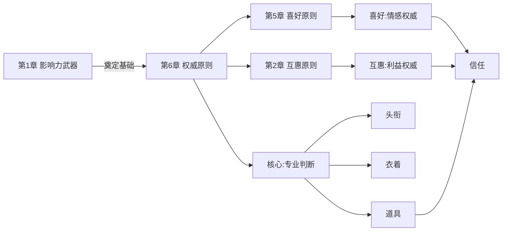
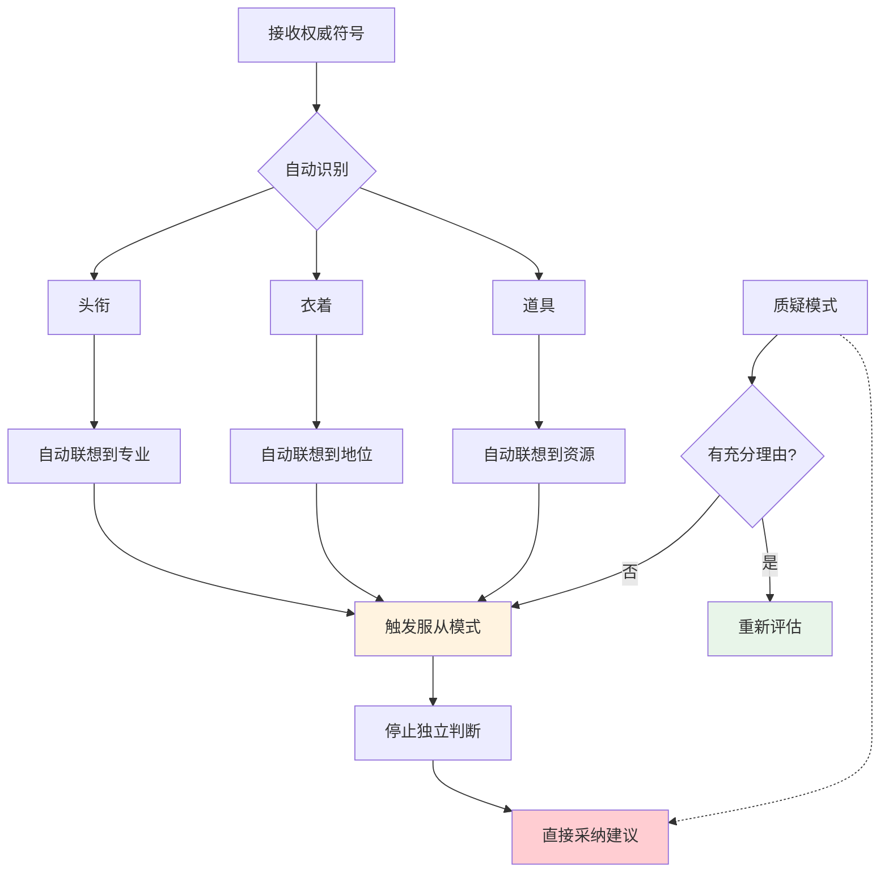
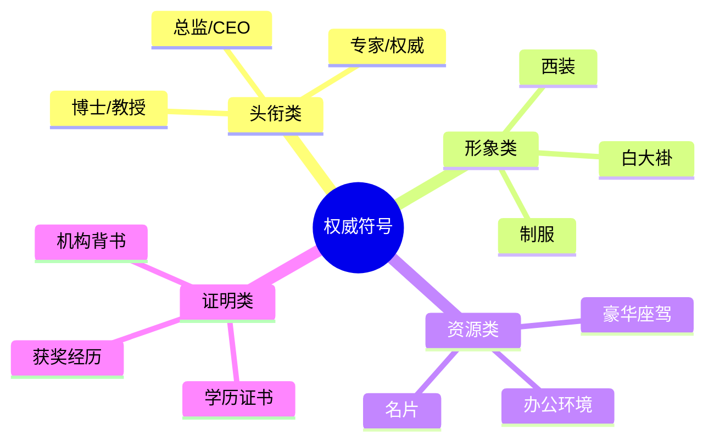

# 第6章 权威原则

## 📍 章节定位

### 全书位置

**核心问题**：为什么我们总是服从"专家"的指示？即使是明显不合理的指示？

**章节回答的问题**：权威是如何建立的？头衔、衣着、座驾——这些"权威符号"如何绕过理性判断？盲目服从权威是愚蠢还是生存智慧？

**一句话总结**：权威原则揭示了人类对"权威"的病态服从——即使权威是伪装的、一个指示、一个头衔，就能让我们放弃独立思考。

**在本书结构中的角色**：**认知层说服**——从"情感"进阶到"专业判断"。

### 章节核心概念

**权威原理（Authority Principle）**：
- 人倾向于服从权威人物的建议
- 权威可以通过外在符号（头衔、衣着、座驾）快速建立
- 权威效应往往在不知不觉中生效

---

## 🎯 核心观点：三层提取

### 第一层：表层案例——权威符号的力量

#### 案例1：米尔格拉姆电击实验
- **场景**：参与者被要求电击"学生"，其实学生是演员
- **结果**：65%的参与者执行了最高450伏电击
- **机制**：穿白大褂的"科学家"=权威，不容质疑
- **启示**：普通人会因权威指示伤害他人

#### 案例2：医生开错药
- **场景**：护士看到医生开的明显错误的药方
- **数据**：95%的护士没有质疑，直接执行
- **原因**：医生=权威，"不应该质疑"是职业本能

#### 案例3：西装效应
- **实验**：同一个路人，穿西装vs穿休闲装
- **结果**：问路时，穿西装时获得更详细的回答
- **机制**：衣着=权威符号，自动触发服从

#### 案例4：头衔与称呼
- **实验**：同样内容，"教授"比"学生"更有说服力
- **数据**：头衔能提升30%的被采纳率
- **机制**：头衔=专业背书

#### 案例5：豪华座驾
- **场景**：同一个男人，换不同车
- **结果**：开豪华车时，更多人让行
- **机制**：座驾=社会地位符号

---

### 第二层：心理机制——为什么我们无法抵抗权威

#### 机制1：进化形成的服从本能
```
远古群体 → 权威=经验=生存保障 → 服从→活下去 → 写入基因
```

**为什么服从权威是进化优势？**
1. **效率**：权威已经验证过的路，跟随最省力
2. **安全**：质疑权威可能被群体排斥
3. **生存**：在危险时刻，统一指挥才能活下去

#### 机制2：认知省力
```
面对复杂问题 → 找权威答案 → 不需要自己判断 → 节约认知资源
```

**为什么我们不想思考？**
1. 独立判断太累
2. 权威看起来更可信
3. 质疑权威需要承担风险

#### 机制3：权威的"自动联想"
```
看到权威符号 → 自动联想到专业+正确+安全 → 不自觉服从
```

**触发词**：
- 头衔：博士、教授、专家、总监
- 衣着：白大褂、西装、制服
- 道具：听诊器、文件袋、名片

#### 机制4："顺从"的文化训练
- 从小被教育"听老师的话"
- 职场被训练"服从安排"
- 社会规范支持"不质疑权威"
- **结果**：质疑权威需要额外的心理能量

---

### 第三层：底层规律——权威的本质

#### 规律1：权威 ≠ 正确
- 权威是"身份"的象征，不是"能力"的保证
- 权威也会犯错，甚至利用权威作恶
- **最危险的时刻**：权威犯错了，人还在服从

#### 规律2：权威符号可以伪造
- 头衔可以自封
- 衣着可以购买
- 座驾可以租赁
- **警惕**：你看到的"权威"可能是假的

#### 规律3：服从是自动的，质疑是需要能量的
- 人类大脑默认"接受"而非"质疑"
- 系统1（快思考）直接服从
- 系统2（慢思考）才可能质疑
- **现实**：大多数时候，系统1在值班

#### 规律4：权威的"启动-停止"特性
- 权威符号出现→自动启动服从模式
- 权威符号消失→停止服从
- **中间没有"检验"环节**

---

## 💬 降维翻译

### 原文核心

> "权威的压力能够让我们做出完全不符合自己利益的事情。"
> —— 西奥迪尼

### 中学生能懂的版本

人从小就听老师、家长的话，久而久之就习惯了听"厉害的人"的话。长大了就听专家的、听老板的、听穿西装的人的。你看电视上，那些穿白大褂推荐药的人，你就不自觉觉得他是医生，其实他可能是演员。

### 奶奶能懂的版本

人老了就容易信这个信那个。那些卖保健品的，一口一个"专家"，一口一个"这个研究证实了"，老年人就信了。实际上专家不专家，谁知道呢？穿个白大褂你就当他是医生了？

---

## ✨ 金句库

### 原书金句

1. "权威的压力能够让我们做出完全不符合自己利益的事情。"
2. "即使是最有理性的人，在权威面前也会放弃独立思考。"
3. "头衔是最容易获得也最容易被伪造的权威象征。"
4. "我们倾向于服从权威，但这并不意味着权威总是正确的。"
5. "衣着是最直观的权威符号，能在瞬间建立信任感。"

### 降维金句

1. "权威说'是'的时候，你说是；权威说'不是'的时候，你说不。"
2. "穿白大褂的不一定是医生，可能是卖保健品的。"
3. "专家也是人，也会犯错——只是我们倾向于忘记这一点。"
4. "头衔是别人给的，能力是自己有的，这两者经常没关系。"
5. "在权威面前，普通人会自愿放弃思考的权利。"

## 🔗 当下映射：现实应用

### 💰 财富/营销场景

| 场景 | 权威符号 | 机制 | 案例 |
|------|---------|------|------|
| 医疗广告 | 白大褂、专家头衔 | 医疗权威 | "老中医"、"主任" |
| 投资理财 | "XX机构认证" | 机构权威 | 理财产品、基金 |
| 知识付费 | "前阿里P8" | 职业权威 | 职场课程 |
| 美容整形 | "韩国专家" | 地域权威 | 医美广告 |
| 保险推销 | 穿西装、拿公文包 | 职业形象 | 保险代理人 |

### 💼 职场场景

| 场景 | 权威符号 | 机制 | 应用 |
|------|---------|------|------|
| 面试 | 简历中的公司名 | 前职权威 | 刷大厂经历 |
| 汇报 | 引用权威报告 | 数据权威 | 增加可信度 |
| 跨部门 | "李总同意了" | 职位权威 | 推动执行 |
| 培训 | "前XX总监" | 头衔权威 | 建立信任 |
| 会议 | 坐主位、最后发言 | 身份权威 | 建立主导权 |

### 🏠 生活场景

| 场景 | 陷阱 | 破解 |
|------|------|------|
| 电视购物 | "专家推荐" | 查证专家身份 |
| 保健品 | "航天员在用" | 辨别真伪 |
| 养生文章 | "研究证实" | 查原始研究 |
| 网红推荐 | "XX都在用" | 不是权威 |
| 父母被诈骗 | "公安局来电" | 核实身份 |

### 72小时行动计划

1. **今天**：注意3次你因为"权威"而做出决定的场景
2. **本周**：查证一个你最近听到的"专家说"的真实性
3. **本月**：在重要决定上，尝试不依赖"权威"，自己查证

---

## 🕸️ 章节关联

### 与前后章节的关系



**逻辑关系**：
- **递进**：喜好（情感）→ 权威（专业）→ 联盟（身份）
- **并列**：权威vs喜好vs互惠，不同维度的信任

### 与整书的关系

**核心地位**：权威是"专业层"说服的代表
- 特点：不需要情感连接，只需要"看起来专业"
- 适用场景：复杂问题、风险决策

### 跨书关联

| 书籍 | 关联点 |
|------|--------|
| 《思考快与慢》 | 系统1的权威服从、锚定效应 |
| 《助推》 | 自由家长制vs权威 |
| 《穷查理宝典》 | "权威倾向"人类误判 |
| 《乌合之众》 | 群体中的权威崇拜 |

---

## ❓ 问答设计：认知层次递进

### 第一层：记忆

1. **权威原则的核心是什么？**
   - 人倾向于服从权威人物的建议

2. **常见的权威符号有哪些？**
   - 头衔、衣着、座驾、配饰

3. **米尔格拉姆实验说明了什么？**
   - 普通人会因权威指示伤害他人

### 第二层：理解

4. **为什么人类进化出了服从权威的本能？**
   - 效率、安全、群体生存

5. **权威符号为什么有效？**
   - 自动触发联想，跳过理性判断

6. **"穿白大褂"为什么有权威感？**
   - 职业联想：医生=专业+救死扶伤

### 第三层：分析

7. **为什么权威往往是对的，但我们不应该盲目服从？**
   - 权威≠正确，权威也会犯错

8. **伪权威和真权威如何区分？**
   - 查身份、查资质、查利益关系

9. **权威原则和喜好原则有什么区别？**
   - 喜好：情感连接
   - 权威：专业判断

### 第四层：应用

10. **如何让自己看起来更权威？**
    - 打造头衔、注意衣着、使用专业术语

11. **如何利用权威原则做营销？**
    - 权威背书、专家站台、机构认证

12. **如何在职场建立权威？**
    - 专注领域、专业输出、公开演讲

### 第五层：防御

13. **如何识别伪权威？**
    - 查资质、查利益、问"谁在受益"

14. **什么情况下应该质疑权威？**
    - 涉及金钱、健康、人身安全时

15. **如何做到"尊重权威但不盲从"？**
    - 查证、独立思考、允许犯错

---

## 📊 可视化总结

### 权威服从的心理链路



### 权威符号层级



---

## 🛡️ 防御策略

### 三步防御法

**Step 1：暂停**
- 看到"权威"时，先不要立即反应
- 问：这是不是又在触发我的自动反应？

**Step 2：查证**
- 这个"权威"是真的吗？
- 查资质、查背景、查利益关系
- "专家"推荐的产品，专家自己用吗？

**Step 3：独立判断**
- 假设没有这个"权威"，你会怎么选？
- 权威≠正确，要为自己的决定负责

### 关键心态

> "权威值得尊敬，但不值得盲从。"
> 真正的理性是：尊重权威的专业，但不放弃自己判断的权利。

---

## 📌 本章要点速记

| 概念 | 一句话 |
|------|--------|
| 权威原则 | 专家说的=对的 |
| 权威符号 | 头衔、衣着、座驾 |
| 服从本能 | 进化给的自动反应 |
| 伪权威 | 可以伪造的象征 |
| 防御核心 | 查证+独立判断 |

---

## 🔖 延伸思考

1. **AI时代**：当AI拥有"专家"的海量知识时，我们是否会更服从AI？
2. **教育孩子**：如何培养"质疑权威"的能力而不变成"不尊敬长辈"？
3. **职场文化**：领导的话=圣旨？如何平衡服从与创新？
4. **自我反思**：我曾经因为"权威"犯过什么错？

---

*创建日期：2026-02-26*
*整书拆解：[[影响力-西奥迪尼]]*
*章节导航：[[影响力/_导航]]*