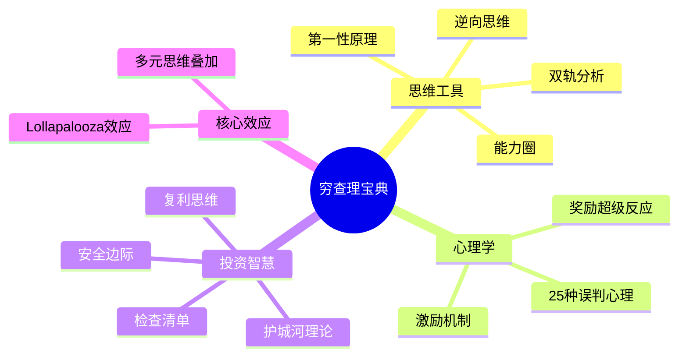

# 穷查理宝典 - 章节拆解导航

## 📖 书籍信息

| 属性 | 内容 |
|------|------|
| **书名** | 穷查理宝典（Poor Charlie's Almanack） |
| **作者** | 查理·芒格（Charlie Munger） |
| **编者** | 彼得·考夫曼（Peter D. Kaufman） |
| **主题** | 多元思维模型、投资智慧、决策方法 |
| **核心价值** | 跨学科思维框架，80-90个思维模型 |

## 🧠 核心思维模型体系

## 📚 传记 + 11讲

### 📖 传记章节

| 序号 | 主题 | 核心内容 | 状态 | 优先级 | 笔记文件 |
|:----:|------|----------|:----:|:------:|----------|
| 00 | 查理·芒格传略 | 生平经历、思维根源、人生哲学 | ✅ 已完成 | 🔴 高 | `[[第1章-查理芒格传略]]` |
| 01 | 芒格主义 | 终身学习、逆向思维、耐心、诚信 | ✅ 已完成 | 🔴 高 | `[[第2章-芒格主义]]` |
| 02 | 芒格的私人书单 | 跨学科阅读、模型萃取、四支柱框架 | ✅ 已完成 | 🔴 高 | `[[第3章-芒格的私人书单]]` |
| 03 | 芒格论投资 | 价值投资、能力圈、护城河、安全边际 | ✅ 已完成 | 🔴 高 | `[[第4章-芒格论投资]]` |
| 04 | 芒格论商业 | 好生意特征、激励机制、商业失败规律 | ✅ 已完成 | 🔴 高 | `[[第5章-芒格论商业]]` |
| 05 | 芒格论投资决策 | 检查清单、双轨分析、逆向思考、独立思考 | ✅ 已完成 | 🔴 高 | `[[第6章-芒格论投资决策]]` |
| 06 | 芒格论人生 | 配得感、理性、诚实、终身学习、避开愚蠢 | ✅ 已完成 | 🔴 高 | `[[第7章-芒格论人生]]` |
| 07 | 芒格论学习 | 终身学习、跨学科、模型化、费曼技巧、逆向学习 | ✅ 已完成 | 🔴 高 | `[[第8章-芒格论学习]]` |
| 08 | 芒格的思维方式 | 思维模型、决策框架、跨学科思维 | ✅ 已完成 | 🔴 高 | `[[第9章-芒格的思维方式]]` |
| 09 | 人类误判心理学 | 24种心理倾向、Lollapalooza效应 | ✅ 已完成 | 🔴 高 | `[[第10章-人类误判心理学]]` |
| 10 | 芒格的智慧总结 | 五大支柱、全书闭环、人生指南 | ✅ 已完成 | 🔴 高 | `[[第11章-芒格的智慧总结]]` |

### 🎓 11个核心讲座

| 序号 | 主题 | 核心模型 | 状态 | 优先级 | 笔记文件 |
|:----:|------|----------|:----:|:------:|----------|
| 01 | 多元思维模型 | 80-90个跨学科模型 | ✅ 已完成 | 🔴 高 | `[[第1讲-多元思维模型]]` |
| 02 | 逆向思维 | "我只想知道我将来会死在哪里" | ✅ 已完成 | 🔴 高 | `[[第2讲-逆向思维]]` |
| 03 | 能力圈 | 知道自己不知道什么 | ✅ 已完成 | 🔴 高 | `[[第3讲-能力圈]]` |
| 04 | 检查清单 | 投资决策清单 | ✅ 已完成 | 🔴 高 | `[[第4讲-检查清单]]` |
| 05 | 人类误判心理学 | 25个心理倾向 | ✅ 已完成 | 🔴 高 | `[[第5讲-人类误判心理学]]` |
| 06 | Lollapalooza效应 | 多种力量叠加 | ✅ 已完成 | 🟡 中 | `[[第6讲-Lollapalooza效应]]` |
| 07 | 安全边际 | 留有余地 | ✅ 已完成 | 🔴 高 | `[[第7讲-安全边际]]` |
| 08 | 芒格主义 | 生活和投资智慧 | ✅ 已完成 | 🟢 低 | `[[第8讲-芒格主义]]` |
| 09 | 复利思维 | 时间的力量 | ✅ 已完成 | 🔴 高 | `[[第9讲-复利思维]]` |
| 10 | 双轨分析 | 理性+心理 | ✅ 已完成 | 🟡 中 | `[[第10讲-双轨分析]]` |
| 11 | 护城河 | 竞争优势分析 | ✅ 已完成 | 🔴 高 | `[[第11讲-护城河]]` |
## 🎯 模型分类速查

### 思维工具类
- [[第1讲-多元思维模型]] - 跨学科知识框架
- [[第2讲-逆向思维]] - 反向思考问题
- [[03-能力圈]] - 认知边界意识
- [[10-双轨分析]] - 理性与心理双轨

### 心理学类
- [[05-人类误判心理学]] - 25种认知偏误
- 激励机制 - 超级力量

### 投资智慧类
- [[07-安全边际]] - 风险缓冲
- [[11-护城河理论]] - 竞争壁垒
- [[09-复利思维]] - 长期积累
- [[04-检查清单]] - 决策流程

### 核心效应
- [[06-Lollapalooza效应]] - 多因素共振
- [[08-芒格主义]] - 人生智慧集锦

## 📊 拆解进度

### 传记章节
- **总计**: 11 个章节
- **已完成**: 11 个
- **完成率**: 100%

### 讲座章节
- **总计**: 11 个章节
- **已完成**: 11 个
- **完成率**: 100%

### 总体进度
- **总计**: 22 个章节
- **已完成**: 22 个
- **完成率**: 100%
- **最新完成**: 第11章-芒格的智慧总结 (2026-02-28)
## 🔗 相关资源

- [[穷查理宝典-拆解记录]] - 原始拆解笔记
- [[影响力-西奥迪尼-拆解记录]] - 心理学相关
- [[纳瓦尔宝典-乔根森-拆解记录]] - 同类智慧书籍

## 💡 拆解指南

### 高优先级章节（建议先拆）
1. **查理·芒格传略** - 理解芒格其人
2. **多元思维模型** - 全书核心框架
3. **人类误判心理学** - 最实用的心理学工具
4. **逆向思维** - 芒格标志性思维
5. **安全边际** - 投资核心概念
6. **能力圈** - 认知边界

### 拆解模板
每个章节拆解应包含：
- 核心概念定义
- 实际应用案例
- 与其他模型的关联
- 个人行动清单
- 可用于文章的金句

---

*创建日期: 2026-02-26*
*最后更新: 2026-02-28*
*最新完成: 第8章-芒格论学习*
