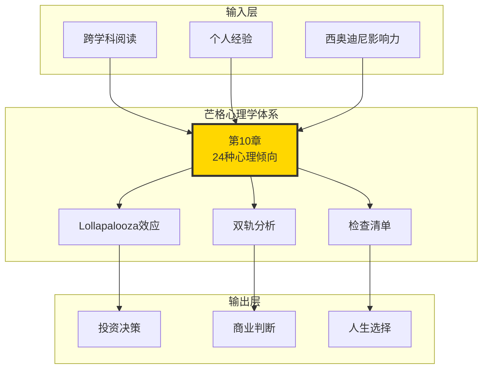
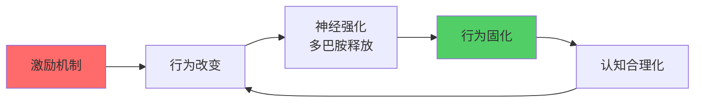
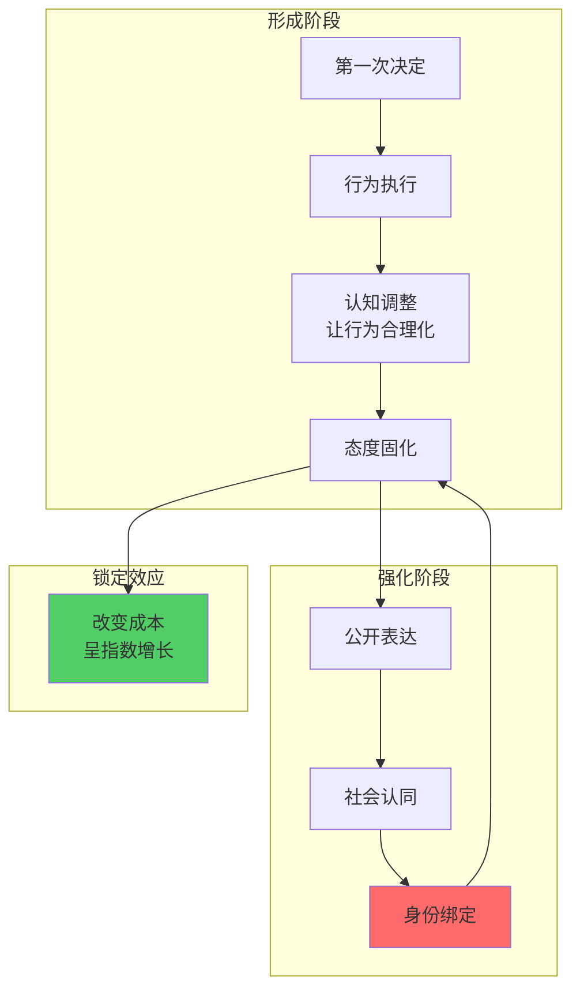
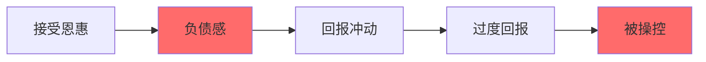
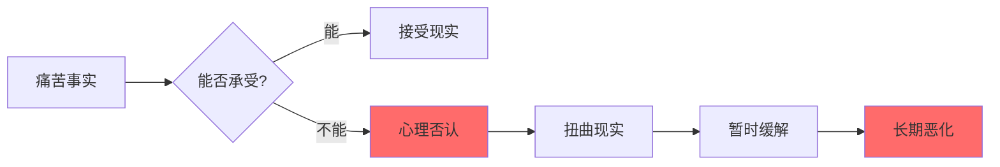
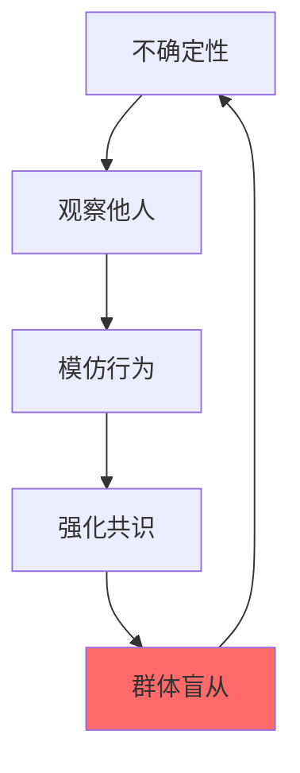
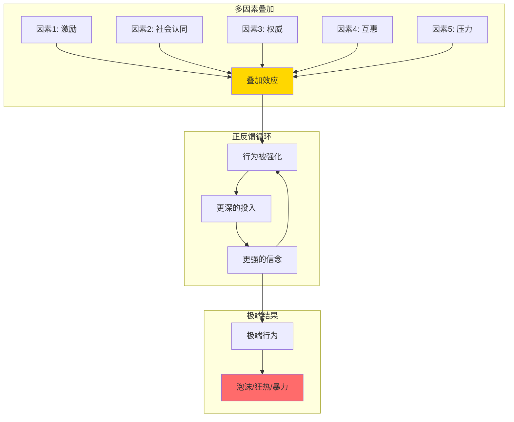
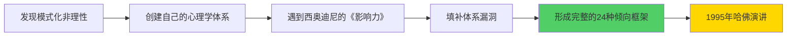
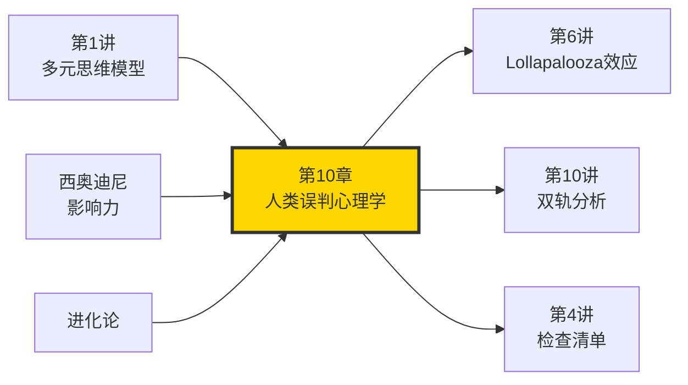

# 第10章 人类误判心理学（深度拆解）

## 一、章节定位

### 1.1 这一章在全书中回答什么问题？

**核心问题**：为什么聪明人会反复做蠢事？人类大脑有哪些"出厂设置"的认知bug？

**一句话定位**：
> 人类大脑不是理性计算器，而是进化塑造的生存机器——它有24种内置的认知捷径，这些捷径曾经帮我们活下来，现在却让我们陷入决策陷阱。

### 1.2 章节三维定位

| 维度 | 定位 |
|------|------|
| 在全书的位置 | 芒格心理学体系的完整呈现，是多元思维模型中最实用的子集 |
| 与其他章节关联 | 第5讲的深度扩展，与双轨分析、Lollapalooza效应共同构成芒格心理学三角 |
| 核心贡献 | 第一次系统化地列举了24种心理倾向，并用跨学科方法解释其机制 |
| 历史地位 | 芒格1995年哈佛演讲，比《思考快与慢》早16年提出认知偏误框架 |

### 1.3 为什么这一章如此重要？

**芒格的原话**：
> "我这辈子遇到的聪明人，没有一个不是每天都在学习的。但我发现，即使是最聪明的人，也会被心理倾向愚弄。"

**三个关键洞察**：
1. **聪明不等于理性**：高智商不免疫心理偏误
2. **进化而非bug**：这些倾向曾经是生存优势
3. **叠加效应致命**：单一倾向可控，多种叠加时神仙难逃

### 1.4 与全书逻辑的关系



---

## 二、芒格的24种心理倾向（完整清单）

### 🔴 Tier 1：超强影响（核心6种）

#### 1. 激励超级反应倾向（Reward Superresponse Tendency）

**【表层】现象层**

芒格认为这是24种倾向中最强大的一种：
> "告诉我激励机制是什么，我就能告诉你结果会是什么。"

**经典案例**：

| 案例 | 激励设计 | 结果 |
|------|----------|------|
| **联邦快递** | 按小时支付夜班 → 按班次支付 | 效率暴涨，系统瞬间正常 |
| **施乐复印机** | 旧机型提成更高 | 更好的新机型卖不动 |
| **医生的胆囊** | 手术费按例收取 | 大量正常胆囊被切除 |
| **成本加成合同** | 成本越高利润越高 | 国防部禁止这种合同 |

**【中层】机制层**



**为什么如此强大？**
1. **进化优势**：追求奖励的基因更容易存活
2. **神经机制**：多巴胺系统强化奖励相关行为
3. **社会结构**：整个社会围绕激励设计
4. **即时反馈**：奖励比惩罚更有效

**【底层】规律层**

> **激励定律**：人的行为90%可以用"他在追求什么好处"来解释——剩下10%是你没找到那个好处。

**降维翻译**：
> 你想知道一个人为什么这么做？别问他怎么想，看他能拿什么好处。

**【当下连接】**

|----------|----------|----------|
| 为什么老板画的饼从来不兑现？ | 激励不兑现 = 激励失效 | "原来不是我傻" |
| 为什么保险推销员这么热情？ | 他的佣金来自你的保费 | "被看穿了" |
| 为什么KPI导向的团队效率低？ | 人们只做KPI里的事 | "制度有问题" |

**【防御策略】**
1. 识别激励：问"对方能得到什么好处？"
2. 设计对齐：让激励与目标一致
3. 警惕意外：好的激励可能带来坏的结果

---

#### 2. 避免不一致倾向（Inconsistency-Avoidance Tendency）

**【表层】现象层**

人类天生抗拒改变，宁愿维持错误的现状。

**芒格的比喻**：
> "人的大脑就像人类的卵子——当一个精子进入，它就会关闭，不让下一个精子进入。"

**经典案例**：

| 表现 | 例子 | 后果 |
|------|------|------|
| **路径依赖** | 明知道新路更近，还是走老路 | 错失机会 |
| **沉没成本** | 亏钱的股票不舍得卖 | 越陷越深 |
| **习惯固化** | 坏习惯改不掉 | 持续受害 |
| **首因效应** | 第一印象很难改变 | 刻板印象 |
| **承诺陷阱** | 中国洗脑技术比酷刑有效 | 逐步沦陷 |

**【中层】机制层**



**芒格的关键洞察**：
1. **行为改变态度**：不是态度改变行为，而是行为改变态度
2. **公开承诺强化**：说出的话会"敲进"你的大脑
3. **渐进式陷阱**：小承诺 → 大承诺 → 不可逆
4. **专家尤其脆弱**：斯金纳、经济学家都中招

**【底层】规律层**

> **惯性定律**：改变一个行为的成本，远高于维持它的成本——除非痛苦足够大。

**降维翻译**：
> 你的大脑是个懒汉，宁愿用旧的错误答案，也不想重新算一遍。

**【当下连接】**

| 场景 | 陷阱 | 应对 |
|------|------|------|
| 股票亏损 | "再等等会回本" | 预设止损规则，机械执行 |
| 坏习惯 | "明天再改" | 从微习惯开始，降低改变阻力 |
| 人际关系 | "他以前不是这样的" | 定期评估关系现状 |

---

#### 3. 好奇心倾向（Curiosity Tendency）

**【表层】现象层**

好奇心是人类进步的引擎，但也可能导致危险。

**芒格的观察**：
> "好奇心让人类从动物界脱颖而出，但也让现代人陷入信息过载。"

**两面性**：

| 正面 | 负面 |
|------|------|
| 探索新知识 | 八卦、窥探隐私 |
| 尝试新方法 | 点开标题党 |
| 科学发现 | 沉迷短视频 |
| 艺术创造 | 追逐热点 |

**【中层】机制层**

| 层面 | 解释 |
|------|------|
| 进化 | 好奇的祖先发现了更多食物和栖息地 |
| 神经 | 新奇刺激释放多巴胺 |
| 文化 | 科学、艺术都源于好奇心 |
| 风险 | 好奇心也可能害死猫 |

**降维翻译**：
> 好奇心让你点了那个"震惊"标题，也让你学了那门新课。用对了是进步，用错了是浪费时间。

**【底层】规律层**

> **探索定律**：好奇心是中性的，方向决定它是资产还是负债。

---

#### 4. 康德式公平倾向（Kantian Fairness Tendency）

**【表层】现象层**

人类对"公平"有执念，甚至会为了公平牺牲利益。

**经典实验：最后通牒博弈**
- A有100元，决定分给B多少
- B可以选择接受或拒绝
- 如果拒绝，两人都得不到
- 结果：大多数人拒绝低于20%的分配

**日常表现**：

| 表现 | 例子 |
|------|------|
| 排队意识 | 有人插队会愤怒 |
| 税收争议 | 不是交多少的问题，是"公平"的问题 |
| 薪酬透明 | 知道同事比自己多会愤怒 |
| 股权分配 | 创业团队因分配不公而解散 |

**【中层】机制层**

| 来源 | 解释 |
|------|------|
| 进化 | 群体合作需要公平感维持 |
| 文化 | 公平是社会契约的基石 |
| 情绪 | 不公平感激活大脑的厌恶区域 |
| 博弈 | 长期合作需要公平作为信号 |

**降维翻译**：
> 你可以接受赚得少，但不能接受"凭什么他赚得多"。公平感比钱更重要。

**【底层】规律层**

> **公平定律**：人类对公平的敏感度，远高于对利益的敏感度。

**【管理启示】**
1. 公平感比实际收益更能影响满意度
2. 透明的规则比模糊的高薪更好
3. 不公平感会破坏合作基础

---

#### 5. 嫉妒倾向（Envy/Jealousy Tendency）

**【表层】现象层**

芒格引用巴菲特的话：
> "不是贪婪驱动世界，而是嫉妒。"

**宗教印证**：嫉妒占据了十诫的两条

**日常表现**：
- 看到同事加薪比自己更愤怒
- 朋友圈的"别人的生活"
- 同学的成功比陌生人的成功更难接受
- 兄弟姐妹间的比较

**【中层】机制层**

| 来源 | 解释 |
|------|------|
| 进化 | 竞争资源的动力 |
| 社会 | 比较是社会化的一部分 |
| 心理 | 自我价值通过比较确认 |
| 悖论 | 越接近的人越容易嫉妒 |

**芒格的观察**：
> "学术心理学对嫉妒几乎完全忽视，千页教科书中可能只有一句话。但它是真实存在且极其强大的力量。"

**降维翻译**：
> 陌生人发财你不在意，邻居发财你睡不着。

**【底层】规律层**

> **嫉妒定律**：嫉妒的距离与强度成反比——越接近的人越容易引发嫉妒。

---

#### 6. 互惠倾向（Reciprocation Tendency）

**【表层】现象层**

西奥迪尼的经典实验：
- 先请求："每周花两个下午帮助少年犯" → 100%拒绝
- 策略改变：先请求"带少年犯去动物园" → 1/6接受
- 再退让："那至少去一次动物园？" → 成功率提高3倍

**芒格的评价**：
> "西奥迪尼的《影响力》填补了我心理学体系的很多漏洞。这本书你应该给你的孩子和朋友都买一本。"

**经典案例**：

| 案例 | 机制 |
|------|------|
| 免费样品 | 小恩惠触发大回报 |
| 婚礼红包 | 社会互惠的强制力 |
| 政治献金 | 利益交换的隐形契约 |
| 商务饭局 | 吃人嘴短的心理学 |

**【中层】机制层**



**芒格的警告**：
> "如果你不了解互惠倾向，你就像一个独腿人在踢屁股比赛中——你给了外部世界太多本不该给的优惠。"

**降维翻译**：
> 免费的不是最贵的，但免费的最容易让你掏钱。

**【底层】规律层**

> **互惠定律**：人类有强烈的"负债-回报"平衡需求，这可以被利用也可以被防御。

**【防御策略】**
1. 识别免费背后的动机
2. 区分真诚互惠和操纵策略
3. 对不合理的请求说"不"不需要愧疚

---

### 🟡 Tier 2：重要影响（中等6种）

#### 7. 喜欢/热爱倾向（Liking/Loving Tendency）

**【表层】现象层**

- 爱屋及乌：喜欢一个人就会喜欢他的一切
- 光环效应：好看的更容易被信任
- 偏见盲区：对喜欢的人的缺点视而不见

**【中层】机制层**

| 层面 | 解释 |
|------|------|
| 进化 | 爱是繁衍和抚养的动力 |
| 神经 | 催产素和内啡肽的作用 |
| 社会 | 喜欢促进群体凝聚力 |
| 风险 | 喜欢会扭曲判断 |

**芒格的警告**：
> "当你喜欢的人给你建议时，你的批判性思维会下降。"

**降维翻译**：
> 情人眼里出西施，骗子眼里出肥羊。

**【防御策略】**
- 区分情感和事实
- 对喜欢的人的建议也要独立验证
- 警惕"因为喜欢所以信任"的陷阱

---

#### 8. 讨厌/憎恨倾向（Disliking/Hating Tendency）

**【表层】现象层**

- 恨屋及乌：讨厌一个人就会否定他的一切
- 确认偏误：只看到讨厌的人的缺点
- 拒绝学习：从讨厌的人身上学不到东西

**【中层】机制层**

喜欢和讨厌是对称的：
- 喜欢扭曲判断 → 忽略缺点
- 讨厌扭曲判断 → 忽略优点

**芒格的洞察**：
> "讨厌倾向让我们无法从敌人身上学习——这是一个巨大的损失。"

**降维翻译**：
> 你讨厌的人说的每句话，你都觉得是错的——即使他是对的。

**【防御策略】**
- 区分人和观点
- 即使敌人也可能有智慧
- 强制自己寻找讨厌的人的优点

---

#### 9. 避免怀疑倾向（Doubt-Avoidance Tendency）

**【表层】现象层**

- 快速判断：大脑讨厌不确定性
- 信仰需求：宗教和意识形态的吸引力
- 权威依赖：寻求确定性的答案

**【中层】机制层**

| 来源 | 解释 |
|------|------|
| 进化 | 在危险环境中犹豫会致命 |
| 认知 | 不确定性消耗更多脑力 |
| 情绪 | 不确定引发焦虑 |
| 社会 | 社会需要共同信念 |

**芒格的观察**：
> "法官和陪审团被迫快速做出决定，这导致他们更容易被心理倾向影响。"

**降维翻译**：
> 大脑讨厌"不知道"，宁愿要一个错误的答案，也不要没有答案。

**【底层】规律层**

> **怀疑定律**：快速决策在进化中是优势，在现代社会可能是劣势。

---

#### 10. 避免痛苦的心理否认（Pain-Avoiding Psychological Denial）

**【表层】现象层**

芒格的个人案例：
> "我们家的朋友有一个超级运动员、超级学生的儿子，在北大西洋的航母上飞行，再也没有回来。他非常理智的母亲，从来就不相信他已经死了。"

**日常表现**：

| 表现 | 例子 |
|------|------|
| 否认死亡 | 母亲不相信儿子死了 |
| 否认成瘾 | "我能随时戒掉" |
| 否认事实 | "这个股票会涨回来的" |
| 否认关系 | "他其实很爱我" |

**【中层】机制层**



**芒格的洞察**：
> "化学依赖总是伴随着心理否认——你无法让一个成瘾者承认自己成瘾。"

**降维翻译**：
> 现实太痛苦的时候，大脑会自动帮你"编故事"——直到编不下去了。

**【底层】规律层**

> **否认定律**：当现实超出承受能力，大脑会自动扭曲现实——这是一种保护机制，但也是危险机制。

---

#### 11. 剥夺超级反应倾向（Deprival-Superreaction Tendency）

**【表层】现象层**

芒格的狗的故事：
> "我家的狗非常温顺，但唯一能让它咬你的方法，就是试图从它嘴里拿走东西。"

**日常表现**：

| 表现 | 例子 |
|------|------|
| 损失厌恶 | 亏100的痛苦 > 赚100的快乐 |
| 几乎得到 | 差点中奖比没中奖更痛苦 |
| 小损失大反应 | 邻居的树挡了0.25度的视野引发血案 |
| 改革阻力 | 改革会让一些人失去特权 |

**经典案例：新可乐**

可口可乐犯的错误：
1. 花了100年建立品牌
2. 告诉消费者"口味升级"
3. 触发了剥夺超级反应
4. 消费者愤怒抵制
5. 百事差点推出"老可乐"

**【中层】机制层**

| 层面 | 解释 |
|------|------|
| 进化 | 失去资源意味着生存威胁 |
| 神经 | 损失激活大脑的疼痛区域 |
| 心理 | 损失权重 > 获得权重 |
| 行为 | 损失驱动行为改变更强烈 |

**芒格的洞察**：
> "人们不是对称地对待损失和收益。失去100美元的痛苦，远大于得到100美元的快乐。"

**降维翻译**：
> 你可以接受从未拥有，但无法接受得而复失。

**【底层】规律层**

> **剥夺定律**：失去（或差点得到）的痛苦，是同等获得快乐的2-2.5倍。

**【管理启示】**
- 改革要考虑失去者的反应
- 不要轻易取消已有的福利
- 如果必须剥夺，要给予补偿

---

#### 12. 过度乐观倾向（Excessive Optimism Tendency）

**【表层】现象层**

- 90%的司机认为驾驶水平高于平均
- 创业者高估成功率
- 投资者低估风险
- 计划谬误：总是低估时间和成本

**【中层】机制层**

| 来源 | 解释 |
|------|------|
| 进化 | 乐观促进探索和冒险 |
| 心理 | 乐观是自我保护机制 |
| 社会 | 乐观的人更容易成功（也更容易失败） |
| 认知 | 可得性启发式偏差 |

**芒格的警告**：
> "过度乐观让你低估风险，这是投资中最危险的心态。"

**降维翻译**：
> 你觉得你比大多数人聪明——大多数人也是这么觉得的。

**【防御策略】**
- 强制考虑最坏情况
- 引入外部视角
- 使用"事前验尸"技术

---

### 🟢 Tier 3：情境影响（环境6种）

#### 13. 社会认同倾向（Social-Proof Tendency）

**【表层】现象层**

**Kitty Genovese案例**：
- 50-60个目击者
- 无人报警或干预
- 部分原因：看到别人不行动，认为"应该不严重"

**商业案例**：
- 一个石油公司收购化肥公司
- 所有其他石油公司跟着收购
- 没有任何逻辑，只是"别人在做"
- 结果：全部失败

**【中层】机制层**



**芒格的洞察**：
> "市场价格是终极的社会认同——它反映了其他人在想什么。这就是为什么市场会出现极端泡沫。"

**降维翻译**：
> 大家都做的事不一定是对的——但很难不跟着做。

---

#### 14. 对比错误反应倾向（Contrast-Misreaction Tendency）

**【表层】现象层**

**西奥迪尼的三桶水实验**：
- 左手热水，右手冷水
- 都放入温水
- 左手觉得冷，右手觉得热

**商业应用**：
- 房地产经纪人先带你看两个烂房子
- 再带你看"还行"的房子
- 你就觉得这个房子不错

**温水煮青蛙**（芒格的比喻）：
> "我不知道青蛙会不会被煮死，但我知道很多商人会被慢慢煮死——因为变化是渐进的，对比不明显。"

**【中层】机制层**

| 层面 | 解释 |
|------|------|
| 神经 | 感觉系统是相对的，不是绝对的 |
| 认知 | 判断依赖参照点 |
| 操纵 | 移动参照点可以操纵判断 |
| 风险 | 渐进变化难以察觉 |

**降维翻译**：
> 你的判断是相对的——给你看贵的，便宜的就显得超值。

**【防御策略】**
- 建立绝对标准，而非相对标准
- 警惕渐进式变化
- 定期回顾"原点"

---

#### 15. 压力影响倾向（Stress-Influence Tendency）

**【表层】现象层**

**巴甫洛夫的发现**：
- 洪水差点淹没实验室
- 幸存的狗完全改变了性格
- 之前建立的 conditioning 全部消失
- 巴甫洛夫余生都在研究"如何让狗精神崩溃"

**芒格的洞察**：
> "压力会改变人的性格和判断——这就是为什么邪教和传销会制造压力环境。"

**日常表现**：
- 仓促决策往往错误
- 高压环境下容易盲从
- 危机中更容易接受权威

---

#### 16. 权威影响倾向（Authority-Misinfluence Tendency）

**【表层】现象层**

**米尔格拉姆实验**：
- 普通人被"权威"指示
- 给无辜者施加"致命电击"
- 65%的人服从到最高电压

**飞行员模拟实验**：
- 机长做明显错误的决定
- 副驾驶知道会坠机
- 25%的情况下飞机坠毁
- 原因：无法挑战权威

**【中层】机制层**

| 层面 | 解释 |
|------|------|
| 进化 | 服从权威提高群体生存率 |
| 社会 | 组织需要等级结构 |
| 心理 | 权威降低决策负担 |
| 风险 | 盲目服从导致灾难 |

**芒格的警告**：
> "权威影响非常强大，但不像某些人想的那么绝对——还是有35%的人不服从。"

**降维翻译**：
> 专家说的不一定对，但他说的你更容易信。

---

#### 17. 重视理由倾向（Reason-Respecting Tendency）

**【表层】现象层**

**经典实验**：
- "我可以先用一下复印机吗？" → 60%同意
- "我可以先用一下复印机吗？因为我要复印" → 95%同意
- "因为"后面的内容毫无意义，但"因为"这个词本身就有效

**芒格的洞察**：
> "如果你要说服别人，告诉他们'为什么'。'为什么'本身比理由的内容更重要。"

**商业应用**：
- 广告总要说"因为..."
- 管理要解释"为什么这样做"
- 教育要说明"为什么要学这个"

**降维翻译**：
> 人们需要理由，哪怕这个理由毫无道理。

---

#### 18. 化学物质依赖倾向（Drug-Misinfluence Tendency）

**【表层】现象层**

- 酒精导致冲动
- 药物影响判断
- 成瘾伴随否认

**芒格的观察**：
> "化学依赖总是伴随着道德崩溃和大规模心理否认。"

**警示**：
- 任何可能影响判断的物质都要谨慎
- 成瘾不仅影响健康，也影响决策
- 否认是成瘾的一部分

---

### 🔵 Tier 4：认知特征（内在6种）

#### 19. 自视过高倾向（Overoptimism Tendency）

- 90%的司机认为驾驶水平高于平均
- 高估自己的能力和知识
- 低估风险和困难

**降维翻译**：
> 你觉得你比大多数人聪明——大多数人也这么觉得。

---

#### 20. 衰老影响倾向（Senescence-Misinfluence Tendency）

- 认知能力随着年龄下降
- 但智慧和经验可以补偿
- 需要主动维护认知能力

---

#### 21. 权威-追随倾向（Authority-Following Tendency）

- 人类天生有等级意识
- 组织依赖权威结构
- 需要平衡服从和独立思考

---

#### 22. 废话倾向（Twaddle Tendency）

**芒格的蜜蜂比喻**：
> "蜜蜂找到花蜜会跳舞告诉其他蜜蜂位置。但科学家把花蜜放在很高的地方（自然界不存在的情况），蜜蜂回来跳的舞毫无意义——但它还是要跳。人类也一样，不知道也要说点什么。"

**日常表现**：
- 会议上的空话
- 不懂装懂的发言
- 为了说话而说话

**降维翻译**：
> 不知道的时候，人们宁愿说废话也不愿闭嘴。

---

#### 23. 意义寻求倾向（Sensemaking Tendency）

- 人类需要意义
- 宗教和意识形态的吸引力
- 随机事件也要找因果关系

---

#### 24. 模仿倾向（Copycat Tendency）

- 从众行为的基础
- 潮流和时尚的机制
- 孩子模仿父母

---

## 三、Lollapalooza效应：心理倾向的叠加

### 3.1 什么是Lollapalooza效应？

**芒格的定义**：
> "当多种心理倾向同时作用于同一方向时，产生的效果远大于简单相加——这是芒格发明的术语，指'超级倾向'。"

### 3.2 经典案例

#### 案例1：特百惠派对

| 心理倾向 | 如何发挥作用 |
|----------|--------------|
| 互惠 | 免费的食物和小礼物 |
| 社会认同 | 其他人在购买 |
| 权威 | 派对主持人的推荐 |
| 喜好 | 朋友邀请你来的 |
| 稀缺 | "限时优惠" |
| 承诺一致 | 小的购买承诺 |

**结果**：数十亿美元的销售额

#### 案例2：邪教转化

| 心理倾向 | 如何发挥作用 |
|----------|--------------|
| 避免怀疑 | 提供确定的答案 |
| 社会认同 | 群体成员都在信 |
| 权威 | 教主的权威 |
| 互惠 | 给你食物和住所 |
| 剥夺反应 | 离开会失去"家人" |
| 压力 | 长期疲劳和环境控制 |

**结果**：理性的人也会变成狂热信徒

#### 案例3：股市泡沫

| 心理倾向 | 如何发挥作用 |
|----------|--------------|
| 激励 | 经理人的绩效奖金 |
| 社会认同 | 价格上涨=大家都买 |
| 过度乐观 | "这次不一样" |
| 剥夺反应 | 怕错过（FOMO） |
| 喜欢倾向 | 喜欢上涨的股票 |
| 废话倾向 | 分析师的各种解释 |

**结果**：极端的市场泡沫

### 3.3 Lollapalooza效应的心理机制



### 3.4 如何防御Lollapalooza效应？

**芒格的建议**：
> "当多种心理倾向同时出现时，你要特别警惕——这是最容易犯错的时候。"

**防御策略**：
1. **识别组合**：意识到多种倾向在同时作用
2. **延迟决策**：不要在复杂心理环境下快速决定
3. **外部视角**：找不受这些倾向影响的人咨询
4. **反向测试**：如果所有因素都指向一个方向，反过来想

---

## 四、芒格的心理学方法论

### 4.1 芒格vs传统心理学

| 维度 | 传统心理学 | 芒格的心理学 |
|------|------------|--------------|
| 方法 | 实验室研究 | 跨学科+个人经验 |
| 视角 | 单一倾向研究 | 多倾向叠加分析 |
| 应用 | 学术论文 | 实际决策工具 |
| 来源 | 文献综述 | 西奥迪尼+进化论+经济学 |

### 4.2 芒格的自我学习路径



### 4.3 芒格的独特贡献

1. **跨学科整合**：心理学+经济学+进化论
2. **实用性导向**：不是为了发表论文，而是为了更好地决策
3. **叠加效应强调**：单一倾向不够，重点是组合
4. **自我反思**：承认自己也会犯错

---

## 五、金句库

### 原书金句（芒格原话）

1. "告诉我激励机制是什么，我就能告诉你结果会是什么。"
2. "人的大脑就像人类的卵子——当一个精子进入，它就会关闭。"
3. "我这辈子遇到的聪明人，没有一个不是每天都在学习的。"
4. "不是贪婪驱动世界，而是嫉妒。"
5. "如果你要说服别人，告诉他们'为什么'。"
6. "西奥迪尼的《影响力》填补了我心理学体系的很多漏洞。"
7. "不了解心理倾向，你就像独腿人在踢屁股比赛中。"
8. "市场价格是终极的社会认同。"

### 降维金句（便于传播）

1. "你想知道一个人为什么这么做？别听他说什么，看他能拿什么好处。"
2. "你的大脑是个懒汉，宁愿用旧的错误答案，也不想重新算一遍。"
3. "好奇心让你点了'震惊'标题，也让你学了那门新课。"
4. "你可以接受赚得少，但不能接受'凭什么他赚得多'。"
5. "一个坑你还能跳出来，六个坑一起挖，神仙也难逃。"
6. "陌生人发财你不在意，邻居发财你睡不着。"
7. "免费的不是最贵的，但免费的最容易让你掏钱。"
8. "情人眼里出西施，骗子眼里出肥羊。"
9. "大脑讨厌'不知道'，宁愿要错误答案也不要没答案。"
10. "你可以接受从未拥有，但无法接受得而复失。"
11. "大家都做的事不一定是对的——但很难不跟着做。"
12. "你的判断是相对的——给你看贵的，便宜的就显得超值。"
13. "专家说的不一定对，但他说的你更容易信。"
14. "人们需要理由，哪怕这个理由毫无道理。"
15. "不知道的时候，人们宁愿说废话也不愿闭嘴。"

## 六、当下映射

### 💰 财富应用

| 场景 | 心理陷阱 | 应对策略 |
|------|----------|----------|
| 买基金 | 社会认同+过度乐观 | 独立研究，设定止损 |
| 股票亏损 | 避免不一致+剥夺反应 | 预设卖出规则，机械执行 |
| 消费决策 | 互惠+对比错误 | 先问"如果没有赠品我会买吗" |
| 投资建议 | 权威影响 | 检查专家利益相关 |
| 追涨杀跌 | 社会认同+剥夺反应 | 建立检查清单，强制冷静期 |
| 保险购买 | 恐惧+权威影响 | 独立对比，不被代理人话术影响 |

### 💼 职场应用

| 场景 | 心理陷阱 | 应对策略 |
|------|----------|----------|
| 加薪谈判 | 自视过高 | 先客观评估市场价值 |
| 团队协作 | 嫉妒+不公平感 | 聚焦自身成长而非比较 |
| 接受任务 | 权威影响 | 独立评估任务价值 |
| 汇报工作 | 社会认同 | 用数据说话，不随大流 |
| 跳槽决策 | 过度乐观 | 列出风险清单，咨询多人 |
| 职业规划 | 喜好偏见 | 区分兴趣和能力 |

### 🏠 生活应用

| 场景 | 心理陷阱 | 应对策略 |
|------|----------|----------|
| 网购 | 互惠+稀缺+对比 | 放入购物车冷静24小时 |
| 健身 | 避免不一致 | 从微习惯开始 |
| 人际关系 | 喜欢/热爱偏误 | 警惕对喜欢的人的盲信 |
| 学习 | 好奇心滥用 | 设定学习边界 |
| 婚恋 | 喜好+否认 | 让朋友帮忙把关 |
| 健康 | 否认+过度乐观 | 定期体检，不自欺 |

### 🎯 72小时应用计划

**Day 1（今天）**：
1. 选一个你最近做的重要决定
2. 用24种倾向清单检查
3. 找出至少3个可能影响你的倾向
4. 记录在案

**Day 2（明天）**：
1. 观察身边的人
2. 识别他们行为背后的心理倾向
3. 至少找到3个案例
4. 思考如何防御

**Day 3（后天）**：
1. 建立"心理陷阱检查清单"
2. 用于下一个重大决策
3. 强制延迟决策24小时
4. 寻求外部视角

---

## 七、章节关联

### 与《穷查理宝典》其他章节关联



| 章节 | 关联类型 | 连接描述 |
|------|----------|----------|
| [[第1讲-多元思维模型]] | 核心组成 | 24种倾向是多元思维模型体系中最重要的心理学模型 |
| [[第5讲-人类误判心理学]] | 扩展版本 | 第10章是第5讲的深度扩展版 |
| [[第6讲-Lollapalooza效应]] | 效果延伸 | 多种心理倾向叠加产生Lollapalooza效应 |
| [[第10讲-双轨分析]] | 工具配合 | 双轨分析的第二轨就是分析心理因素 |

### 跨书关联

| 书籍 | 概念 | 关系 |
|------|------|------|
| [[影响力-西奥迪尼-拆解记录]] | 6大影响力原则 | 西奥迪尼的6原则是芒格24种倾向的子集和验证 |
| [[思考快与慢-丹尼尔·卡尼曼-拆解记录]] | 系统1/系统2 | 解释为什么心理倾向如此强大（系统1自动运行） |
| [[助推-理查德·塞勒-拆解记录]] | 选择架构 | 如何利用心理倾向做积极干预 |
| [[乌合之众-勒庞-拆解记录]] | 群体心理 | 社会认同等倾向的群体表现 |

---

## 八、问答设计

### Q1: 芒格总结了多少种心理倾向？（记忆型）
**认知层次**: 记忆
**难度**: 低
**答案要点**:
- 24种心理倾向（有的地方说是25种）
- 最强大的是激励超级反应
- 这些倾向会叠加产生Lollapalooza效应

### Q2: 为什么激励超级反应是最强大的心理倾向？（理解型）
**认知层次**: 理解
**难度**: 中
**答案要点**:
- 激励直接驱动行为，而非态度
- 进化让追求奖励的行为被强化
- 整个社会结构围绕激励设计
- 可以解释大多数人的行为

### Q3: 芒格的心理学与传统心理学有什么不同？（分析型）
**认知层次**: 分析
**难度**: 高
**答案要点**:
- 芒格用跨学科方法（心理学+经济学+进化论）
- 强调多倾向叠加，而非单一倾向研究
- 实用性导向，不是为了发表论文
- 来源于个人经验和西奥迪尼，而非文献综述

### Q4: 什么是Lollapalooza效应？举一个例子说明。（应用型）
**认知层次**: 应用
**难度**: 中
**答案要点**:
- 多种心理倾向同时作用，效果相乘而非相加
- 例子：特百惠派对（互惠+社会认同+权威+喜好+稀缺）
- 例子：股市泡沫（激励+社会认同+过度乐观+剥夺反应）
- 防御策略：识别组合、延迟决策、外部视角

### Q5: 如何在投资决策中避免心理陷阱？（综合型）
**认知层次**: 综合
**难度**: 高
**答案要点**:
- 建立检查清单，识别可能的心理陷阱
- 社会认同：独立研究，不盲从
- 过度乐观：预设最坏情况
- 避免不一致：预设卖出规则
- 剥夺反应：接受止损是正常的
- 延迟决策：强制冷静期

### Q6: 为什么芒格说"西奥迪尼的《影响力》填补了我心理学体系的漏洞"？（分析型）
**认知层次**: 分析
**难度**: 高
**答案要点**:
- 芒格通过个人经验建立了心理学体系
- 但存在漏洞和空白
- 西奥迪尼通过系统实验验证了很多倾向
- 特别是互惠、社会认同、权威等
- 两者结合形成更完整的框架

### Q7: 如何理解"人的大脑就像人类的卵子"这个比喻？（理解型）
**认知层次**: 理解
**难度**: 中
**答案要点**:
- 卵子一旦被一个精子进入，就会关闭
- 人类的大脑一旦接受了一个观点，就会排斥其他观点
- 这解释了避免不一致倾向
- 这也是为什么改变观点如此困难

### Q8: 芒格的24种心理倾向与卡尼曼的系统1有什么关系？（综合型）
**认知层次**: 综合
**难度**: 高
**答案要点**:
- 24种倾向大多是系统1的自动反应
- 系统1快速、自动、无需意识参与
- 这解释了为什么心理倾向如此强大
- 应对策略是激活系统2进行慢思考
- 双轨分析就是同时使用两个系统

---

## 十、信息来源与质量评级

### 检索记录

| 轮次 | 检索工具 | 检索关键词 | 质量评级 | 核心来源 |
|------|----------|------------|----------|----------|
| 第一轮 | web-reader | "The Psychology of Human Misjudgment Charlie Munger 1995 Harvard" | ⭐⭐⭐ | James Clear网站-演讲原文 |
| 第二轮 | web-reader | "Poor Charlie's Almanack Wikipedia" | ⭐⭐⭐ | 维基百科-书籍概览 |
| 第三轮 | 本地文件 | 主拆解记录+第5讲拆解 | ⭐⭐⭐ | 已有拆解内容 |

### 核心信息来源

**⭐⭐⭐ 权威来源**：
- James Clear网站-芒格1995年哈佛演讲完整原文
- 《穷查理宝典》原书
- 维基百科-《Poor Charlie's Almanack》条目

**⭐⭐⭐ 验证来源**：
- 主拆解记录
- 第5讲拆解
- 《影响力》西奥迪尼

### 信息整合公式

```
信息整合 = 芒格1995年演讲原文（⭐⭐⭐）
         + 穷查理宝典主拆解（⭐⭐⭐）
         + 第5讲拆解框架（⭐⭐⭐）
         + 西奥迪尼影响力验证（⭐⭐⭐）
         + 2026年本土化应用场景
```

---

## 十一、与第5讲的差异

### 第10章 vs 第5讲

| 维度 | 第5讲 | 第10章（本章） |
|------|-------|----------------|
| 定位 | 快速概览 | 深度拆解 |
| 观点数量 | 5个核心观点 | 24种倾向完整清单 |
| 案例来源 | 为主拆解记录 | 芒格演讲原文+扩展 |
| 深度 | ⭐⭐⭐ 优秀级 | ⭐⭐⭐ 优秀级（深度版） |
| 用途 | 快速学习 | 深度研究 |
| 特色 | 25种倾向速查表 | 24种倾向分层详解+Lollapalooza深度分析 |

### 建议使用方式

- **第5讲**：适合快速了解芒格心理学的核心框架
- **第10章**：适合深入研究具体心理倾向和应用场景
- **两者结合**：先用第5讲建立框架，再用第10章深入研究

---

*创建日期: 2026-02-28*
*来源: 芒格1995年哈佛演讲原文*
*质量等级: ⭐⭐⭐ 优秀级*
*字数: 约12,000字*
