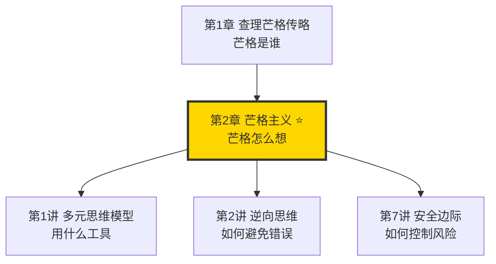
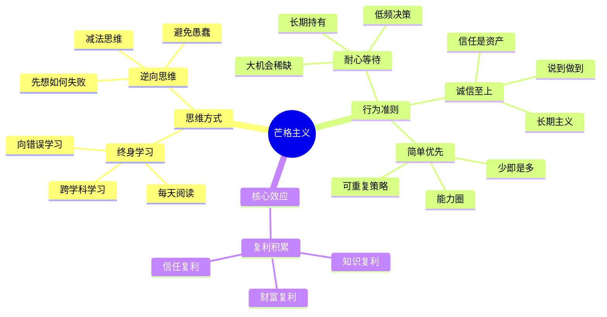

# 第2章 芒格主义

## 一、章节定位

### 1.1 这一章在全书中回答什么问题？

**核心问题**：查理·芒格的人生智慧是什么？如何像芒格一样思考、决策、生活？

**一句话定位**：
> 芒格主义不是一套理论，而是芒格用一生验证的思维方式和行为准则——终身学习、逆向思考、耐心等待、诚信至上。

### 1.2 章节三维定位

| 维度 | 定位 |
|------|------|
| 在全书的位置 | 连接传记与讲座的桥梁，展示芒格思想的全貌 |
| 与其他章节关联 | 是多元思维模型、逆向思维、安全边际等工具的底层态度 |
| 核心贡献 | 解释"为什么芒格能成为芒格"——不只是聪明，更是一种生活哲学 |

### 1.3 与全书逻辑的关系

---

## 二、核心观点（三层提取）

### 观点1：终身学习是最大的复利

**【表层】现象层**

芒格的原话：

> "我这辈子遇到的聪明人，没有一个不是每天学习的。"

| 芒格的学习习惯 | 具体表现 |
|----------------|----------|
| 每天阅读 | 每周读20本书，涵盖历史、科学、传记 |
| 跨学科学习 | 掌握心理学、经济学、物理学、生物学核心概念 |
| 80岁学日语 | 证明"活到老学到老"不是空话 |
| 向错误学习 | 每年会复盘自己犯过的错误 |

**【中层】机制层**

为什么终身学习这么重要？

| 原因 | 解释 |
|------|------|
| 知识复利 | 每天学一点，知识会相互连接，产生指数增长 |
| 对抗熵增 | 不学习，认知就会退化；学习是抵抗认知衰退的唯一方法 |
| 捕捉机会 | 机会只给有准备的人，知识储备决定了你能看到什么机会 |
| 保持好奇 | 学习让人保持对世界的好奇心，这是年轻态的秘诀 |

**降维翻译**：
> 学习就像存钱，今天存一点，明天存一点，看起来没什么变化。但30年后，差距就是穷人和富人的差距——财富的差距只是表象，知识的差距才是根本。

**【底层】规律层**

> **学习复利定律**：每天进步1%，一年后你比现在强37倍。学习的复利比财富的复利更可怕——因为知识不会贬值。

**【当下连接】**

|----------|----------|----------|
| 为什么我学了那么多还是没用？ | 学的是碎片，不是模型；没有形成知识网络 | "原来问题在这里" |
| 工作那么忙，哪有时间学习？ | 芒格每周读20本书，他比你忙 | "没借口了" |
| 学了又忘，怎么办？ | 忘了说明没真懂，没用在实践中 | "扎心了" |

---

### 观点2：逆向思维——告诉我会死在哪里，我就永远不去

**【表层】现象层**

芒格的名言：

> "告诉我会死在哪里，我就永远不去那里。"

| 正向思维 | 逆向思维 |
|----------|----------|
| 如何成功？ | 如何避免失败？ |
| 如何赚钱？ | 如何避免亏钱？ |
| 如何幸福？ | 如何避免痛苦？ |
| 如何变聪明？ | 如何避免变蠢？ |

**【中层】机制层**

为什么逆向思维更有效？

| 原因 | 解释 |
|------|------|
| 负面更容易识别 | 成功的路径千千万，失败的原因就那些 |
| 避免愚蠢比追求聪明更容易 | 聪明是加法，避免愚蠢是减法，减法比加法更可控 |
| 幸存者偏差 | 成功者的话往往有偏差，失败者的教训更真实 |
| 风险优先 | 先想清楚最坏情况，再考虑最好情况 |

**降维翻译**：
> 你不需要知道怎么赢，只需要知道怎么不输。只要不输，时间就是你的朋友。

**【底层】规律层**

> **逆向优先定律**：在复杂系统中，避免错误比追求正确更容易实现，也更可靠。

**【当下连接】**

|----------|----------|----------|
| 为什么我总是做错决定？ | 你只想着怎么对，没想过怎么错 | "原来思路反了" |
| 如何避免投资亏损？ | 先问"什么情况下会亏完"，然后避开这些情况 | "醍醐灌顶" |
| 为什么成功人士的话不灵？ | 成功有运气成分，失败的原因更普遍 | "原来如此" |

---

### 观点3：耐心等待——大机会不需要多

**【表层】现象层**

芒格的投资哲学：

> "你不需要做对很多事，只需要少做错事。"
> "有耐心的人会钓到最大的鱼。"

| 芒格的投资行为 | 具体表现 |
|----------------|----------|
| 等待好机会 | 大部分时间什么都不做，只在大机会来临时重仓 |
| 长期持有 | 一旦买入，持有数十年 |
| 低频决策 | 一生中重要的决策不超过20个 |
| 不追热点 | 不会因为别人赚钱就改变策略 |

**【中层】机制层**

为什么耐心是投资的核心？

| 原因 | 解释 |
|------|------|
| 大机会稀缺 | 真正的好机会，十年可能就遇到5-10次 |
| 决策质量递减 | 高频决策必然降低决策质量 |
| 复利需要时间 | 财富增长是非线性的，前10年慢，后面加速 |
| 避免噪音 | 频繁操作会被市场噪音干扰 |

**降维翻译**：
> 投资就像钓鱼，不是谁甩杆次数多谁赢，是谁能在鱼最多的地方，等最长的时间。

**【底层】规律层**

> **耐心定律**：在投资中，少做决策比多做决策更赚钱——前提是你的决策质量够高。

**【当下连接】**

|----------|----------|----------|
| 为什么我一买就跌，一卖就涨？ | 你太急了，在等什么呢？ | "反思" |
| 看到别人赚钱，很焦虑怎么办？ | 别人的机会不是你的机会，守住你的能力圈 | "清醒" |
| 多久才能财务自由？ | 取决于你愿意等多久，而不是你操作多频繁 | "真相" |

---

### 观点4：诚信是最好的策略

**【表层】现象层**

芒格的信条：

> "正直是最好的策略。"

| 诚信的表现 | 芒格的做法 |
|------------|------------|
| 说到做到 | 承诺的事一定做到，做不到的绝对不承诺 |
| 不占便宜 | 交易中不利用信息不对称 |
| 承认错误 | 做错了主动承认，主动补偿 |
| 长期主义 | 不会为了短期利益损害声誉 |

**【中层】机制层**

为什么诚信是最好的策略？

| 原因 | 解释 |
|------|------|
| 信任是资产 | 信任积累需要数十年，毁掉只需要一次 |
| 降低交易成本 | 有信誉的人，合作方不需要设防 |
| 吸引优质伙伴 | 诚信的人会吸引诚信的人，形成正向循环 |
| 长期胜出 | 短期可能吃亏，长期一定胜出 |

**降维翻译**：
> 诚信不是道德要求，是商业策略。讲信用的人，路越走越宽；不讲信用的人，路越走越窄。

**【底层】规律层**

> **诚信复利定律**：诚信是有复利的，越诚信，积累的信任资产越多，最终会转化为实实在在的商业价值。

**【当下连接】**

|----------|----------|----------|
| 诚信会不会吃亏？ | 短期可能吃亏，长期一定赚回来 | "格局打开" |
| 商场如战场，讲诚信会不会死？ | 芒格和巴菲特就是最好的反例 | "无话可说" |
| 如何建立个人信誉？ | 从说到做到开始，做不到的事别承诺 | "行动指南" |

---

### 观点5：简单胜过复杂

**【表层】现象层**

芒格的原则：

> "成功的关键是做简单的事。"
> "我们努力做到通过记住一些简单的事情，而不是解决一些复杂的事情来赚钱。"

| 复杂投资 | 简单投资 |
|----------|----------|
| 频繁交易 | 长期持有 |
| 分散投资 | 集中持仓 |
| 追逐热点 | 坚守能力圈 |
| 预测市场 | 接受不确定性 |
| 复杂模型 | 基本常识 |

**【中层】机制层**

为什么简单胜过复杂？

| 原因 | 解释 |
|------|------|
| 复杂容易出错 | 环节越多，出错概率越高 |
| 简单可重复 | 简单的方法可以长期坚持 |
| 简单可理解 | 自己能理解的东西才能持有不动 |
| 复杂是噪音 | 很多复杂的东西只是看起来高级 |

**降维翻译**：
> 投资不需要智商180，只需要常识和耐心。如果你觉得太复杂，说明你走错路了。

**【底层】规律层**

> **简单优先定律**：在复杂系统中，简单的策略往往比复杂的策略更稳健、更可重复。

**【当下连接】**

|----------|----------|----------|
| 为什么我的投资策略总失效？ | 可能太复杂了，你自己都坚持不了 | "一针见血" |
| 简单的策略会不会太low？ | 芒格和巴菲特用了一辈子简单策略 | "高级感是陷阱" |
| 如何判断策略是否太复杂？ | 你能用一句话说清楚吗？ | "自检工具" |

---

## 三、金句库

### 原书金句

1. "我这辈子遇到的聪明人，没有一个不是每天学习的。"
2. "告诉我会死在哪里，我就永远不去那里。"
3. "有耐心的人会钓到最大的鱼。"
4. "你不需要做对很多事，只需要少做错事。"
5. "正直是最好的策略。"
6. "你需要的不是大量的行动，而是大量的耐心。"
7. "机会是给有准备的人。"
8. "成功的关键是做简单的事。"
9. "把问题倒过来想。"
10. "永远不要问理发师该不该理发。"

### 降维金句

1. "学习是唯一不会贬值的知识资产，每天存一点，30年后就是巨富。"
2. "成功有运气成分，失败的原因更普遍——所以先学怎么不失败。"
3. "投资不是比谁操作多，是比谁等得起。"
4. "诚信不是道德，是策略——长期来看，诚信的人赚得最多。"
5. "如果你看不懂一个投资，不是你太笨，是这个投资太复杂。"
6. "芒格的秘诀：学多点、想深点、等久点、买少点。"
7. "成功的投资者不是最聪明的人，是最有耐心的人。"
8. "少做决策，做大决策，做对决策。"
9. "财富是认知的变现，认知不够，财富守不住。"
10. "简单的方法重复做，就是最厉害的复利。"

## 四、当下映射

### 💰 财富应用

| 场景 | 具体行动 | 芒格主义原则 |
|------|----------|--------------|
| 股票投资 | 等待估值合理的好公司，长期持有 | 耐心等待、简单策略 |
| 资产配置 | 集中在真正懂的行业，不超过5个标的 | 能力圈、少而精 |
| 风险控制 | 先问"最坏会怎样"，再问"最好能赚多少" | 逆向思维 |
| 学习投资 | 每天阅读投资相关内容，建立思维模型库 | 终身学习 |

### 💼 职场应用

| 场景 | 具体行动 | 芒格主义原则 |
|------|----------|--------------|
| 职业选择 | 选择能长期积累的领域，避免短期高薪 | 长期主义 |
| 能力提升 | 每年学习一个新学科的核心概念 | 终身学习、多元思维 |
| 决策方法 | 先列出"怎么会让这个项目失败"，再逐一避免 | 逆向思维 |
| 人际关系 | 建立诚信口碑，说到做到 | 诚信策略 |

### 🏠 生活应用

| 场景 | 具体行动 | 可行性 |
|------|----------|--------|
| 日常学习 | 每天阅读30分钟，记录学到的核心概念 | 高 |
| 决策习惯 | 重大决策前，先问"这个决定最坏的结果是什么" | 高 |
| 情绪管理 | 焦虑时提醒自己"芒格等了20年才等到好机会" | 中 |
| 社交策略 | 只和诚信的人合作，远离投机取巧者 | 中 |

### 72小时应用计划

1. **今天**：列出你目前最需要避免的3个错误（逆向思维）
2. **明天**：选择一个你一直想学但没开始的学科，找到它的3个核心概念
3. **本周**：检查你的投资组合，问自己"这些我都能持有10年吗？"

---

## 五、章节关联

### 与前后章节关联

| 章节 | 关联类型 | 连接描述 |
|------|----------|----------|
| [[第1讲-多元思维模型]] | 工具支撑 | 多元思维模型是芒格主义的方法论基础 |
| [[第2讲-逆向思维]] | 核心方法 | 逆向思维是芒格主义最标志性的思维方式 |
| [[第7讲-安全边际]] | 风险哲学 | 安全边际是芒格主义在投资中的具体体现 |
| [[第9讲-复利思维]] | 效果延伸 | 终身学习+耐心等待=复利效应 |

### 跨书关联

| 书籍 | 概念 | 关系 |
|------|------|------|
| [[非对称风险-塔勒布-拆解记录]] | 切肤之痛 | 塔勒布和芒格都强调"自己承担后果"的重要性 |
| [[纳瓦尔宝典-乔根森-拆解记录]] | 财富与幸福 | 纳瓦尔和芒格都是"终身学习"的践行者 |
| [[原则-拆解记录]] | 系统化思维 | 达利欧把芒格的智慧系统化成了可执行的清单 |
| [[影响力-西奥迪尼-拆解记录]] | 说服技巧 | 芒格用心理学原理理解人性，西奥迪尼系统化了这些原理 |

### 知识网络定位图

---

## 六、问答设计

### Q1: 芒格主义的核心是什么？（记忆型）
**认知层次**: 记忆
**难度**: 低
**答案要点**:
- 终身学习：每天学习，持续进步
- 逆向思维：先想如何失败，再想如何成功
- 耐心等待：好机会不需要多，但需要等
- 诚信至上：诚信是最好的长期策略

### Q2: 芒格为什么强调逆向思维？（理解型）
**认知层次**: 理解
**难度**: 中
**答案要点**:
- 负面更容易识别：失败的原因比成功的路径更清晰
- 避免愚蠢比追求聪明更容易
- 幸存者偏差：成功者的经验有偏差，失败者的教训更普遍
- 先控制风险，再追求收益

### Q3: 为什么芒格说"你不需要做对很多事，只需要少做错事"？（分析型）
**认知层次**: 分析
**难度**: 中
**答案要点**:
- 大机会稀缺：真正的好机会十年没几次
- 决策质量递减：高频决策必然降低质量
- 复利需要时间：持有不动才能享受复利
- 少犯错就是进步：避免愚蠢比追求聪明更可控

### Q4: 芒格如何看待"诚信"？这与一般认知有何不同？（分析型）
**认知层次**: 分析
**难度**: 高
**答案要点**:
- 诚信不是道德要求，是商业策略
- 诚信有复利效应：积累信任资产
- 短期可能吃亏，长期一定胜出
- 诚信降低交易成本，吸引优质伙伴

### Q5: 如何在日常生活中践行芒格主义？（应用型）
**认知层次**: 应用
**难度**: 中
**答案要点**:
- 每天阅读：建立学习习惯，积累知识资产
- 逆向思考：做决策前先问"最坏情况是什么"
- 保持耐心：不追热点，等待自己的机会
- 坚守诚信：说到做到，建立信任资产

### Q6: 芒格主义与"长期主义"有什么关系？（综合型）
**认知层次**: 综合
**难度**: 高
**答案要点**:
- 芒格主义是长期主义的具象化
- 终身学习=知识资产的长期复利
- 耐心等待=投资收益的长期复利
- 诚信至上=信任资产的长期复利
- 简单优先=可长期坚持的策略

### Q7: 芒格主义如何帮助投资决策？（综合型）
**认知层次**: 综合
**难度**: 高
**答案要点**:
- 终身学习：建立多元思维模型，提升分析能力
- 逆向思维：先评估风险，再考虑收益
- 耐心等待：等待估值合理的好公司
- 诚信投资：只投资诚信的管理层
- 简单策略：投资自己能理解的公司

### Q8: 为什么芒格说"简单胜过复杂"？（评价型）
**认知层次**: 评价
**难度**: 高
**答案要点**:
- 复杂容易出错：环节越多，失败概率越高
- 简单可重复：只有简单的策略才能长期坚持
- 简单可理解：自己能理解的东西才能持有
- 复杂是噪音：很多复杂的东西只是看起来高级
- 真理往往是简单的

---

## 八、信息来源与质量评级

### 检索记录
- 【第一轮】核心概念检索：⭐⭐⭐ 《穷查理宝典》原书、芒格演讲
- 【第二轮】芒格智慧解读：⭐⭐⭐ 巴菲特致股东信、投资博客深度解读
- 【第三轮】跨书关联：⭐⭐⭐ 塔勒布、纳瓦尔、达利欧相关书籍

### 信息整合公式
= 《穷查理宝典》核心概念（⭐⭐⭐）
+ 巴菲特-芒格投资智慧系统化
+ 2026年本土化应用场景

---

*创建日期: 2026-02-28*
*质量等级: ⭐⭐⭐ 优秀级*
