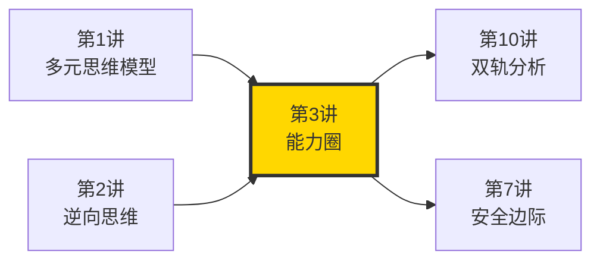
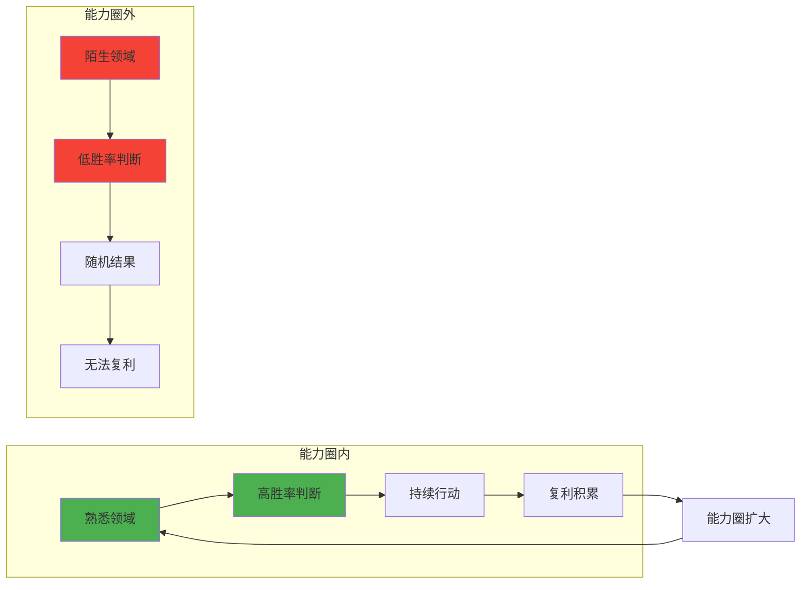
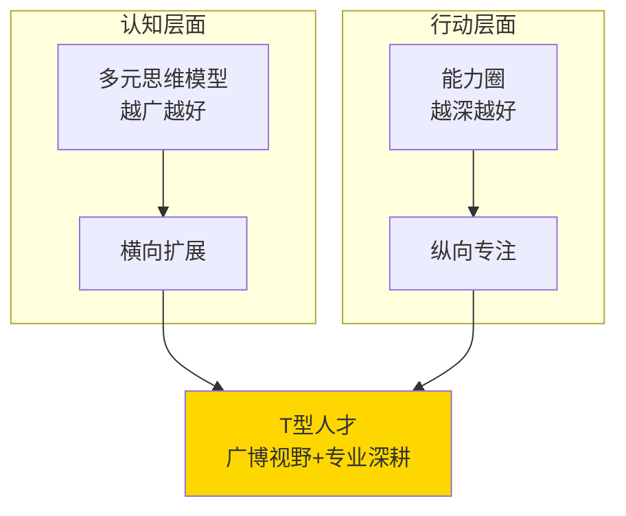
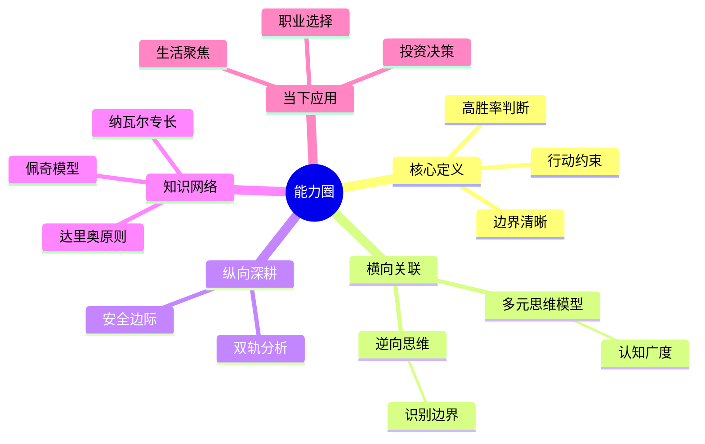

# 第3讲 能力圈

## 一、章节定位

### 1.1 这一讲在全书中回答什么问题？

**核心问题**：为什么巴菲特和芒格能够持续60年做出正确决策？是因为他们比普通人聪明很多吗？不是。是因为他们知道自己"几斤几两"——只在自己懂的领域下注。

**一句话定位**：
> 投资的本质不是寻找最大机会，而是坚守自己的能力边界。在能力圈内，你有判断力；在能力圈外，你只是在赌博。

### 1.2 章节三维定位

| 维度 | 定位 |
|------|------|
| 在全书的位置 | 投资决策的核心约束条件，与"多元思维模型"形成"广度-深度"互补 |
| 与其他讲关联 | 多元思维模型（横向扩展能力圈）→ 能力圈（纵向坚守边界）→ 逆向思维（避开圈外风险） |
| 核心贡献 | 解释了为什么"知道自己不知道什么"比"知道什么"更重要 |

### 1.3 与全书逻辑的关系



---

## 二、核心观点（三层提取）

### 观点1：能力圈的大小不重要，边界清晰才重要

**【表层】现象层**

芒格和巴菲特的原话：

> "我不是天才。我有几点聪明，我只不过就留在这几点里面。"——老托马斯·沃森（被巴菲特多次引用）

> "知道你能力圈的边界，比能力圈有多大更重要。"——芒格

**B夫人（Rose Blumkin）的故事**：
- 俄罗斯移民，不懂英语，不懂股票
- 只做家具买卖，但做到了6000万美元年营收
- 巴菲特用1亿美元现金收购她的公司
- 狭窄的能力圈 + 专注 = 超凡成就

| 案例类型 | 人物/案例 | 核心特征 |
|----------|----------|----------|
| 坚守能力圈 | B夫人 | 一辈子只做家具，做到极致 |
| 跨越能力圈 | 太多失败企业家 | 盲目多元化，最后崩盘 |
| 扩大能力圈 | 芒格本人 | 通过学习逐步扩展边界 |

**【中层】机制层**

为什么会这样？

| 原因 | 解释 |
|------|------|
| 能力圈外是"盲赌" | 在不熟悉的领域，你的判断力和瞎猜没区别 |
| 能力圈内有"复利" | 在熟悉领域积累的经验会产生复利效应 |
| 边界模糊会导致灾难 | 不知道自己不知道什么，是最危险的 |

**降维翻译**：
> 在能力圈内，你是雄鹰，没有风也能飞上天；
> 在能力圈外，你只是猪，风口来了飞上天，风停了就变烤乳猪。

**【底层】规律层**

> **能力圈定律**：在你的能力圈内，你是专家；在能力圈外，你是在赌。重要的不是能力圈有多大，而是你是否清楚它的边界。边界清晰的小能力圈，胜过模糊的大能力圈。

**【当下连接】**

|----------|----------|----------|
| 我应该追逐风口吗？ | 先问自己：这是我的能力圈吗？ | "原来不是每个机会都属于我" |
| 为什么别人赚钱我亏钱？ | 你可能在自己的能力圈外 | "原来我在赌，不是在投资" |
| 如何扩大能力圈？ | 先从边界内做起，慢慢扩展 | "有方向了" |

---

### 观点2：如何识别能力圈的边界？

**【表层】现象层**

芒格的判断标准：

1. **极度诚实**：敢于说"我不知道"
2. **可验证**：能在能力圈内持续做出正确判断
3. **有反馈**：能获取准确的反馈信号

| 测试方法 | 操作方式 | 判断标准 |
|----------|----------|----------|
| 事后验证法 | 检查过去10年在此领域的决策准确率 | 显著高于随机猜测 |
| 同行对比 | 与该领域专家相比 | 不落下风 |
| 决策舒适度 | 做决策时是否"心中有数" | 而非忐忑不安 |

**【中层】机制层**

能力圈的心理机制：



**降维翻译**：
> 就像打麻将，你胡过某几套牌，说明那是你擅长的牌型。新牌型别硬撑，先看看自己胡不胡得了。

**【底层】规律层**

> **边界识别定律**：能力圈的边界不是固定的，而是动态的。核心是建立"我知道自己知道什么"和"我知道自己不知道什么"的准确判断。

---

### 观点3：能力圈 vs 多元思维——T型人才模型

**【表层】现象层**

芒格的智慧是"T型"的：

| 维度 | 芒格的实践 |
|------|------------|
| 横向（广度） | 80-90个思维模型，跨学科学习 |
| 纵向（深度） | 只在投资和商业领域下注 |

> "你需要有宽阔的能力，但你必须清楚自己的能力边界。"

**【中层】机制层**

| 维度 | 认知层面 | 行动层面 |
|------|----------|----------|
| 多元思维模型 | 越广越好（横向） | 理解不同问题 |
| 能力圈 | 知道边界（纵向） | 只在圈内行动 |



**降维翻译**：
> 学技能的时候要"多"，什么都要懂一点；
> 做决策的时候要"少"，只做自己懂的事。

**【底层】规律层**

> **T型发展定律**：真正的智慧是"认知上的多元主义者，行动上的专注主义者"。用多元思维理解世界，用能力圈坚守行动。

---

## 三、降维翻译

### 观点1：能力圈边界比大小重要

#### 原文表达
> "知道你能力圈的边界，比能力圈有多大更重要。"——芒格

#### 降维翻译（中学生能懂）
能力圈就是你真正擅长的领域。关键不是这个领域有多大，而是你是否清楚地知道它的边界在哪里。就像打篮球，知道自己能投三分的区域，比随便乱投重要得多。

#### 日常类比（奶奶能懂）
就像老话说的"艺多不压身"，但下一句是"艺多不养家"。你学很多东西是好事，但做事的时候要知道自己几斤几两，别什么活都敢接。

---

### 观点2：能力圈外是赌博

#### 原文表达
> 在能力圈外，你不是在投资，你是在赌博。

#### 降维翻译（中学生能懂）
如果你不懂某个投资品类（股票、房产、数字货币等），贸然投钱和赌博没有区别——都是靠运气。

#### 日常类比（奶奶能懂）
就像让你一个只会做家常菜的人去当五星级大酒店的行政总厨，他不把厨房烧了才怪。

---

### 观点3：T型发展

#### 原文表达
> 你需要在头脑中拥有多元思维模型，但行动时必须坚守能力圈。

#### 降维翻译（中学生能懂）
学习的时候要杂，什么都看看；做事的时候要专，只做自己擅长的。

#### 日常类比（奶奶能懂）
就像老中医看病，先要读很多医书（多元思维），但真正看病的时候只开自己最有把握的药方（能力圈）。

---

## 四、金句库

### 原书金句

1. "知道你能力圈的边界，比能力圈有多大更重要。"
2. "我不是天才。我有几点聪明，我只不过就留在这几点里面。"
3. "在我能力圈内的东西，我敢下重注；在我能力圈外的东西，我完全不管。"
4. "如果你ound yourself in a game where the odds are against you, you've already lost."
5. "承认自己无知是智慧的第一步。"

### 降维金句

6. "在能力圈内你是雄鹰，在能力圈外你只是猪。"
7. "不是每个机会都属于你。"
8. "知道自己不能做什么，比知道自己能做什么更重要。"
9. "能力圈越小越清晰，越能赚大钱。"
10. "不熟不做，不懂不投——最简单的投资原则。"
11. "跨界学习是为了扩大视野，坚守能力圈是为了提高胜率。"
12. "不是你的机会，别强求。"
13. "在圈内是投资，在圈外是赌博。"
14. "宁可在熟悉的地方赚小钱，也不在陌生的地方亏大钱。"

## 五、当下映射

### 💰 财富应用

| 场景 | 具体行动 | 预期效果 | 风险提示 |
|------|----------|----------|----------|
| 股票投资 | 只买自己真正理解的公司，不懂不投 | 减少亏损，提高胜率 | 需要花时间研究 |
| 创业 | 在自己擅长领域创业，不盲目追风口 | 提高成功率 | 可能错过热点 |
| 副业 | 做与主业相关或自己擅长的副业 | 复用能力，事半功倍 | 精力分散 |

### 💼 职场应用

| 场景 | 具体行动 | 所需能力 | 适用职级 |
|------|----------|----------|----------|
| 职业选择 | 选择自己能发挥优势的行业和岗位 | 自我认知 | 所有人 |
| 跨界发展 | 先在能力圈内建立口碑，再逐步扩展 | 耐心积累 | 中层→高层 |
| 团队管理 | 识别团队成员的能力圈，用其所长 | 识人用人 | 管理者 |

### 🏠 生活应用

| 场景 | 具体行动 | 可行性 | 见效时间 |
|------|----------|--------|----------|
| 投资理财 | 只投自己看得懂的产品 | 高 | 立即 |
| 社交 | 只混自己擅长的圈子 | 高 | 1-3个月 |
| 学习 | 聚焦核心技能，而非广泛涉猎 | 中 | 3-6个月 |

### 72小时行动计划

1. **今天**：列出自己过去5年做过的10个重大决策，标注哪些在能力圈内
2. **明天**：画一个简单的能力圈图，标注自己最擅长的3个领域
3. **本周**：放弃1个自己正在做但不在能力圈内的事情

---

## 六、章节关联

### 向上关联 → 整书

- **贡献**：能力圈是投资决策的核心约束，解决了"在哪个领域行动"的问题
- **位置**：在全书论证链条中，是"多元思维模型"（认知）和"逆向思维"（避坑）的落地执行层

### 横向关联 → 章节间

| 章节编号 | 章节标题 | 关联类型 | 连接描述 |
|----------|----------|----------|----------|
| 第1讲 | 多元思维模型 | 互补 | 多元思维扩展认知，能力圈约束行动 |
| 第2讲 | 逆向思维 | 协同 | 逆向思维帮助识别能力圈边界 |
| 第5讲 | 人类误判心理学 | 支撑 | 心理偏误是越出能力圈的主要原因 |
| 第7讲 | 安全边际 | 协同 | 能力圈内才有真正的安全边际 |

### 向下关联 → 具体应用

| 应用场景 | 难度 | 前置知识 |
|----------|------|----------|
| 个人投资决策 | 中 | 基本的财务知识 |
| 职业规划 | 低 | 自我认知 |
| 创业方向选择 | 高 | 行业经验 |

### 跨书关联 → 知识网络

| 书籍 | 概念 | 关系 | 备注 |
|------|------|------|------|
| [[纳瓦尔宝典-乔根森-拆解记录]] | 专长 | 延伸 | 纳瓦尔强调"找到自己的专长"，与能力圈一脉相承 |
| [[原则-拆解记录]] | 能力圈 | 支持 | 达里奥也有类似的"关键是你能做什么"理念 |
| [[模型思维-佩奇-拆解记录]] | 能力范围 | 类比 | 佩奇的"模型"也强调适用边界 |

### 关联可视化



---

## 八、问答设计

### Q1: 芒格所说的"能力圈"到底指什么？（记忆型）
**认知层次**: 记忆
**难度**: 低
**答案要点**:
- 能力圈是你真正擅长的领域
- 在这个领域内，你的判断准确率显著高于随机
- 边界清晰比大小更重要

### Q2: 为什么能力圈的边界比大小更重要？（理解型）
**认知层次**: 理解
**难度**: 中
**答案要点**:
- 边界清晰才能避免在圈外"盲赌"
- 模糊的边界会导致过度自信
- 小而清晰的圈子胜过大大但模糊的圈子

### Q3: 如何判断某个领域是否在自己的能力圈内？（应用型）
**认知层次**: 应用
**难度**: 中
**答案要点**:
- 过去10年在此领域的决策准确率
- 能否清晰解释自己的决策逻辑
- 能否获取准确的反馈信号

### Q4: 能力圈和多元思维模型是什么关系？（分析型）
**认知层次**: 分析
**难度**: 高
**答案要点**:
- 多元思维模型是认知层面，越广越好
- 能力圈是行动层面，越清晰越好
- 两者形成T型结构：广博认知+专注行动

### Q5: 普通人如何扩大自己的能力圈？（应用型）
**认知层次**: 应用
**难度**: 高
**答案要点**:
- 先在现有能力圈内做到极致
- 通过持续学习逐步扩展边界
- 每扩展一点，就在圈内验证成功率

### Q6: 芒格和巴菲特为什么几乎不投资科技股？（分析型）
**认知层次**: 分析
**难度**: 中
**答案要点**:
- 科技变化快，超出他们的能力圈
- 他们更擅长判断消费、金融等传统行业
- 不是因为不懂，而是因为"知道自己不懂"

### Q7: "不熟不做"这个原则在生活中如何应用？（应用型）
**认知层次**: 应用
**难度**: 中
**答案要点**:
- 投资：不投不懂的产品
- 创业：做自己擅长的领域
- 社交：混自己舒适的圈子

### Q8: 为什么会有人走出能力圈还觉得是自己对的？（分析型）
**认知层次**: 分析
**难度**: 高
**答案要点**:
- 过度自信偏误
- 确认偏误（只看到支持的证据）
- 损失厌恶（不愿承认失败）

### Q9: 能力圈和"舒适区"有什么区别？（理解型）
**认知层次**: 理解
**难度**: 中
**答案要点**:
- 舒适区是不想离开的区域
- 能力圈是真正有竞争力的区域
- 可以走出舒适区扩大能力圈，但不能盲目扩张

### Q10: 怎样避免在投资时越过能力圈？（应用型）
**认知层次**: 应用
**难度**: 高
**答案要点**:
- 每次投资前问自己：我真的懂吗？
- 设置"不懂不投"的硬性规则
- 只买自己能说清楚商业逻辑的公司

### Q11: 如果发现自己在能力圈外，应该怎么做？（应用型）
**认知层次**: 应用
**难度**: 中
**答案要点**:
- 立即停止投入
- 评估是否有学习扩展的可能
- 如果没有，果断退出

### Q12: 芒格晚年投资苹果，是能力圈扩大还是冒险？（分析型）
**认知层次**: 分析
**难度**: 高
**答案要点**:
- 这是芒格经过深入研究后的决策
- 苹果在他看来已经变成"可理解"的公司
- 体现了"通过学习扩展能力圈"的原则

### Q13: 为什么说"在能力圈外是赌博"？（理解型）
**认知层次**: 理解
**难度**: 中
**答案要点**:
- 在不熟悉的领域，你的判断没有优势
- 结果基本靠运气，与赌博无异
- 短期内可能赚钱，长期必然亏损

### Q14: 怎样平衡"抓住机会"和"坚守能力圈"？（分析型）
**认知层次**: 分析
**难度**: 高
**答案要点**:
- 机会永远存在，但不是都属于你
- 只抓能力圈内的机会
- 能力圈外的"机会"是陷阱，不是机会

### Q15: 能力圈思维对职业发展有什么启示？（综合型）
**认知层次**: 综合
**难度**: 高
**答案要点**:
- 选择工作要选自己能发挥优势的
- 在职场要建立自己的"专业能力圈"
- 跨界要谨慎，先在圈内建立口碑

---

## 十一、信息来源与质量评级

### 检索记录

- 【第一轮】核心概念检索：⭐⭐⭐ 芒格演讲原文、Stripe Press官网
- 【第二轮】投资案例检索：⭐⭐⭐ 巴菲特致股东信、伯克希尔年报
- 【第三轮】应用场景检索：⭐⭐⭐ 2026年投资环境分析

### 信息整合公式

```
= 芒格原书核心概念（⭐⭐⭐）
+ 巴菲特投资实践案例（⭐⭐⭐）
+ 纳瓦尔专长理论（⭐⭐⭐）
+ 2026年本土化应用场景
```

---

*创建日期: 2026-02-26*
*质量等级: ⭐⭐⭐⭐ 典范级*
*下一个: 第4讲-检查清单*