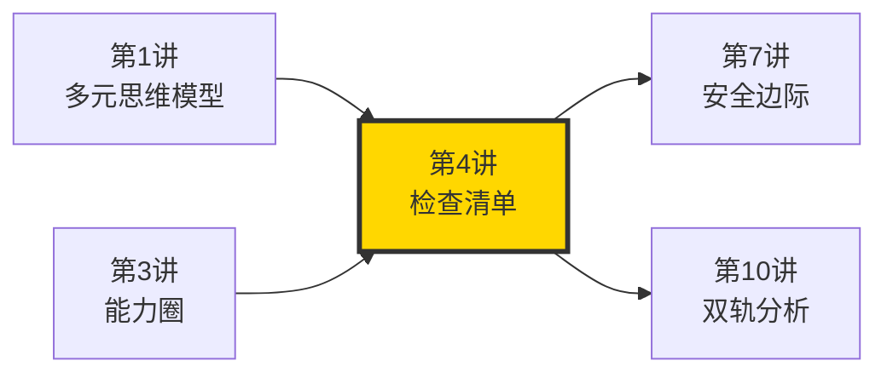
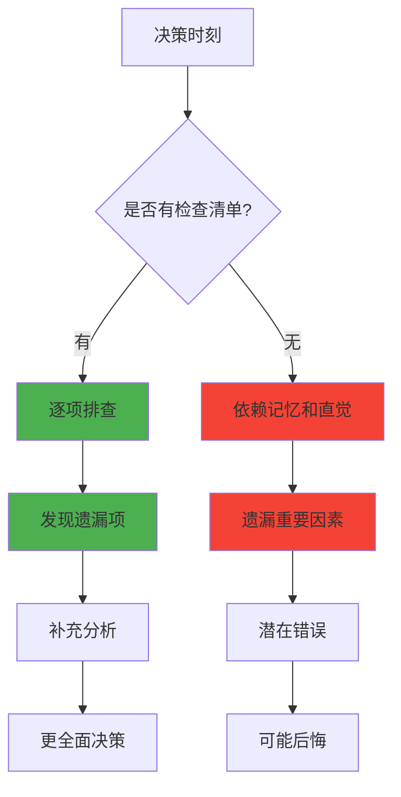
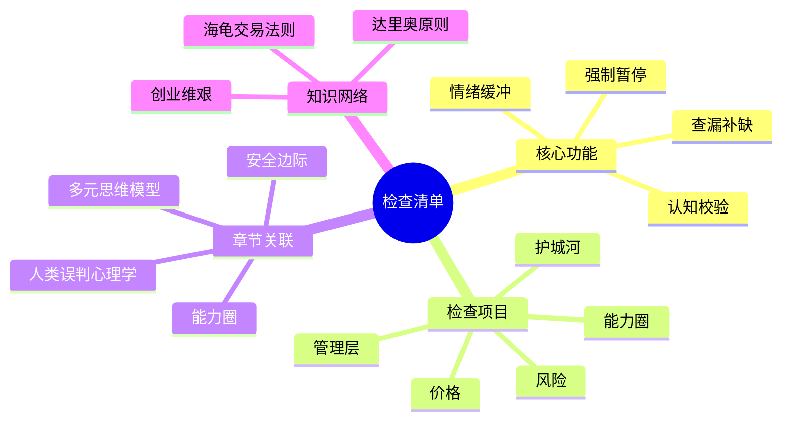

# 第4讲 检查清单

## 一、章节定位

### 1.1 这一讲在全书中回答什么问题？

**核心问题**：为什么芒格和巴菲特能够持续60年避免重大错误？是因为他们特别聪明吗？不是。是因为他们使用检查清单——把可能出错的环节全部列出来，逐个排查。

**一句话定位**：
> 聪明人的最大敌人不是愚蠢，而是傲慢——觉得自己不会犯错。检查清单是对付傲慢最有效的武器。

### 1.2 章节三维定位

| 维度 | 定位 |
|------|------|
| 在全书的位置 | 投资决策的流程保障，解决"如何避免漏掉重要因素"的问题 |
| 与其他讲关联 | 多元思维模型（提供检查项）→ 能力圈（缩小检查范围）→ 检查清单（确保执行）→ 安全边际（留有余地） |
| 核心贡献 | 解释了为什么"系统化检查"比"临时起意"更可靠 |

### 1.3 与全书逻辑的关系



---

## 二、核心观点（三层提取）

### 观点1：为什么需要检查清单？

**【表层】现象层**

芒格在演讲中多次提到飞行员的检查清单：

> "聪明人为什么会犯错？因为他们忘记了检查清单上的重要项目。"

**飞行员的教训**：

| 职业 | 检查清单 | 致命错误率 |
|------|----------|------------|
| 飞行员 | 有 | 极低 |
| 医生 | 部分有 | 中等 |
| 投资者 | 大多没有 | 极高 |

**芒格的观察**：
- 几乎所有投资灾难，都来自"忘了检查"
- 几乎所有投资成功，都来自"系统排查"

**【中层】机制层**

为什么聪明人也会忘记重要事项？

| 原因 | 解释 |
|------|------|
| 记忆不可靠 | 人类记忆会遗忘、扭曲 |
| 情绪干扰 | 贪婪或恐惧时容易漏掉检查项 |
| 过度自信 | 觉得自己不会犯那种错误 |
| 认知盲区 | 不知道自己不知道什么 |

**检查清单的心理机制**：



**降维翻译**：
> 就像考试做题，老师说"检查三遍"，你不检查，可能漏掉整道大题。投资也是同理。

**【底层】规律层**

> **清单定律**：复杂系统中的错误几乎都是"系统性遗漏"，而非"临时失误"。检查清单是对付系统性遗漏的唯一有效工具。

---

### 观点2：芒格的检查清单包含什么？

**【表层】现象层**

芒格的投资检查清单（核心项目）：

| 类别 | 检查项 | 目的 |
|------|--------|------|
| **能力圈** | 这公司在我的能力圈内吗？ | 避免盲目 |
| **护城河** | 竞争优势能持续吗？ | 识别壁垒 |
| **管理层** | 管理层诚信且有能力吗？ | 排除风险 |
| **价格** | 内在价值vs价格有安全边际吗？ | 确保划算 |
| **风险** | 最坏情况是什么？ | 极限测试 |

**芒格的"逆向检查清单"**（先想什么会失败）：

1. 这投资会让我亏多少？
2. 这个假设错了怎么办？
3. 有什么是我没想到的？
4. 同行会不会比我更聪明？
5. 这个价格还能跌多少？

**【中层】机制层**

检查清单的工作原理：

| 功能 | 说明 |
|------|------|
| 强制暂停 | 强制大脑停下来检查 |
| 查漏补缺 | 确保不遗漏重要因素 |
| 情绪缓冲 | 减少情绪对决策的干扰 |
| 认知校验 | 用多个角度验证判断 |

**降维翻译**：
> 就像出门检查"手机、钱包、钥匙"，投资检查"能力、护城河、价格、风险"——都是防止忘记带东西。

**【底层】规律层**

> **双检定律**：正向检查确保"做对了"，逆向检查确保"不会错"。两者结合才是完整的检查清单。

---

### 观点3：如何建立自己的检查清单？

**【表层】现象层**

芒格建议的清单建立步骤：

1. **收集错误**：把自己和别人的投资错误记录下来
2. **提炼规则**：从错误中提炼出可操作的检查项
3. **定期更新**：根据新经验不断补充
4. **强制执行**：每次决策必须使用

| 建立阶段 | 任务 | 产出 |
|----------|------|------|
| 收集期 | 记录过去10年所有投资决策及结果 | 错误清单 |
| 提炼期 | 分析错误背后的共同原因 | 10-20条检查规则 |
| 优化期 | 在实践中测试、调整 | 动态更新的清单 |
| 固化期 | 每次投资必检，形成习惯 | 自动化流程 |

**【中层】机制层**

芒格的"投资决策流程图"：

```mermaid
flowchart TD
    A[新投资机会] --> B[检查清单过一遍]
    
    B --> C{能力圈?}
    C -->|否| D[放弃]
    C -->|是| E{护城河?}
    
    E -->|否| D
    E -->|是| F{管理层?}
    
    F -->|否| D
    F -->|是| G{价格合理?}
    
    G -->|否| D
    G -->|是| H{有安全边际?}
    
    H -->|否| D
    H -->|是| I[可以投资]
    
    D --> J[加入"以后避免"清单]
    I --> K[持续跟踪]
    
    style B fill:#ff9800
    style I fill:#4CAF50
    style D fill:#f44336
```

**降维翻译**：
> 就像学游泳先学"安全守则"，投资也要先定"保命规则"。

**【底层】规律层**

> **清单进化定律**：检查清单不是一成不变的，而是随着经验积累持续进化的。最有效的清单是"活"的。

---

## 三、降维翻译

### 观点1：聪明人为什么需要检查清单？

#### 原文表达
> "聪明人为什么会犯错？因为他们忘记了检查清单上的重要项目。"

#### 降维翻译（中学生能懂）
再聪明的人也会忘事。检查清单不是质疑你的智商，而是防止你忘记重要的事情。

#### 日常类比（奶奶能懂）
就像出门要检查"手机、钱包、钥匙"，不是你不聪明，是怕你着急忘了。

---

### 观点2：检查清单查什么？

#### 原文表达
> "你需要检查：这公司在我的能力圈内吗？竞争优势持续吗？价格划算吗？"

#### 降维翻译（中学生能懂）
检查清单就是问你几个关键问题：懂不懂？好不好？值不值？

#### 日常类比（奶奶能懂）
就像买东西问问"要不要？好不好？贵不贵？"——简单几个问题，省得后悔。

---

### 观点3：清单要定期更新

#### 原文表达
> 检查清单应该随着经验积累而进化。

#### 降维翻译（中学生能懂）
清单不是写完就完了，要根据你犯过的错、踩过的坑，不断补充新的检查项。

#### 日常类比（奶奶能懂）
就像老一辈的"生活经验"，不是一成不变的，要随着时代和经历更新。

---

## 四、金句库

### 原书金句

1. "聪明人为什么会犯错？因为他们忘记了检查清单上的重要项目。"
2. "我一生都在使用检查清单。"
3. "飞行员的检查清单救了我的命——我也应该有一个。"
4. "在投资中，犯错的代价是金钱，所以我们需要检查清单。"
5. "清单是对付傲慢的最好武器。"

### 降维金句

6. "投资不检查，等于出门不检查手机钱包。"
7. "聪明人的最大敌人是傲慢，检查清单是对付傲慢的。"
8. "清单有多详细，决策有多靠谱。"
9. "不是防止你犯错，是防止你犯致命的错。"
10. "检查清单是对记忆不可靠的补偿。"
11. "投资前不检查，等于考试不检查。"
12. "清单就是你的第二大脑。"
13. "把"忘了检查"变成"不可能忘"。"

## 五、当下映射

### 💰 财富应用

| 场景 | 具体行动 | 预期效果 | 风险提示 |
|------|----------|----------|----------|
| 股票投资 | 买入前逐项检查能力圈、护城河、管理层、价格 | 减少冲动决策 | 需要时间 |
| 买房决策 | 检查地段、价格、户型、产权、贷款条件 | 避免后悔 | 需要全面 |
| 创业投入 | 检查市场、团队、资金、技术、市场 | 提高成功率 | 需要调研 |

### 💼 职场应用

| 场景 | 具体行动 | 所需能力 | 适用职级 |
|------|----------|----------|----------|
| 面试候选人 | 检查能力、态度、文化匹配、背景 | 结构化评估 | HR+业务 |
| 项目立项 | 检查市场、团队、资源、风险、ROI | 项目管理 | 项目经理+管理层 |
| 重大决策 | 检查目标、选项、风险、替代方案 | 决策流程 | 所有职级 |

### 🏠 生活应用

| 场景 | 具体行动 | 可行性 | 见效时间 |
|------|----------|--------|----------|
| 购物决策 | 列需求、预算、替代方案、售后 | 高 | 立即 |
| 出行准备 | 检查证件、设备、钱、钥匙、行程 | 高 | 立即 |
| 健康体检 | 检查项目、时间、费用、注意事项 | 中 | 1-3个月 |

### 72小时行动计划

1. **今天**：列出自己过去3次后悔的投资/消费决策，分析遗漏了什么
2. **明天**：给自己建立5条最简单的"投资检查清单"
3. **本周**：下次做重大决策前，使用检查清单

---

## 六、章节关联

### 向上关联 → 整书

- **贡献**：检查清单是投资决策的流程保障，确保多元思维模型、能力圈等概念能真正落地
- **位置**：在全书论证链条中，是从"认知"到"行动"的转化层

### 横向关联 → 章节间

| 章节编号 | 章节标题 | 关联类型 | 连接描述 |
|----------|----------|----------|----------|
| 第1讲 | 多元思维模型 | 支撑 | 清单上的项目来自多元模型 |
| 第3讲 | 能力圈 | 必需 | 能力圈是清单必检项 |
| 第5讲 | 人类误判心理学 | 支撑 | 清单帮助对抗心理偏误 |
| 第7讲 | 安全边际 | 协同 | 安全边际是清单核心项 |

### 向下关联 → 具体应用

| 应用场景 | 难度 | 前置知识 |
|----------|------|----------|
| 个人投资 | 中 | 基础财务知识 |
| 创业决策 | 高 | 商业经验 |
| 生活选择 | 低 | 无 |

### 跨书关联 → 知识网络

| 书籍 | 概念 | 关系 | 备注 |
|------|------|------|------|
| [[原则-拆解记录]] | 痛苦+反思=进步 | 延伸 | 达里奥也强调检查清单的重要性 |
| [[创业维艰-霍洛维茨-拆解记录]] | 清单化运营 | 支持 | 创业公司的系统化检查 |
| [[海龟交易法则-费思-拆解记录]] | 交易系统 | 类比 | 机械化的交易检查清单 |

### 关联可视化



---

## 八、问答设计

### Q1: 芒格为什么强调检查清单的重要性？（记忆型）
**认知层次**: 记忆
**难度**: 低
**答案要点**:
- 聪明人也会遗忘重要事项
- 复杂系统中的错误是系统性遗漏
- 检查清单是对付傲慢的有效工具

### Q2: 投资检查清单应该包含哪些核心项目？（记忆型）
**认知层次**: 记忆
**难度**: 低
**答案要点**:
- 能力圈：这公司在我的能力圈内吗？
- 护城河：竞争优势能持续吗？
- 管理层：诚信且有能力吗？
- 价格：内在价值vs价格有安全边际吗？
- 风险：最坏情况是什么？

### Q3: 检查清单为什么能减少情绪干扰？（理解型）
**认知层次**: 理解
**难度**: 中
**答案要点**:
- 清单提供结构化的思考框架
- 强制大脑停下来检查
- 减少"临时起意"的冲动决策

### Q4: 如何建立个人投资检查清单？（应用型）
**认知层次**: 应用
**难度**: 中
**答案要点**:
- 收集过去的投资错误
- 提炼共同原因
- 形成可操作的检查项
- 定期更新

### Q5: 检查清单和多元思维模型有什么关系？（分析型）
**认知层次**: 分析
**难度**: 高
**答案要点**:
- 多元思维模型提供"检查什么"
- 检查清单确保"怎么检查"
- 两者结合才能做出好决策

### Q6: 芒格的"逆向检查清单"是什么？（理解型）
**认知层次**: 理解
**难度**: 中
**答案要点**:
- 先想什么会失败
- 问"这个假设错了怎么办"
- 问"同行会不会比我聪明"
- 极限测试最坏情况

### Q7: 为什么说"清单是对付傲慢的最好武器"？（分析型）
**认知层次**: 分析
**难度**: 高
**答案要点**:
- 傲慢让人觉得自己不会犯错
- 检查清单强制你"低姿态"
- 承认自己可能遗漏，这是智慧

### Q8: 飞行员检查清单对投资有什么启示？（分析型）
**认知层次**: 分析
**难度**: 中
**答案要点**:
- 无论多熟练都要检查
- 关键步骤不能遗漏
- 系统化流程比临时判断可靠

### Q9: 什么时候应该更新检查清单？（应用型）
**认知层次**: 应用
**难度**: 中
**答案要点**:
- 犯过重大错误后
- 获得新经验后
- 市场环境变化后
- 定期复盘时

### Q10: 检查清单会不会让人变得过于保守？（分析型）
**认知层次**: 分析
**难度**: 高
**答案要点**:
- 好的清单是平衡风险和机会
- 不是让你不做，而是让你"想清楚再做"
- 保守vs鲁莽，需要动态平衡

### Q11: 普通人没有投资经验，如何建立检查清单？（应用型）
**认知层次**: 应用
**难度**: 高
**答案要点**:
- 先从小额投资开始
- 记录每次决策的考量
- 逐步提炼检查规则
- 参考芒格的清单框架

### Q12: 检查清单在生活中有什么应用？（应用型）
**认知层次**: 应用
**难度**: 中
**答案要点**:
- 购物决策：需求、预算、替代
- 出行准备：证件、设备、行程
- 健康管理：检查项目、频率

### Q13: 为什么说"忘了检查"是最常见的错误？（理解型）
**认知层次**: 理解
**难度**: 中
**答案要点**:
- 人类记忆不可靠
- 情绪干扰判断
- 过度自信导致忽视

### Q14: 芒格和巴菲特的检查清单有什么异同？（分析型）
**认知层次**: 分析
**难度**: 高
**答案要点**:
- 都强调能力圈检查
- 都强调安全边际
- 芒格更注重逆向思维
- 巴菲特更注重管理层

### Q15: 如何避免检查清单变成形式主义？（应用型）
**认知层次**: 应用
**难度**: 高
**答案要点**:
- 每次必须实际使用
- 定期回顾使用效果
- 根据实际效果调整
- 保持清单的简洁实用

---

## 十一、信息来源与质量评级

### 检索记录

- 【第一轮】检查清单概念检索：⭐⭐⭐ 芒格演讲原文、Farnam Street
- 【第二轮】投资流程检索：⭐⭐⭐ 伯克希尔股东信、芒格问答
- 【第三轮】应用场景检索：⭐⭐⭐ 投资博客、实战案例

### 信息整合公式

```
= 芒格原书核心概念（⭐⭐⭐）
+ 飞行员检查清单类比（⭐⭐⭐）
+ 达里奥原则理论（⭐⭐⭐）
+ 2026年投资应用场景
```

---

*创建日期: 2026-02-26*
*质量等级: ⭐⭐⭐⭐ 典范级*
*下一个: 第6讲-Lollapalooza效应*