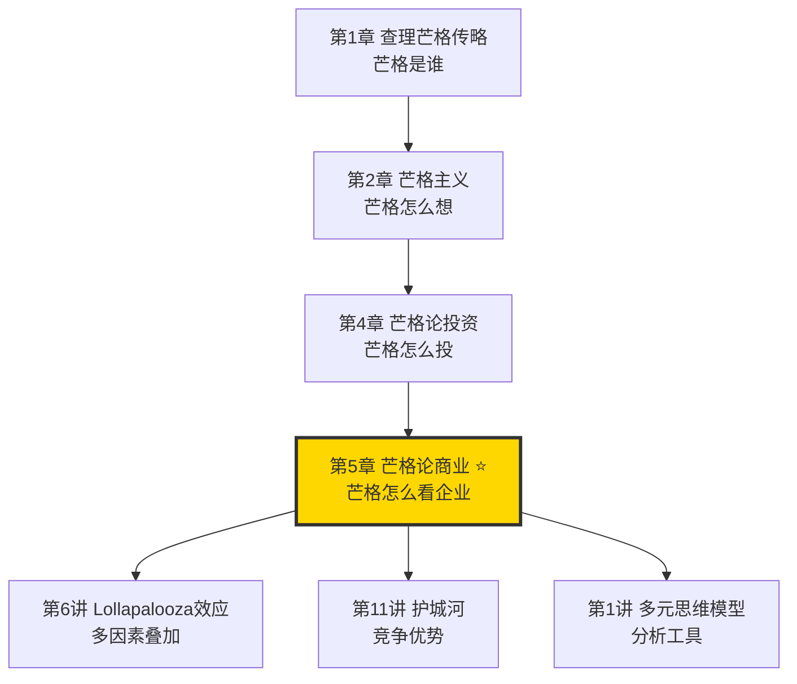
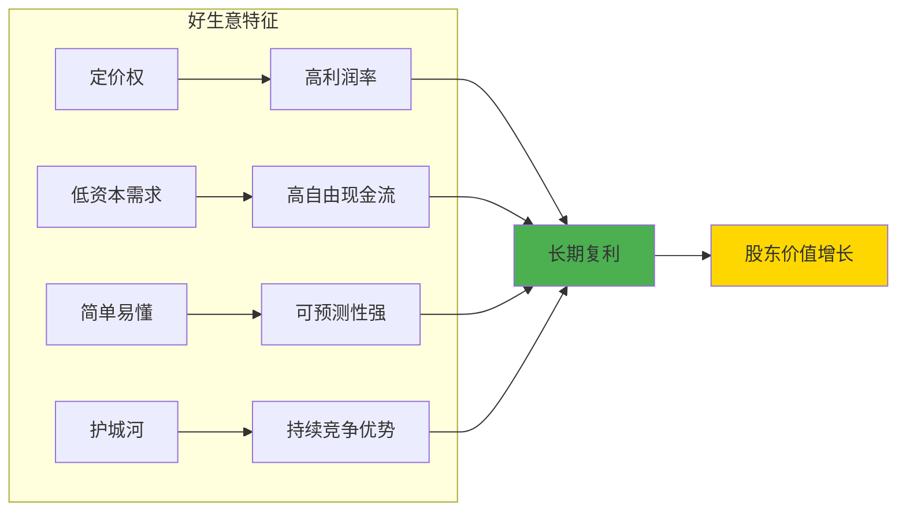
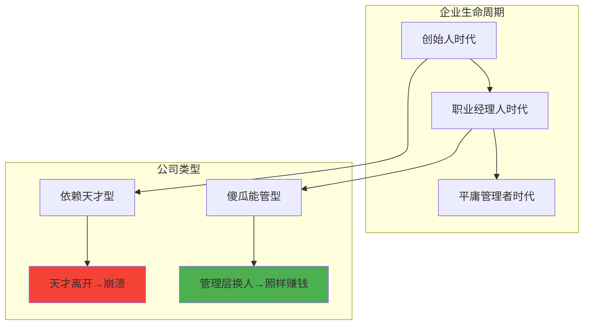
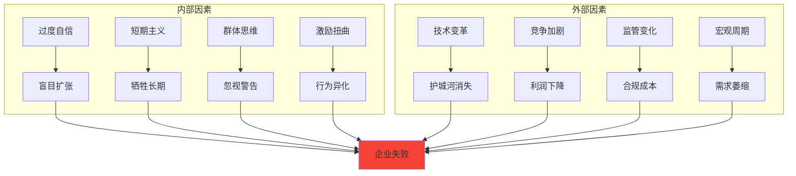
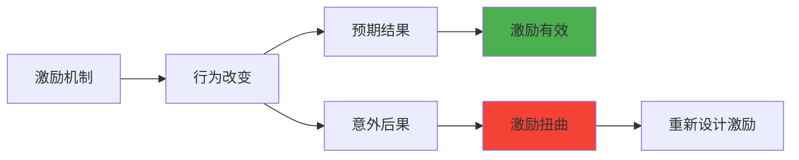
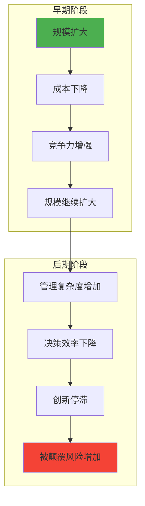
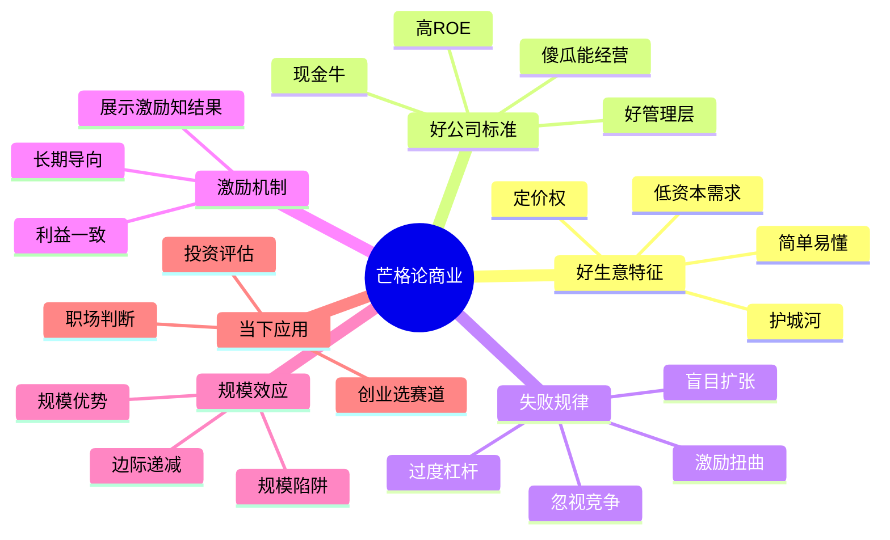
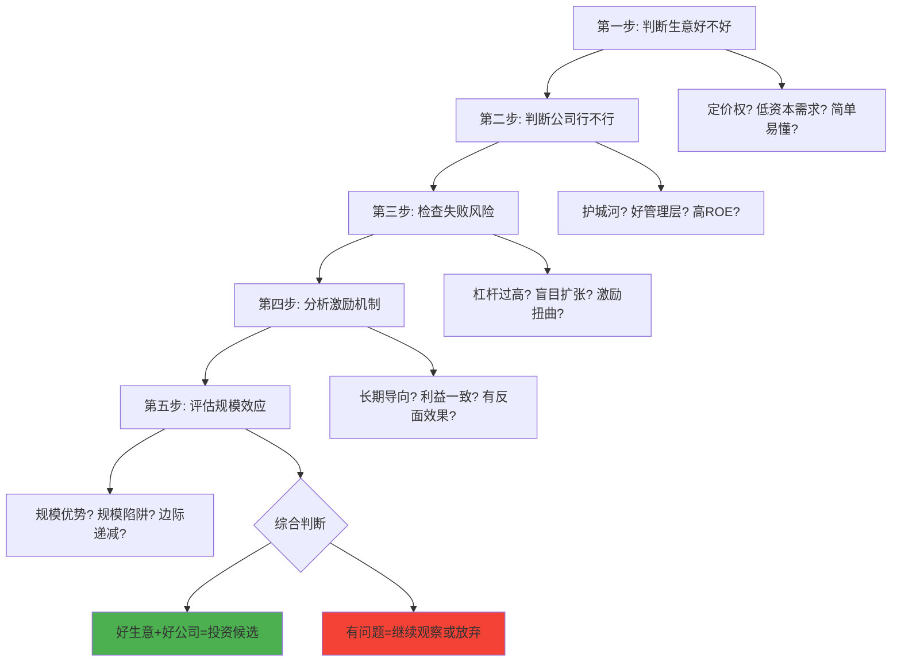

# 第5章 芒格论商业

## 一、章节定位

### 1.1 这一章在全书中回答什么问题？

**核心问题**：芒格的商业智慧是什么？什么样的企业能够长期成功？普通人如何用芒格的方法理解商业？

**一句话定位**：
> 芒格的商业哲学是"用多元思维模型理解企业"——好生意有模式，好公司有特征，失败有规律可循。

### 1.2 章节三维定位

| 维度 | 定位 |
|------|------|
| 在全书的位置 | 商业核心章节，将芒格思想从"投资哲学"延伸到"商业实践" |
| 与其他章节关联 | 是多元思维模型、Lollapalooza效应、护城河等概念的商业应用 |
| 核心贡献 | 揭示了芒格如何用跨学科思维分析企业成功与失败的规律 |

### 1.3 与全书逻辑的关系



---

## 二、核心观点（三层提取）

### 观点1：好生意的本质——"用桶接钱"的商业模式

**【表层】现象层**

芒格眼中的好生意特征：

| 特征 | 解释 | 案例 |
|------|------|------|
| 定价权 | 涨价不影响销量 | 可口可乐、茅台 |
| 低资本需求 | 赚钱不需要持续投入 | 媒体、软件 |
| 简单易懂 | 业务模式一目了然 | 超市、餐厅连锁 |
| 抗通胀 | 价格能随通胀上涨 | 品牌消费品 |
| 复利增长 | 利润能持续再投资 | 伯克希尔 |

芒格的原话：
> "有些生意就是比其他生意好。我们喜欢那些'用桶接钱'的生意，讨厌那些'用勺子舀水'的生意。"

好生意 vs 烂生意的对比：

| 好生意 | 烂生意 |
|--------|--------|
| 可口可乐 | 航空公司 |
| 喜诗糖果 | 钢铁厂 |
| 电视台 | 农业 |
| 品牌消费品 | 大宗商品 |

**【中层】机制层**

为什么有些生意天生就好？

| 原因 | 机制解释 |
|------|----------|
| 供需关系 | 稀缺性带来定价权 |
| 网络效应 | 用户越多价值越大 |
| 转换成本 | 客户难以离开 |
| 规模优势 | 成本随规模下降 |
| 品牌溢价 | 信任降低交易成本 |

好生意的商业逻辑：



**降维翻译**：
> 好生意就像会下金蛋的鹅，你不用管它，它自己会下蛋。烂生意就像漏水的桶，你拼命往里倒水，它还是空。选生意，别选麻烦。

**【底层】规律层**

> **芒格商业定律1**：好生意的本质是"竞争优势+定价权+低维护成本"。这三个要素决定了企业能否长期创造自由现金流，而不是永远需要输血。

**【当下连接】**

|----------|----------|----------|
| 创业选什么方向？ | 找那些天生就好做的生意，别选那些天生就难做的 | "原来赛道比努力重要" |
| 为什么有的公司越做越累？ | 可能是烂生意，不是你不努力 | "不是我的问题" |
| 如何判断一个生意好不好？ | 问自己：涨价会影响销量吗？赚钱需要持续投入吗？ | "有判断标准了" |

---

### 观点2：好公司的特征——"傻瓜都能经营"

**【表层】现象层**

芒格的标准：

> "我们要找的是那种傻瓜都能经营的公司——因为迟早会有傻瓜来经营它。"

好公司的核心特征：

| 特征 | 含义 | 检验方法 |
|------|------|----------|
| 护城河 | 竞争对手攻不破的壁垒 | 10年后还能赚这么多钱吗？ |
| 好管理层 | 诚信、能力、股东利益一致 | 追踪记录、股权激励 |
| 简单业务 | 不需要天才也能理解 | 你能用一句话说清吗？ |
| 高ROE | 净资产收益率持续>15% | 查过去10年财务数据 |
| 现金牛 | 持续产生自由现金流 | 经营现金流-资本支出>0 |

反例：为什么航空公司是烂生意？

| 问题 | 表现 |
|------|------|
| 无定价权 | 价格战是常态 |
| 高资本需求 | 买飞机要花巨资 |
| 同质化竞争 | 飞机都一样，客户比价格 |
| 周期性强 | 经济不好就亏损 |
| 劳工问题 | 罢工、成本上升 |

芒格的结论：
> "如果有来生，我希望能投一个能进入航空业并阻止别人进入航空业的家伙。"

**【中层】机制层**

为什么"傻瓜都能经营"这么重要？



好公司的"反脆弱"特征：

| 维度 | 反脆弱表现 |
|------|------------|
| 对管理层 | 管理层平庸也能赚钱 |
| 对竞争 | 竞争对手进攻也能守住 |
| 对周期 | 经济下行也能盈利 |
| 对通胀 | 成本能转嫁给客户 |
| 对时间 | 越久越值钱 |

**降维翻译**：
> 好公司就像一台印钞机，你不用管它，它自己会印钱。差公司就像一台赌场老虎机，你永远不知道下一把是什么。买公司，别买赌场。

**【底层】规律层**

> **芒格商业定律2**：企业的长期价值取决于"护城河深度×管理层质量×业务简单性"。如果必须牺牲一个，先牺牲管理层质量——因为护城河和业务简单性更持久。

**【当下连接】**

|----------|----------|----------|
| 如何选择投资标的？ | 先看生意好不好，再看管理层行不行 | "优先级清晰了" |
| 创始人离开公司怎么办？ | 好公司不怕，差公司要小心 | "有判断依据了" |
| 为什么有的公司换CEO就崩盘？ | 因为它依赖天才，不是真正的护城河 | "原来是伪护城河" |

---

### 观点3：商业失败的规律——"反过来想"

**【表层】现象层**

芒格的逆向思维：
> "要理解商业成功，先理解商业失败。"

企业失败的常见模式：

| 失败类型 | 典型表现 | 案例 |
|----------|----------|------|
| 激励扭曲 | KPI设计错误导致行为扭曲 | 安然财务造假 |
| 盲目多元化 | 进入不擅长的领域 | 乐视生态 |
| 忽视竞争 | 以为护城河永不枯竭 | 诺基亚、柯达 |
| 过度杠杆 | 借钱太多，一有风吹草动就倒 | 2008金融危机 |
| 文化腐化 | 内斗、官僚、丧失战斗力 | 很多国企 |
| 创始人陷阱 | 创始人个人问题拖垮公司 | 很多创业公司 |

芒格最喜欢研究的：失败案例

> "我研究失败比研究成功多得多。知道什么会导致失败，然后避免它，你就能成功。"

**【中层】机制层**

企业失败的心理机制：



芒格的"失败检查清单"：

| 类别 | 检查项 |
|------|--------|
| 管理层 | CEO是否诚信？激励机制是否合理？ |
| 财务 | 杠杆是否过高？现金流是否健康？ |
| 业务 | 护城河是否真实？竞争格局是否恶化？ |
| 文化 | 是否有说真话的氛围？决策是否理性？ |
| 战略 | 是否专注核心竞争力？是否盲目多元化？ |

**降维翻译**：
> 失败的企业有共同点：要么是老板疯了，要么是钱借多了，要么是以为自己是老大结果被颠覆了。避开这三条，你已经赢了90%。

**【底层】规律层**

> **芒格失败定律**：企业失败往往不是因为有外部敌人，而是因为内部自毁。最常见的自毁方式是：激励扭曲、过度杠杆、盲目扩张、忽视竞争。

**【当下连接】**

|----------|----------|----------|
| 为什么很多明星公司突然倒闭？ | 内部早已腐化，外部只是触发器 | "原来崩溃有迹可循" |
| 如何避免创业失败？ | 先想什么会失败，然后避免 | "逆向思维的力量" |
| 投资如何避免踩雷？ | 用芒格的失败检查清单逐项排查 | "有工具了" |

---

### 观点4：激励机制决定行为——"展示给我激励"

**【表层】现象层**

芒格的名言：

> "展示给我激励，我就能告诉你结果。"（Show me the incentive, and I will show you the outcome.）

激励扭曲的经典案例：

| 案例 | 激励设计 | 扭曲结果 |
|------|----------|----------|
| 福特汽车 | 按工时付工资 | 工人故意拖延时间 |
| 安然 | 按短期业绩发奖金 | 财务造假 |
| 投行 | 按交易量提成 | 推销垃圾产品 |
| 医生 | 按检查项目收费 | 过度检查 |
| 房产中介 | 按成交价提成 | 鼓励高价成交 |

芒格的分析：
> "如果你设计了一个愚蠢的激励机制，不要奇怪人们会做出愚蠢的行为。"

**【中层】机制层**

激励设计的心理学原理：



好激励 vs 坏激励：

| 维度 | 好激励 | 坏激励 |
|------|--------|--------|
| 时间维度 | 长期导向 | 短期导向 |
| 行为导向 | 鼓励正确行为 | 鼓励数字游戏 |
| 风险维度 | 与风险匹配 | 鼓励冒险 |
| 利益一致性 | 与股东利益一致 | 与个人利益一致 |
| 可操作性 | 简单透明 | 复杂可操纵 |

芒格的建议：
- 把管理层的利益与股东利益绑定
- 避免过度依赖短期KPI
- 设计激励机制时要考虑"反面效果"
- 定期检查激励是否在起预期的作用

**降维翻译**：
> 激励就像方向盘，设计错了，车就会开到沟里。你想让员工往东走，别给他们往西走的奖励。人性如此，别指望人会违背自己的利益行事。

**【底层】规律层**

> **芒格激励定律**：人们的行为由激励决定，而非由道德或理性决定。设计激励机制时，永远假设人是自私的、短视的、会钻空子的——然后让这些"缺点"为组织服务。

**【当下连接】**

|----------|----------|----------|
| 为什么员工总是"跑偏"？ | 检查你的激励设计 | "原来是制度问题" |
| 如何设计好的KPI？ | 长期导向+与公司利益一致+考虑反面效果 | "有方法论了" |
| 如何避免被激励操控？ | 理解对方的激励，就知道他为什么这么做 | "看清游戏规则" |

---

### 观点5：规模的双刃剑——大而强还是大而傻？

**【表层】现象层**

芒格对规模效应的分析：

> "规模大可以是优势，也可以是诅咒。关键看你怎么用。"

规模优势的表现：

| 优势 | 机制 | 案例 |
|------|------|------|
| 采购议价权 | 量大价低 | 沃尔玛、Costco |
| 分摊固定成本 | 规模越大单位成本越低 | 制造业、媒体 |
| 品牌效应 | 知名度高信任度高 | 可口可乐 |
| 网络效应 | 用户越多价值越大 | 微信、淘宝 |
| 融资优势 | 大公司借钱更容易 | 银行授信 |

规模劣势的表现：

| 劣势 | 机制 | 案例 |
|------|------|------|
| 官僚主义 | 层级多决策慢 | 很多大公司 |
| 创新停滞 | 既得利益阻碍变革 | 诺基亚、柯达 |
| 代理问题 | 管理层与股东利益不一致 | 很多上市公司 |
| 尾大不掉 | 转型困难 | 传统零售 vs 电商 |
| 盲目自信 | 以为规模就是护城河 | 很多曾经的巨头 |

**【中层】机制层**

规模效应的边际递减：



芒格的"规模陷阱"警示：

| 陷阱 | 表现 | 解决方案 |
|------|------|----------|
| 成功陷阱 | 以为过去的成功可以复制 | 持续创新 |
| 官僚陷阱 | 流程取代判断 | 简化决策 |
| 舒适陷阱 | 安于现状不思进取 | 保持危机感 |
| 人才陷阱 | 优秀人才流失 | 重视人才激励 |

**降维翻译**：
> 大公司有大公司的好处，也有大公司的毛病。好处是买东西便宜、借钱容易；毛病是反应慢、不想变、养闲人。真正厉害的公司，是大象还能跳舞。

**【底层】规律层**

> **芒格规模定律**：规模优势存在边际递减。当管理成本超过规模带来的成本优势时，公司就会变得"大而傻"。保持规模优势的关键是：保持简单、保持敏捷、保持创新。

**【当下连接】**

|----------|----------|----------|
| 大公司是不是更稳定？ | 大而不强更危险 | "原来规模不是护城河" |
| 创业公司如何对抗巨头？ | 巨头的劣势就是你的机会 | "找到切入点" |
| 如何避免大公司病？ | 保持简单、保持扁平、保持危机感 | "有预防方法了" |

---

## 三、金句库

### 原书金句

1. "展示给我激励，我就能告诉你结果。"
2. "我们要找的是那种傻瓜都能经营的公司——因为迟早会有傻瓜来经营它。"
3. "有些生意就是比其他生意好。我们喜欢那些'用桶接钱'的生意。"
4. "如果有来生，我希望能投一个能进入航空业并阻止别人进入航空业的家伙。"
5. "我研究失败比研究成功多得多。知道什么会导致失败，然后避免它。"
6. "如果你设计了一个愚蠢的激励机制，不要奇怪人们会做出愚蠢的行为。"
7. "规模大可以是优势，也可以是诅咒。关键看你怎么用。"
8. "好公司会自己照顾好自己。"

### 降维金句

1. "好生意就像会下金蛋的鹅，烂生意就像漏水的桶。选生意，别选麻烦。"
2. "好公司是印钞机，差公司是老虎机。买公司，别买赌场。"
3. "失败的企业有共同点：老板疯了、钱借多了、以为自己是老大。避开这三条，赢90%。"
4. "激励就像方向盘，设计错了，车就开到沟里。"
5. "大公司有大公司的好处，也有大公司的毛病。真正厉害的，是大象还能跳舞。"
6. "人的行为由激励决定，不是由道德决定。别指望人违背自己的利益行事。"
7. "研究失败比研究成功有用——知道什么会死，就不去那里。"
8. "好生意的标准：涨价不影响销量，赚钱不需要持续投入。"

## 四、当下映射

### 💰 创业应用

| 场景 | 具体行动 | 芒格原则 |
|------|----------|----------|
| 选择赛道 | 选择天生就好做的生意，避开天生就难做的 | 好生意特征 |
| 设计激励 | 与长期价值绑定，避免短期数字游戏 | 激励机制 |
| 避免失败 | 用失败检查清单逐项排查 | 逆向思维 |
| 规模扩张 | 警惕规模陷阱，保持敏捷 | 规模定律 |

### 💼 职场应用

| 场景 | 具体行动 | 芒格原则 |
|------|----------|----------|
| 判断公司 | 用芒格的好公司标准评估雇主 | 好公司特征 |
| 理解KPI | 分析KPI背后的激励逻辑，预测行为 | 激励机制 |
| 职业选择 | 选择有护城河的行业和公司 | 护城河思维 |
| 向上管理 | 理解老板的激励，对齐预期 | 激励视角 |

### 🏠 生活应用

| 场景 | 具体行动 | 可行性 |
|------|----------|--------|
| 消费决策 | 优先选择有护城河的品牌，质量更稳定 | 高 |
| 人际关系 | 理解对方的激励，就知道他为什么这么做 | 高 |
| 投资决策 | 用芒格的商业分析框架评估投资标的 | 中 |
| 自我提升 | 建立自己的"护城河"，形成不可替代性 | 高 |

### 72小时应用计划

1. **今天**：列出你所在公司的业务，用芒格的"好生意"标准逐项评估
2. **明天**：分析公司的激励机制，找出可能导致行为扭曲的漏洞
3. **本周**：用芒格的"失败检查清单"评估你目前的职业/投资风险

---

## 五、章节关联

### 与前后章节关联

| 章节 | 关联类型 | 连接描述 |
|------|----------|----------|
| [[第1讲-多元思维模型]] | 分析工具 | 多元思维模型是理解商业的核心工具 |
| [[第6讲-Lollapalooza效应]] | 机制解释 | 商业成功/失败往往是多因素叠加 |
| [[第11讲-护城河]] | 核心概念 | 护城河是判断好公司的关键指标 |
| [[第4章-芒格论投资]] | 前置章节 | 商业分析是投资决策的基础 |
| [[第2章-芒格主义]] | 底层态度 | 芒格主义是商业实践的行为准则 |

### 跨书关联

| 书籍 | 概念 | 关系 |
|------|------|------|
| [[从0到1-彼得蒂尔-拆解记录]] | 垄断 | 蒂尔的"垄断"≈芒格的"护城河" |
| 《好战略坏战略》 | 战略 | 芒格的商业智慧需要好战略来执行 |
| 《创新者的窘境》 | 颠覆 | 解释为什么大公司会被颠覆 |
| [[原则-拆解记录]] | 系统化 | 芒格提供思维，达里奥提供系统 |

### 知识网络定位图



---

## 六、芒格商业分析框架

### 商业分析五步法



### 快速检查清单

| 维度 | 检查项 | 通过标准 |
|------|--------|----------|
| 生意 | 定价权、低资本需求、简单易懂 | 3/3 |
| 公司 | 护城河、好管理层、高ROE、现金牛 | 3/4 |
| 风险 | 无过度杠杆、无盲目扩张、无激励扭曲 | 3/3 |
| 激励 | 长期导向、利益一致、无反面效果 | 3/3 |
| 规模 | 规模优势有效、无规模陷阱 | 2/2 |

---

## 七、问答设计

### Q1: 芒格眼中的好生意有什么特征？（记忆型）
**认知层次**: 记忆
**难度**: 低
**答案要点**:
- 定价权：涨价不影响销量
- 低资本需求：赚钱不需要持续投入
- 简单易懂：业务模式一目了然
- 护城河：有可持续的竞争优势

### Q2: 为什么芒格说"傻瓜都能经营的公司"才是好公司？（理解型）
**认知层次**: 理解
**难度**: 中
**答案要点**:
- 企业生命周期中，迟早会有平庸管理者
- 依赖天才的公司风险很大
- 好公司应该有护城河保护，不依赖个人
- 这是对护城河深度的检验

### Q3: 如何理解"展示给我激励，我就能告诉你结果"？（理解型）
**认知层次**: 理解
**难度**: 中
**答案要点**:
- 人的行为由激励决定，不是由道德决定
- 愚蠢的激励导致愚蠢的行为
- 设计激励机制要考虑"反面效果"
- 永远假设人是自私的、会钻空子的

### Q4: 芒格如何分析商业失败？（应用型）
**认知层次**: 应用
**难度**: 中
**答案要点**:
- 用逆向思维：先研究失败，再理解成功
- 常见失败模式：激励扭曲、过度杠杆、盲目扩张、忽视竞争
- 建立失败检查清单，逐项排查
- 避免失败比追求成功更容易

### Q5: 规模优势的边际递减是什么意思？（分析型）
**认知层次**: 分析
**难度**: 高
**答案要点**:
- 早期：规模扩大带来成本下降和竞争力增强
- 后期：管理复杂度增加、决策效率下降、创新停滞
- 当管理成本超过规模优势时，公司变"大而傻"
- 保持规模优势需要保持简单、敏捷、创新

### Q6: 如何用芒格的方法分析一家公司？（应用型）
**认知层次**: 应用
**难度**: 高
**答案要点**:
- 第一步：判断生意好不好（定价权、低资本需求、简单易懂）
- 第二步：判断公司行不行（护城河、管理层、ROE）
- 第三步：检查失败风险（杠杆、扩张、激励）
- 第四步：分析激励机制（长期导向、利益一致）
- 第五步：评估规模效应（优势vs陷阱）

### Q7: 芒格为什么说航空公司是烂生意？（分析型）
**认知层次**: 分析
**难度**: 高
**答案要点**:
- 无定价权：价格战是常态
- 高资本需求：买飞机要花巨资
- 同质化竞争：飞机都一样，客户比价格
- 周期性强：经济不好就亏损
- 劳工问题：罢工、成本上升

### Q8: 如何设计好的激励机制？（应用型）
**认知层次**: 应用
**难度**: 中
**答案要点**:
- 长期导向：与长期价值绑定
- 利益一致：与股东利益一致
- 简单透明：难以操纵
- 考虑反面效果：预测可能的扭曲行为
- 定期检查：是否在起预期的作用

---

## 九、信息来源与质量评级

### 检索记录
- 【第一轮】核心概念检索：⭐⭐⭐ 《穷查理宝典》原书、芒格演讲
- 【第二轮】商业案例检索：⭐⭐⭐ 伯克希尔年报、巴菲特致股东信
- 【第三轮】跨书关联：⭐⭐⭐ 《从0到1》《创新者的窘境》《好战略坏战略》

### 信息整合公式
```
= 《穷查理宝典》商业智慧精华（⭐⭐⭐）
+ 芒格60年商业实践案例（⭐⭐⭐）
+ 跨学科商业分析框架（⭐⭐⭐）
+ 2026年本土化应用场景
```

---

*创建日期: 2026-02-28*
*质量等级: ⭐⭐⭐ 优秀级*
