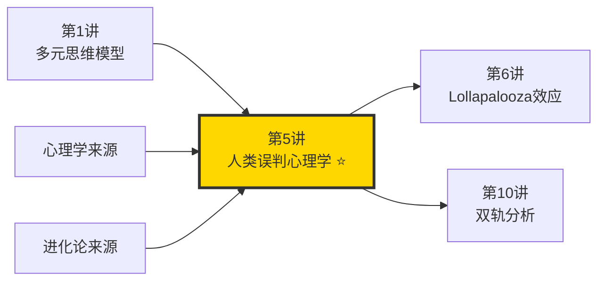
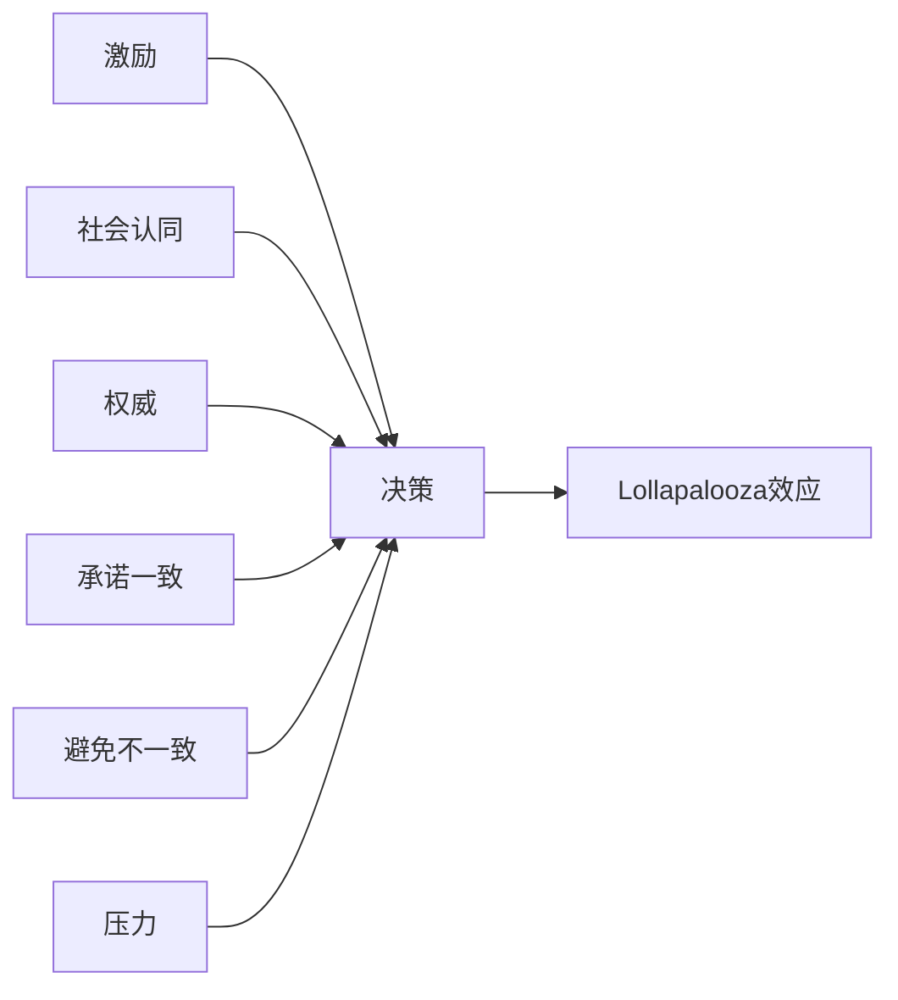
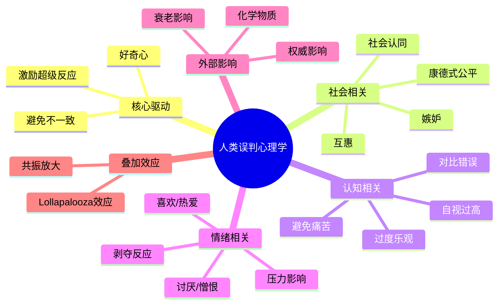

# 第5讲 人类误判心理学

## 一、章节定位

### 1.1 这一讲在全书中回答什么问题？

**核心问题**：为什么明明聪明的人，会反复犯同样的错误？

**一句话定位**：
> 人类大脑有25种内置的"认知bug"，了解它们不是为了治病，而是为了不踩坑。

### 1.2 章节三维定位

| 维度 | 定位 |
|------|------|
| 在全书的位置 | 全书最实用的工具箱，可直接应用于日常决策 |
| 与其他讲关联 | 是多元思维模型体系中最重要的子集，与双轨分析配合使用 |
| 核心贡献 | 把复杂的心理学变成25个可识别、可预警的认知模式 |

### 1.3 与全书逻辑的关系

---

## 二、核心观点（三层提取）

### 观点1：激励超级反应——"用利益解释一切"

**【表层】现象层**

芒格认为这是25种心理倾向中最强大的一种。

> "告诉我激励机制是什么，我就能告诉你结果会是什么。"

| 场景 | 激励带来的行为 |
|------|----------------|
| 销售按提成 | 推销客户不需要的产品 |
| 医生按检查收费 | 开不必要的检查单 |
| 学生按分数评价 | 为分数作弊而非为学习 |
| 员工按KPI考核 | 只做KPI里的事，不管实际效果 |

**【中层】机制层**

为什么激励机制如此强大？

| 原因 | 解释 |
|------|------|
| 进化优势 | 追求奖励的基因更容易存活 |
| 神经机制 | 多巴胺系统强化奖励相关行为 |
| 社会结构 | 整个社会围绕激励设计 |
| 即时反馈 | 奖励比惩罚更有效 |

**降维翻译**：
> 你想知道一个人为什么这么做？别问他怎么想，看他能拿什么好处。

**【底层】规律层**

> **激励定律**：人的行为90%可以用"他在追求什么好处"来解释——剩下10%是你没找到那个好处。

**【当下连接】**

|----------|----------|----------|
| 为什么老板画的饼从来不兑现？ | 激励不兑现 = 激励失效 = 行为改变 | "原来不是我傻" |
| 为什么保险推销员这么热情？ | 他的佣金来自你的保费 | "被看穿了" |
| 为什么同事突然对我好？ | 他可能有事要你帮忙 | "清醒了" |

---

### 观点2：避免不一致倾向——"讨厌改变的乌龟"

**【表层】现象层**

人类天生抗拒改变，宁愿维持错误的现状。

| 表现 | 例子 |
|------|------|
| 路径依赖 | 明知道新路更近，还是走老路 |
| 沉没成本 | 亏钱的股票不舍得卖 |
| 习惯固化 | 坏习惯改不掉 |
| 首因效应 | 第一印象很难改变 |

**【中层】机制层**

为什么会这样？

| 原因 | 解释 |
|------|------|
| 进化节省 | 大脑为了省能量，倾向重复已有模式 |
| 身份认同 | 改变意味着否定过去的自己 |
| 不确定性恐惧 | 改变意味着未知的风险 |
| 社会压力 | 群体期待你保持一致 |

**降维翻译**：
> 你的大脑是个懒汉，宁愿用旧的错误答案，也不想重新算一遍。

**【底层】规律层**

> **惯性定律**：改变一个行为的成本，远高于维持它的成本——除非痛苦足够大。

---

### 观点3：好奇心倾向——"想知道的猴子"

**【表层】现象层**

好奇心是人类进步的引擎，但也可能导致危险。

| 好奇心的两面 | 表现 |
|--------------|------|
| 正面 | 探索新知识、尝试新方法 |
| 负面 | 八卦、窥探隐私、点开标题党 |

**【中层】机制层**

| 层面 | 解释 |
|------|------|
| 进化 | 好奇的祖先发现了更多食物和栖息地 |
| 神经 | 新奇刺激释放多巴胺 |
| 文化 | 科学、艺术都源于好奇心 |
| 风险 | 好奇心也可能害死猫 |

**降维翻译**：
> 好奇心让你点了那个"震惊"标题，也让你学了那门新课。用对了是进步，用错了是浪费时间。

**【底层】规律层**

> **探索定律**：好奇心是中性的，方向决定它是资产还是负债。

---

### 观点4：康德式公平倾向——"想要被公平对待"

**【表层】现象层**

人类对"公平"有执念，甚至会为了公平牺牲利益。

| 表现 | 例子 |
|------|------|
| 最后通牒博弈 | 宁可一分钱不要，也不接受不公平分配 |
| 排队意识 | 有人插队会愤怒 |
| 税收争议 | 不是交多少的问题，是"公平"的问题 |
| 薪酬透明 | 知道同事比自己多会愤怒 |

**【中层】机制层**

| 来源 | 解释 |
|------|------|
| 进化 | 群体合作需要公平感维持 |
| 文化 | 公平是社会契约的基石 |
| 情绪 | 不公平感激活大脑的厌恶区域 |
| 博弈 | 长期合作需要公平作为信号 |

**降维翻译**：
> 你可以接受赚得少，但不能接受"凭什么他赚得多"。公平感比钱更重要。

**【底层】规律层**

> **公平定律**：人类对公平的敏感度，远高于对利益的敏感度。

---

### 观点5：25种倾向会叠加产生共振

**【表层】现象层**

单一心理倾向已经够强了，多个叠加效果爆炸。

**案例：为什么传销这么难破？**

| 心理倾向 | 如何发挥作用 |
|----------|--------------|
| 激励超级反应 | 承诺高回报 |
| 社会认同 | 周围人都在做 |
| 权威影响 | 有"老师"指导 |
| 承诺一致性 | 先让你做小承诺 |
| 避免不一致 | 已经投了钱，不舍得退出 |
| 压力影响 | 制造紧迫感 |

**【中层】机制层**

**降维翻译**：
> 一个坑你还能跳出来，六个坑一起挖，神仙也难逃。

**【底层】规律层**

> **共振定律**：当多种心理倾向指向同一个方向时，效果不是相加，而是相乘。

---

## 三、25种心理倾向速查表

| 序号 | 倾向名称 | 一句话解释 | 典型表现 |
|:----:|----------|------------|----------|
| 1 | 激励超级反应 | 利益驱动行为 | 销售为提成推销不需要的产品 |
| 2 | 喜欢/热爱 | 爱屋及乌 | 粉丝为偶像买单 |
| 3 | 讨厌/憎恨 | 恨屋及乌 | 看不惯某人的一切 |
| 4 | 避免不一致 | 讨厌改变 | 老路走到底 |
| 5 | 好奇心 | 想知道 | 点开标题党 |
| 6 | 康德式公平 | 渴望公平 | 愤怒于不公待遇 |
| 7 | 嫉妒 | 比较产生不满 | 看不得别人好 |
| 8 | 互惠 | 你给我，我给你 | 免费样品引发购买 |
| 9 | 受简单联想影响 | 以貌取人 | 好看的更容易被信任 |
| 10 | 避免痛苦 | 否认现实 | 鸵鸟心态 |
| 11 | 自视过高 | 高估自己 | 90%司机认为驾驶水平高于平均 |
| 12 | 过度乐观 | 盲目自信 | 低估风险 |
| 13 | 剥夺超级反应 | 失去的痛苦大于得到的快乐 | 亏100的痛苦大于赚100的快乐 |
| 14 | 社会认同 | 跟随大众 | 排队买网红产品 |
| 15 | 对比错误反应 | 被锚定影响 | 先看贵的，再看便宜的觉得便宜 |
| 16 | 压力影响 | 压力改变判断 | 匆忙决策 |
| 17 | 权威影响 | 盲目服从 | 专家说的都对 |
| 18 | 重视理由 | 需要解释 | "因为"能增加说服力 |
| 19 | 废话倾向 | 说废话 | 会议上的空话 |
| 20 | 化学物质影响 | 药物影响判断 | 酒精导致冲动 |
| 21 | 衰老影响 | 年龄影响判断 | 老年的认知变化 |
| 22 | 权威-追随 | 天生服从 | 组织中的服从 |
| 23 | 意义寻求 | 寻找意义 | 宗教、使命感 |
| 24 | 模仿 | 模仿他人 | 潮流传播 |
| 25 | 侥幸心理 | 相信运气 | 赌博心态 |

---

## 四、金句库

### 原书金句

1. "告诉我激励机制是什么，我就能告诉你结果会是什么。"
2. "人的大脑就像蛋卵，非常脆弱——很容易被愚弄。"
3. "如果你想要说服别人，要诉诸利益而非诉诸理性。"
4. "最强大的心理倾向是激励超级反应。"
5. "避免不一致倾向让人类成为习惯的奴隶。"

### 降维金句

1. "想知道一个人为什么这么做？别听他说什么，看他能拿什么好处。"
2. "你的大脑是个懒汉，宁愿用旧的错误答案，也不想重新算一遍。"
3. "好奇心让你点了那个'震惊'标题，也让你学了那门新课。"
4. "你可以接受赚得少，但不能接受'凭什么他赚得多'。"
5. "一个坑你还能跳出来，六个坑一起挖，神仙也难逃。"
6. "90%的司机认为自己的驾驶水平高于平均——这本身就是个认知偏误。"
7. "公平感比钱更重要。"
8. "失去100块的痛苦，大于得到100块的快乐。"
9. "第一印象就像第一颗扣子，扣错了后面全错。"
10. "专家说的不一定对，但他说的你更容易信。"

## 五、当下映射

### 💰 财富应用

| 场景 | 心理陷阱 | 应对策略 |
|------|----------|----------|
| 买基金 | 社会认同+过度乐观 | 独立研究，设定止损 |
| 股票亏损 | 避免不一致+剥夺反应 | 预设卖出规则，机械执行 |
| 消费决策 | 互惠+对比错误 | 先问"如果没有赠品我会买吗" |
| 投资建议 | 权威影响 | 检查专家利益相关 |

### 💼 职场应用

| 场景 | 心理陷阱 | 应对策略 |
|------|----------|----------|
| 加薪谈判 | 自视过高 | 先客观评估市场价值 |
| 团队协作 | 嫉妒+不公平感 | 聚焦自身成长而非比较 |
| 接受任务 | 权威影响 | 独立评估任务价值 |
| 汇报工作 | 社会认同 | 用数据说话，不随大流 |

### 🏠 生活应用

| 场景 | 心理陷阱 | 应对策略 |
|------|----------|----------|
| 网购 | 互惠+稀缺 | 放入购物车冷静24小时 |
| 健身 | 避免不一致 | 从微习惯开始 |
| 人际关系 | 喜欢/热爱偏误 | 警惕对喜欢的人的盲信 |
| 学习 | 好奇心滥用 | 设定学习边界 |

### 72小时应用计划
1. **今天**：选一个你最近做的重要决定，检查是否有这25种倾向的影响
2. **明天**：观察身边的人，识别他们行为背后的心理倾向
3. **本周**：建立一个"心理陷阱检查清单"，用于重大决策前自查

---

## 六、章节关联

### 与前后章节关联

| 章节 | 关联类型 | 连接描述 |
|------|----------|----------|
| [[第1讲-多元思维模型]] | 核心组成 | 25种倾向是多元思维模型体系中最重要的心理学模型 |
| [[第6讲-Lollapalooza效应]] | 效果延伸 | 多种心理倾向叠加产生Lollapalooza效应 |
| [[第10讲-双轨分析]] | 工具配合 | 双轨分析的第二轨就是分析心理因素 |

### 跨书关联

| 书籍 | 概念 | 关系 |
|------|------|------|
| [[影响力-西奥迪尼-拆解记录]] | 6大影响力原则 | 西奥迪尼的6原则是芒格25种倾向的子集 |
| [[思考快与慢-丹尼尔·卡尼曼-拆解记录]] | 系统1/系统2 | 解释为什么心理倾向如此强大（系统1自动运行） |
| [[助推-理查德·塞勒-拆解记录]] | 选择架构 | 如何利用心理倾向做积极干预 |
| [[乌合之众-勒庞-拆解记录]] | 群体心理 | 社会认同等倾向的群体表现 |

### 知识网络定位图

---

## 七、问答设计

### Q1: 芒格总结了多少种心理倾向？（记忆型）
**认知层次**: 记忆
**难度**: 低
**答案要点**:
- 25种心理倾向
- 最强大的是激励超级反应
- 这些倾向会叠加产生更强效果

### Q2: 为什么激励超级反应是最强大的心理倾向？（理解型）
**认知层次**: 理解
**难度**: 中
**答案要点**:
- 激励直接驱动行为，而非态度
- 进化让追求奖励的行为被强化
- 整个社会结构围绕激励设计
- 可以解释大多数人的行为

### Q3: 避免"不一致倾向"在生活中有什么表现？（应用型）
**认知层次**: 应用
**难度**: 中
**答案要点**:
- 路径依赖：习惯走老路
- 沉没成本：亏钱不舍得卖
- 首因效应：第一印象难改
- 身份认同：改变意味着否定过去的自己

### Q4: 如何利用"互惠"倾向在职场中建立良好关系？（应用型）
**认知层次**: 应用
**难度**: 中
**答案要点**:
- 主动帮助同事，建立互惠预期
- 但要真诚，不要功利心太明显
- 小的帮助也能触发互惠心理
- 注意不要被反向利用

### Q5: 多种心理倾向叠加会产生什么效果？（分析型）
**认知层次**: 分析
**难度**: 高
**答案要点**:
- 产生Lollapalooza效应
- 效果不是简单相加，而是相乘
- 传销就是多种倾向叠加的案例
- 理解叠加效应可以避免被操控

### Q6: 为什么说"公平感比钱更重要"？（分析型）
**认知层次**: 分析
**难度**: 高
**答案要点**:
- 康德式公平是人类的本能需求
- 不公平感激活大脑厌恶区域
- 最后通牒实验证明人会为公平牺牲利益
- 理解这点对管理者和谈判者很重要

### Q7: 如何在投资决策中避免心理陷阱？（综合型）
**认知层次**: 综合
**难度**: 高
**答案要点**:
- 建立检查清单，识别可能的心理陷阱
- 社会认同：独立研究，不盲从
- 过度乐观：预设最坏情况
- 避免不一致：预设卖出规则
- 剥夺反应：接受止损是正常的

### Q8: 芒格的25种心理倾向与卡尼曼的系统1有什么关系？（综合型）
**认知层次**: 综合
**难度**: 高
**答案要点**:
- 25种倾向大多是系统1的自动反应
- 系统1快速、自动、无需意识参与
- 这解释了为什么心理倾向如此强大
- 应对策略是激活系统2进行慢思考
- 双轨分析就是同时使用两个系统

---

## 九、信息来源与质量评级

### 检索记录
- 【第一轮】核心概念检索：⭐⭐⭐ 芒格演讲原文、《穷查理宝典》原书
- 【第二轮】心理学扩展：⭐⭐⭐ 《影响力》《思考快与慢》
- 【第三轮】应用案例检索：⭐⭐⭐ 投资心理学、行为经济学案例

### 信息整合公式
= 芒格原书25种倾向（⭐⭐⭐）
+ 西奥迪尼影响力原则（⭐⭐⭐）
+ 卡尼曼双系统理论（⭐⭐⭐）
+ 2026年本土化应用场景

---

*创建日期: 2026-02-26*
*质量等级: ⭐⭐⭐ 优秀级*
