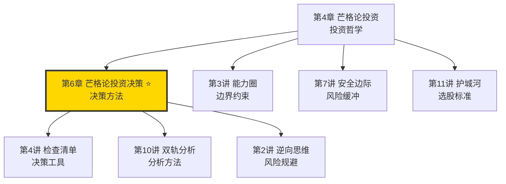
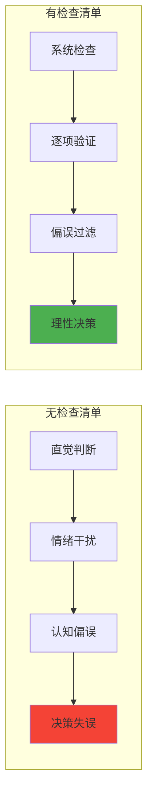
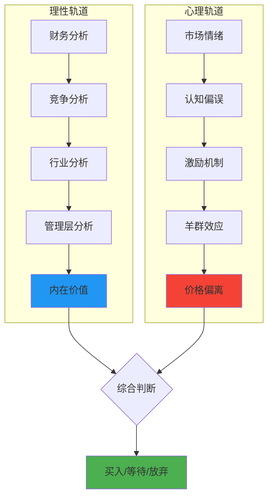
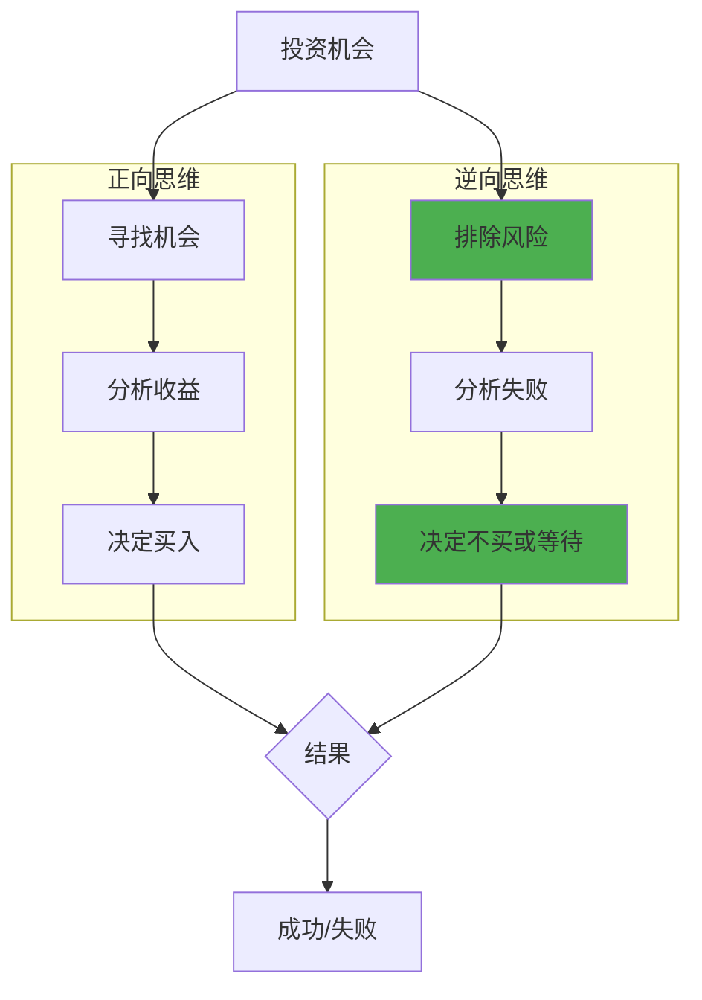
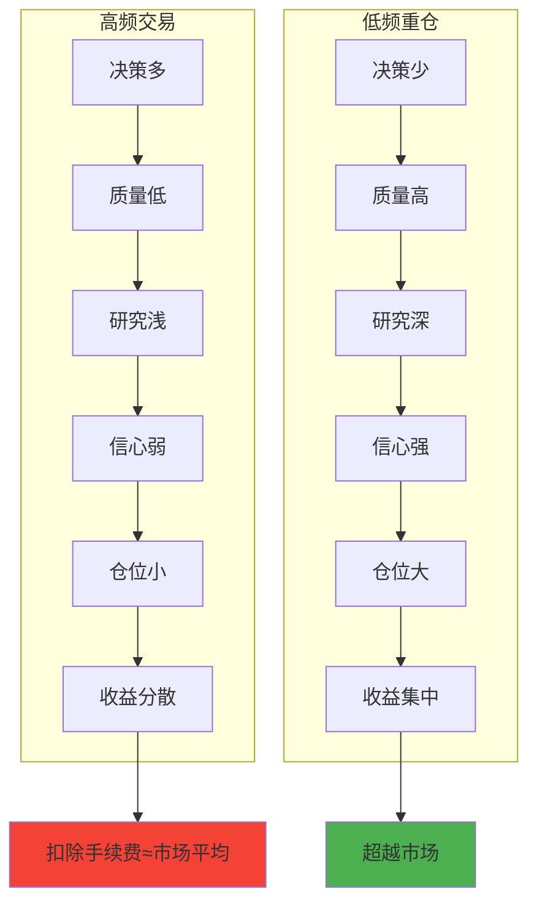
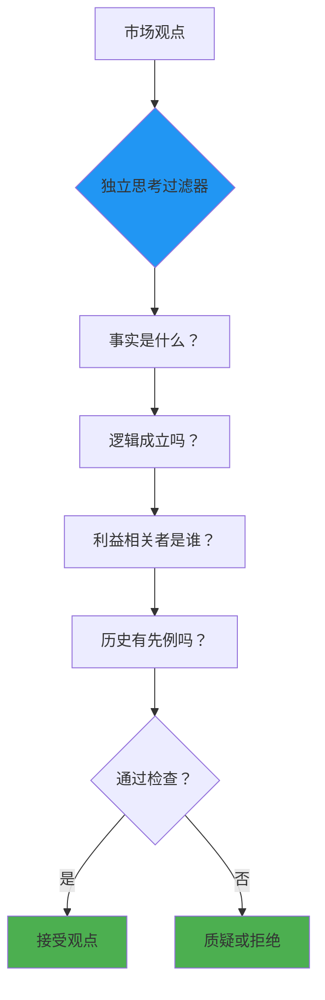
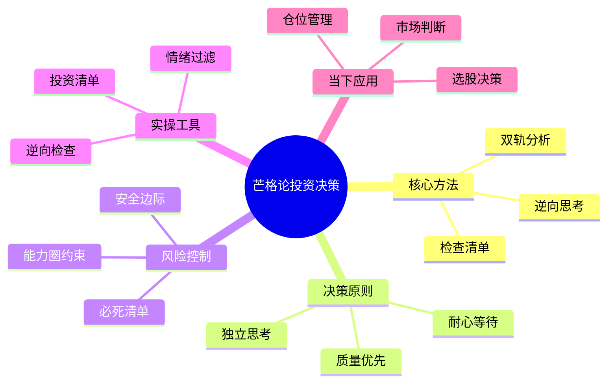
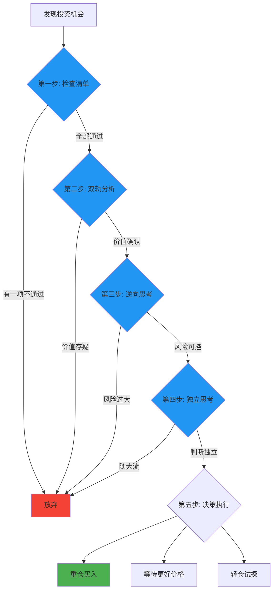

# 第6章 芒格论投资决策

## 一、章节定位

### 1.1 这一章在全书中回答什么问题？

**核心问题**：芒格如何做出投资决策？他用什么方法避免犯错？普通人如何建立自己的投资决策系统？

**一句话定位**：
> 芒格的投资决策方法是"检查清单+双轨分析+逆向思考"——把决策过程系统化，让正确决策成为习惯。

### 1.2 章节三维定位

| 维度 | 定位 |
|------|------|
| 在全书的位置 | 投资决策实操章节，将第4章的投资哲学落地为具体决策方法 |
| 与其他章节关联 | 是检查清单、双轨分析、逆向思维的集大成应用 |
| 核心贡献 | 揭示了芒格如何用"系统化方法"替代"灵光一现"做出高胜率决策 |

### 1.3 与全书逻辑的关系



---

## 二、核心观点（三层提取）

### 观点1：检查清单是决策的第一道防线

**【表层】现象层**

芒格的检查清单哲学：

> "聪明的飞行员即使才华再过人，也不会在没有检查清单的情况下起飞。"

芒格的投资检查清单框架：

| 类别 | 检查项 | 核心问题 |
|------|--------|----------|
| **风险** | 安全边际 | 有足够的安全边际吗？ |
| **风险** | 独立思考 | 这是独立分析还是随大流？ |
| **风险** | 准备 | 研究够深入了吗？ |
| **价值** | 护城河 | 竞争优势可持续吗？ |
| **价值** | 管理层 | 管理层诚信可靠吗？ |
| **价值** | 价格 | 价格合理吗？ |
| **心理** | 偏误 | 我有没有被情绪左右？ |
| **心理** | 能力圈 | 这在我能力圈内吗？ |
| **时机** | 必要性 | 现在必须买吗？可以等吗？ |

芒格的原话：
> "不要只盯着想要买入的公司的财务数据，还要检查其他所有相关因素。就像一个工程师检查桥梁一样。"

**【中层】机制层**

为什么检查清单如此有效？



检查清单的心理机制：

| 机制 | 解释 |
|------|------|
| 强制停顿 | 避免冲动决策，给你思考时间 |
| 全面覆盖 | 不会遗漏关键因素 |
| 客观标准 | 用事实替代感觉 |
| 减少偏见 | 系统性抵消认知偏误 |
| 可复制性 | 成功决策可以复制 |

**降维翻译**：
> 检查清单就像飞行员起飞前的检查——不是因为你笨，而是因为人脑会漏东西。好记性不如烂笔头，聪明脑子不如系统方法。

**【底层】规律层**

> **芒格检查清单定律**：投资决策的质量不取决于智商高低，而取决于是否有系统化的检查流程。检查清单能把"天才的直觉"变成"普通人的可复制方法"。

**【当下连接】**

|----------|----------|----------|
| 为什么我总是追高杀跌？ | 你没有检查清单，只有情绪 | "原来缺工具" |
| 如何避免投资犯错？ | 用检查清单逐项排查，一项不通过就不买 | "有方法了" |
| 检查清单会不会太慢？ | 宁可慢对，不要快错 | "心态变了" |

---

### 观点2：双轨分析——理性+心理双管齐下

**【表层】现象层**

芒格的双轨分析方法：

> "我会用两种方式分析问题：第一，理性地分析因素；第二，潜意识地分析心理因素。"

双轨分析框架：

| 轨道 | 分析内容 | 核心问题 |
|------|----------|----------|
| **理性轨道** | 财务数据、竞争优势、行业前景 | 事实是什么？逻辑是什么？ |
| **心理轨道** | 市场情绪、认知偏误、激励机制 | 人们在想什么？什么在影响决策？ |

芒格的分析习惯：
- 先问"事实是什么"
- 再问"人们怎么看待这些事实"
- 最后问"我的判断是否被情绪影响"

**【中层】机制层**

双轨分析的决策机制：



芒格最警惕的心理偏误：

| 偏误 | 表现 | 对策 |
|------|------|------|
| 过度自信 | 高估自己的判断力 | 问"我可能错在哪里" |
| 确认偏误 | 只看支持自己的证据 | 主动寻找反面证据 |
| 羊群效应 | 跟随大众投资 | 问"如果所有人都做空，我会买吗" |
| 近期偏误 | 过度关注最近发生的事 | 看10年历史 |
| 锚定效应 | 被买入价格影响判断 | 定期重新评估内在价值 |

**降维翻译**：
> 分析问题要走两条路：一条是算账，看数字对不对；另一条是看人，看大家是不是疯了。好公司被疯抢时要小心，烂公司被抛弃时要看看是不是机会。

**【底层】规律层**

> **双轨分析定律**：投资决策既要正确分析价值（理性轨道），也要正确理解市场（心理轨道）。只懂价值不懂心理，会被市场波动折磨；只懂心理不懂价值，会变成投机者。

**【当下连接】**

|----------|----------|----------|
| 为什么好公司也会跌？ | 市场情绪和公司价值是两回事 | "看透了" |
| 如何判断市场是否疯狂？ | 问自己：这是价值驱动还是情绪驱动？ | "有标准了" |
| 我总是被情绪左右怎么办？ | 用双轨分析，先分析事实，再分析情绪 | "有工具了" |

---

### 观点3：逆向思考——先想怎么死，再想怎么活

**【表层】现象层**

芒格的逆向思维名言：

> "我只想知道我将来会死在哪里，这样我就永远不去那个地方。"
> "倒过来想，总是倒过来想。"

投资中的逆向思考：

| 正向思考 | 逆向思考 |
|----------|----------|
| 如何赚大钱？ | 如何避免亏大钱？ |
| 什么公司值得买？ | 什么公司绝对不能买？ |
| 什么时候买入？ | 什么时候卖出？ |
| 如何找到好机会？ | 如何避免坏机会？ |

芒格的"必死清单"：

| 行为 | 后果 |
|------|------|
| 买不懂的东西 | 必死 |
| 高杠杆投资 | 可能死 |
| 追热门概念 | 很可能死 |
| 情绪化决策 | 经常死 |
| 频繁交易 | 慢慢死 |
| 忽视安全边际 | 迟早死 |

**【中层】机制层**

逆向思考的决策逻辑：



芒格的"逆向检查清单"：

| 问题 | 检查要点 |
|------|----------|
| 这家公司怎么死？ | 竞争对手、技术颠覆、管理层问题 |
| 我这笔投资怎么亏？ | 买贵了、买错了、买多了 |
| 市场怎么让我犯错？ | 恐慌、贪婪、噪音 |
| 时间会怎么打败我？ | 复利反向作用、机会成本 |

**降维翻译**：
> 想赚钱？先想怎么不亏钱。想成功？先想怎么避免失败。芒格的投资秘诀不是"选对"，而是"不选错"。避开必死的情况，剩下的就是活路。

**【底层】规律层**

> **逆向思考定律**：在投资中，避免失败比追求成功更容易，也更可控。负面因素比正面因素更容易识别，负面结果比正面结果更容易避免。

**【当下连接】**

|----------|----------|----------|
| 如何提高投资胜率？ | 不需要提高胜率，只需要降低败率 | "思路打开" |
| 为什么我总是踩雷？ | 你在找机会，没在排除风险 | "原来如此" |
| 投资决策太复杂怎么办？ | 先列出"绝对不做"的事，剩下的随意 | "简化了" |

---

### 观点4：决策质量>决策数量——少做，做对，做重

**【表层】现象层**

芒格的决策频率：

> "你不需要做对很多事，只需要少做错事。"
> "伯克希尔的大部分钱来自前10个决策。"

芒格vs普通投资者的决策对比：

| 维度 | 芒格 | 普通投资者 |
|------|------|------------|
| 年决策数 | <10个 | >100个 |
| 单笔仓位 | 可达40% | 通常<5% |
| 持有时间 | 10年+ | 3-6个月 |
| 决策标准 | 机会来临时全力以赴 | 分散投资降低风险 |
| 核心逻辑 | 高质量决策×低频次 | 低质量决策×高频次 |

芒格的"棒球比喻"：
> 投资最大的优势是没有"三振出局"。你可以看着一个又一个好球飞过，等待最适合你的那一球再挥棒。但很多人等不及，看到球就打。

**【中层】机制层**

为什么"少做"反而更赚钱？



芒格的决策质量框架：

| 因素 | 高质量决策 | 低质量决策 |
|------|------------|------------|
| 信息 | 全面、深入、一手的 | 片面、浅层、二手的 |
| 分析 | 理性+心理双轨 | 仅凭直觉或情绪 |
| 安全边际 | 充足 | 不足或没有 |
| 信心程度 | 非常有把握 | 犹豫不决 |
| 机会稀缺性 | 十年一遇 | 到处都是 |

**降维翻译**：
> 投资不是勤奋比赛，是决策质量比赛。一年做5个深思熟虑的决策，比做100个匆忙决策赚得多。关键是：等得到、看得懂、敢下注。

**【底层】规律层**

> **决策质量定律**：投资收益 = 决策质量 × 决策权重 × 时间。提高决策质量比增加决策数量更重要。宁可错过100次，不要做错1次。

**【当下连接】**

|----------|----------|----------|
| 为什么我交易越多亏越多？ | 你在用低质量决策换高质量亏损 | "扎心" |
| 如何提高决策质量？ | 减少决策数量，增加研究深度 | "方向明确" |
| 错过机会很焦虑怎么办？ | 股市永远有机会，本金只有一次 | "冷静了" |

---

### 观点5：独立思考——不随大流，不被噪音干扰

**【表层】现象层**

芒格的独立思考原则：

> "随大流只能得到平均结果。"
> "在伯克希尔，我们不做其他人做的事。"

芒格的"反向指标"思维：

| 大家都... | 芒格会想... |
|-----------|-------------|
| 疯狂买入 | 是不是该卖出或观望？ |
| 恐慌抛售 | 是不是有便宜货？ |
| 推荐这只股票 | 他们的利益是什么？ |
| 看好这个行业 | 护城河是真的吗？ |
| 说"这次不一样" | 历史上发生过什么？ |

芒格的原话：
> "如果你觉得自己的观点和大家一样，那么你可能错了。"

**【中层】机制层**

独立思考的心理机制：



芒格的"独立思考三问"：

| 问题 | 目的 |
|------|------|
| 这个人为什么这么说？ | 识别利益动机 |
| 事实支持这个观点吗？ | 区分事实和观点 |
| 反面观点是什么？ | 避免确认偏误 |

**降维翻译**：
> 大家都说好的时候要小心，大家都说差的时候要看看。投资赚钱不是因为跟着聪明人走，而是因为独立思考发现别人没看到的东西。

**【底层】规律层**

> **独立思考定律**：市场价格反映的是"大众共识"，不是"客观价值"。长期来看，价值会回归，共识会瓦解。独立思考者赚钱，随大流者赚平均收益。

**【当下连接】**

|----------|----------|----------|
| 别人都买，我不买会不会错过？ | 错过比做错好100倍 | "释然" |
| 如何判断市场是否过热？ | 问：大家都在谈论吗？卖菜大妈都在推荐吗？ | "有标准了" |
| 独立思考会不会太孤独？ | 赚钱本来就是少数人的事 | "接受现实" |

---

## 三、金句库

### 原书金句

1. "聪明的飞行员即使才华再过人，也不会在没有检查清单的情况下起飞。"
2. "我只想知道我将来会死在哪里，这样我就永远不去那个地方。"
3. "你不需要做对很多事，只需要少做错事。"
4. "随大流只能得到平均结果。"
5. "倒过来想，总是倒过来想。"
6. "如果你觉得自己的观点和大家一样，那么你可能错了。"
7. "投资最大的优势是没有三振出局。"
8. "一生中真正重要的投资决策不超过20个。"

### 降维金句

1. "检查清单就像飞行员起飞前检查——好记性不如烂笔头，聪明脑子不如系统方法。"
2. "分析要走两条路：算账看数字对不对，看人看大家是不是疯了。"
3. "想赚钱先想怎么不亏钱。避开必死的情况，剩下的就是活路。"
4. "投资不是勤奋比赛，是决策质量比赛。一年5个深思熟虑的决策>100个匆忙决策。"
5. "大家都说好要小心，大家都说差要看看。独立思考者赚钱，随大流者赚平均。"
6. "错过比做错好100倍。股市永远有机会，本金只有一次。"
7. "高频交易=高质量亏损。少做，做对，做重。"
8. "投资成功不需要智商180，需要的是检查清单、逆向思维和独立思考。"

## 四、当下映射

### 💰 投资应用

| 场景 | 具体行动 | 芒格原则 |
|------|----------|----------|
| 选股 | 用检查清单逐项验证，一项不通过就不买 | 检查清单 |
| 买入决策 | 双轨分析：先算账，再看情绪 | 双轨分析 |
| 风险控制 | 列出"必死清单"，逐项排除 | 逆向思考 |
| 仓位管理 | 少数高质量决策，敢于重仓 | 决策质量 |
| 市场噪音 | 问自己"事实是什么"而非"大家怎么看" | 独立思考 |

### 💼 职场应用

| 场景 | 具体行动 | 芒格原则 |
|------|----------|----------|
| 职业选择 | 用检查清单评估机会：行业前景、公司质量、个人成长 | 系统决策 |
| 跳槽决策 | 逆向思考：这份工作可能的坑是什么？ | 逆向思维 |
| 项目评估 | 双轨分析：理性评估可行性+心理分析利益相关方 | 双轨分析 |
| 决策质量 | 减少冲动决策，增加深思熟虑的决策 | 少做做对 |

### 🏠 生活应用

| 场景 | 具体行动 | 可行性 |
|------|----------|--------|
| 大额消费 | 用检查清单评估：需要vs想要、长期价值、替代方案 | 高 |
| 人际关系 | 逆向思考：这段关系可能的坑是什么？ | 中 |
| 学习选择 | 独立判断：这真的是我需要的吗？还是被营销的？ | 高 |
| 时间分配 | 决策质量：把时间花在少数高价值事情上 | 高 |

### 72小时应用计划

1. **今天**：创建你自己的投资检查清单（至少10项）
2. **明天**：用双轨分析法重新审视你目前的一个投资决策
3. **本周**：列出你的"必死清单"——5个你绝对不会做的投资行为

---

## 五、章节关联

### 与前后章节关联

| 章节 | 关联类型 | 连接描述 |
|------|----------|----------|
| [[第4章-芒格论投资]] | 前置章节 | 第4章讲投资哲学，本章讲决策方法 |
| [[第4讲-检查清单]] | 核心工具 | 检查清单是决策的第一道防线 |
| [[第10讲-双轨分析]] | 核心方法 | 双轨分析是决策的分析框架 |
| [[第2讲-逆向思维]] | 核心思维 | 逆向思考是决策的思维模式 |
| [[第3讲-能力圈]] | 边界约束 | 能力圈是决策的范围限制 |
| [[第7讲-安全边际]] | 风险控制 | 安全边际是决策的风险缓冲 |

### 跨书关联

| 书籍 | 概念 | 关系 |
|------|------|------|
| [[聪明的投资者-格雷厄姆-拆解记录]] | 安全边际 | 格雷厄姆提出概念，芒格发展成决策系统 |
| 《思考，快与慢》 | 双系统思维 | 卡尼曼的"系统1/系统2"≈芒格的"双轨分析" |
| 《清单革命》 | 检查清单 | 阿图·葛文德系统化阐述检查清单的价值 |
| [[原则-拆解记录]] | 决策系统 | 达里奥的"决策机器"与芒格的检查清单异曲同工 |

### 知识网络定位图



---

## 六、芒格投资决策系统

### 决策流程图



### 芒格的投资检查清单（完整版）

| 类别 | # | 检查项 | 核心问题 | 通过标准 |
|------|---|--------|----------|----------|
| **风险** | 1 | 安全边际 | 价格<内在价值多少？ | ≥30% |
| **风险** | 2 | 独立思考 | 这是我自己想的还是听别人说的？ | 完全独立 |
| **风险** | 3 | 准备充分 | 我研究了多少资料？ | ≥10小时 |
| **风险** | 4 | 能力圈 | 我真正懂这个行业吗？ | 完全在圈内 |
| **价值** | 5 | 护城河 | 竞争优势可持续吗？ | 10年以上 |
| **价值** | 6 | 管理层 | 管理层诚信可靠吗？ | 历史记录清白 |
| **价值** | 7 | 商业模式 | 生意简单易懂吗？ | 能用一句话说清 |
| **价值** | 8 | 财务健康 | 现金流、负债率正常吗？ | 自由现金流>0 |
| **价值** | 9 | 价格合理 | 估值在历史什么位置？ | 低于历史中位数 |
| **心理** | 10 | 情绪稳定 | 我现在冷静吗？ | 不受市场情绪影响 |
| **心理** | 11 | 无偏误 | 我有没有确认偏误？ | 考虑了反面证据 |
| **时机** | 12 | 必要性 | 现在必须买吗？ | 不急可以等 |

---

## 七、问答设计

### Q1: 芒格的投资决策方法核心是什么？（记忆型）
**认知层次**: 记忆
**难度**: 低
**答案要点**:
- 检查清单：系统化排查风险
- 双轨分析：理性+心理双重验证
- 逆向思考：先想怎么失败，再想怎么成功
- 独立思考：不随大流，不受噪音干扰

### Q2: 为什么芒格强调"检查清单"？（理解型）
**认知层次**: 理解
**难度**: 中
**答案要点**:
- 人脑会遗漏关键因素
- 检查清单强制系统性思考
- 把"天才的直觉"变成"普通人的可复制方法"
- 飞行员都用检查清单，投资者更应该用

### Q3: 什么是"双轨分析"？（理解型）
**认知层次**: 理解
**难度**: 中
**答案要点**:
- 理性轨道：分析财务数据、竞争优势、行业前景
- 心理轨道：分析市场情绪、认知偏误、激励机制
- 两轨结合才能做出正确判断
- 只懂价值不懂心理会被市场折磨

### Q4: 如何理解芒格的"逆向思考"？（应用型）
**认知层次**: 应用
**难度**: 中
**答案要点**:
- 先想"怎么死"，再想"怎么活"
- 列出"必死清单"，逐项排除
- 避免失败比追求成功更容易
- 负面因素比正面因素更容易识别

### Q5: 为什么芒格说"少做决策"反而更赚钱？（分析型）
**认知层次**: 分析
**难度**: 高
**答案要点**:
- 决策质量>决策数量
- 减少决策可以增加研究深度
- 高频交易增加手续费和错误率
- 收益=决策质量×决策权重×时间

### Q6: 如何建立自己的投资检查清单？（应用型）
**认知层次**: 应用
**难度**: 高
**答案要点**:
- 分类：风险、价值、心理、时机四大类
- 每类列出3-5个检查项
- 每个检查项设定"通过标准"
- 定期回顾和更新

### Q7: 芒格如何做到"独立思考"？（分析型）
**认知层次**: 分析
**难度**: 高
**答案要点**:
- 问"这个人为什么这么说"（识别利益动机）
- 问"事实支持这个观点吗"（区分事实和观点）
- 问"反面观点是什么"（避免确认偏误）
- 把市场观点当作"反向指标"

### Q8: 普通人如何用芒格的方法改进投资决策？（应用型）
**认知层次**: 应用
**难度**: 高
**答案要点**:
- 第一步：建立自己的投资检查清单
- 第二步：每次决策前用双轨分析
- 第三步：用逆向思考排除风险
- 第四步：减少决策数量，提高决策质量
- 第五步：坚持独立思考，不受噪音干扰

---

## 九、信息来源与质量评级

### 检索记录
- 【第一轮】核心概念检索：⭐⭐⭐ 《穷查理宝典》原书、芒格演讲
- 【第二轮】决策方法检索：⭐⭐⭐ 巴菲特致股东信、《清单革命》
- 【第三轮】跨书关联：⭐⭐⭐ 《思考快与慢》、《原则》、《聪明的投资者》

### 信息整合公式
```
= 《穷查理宝典》投资决策智慧（⭐⭐⭐）
+ 芒格60年投资决策实践（⭐⭐⭐）
+ 跨学科决策方法论（⭐⭐⭐）
+ 2026年本土化应用场景
```

---

*创建日期: 2026-02-28*
*质量等级: ⭐⭐⭐ 优秀级*
