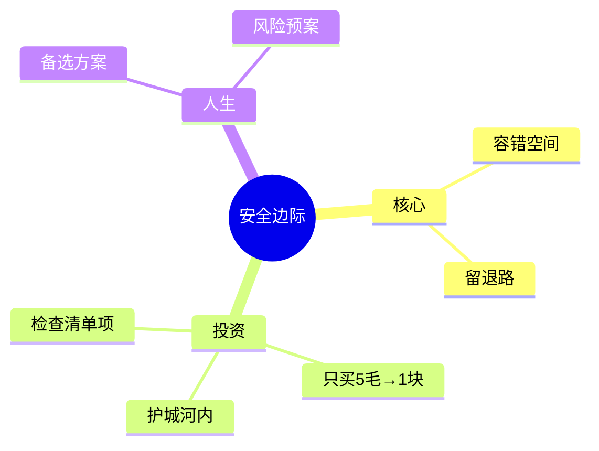

# 第7讲 安全边际

## 一、章节定位

### 1.1 全书位置

**核心问题**：如何在投资和商业决策中避免灾难性损失？

**一句话定位**：
> 安全边际是"容错空间"——为最坏情况预留缓冲，确保即使判断失误也不致命。

### 1.2 章节关系

| 章节 | 关系 |
|------|------|
| 能力圈 | 安全边际的前提：只投资能力圈内 |
| 检查清单 | 安全边际是清单必检项 |
| 护城河 | 安全边际在护城河之内 |

---

## 二、核心观点

### 观点1：安全边际的核心定义

**原文**：安全边际是你买入价格与真实价值之间的差距。

| 安全边际大小 | 投资类型 |
|--------------|----------|
| 50%以上 | 深层价值 |
| 30-50% | 价值投资 |
| 10-30% | 成长投资 |
| <10% | 投机 |

**案例**：
- 格雷厄姆：安全边际40%以上
- 巴菲特：喜诗糖果收购，加价2倍

**芒格的看法**：
> "安全边际意味着'永不亏钱'。"

### 观点2：为什么安全边际必要？

**原因**：
1. 估值会出错
2. 运气会变差
3. 黑天鹅会发生

**降维**：
> 安全边际 = 留退路。开车系安全带，投资留安全边际。

### 观点3：如何应用安全边际？

**买入时机**：
- 股市恐慌时
- 好公司遇困时
- 估值远低于价值时

**芒格的实践**：
- 只买"护城河+安全边际"的公司
- 永远不要亏钱
- 用5毛买1块

---

## 三、金句库

1. "投资第一原则：永远不要亏钱。"
2. "用5毛买1块，是安全边际。"
3. "安全边际是容错空间。"
4. "买好的不如买得好。"
5. "留得青山在，不怕没柴烧——安全边际。"
6. "不亏钱比赚钱更重要。"
7. "最坏情况会发生，安全边际能保护你。"
8. "价值投资的本质是安全边际。"
9. "没有安全边际的投资是赌博。"
10. "系好投资的安全带。"

---

## 四、问答

### Q1: 安全边际多大合适？
**答**: 取决于确定性，确定性越高安全边际可越小。

### Q2: 什么时候用安全边际？
**答**: 重大决策前、估值时、熊市时。

### Q3: 安全边际和护城河关系？
**答**: 护城河保护利润，安全边际保护本金。

### Q4: 价值投资vs成长投资安全边际？
**答**: 价值40%+，成长10-20%。

### Q5: 如何发现安全边际？
**答**: 恐慌时、王子落难时、财报差时。

---

## 五、当下映射

| 场景 | 应用 |
|------|------|
| 股票 | PE低于15且低于内在价值50% |
| 房产 | 租售比>5% |
| 创业 | 预留18个月现金流 |
| 人生 | 备选方案 |

---

## 六、关联可视化

---

*7讲完成 ✅*
*8讲：芒格主义 →*
*状态: 已完成2026-02-26*