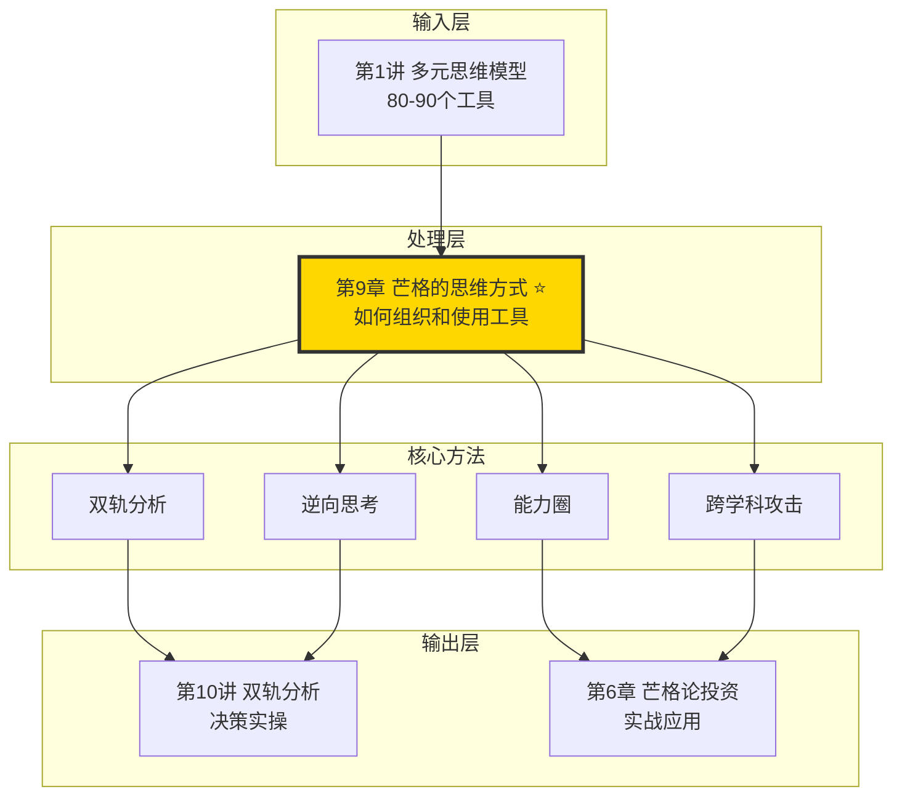
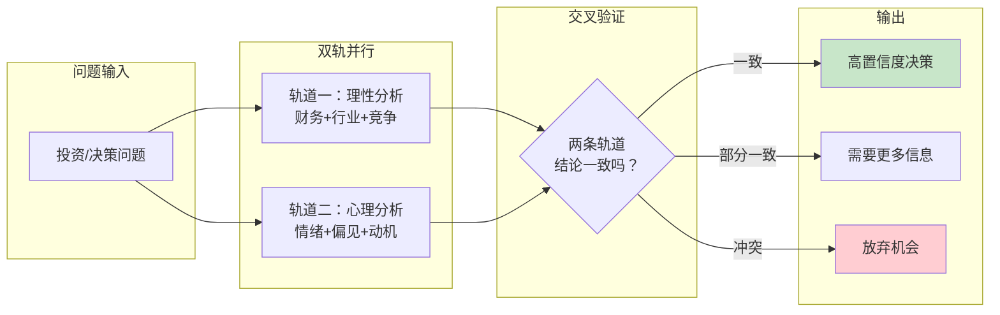
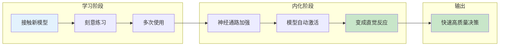
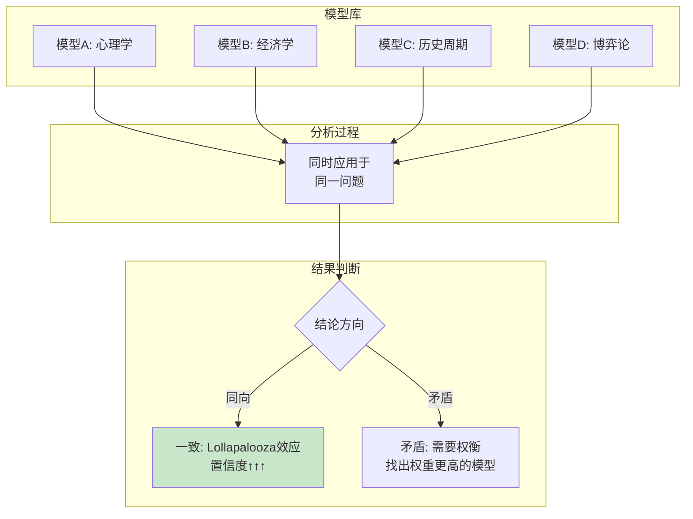
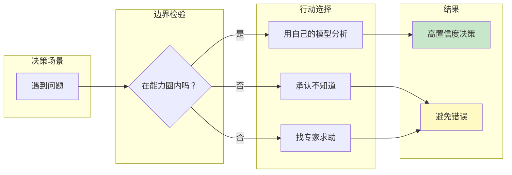

# 第9章 芒格的思维方式

## 一、章节定位

### 1.1 这一章在全书中回答什么问题？

**核心问题**：芒格的思维方式到底是什么？他把80-90个思维模型如何组织成一个可操作的决策系统？

**一句话定位**：
> 芒格的思维方式不是"天才的直觉"，而是一个可以学习的系统——双轨分析、逆向思考、能力圈边界、跨学科攻击，四根支柱撑起他的整个决策大厦。

### 1.2 章节三维定位

| 维度 | 定位 |
|------|------|
| 在全书的位置 | 全书的"方法论整合"章节，把分散的模型整合成可执行的思维系统 |
| 与其他章节关联 | 是第1讲（多元模型）的应用版，第2讲（逆向思维）的系统版 |
| 核心贡献 | 揭示芒格思维的底层架构——不是碎片模型，而是一个完整的决策操作系统 |

### 1.3 与全书逻辑的关系



---

## 二、核心观点（三层提取）

### 观点1：双轨分析——理性和心理两条轨道并行

**【表层】现象层**

芒格的分析方法与众不同：

> "我们在分析一个投资机会时，必须同时考虑两个方面：理性的经济学分析，以及人类心理学会如何影响参与者的行为。"

双轨分析的两个轨道：

| 轨道 | 内容 | 代表学科 |
|------|------|----------|
| 轨道一：理性分析 | 事实、数据、逻辑、概率 | 经济学、数学、物理学 |
| 轨道二：心理分析 | 情绪、偏见、动机、群体行为 | 心理学、社会学、行为经济学 |

芒格的实践案例：
- 分析可口可乐：不只看财务数据（轨道一），还要理解品牌心理学（轨道二）
- 分析航空公司：不只看成本结构（轨道一），还要理解价格战心理学（轨道二）
- 分析保险公司：不只看精算模型（轨道一），还要理解"恐惧"如何影响购买决策（轨道二）

**【中层】机制层**

双轨分析的心理机制：



芒格为什么坚持双轨？

| 单一轨道的盲区 | 双轨的修正 |
|----------------|------------|
| 只看财务数据 → 忽略管理层贪婪 | 心理轨道识别激励机制问题 |
| 只看理性分析 → 忽略市场情绪 | 心理轨道理解群体非理性 |
| 只看心理分析 → 忽略基本面 | 理性轨道提供客观锚点 |

**降维翻译**：
> 买股票就像买房子，不能只看户型和价格（理性），还要看邻居和学区（心理因素会影响未来转手）。两个都对了，才是好投资。

**【底层】规律层**

> **双轨定律**：任何涉及人的决策，都有两个层面——"是什么"（理性层面）和"人怎么想"（心理层面）。忽略任何一个，都会导致重大误判。芒格之所以能60年投资成功，是因为他永远同时看两条轨道。

**【当下连接】**

|----------|----------|----------|
| 为什么我的分析总是错？ | 你可能只看了一条轨道 | "原来缺了一半" |
| 为什么利好消息股价反而跌？ | 市场情绪和基本面不是一回事 | "懂了，心理轨道没看" |
| 如何提高决策准确率？ | 任何决策都用双轨检验 | "有方法了" |

---

### 观点2：思维模型的层次——从"是什么"到"为什么"到"怎么做"

**【表层】现象层**

芒格的思维模型不是平铺的，而是有层次的：

| 层次 | 内容 | 例子 |
|------|------|------|
| 第一层：现象模型 | 描述"是什么" | 沉没成本、损失厌恶 |
| 第二层：机制模型 | 解释"为什么" | 为什么人会执着于沉没成本？——避免不一致倾向 |
| 第三层：元模型 | 指导"怎么用模型" | 能力圈、双轨分析、逆向思考 |

芒格强调：
- 大多数人只停留在第一层（知道概念）
- 聪明人到第二层（理解机制）
- 芒格在第三层（掌握元模型，知道何时用什么）

**【中层】机制层**

思维模型的层次结构：

```mermaid
flowchart TD
    subgraph 第三层：元模型
        A[能力圈<br>知道边界]
        B[双轨分析<br>并行思考]
        C[逆向思考<br>倒推验证]
    end
    
    subgraph 第二层：机制模型
        D[25种心理倾向<br>人性机制]
        E[经济学原理<br>市场机制]
        F[系统论<br>复杂机制]
    end
    
    subgraph 第一层：现象模型
        G[锚定效应]
        H[沉没成本]
        I[社会认同]
    end
    
    A --> D
    B --> D
    B --> E
    C --> F
    D --> G
    E --> H
    F --> I
    
    style A fill:#ffd700
    style B fill:#ffd700
    style C fill:#ffd700
```

芒格的"元模型"运用：

| 元模型 | 功能 | 什么时候用 |
|--------|------|------------|
| 能力圈 | 判断边界 | 面对陌生领域时 |
| 双轨分析 | 全面检验 | 做重大决策时 |
| 逆向思考 | 发现盲点 | 方案看起来太完美时 |
| 跨学科攻击 | 找到真相 | 多个模型指向同一结论时 |

**降维翻译**：
> 知道"沉没成本"是什么，是入门级；知道为什么人会执着沉没成本，是进阶级；知道什么时候该忽略沉没成本、什么时候该利用别人的沉没成本，才是芒格级。

**【底层】规律层**

> **模型层次定律**：思维模型的价值不在于数量，而在于你能把它们组织成多少层次。低层次模型是"知识点"，高层次模型是"思维框架"。芒格的厉害之处不是知道80个模型，而是知道这80个模型如何分层协作。

**【当下连接】**

|----------|----------|----------|
| 学了那么多模型还是不会用？ | 你可能只学了第一层 | "原来层次不够" |
| 如何知道自己的水平？ | 能不能解释"为什么"和"怎么用" | "有检验标准了" |
| 芒格为什么比我们厉害？ | 他掌握了元模型 | "不是天赋，是方法" |

---

### 观点3：思维模型的生命周期——从"新模型"到"直觉"

**【表层】现象层**

芒格描述思维模型从学习到应用的四个阶段：

| 阶段 | 状态 | 表现 |
|------|------|------|
| 第一阶段：接触 | 知道有这个模型 | "哦，原来这叫锚定效应" |
| 第二阶段：理解 | 能用自己的话解释 | "锚定效应就是第一印象影响判断" |
| 第三阶段：应用 | 在决策中有意识地使用 | "这里可能有锚定效应，我要警惕" |
| 第四阶段：内化 | 变成自动反应 | 一眼就能看出对方在用锚定 |

芒格的标准：
- 芒格的大部分模型都在第四阶段（内化）
- 他不需要"调用"模型，模型会自动激活
- 这就是为什么他能在15秒内做出高质量判断

**【中层】机制层**

模型内化的神经机制：



芒格的"模型训练法"：

| 方法 | 具体做法 | 效果 |
|------|----------|------|
| 命名 | 给每个模型一个好记的名字 | "锤子综合症"比"单一视角偏差"好记 |
| 连接 | 把新模型和已有模型建立关联 | "Lollapalooza效应"就是多个模型的组合 |
| 复盘 | 每次决策后反思用了哪些模型 | 强化模型-场景的对应关系 |
| 教学 | 把模型讲给别人听 | 费曼技巧，检验是否真懂 |

**降维翻译**：
> 开车的新手需要想"先踩离合，再挂挡"，老司机这些动作已经变成本能。芒格的思维模型也是这样——他不用"想"，模型自己就跳出来了。怎么做到？无他，唯手熟尔。

**【底层】规律层**

> **内化定律**：一个模型从"知道"到"会用"，平均需要7次以上的刻意应用。芒格60年的投资生涯，每个核心模型至少用了上千次——这就是为什么他能把复杂的模型变成简单的直觉。

**【当下连接】**

|----------|----------|----------|
| 为什么我知道但用不上？ | 模型还没内化，需要多次刻意练习 | "原来需要时间" |
| 如何加速内化？ | 命名+连接+复盘+教学 | "有方法了" |
| 芒格15秒判断怎么做到的？ | 模型已经变成他的直觉 | "不是天赋，是积累" |

---

### 观点4：思维模型的组合——Lollapalooza效应的系统化

**【表层】现象层**

芒格创造"Lollapalooza效应"这个词来描述多个模型叠加产生的爆发性效果：

单一模型的效果 vs 多模型叠加：

| 情境 | 单一模型 | 多模型叠加 |
|------|----------|------------|
| 分析一家公司 | 看财务数据 | 财务+行业周期+管理层心理+竞争格局+宏观经济 |
| 做投资决策 | 看估值便宜 | 便宜+安全边际+能力圈内+管理层诚信+长期持有 |
| 理解市场行为 | 看供求关系 | 供求+羊群效应+可得性偏差+过度自信+损失厌恶 |

芒格的关键洞察：
- 多个模型指向同一结论时，置信度不是相加，而是相乘
- 但如果模型之间矛盾，需要找出哪个模型权重更高
- Lollapalooza效应就是"多因素共振"

**【中层】机制层**

Lollapalooza效应的产生机制：



芒格的组合原则：

| 原则 | 说明 | 例子 |
|------|------|------|
| 全面性 | 至少用3个以上不同学科的模型 | 心理学+经济学+历史学 |
| 独立性 | 模型之间尽量独立，不要高度相关 | 不要用"从众效应"和"社会认同"两个高度重叠的模型 |
| 权重性 | 不同模型有不同权重 | 财务模型的权重可能高于心理学模型 |
| 边界性 | 知道每个模型的适用范围 | 概率模型在小样本时失效 |

**降维翻译**：
> 一个侦探用指纹破案，准确率70%；用DNA破案，准确率80%；用监控破案，准确率85%。如果三个都指向同一个嫌疑人，准确率就不是70%+80%+85%，而是接近100%。这就是Lollapalooza效应。

**【底层】规律层**

> **共振定律**：当多个独立模型指向同一结论时，这个结论的可靠性会呈指数级提升。芒格只在他有"Lollapalooza级别的信心"时才下重注——这就是为什么他很少出手，但出手必中。

**【当下连接】**

|----------|----------|----------|
| 如何提高决策准确率？ | 不要只用一个模型，用多个独立模型交叉验证 | "有方法论了" |
| 什么时候该下重注？ | 当多个模型都指向同一结论时 | "芒格的标准" |
| 模型之间矛盾怎么办？ | 找出权重更高的模型，或者承认自己不懂 | "承认无知也是智慧" |

---

### 观点5：芒格思维的边界——知道自己不知道什么

**【表层】现象层**

芒格的思维系统有一个核心原则：**边界意识**。

芒格的原话：

> "知道自己不知道什么，比知道什么更重要。"

芒格的"三不原则"：

| 原则 | 说明 | 例子 |
|------|------|------|
| 不越界 | 不做能力圈外的事 | 芒格不投他不理解的高科技公司 |
| 不盲从 | 不因为别人赚钱就跟进 | 错过了互联网泡沫，但他不后悔 |
| 不预测 | 不预测不可预测的事 | 不预测短期股价，只判断长期价值 |

芒格的"太难题目清单"：
- 宏观经济预测
- 短期股价波动
- 政治事件结果
- 新兴技术走向
- 复杂衍生品定价

这些事他不做，不是因为不想做，是因为"知道自己做不到"。

**【中层】机制层**

边界意识的保护机制：



芒格的"承认不知道"策略：

| 情境 | 芒格的做法 | 普通人的做法 |
|------|------------|--------------|
| 不懂的领域 | 承认不懂，不做 | 假装懂，跟风投 |
| 信息不足 | 承认信息不足，等更多数据 | 用有限信息硬做判断 |
| 模型矛盾 | 承认无法判断，放弃 | 选一个顺眼的结论 |

**降维翻译**：
> 投资就像打猎，芒格的做法是"只打站在面前的猎物"。那些跑得快的、藏得深的、看不清的，他都不打。你可能说他错过了很多，但你也得承认他几乎从不打空。

**【底层】规律层**

> **边界定律**：在复杂系统中，知道自己不知道什么，比知道自己知道什么更有价值。因为不知道的事情，你可以选择不做；但不知道自己不知道的事情，会让你在毫无防备时踩坑。

**【当下连接】**

|----------|----------|----------|
| 为什么我总是踩坑？ | 你可能不知道自己不知道什么 | "扎心了" |
| 芒格错过互联网泡沫后悔吗？ | 不后悔，因为那不在他能力圈 | "错过好过踩坑" |
| 如何扩大能力圈？ | 先清楚边界，再慢慢扩展 | "有方向了" |

---

## 三、金句库

### 原书金句

1. "我们在分析一个投资机会时，必须同时考虑两个方面：理性的经济学分析，以及人类心理学会如何影响参与者的行为。"
2. "知道自己不知道什么，比知道什么更重要。"
3. "我这辈子一直在训练自己保持理性。"
4. "手里只有一把锤子的人，看什么都像是钉子。"
5. "避免愚蠢，比追求聪明更重要。"
6. "80或90个重要模型能载你走完90%的路程。"
7. "如果你不能简单地解释它，你就没有真正理解它。"
8. "我只想知道我将来会死在什么地方，这样我就永远不去那里。"

### 降维金句

1. **双轨分析**："买股票就像买房子，不能只看户型，还要看邻居"
2. **模型层次**："知道是什么是入门，知道为什么是进阶，知道怎么用是高手"
3. **内化定律**："老司机不需要想怎么换挡，芒格不需要想怎么用模型"
4. **Lollapalooza**："三个侦探指向同一嫌疑人，准确率接近100%"
5. **边界意识**："只打站在面前的猎物，跑得快的、看不清的都不打"

## 五、系统关联

### 与《第1讲 多元思维模型》的关联

| 第9章 芒格的思维方式 | 第1讲 多元思维模型 |
|----------------------|-------------------|
| 如何组织和应用模型 | 模型是什么 |
| 方法论层 | 工具层 |
| "怎么用" | "用什么" |

**关联金句**：
> 第1讲给你80-90个工具，
> 第9章教你如何把这些工具组织成一个系统。
> 工具+方法 = 完整能力

### 与《第2讲 逆向思维》的关联

| 第9章 芒格的思维方式 | 第2讲 逆向思维 |
|----------------------|---------------|
| 逆向思维是元模型之一 | 逆向思维的深度展开 |
| 系统中的一个模块 | 单个方法的详解 |

**关联金句**：
> 逆向思维不是芒格的全部，
> 但它是芒格思维系统中最独特的一个模块。
> 系统理解+单点深入 = 完整掌握

### 与《思考快与慢》的关联（机制对应）

| 《穷查理宝典》 | 《思考快与慢》 |
|----------------|----------------|
| 双轨分析 | 系统1 vs 系统2 |
| 心理轨道 | 系统1的偏误清单 |
| 理性轨道 | 系统2的慢思考 |
| 模型内化 | 从系统2到系统1的自动化 |

**关联金句**：
> 卡尼曼告诉我们"大脑有什么bug"，
> 芒格告诉我们"如何利用和避免这些bug"。
> 诊断书 + 治疗方案 = 完整方案

---

## 八、直接应用

### 72小时内应用

1. 选择一个最近的决策，用"双轨分析"重新检验（理性+心理两条轨道）
2. 列出你最常用的3个思维模型，判断它们在第几层（现象/机制/元模型）
3. 识别一个你"不知道自己不知道"的领域

### 微应用设计

| 决策场景 | 芒格式做法 |
|----------|------------|
| 买股票 | 先问：这是我的能力圈吗？再用双轨分析 |
| 做投资 | 问：多个模型指向同一结论吗？（Lollapalooza检验） |
| 学新知识 | 问：我能用费曼技巧讲清楚吗？（内化检验） |

---

## 九、检索测试

### 1天后回顾
- [ ] 复述芒格思维方式的五个核心观点
- [ ] 说出"双轨分析"的两个轨道分别是什么
- [ ] 解释Lollapalooza效应

### 7天后复述
- [ ] 闭卷画出芒格思维系统的结构图
- [ ] 用双轨分析重新审视一个过去的决策

---

*拆解日期：2026-02-28*
*拆解模式：标准模式*
