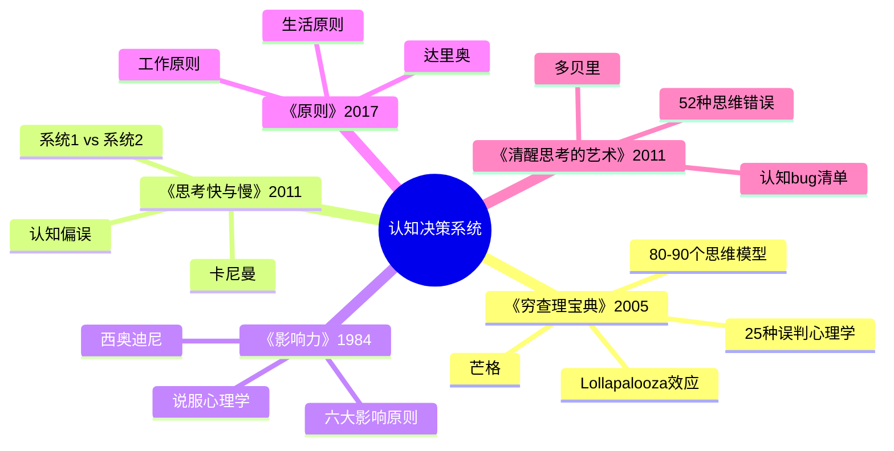
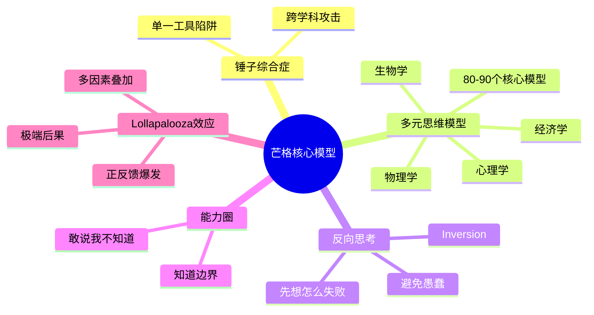
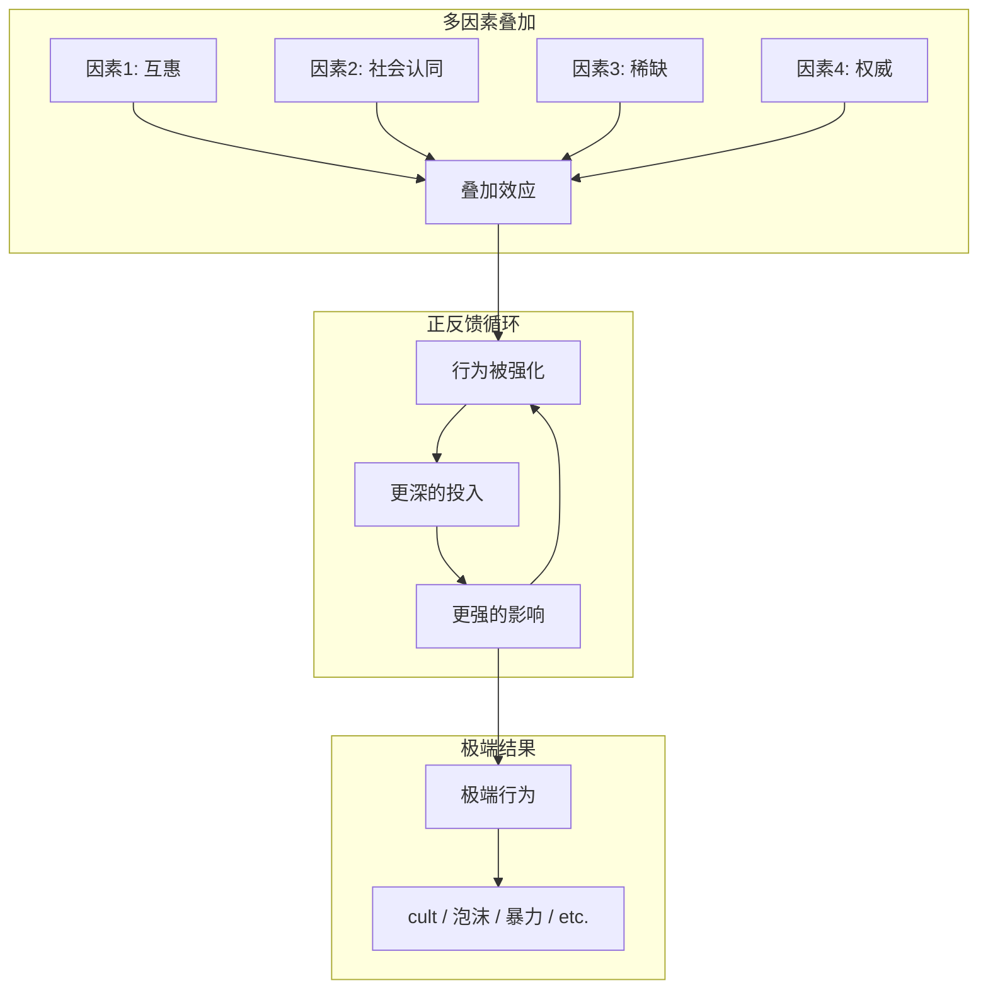

# 《穷查理宝典》读书笔记

## 这本书要解决什么问题？

**核心困境**：大多数人以为自己在"学习"，其实只是在"收集碎片"。为什么学了很多却不会用？因为大脑里没有"格架"——没有把知识组织成一个相互关联的系统。

**一句话定位**：
> 智慧不是记住多少事实，而是能调用的思维模型有多少——芒格用80-90个跨学科模型，构建了世界上最强大的"思维武器库"。

### 作者站在什么位置说这些话？

| 维度 | 定位 |
|------|------|
| 主领域 | 认知决策学 |
| 跨界领域 | 投资哲学、人类心理学、跨学科思维、系统思维 |
| 作者背景 | 伯克希尔·哈撒韦副董事长54年、巴菲特的黄金搭档、律师出身、自学成才的跨学科思想家、99岁仍在学习、2023年11月去世 |
| 历史语境 | 2005年初版，思维模型领域的"奠基之作"。芒格站在全球顶级投资人的位置，输出的是60年实战中提炼的决策智慧，不是理论家的空谈 |

### 和其他书有什么关系？

| 关联书籍 | 关联关系 | 共同底层逻辑 |
|----------|----------|--------------|
| [[思考快与慢]] | 机制基础 | 系统1的漏洞 = 芒格25种心理倾向的触发条件 |
| [[影响力-西奥迪尼]] | 工具应用 | 六大影响原则是芒格心理学的具体应用 |
| [[原则]] | 方法论互补 | 芒格是"思维模型"，达利欧是"行为原则" |
| [[纳瓦尔宝典-乔根森]] | 硅谷实践 | 芒格是"工具箱"，纳瓦尔是"工具应用手册" |
| [[清醒思考的艺术-多贝里]] | 姊妹篇 | 芒格25种误判倾向 ≈ 多贝里52种思维错误 |

### 知识网络图

---

## 作者的核心论点

### 锤子综合症：你手里只有一把锤子

"在手里拿着铁锤的人看来，世界就像一颗钉子。"这是芒格最爱引用的一句话。经济学家看什么都是"激励机制"问题，工程师看什么都是"优化"问题，医生看什么都是"诊断"问题。学营销的觉得所有问题的答案都是"流量"，学技术的觉得都是"技术架构"，学管理的觉得都是"KPI"。

为什么会这样？专业训练让你在一条路上越走越深，大脑形成了路径依赖。遇到新问题，你的第一反应不是"这个问题本质是什么"，而是"用我的专业框架怎么套"。套不上的信息直接被忽略，最后得出一个"专业"但错误的结论。专业化是双刃剑：深度带来专业，窄度带来盲区。

> **芒格锤子定律**：单一学科的专业知识足以让你在熟悉领域成功，但也会让你在陌生领域犯下致命错误。解决方案是构建"多元思维模型"——至少80-90个跨学科的核心模型。

这个观点打碎了我的一个假设——我一直以为"专业"就是好的，越专越深越厉害。但芒格让我看到，专业化本身就是陷阱。你不是因为懂得太少而犯错，你是因为只有一种框架而盲目。

但芒格不只是指出了问题，他给了答案：你需要一个工具箱，而不是一把锤子。

### 多元思维模型：从每个学科"偷"走最厉害的几招

芒格声称自己掌握了80-90个重要模型，来自心理学、经济学、物理学、生物学、数学、工程学等各个学科。他说"80-90个模型能载你走完90%的路程"。

每个学科都有核心模型：

| 学科 | 核心模型 | 生活应用 |
|------|----------|----------|
| **心理学** | 激励机制、社会认同、权威偏误、承诺一致性 | 理解为什么会被营销操控 |
| **经济学** | 机会成本、边际效应、沉没成本、复利 | 做出更理性的消费和投资决策 |
| **物理学** | 临界点、反馈回路、惯性、杠杆 | 识别系统的转折点和放大器 |
| **生物学** | 进化论、适者生存、生态位 | 理解竞争和适应的本质 |
| **数学** | 概率论、大数定律、贝叶斯更新 | 在不确定性中做出最优决策 |
| **系统论** | 二阶效应、非线性、涌现 | 看清行动的连锁后果 |

芒格的"生态投资分析法"就是典型应用：不只看财务数据（经济学），还要看管理层心理（心理学）、行业演进规律（生物学）、竞争格局（博弈论）。各角度结论一致，可靠性就极高。这就是T型知识结构——横向多元视野 + 纵向能力圈深耕。

> **多元模型定律**：每个学科都有其"核心模型"——抓住最重要的3-5个就够了。跨学科的模型组合会产生"Lollapalooza效应"——多个因素叠加产生爆发性结果。

有了武器库，还需要一套独特的使用方式。芒格的用法跟大多数人相反——他不是从正面进攻，而是从背面绕过去。

### 反向思考：告诉我怎么死，我就永远不去那里

"告诉我我会死在哪里，我就永远不去那里。"芒格受数学家雅可比的影响，把"反过来想，总是反过来想"当作核心思维工具。

正向思考的人问"如何成功"，然后列出一堆成功因素，试图全部做到——复杂、困难、容易遗漏。反向思考的人问"如何失败"，列出失败因素，然后一条一条避免——简单、可操作、覆盖关键。芒格的哲学很朴素：避免愚蠢比追求聪明更容易，不做蠢事的人，最终会超过做聪明事的人。成功 = 避免重大错误 + 抓住少数机会。

他的三步法是：第一步，迅速歼灭不该做的事情（灾难性后果的事 + 能力圈外的事）；第二步，对该做的事情发起跨学科的攻击；第三步，在恰当的时机果断采取行动。

> **反向思考定律**：对于复杂系统和人类大脑而言，反向思考往往比正向思考更容易解决问题。因为"避免失败"比"追求成功"更具体、更可操作。

以前我一直觉得想成功就得拼命往前冲，现在意识到这个思路本身就有问题。下次遇到重大决策，我不会再问"怎么才能赢"，而是先问"怎么才会输"——把所有可能失败的原因列出来，一条一条避开。赢不赢看运气，但不输是可以自己控制的。

X只是硬币的一面，另一面是Y——光知道怎么想还不够，还得知道在哪儿想。

### 能力圈：知道自己不知道什么

巴菲特和芒格有个共识：能力圈的边界，比能力圈的大小更重要。敢于说"我不知道"是智慧的表现。

B夫人（Rose Blumkin）的故事最能说明这一点。一个俄罗斯移民，不懂英语，不懂股票，只做家具买卖。但做到了6000万美元年销售额，巴菲特用1亿美元现金收购她的公司。狭窄的能力圈加上极致专注，产生了超凡的成就。

能力圈的机制很简单：在圈内，你熟悉领域、判断胜率高、能持续行动、形成复利积累；在圈外，你面对陌生领域、判断胜率低、结果随机、无法复利。圈内积累的成果会慢慢扩大你的能力圈，形成正循环。

关键是要理解能力圈和多元思维不矛盾。认知层面，多元思维模型越广越好（横向）；行动层面，能力圈内专注越深越好（纵向）。两者结合就是T型人才：广博视野 + 专业深耕。

> **能力圈定律**：在你的能力圈内，你是专家；在能力圈外，你是在赌。重要的不是能力圈有多大，而是你是否清楚它的边界。边界清晰的小能力圈，胜过模糊的大能力圈。

但这还没完，芒格还发现了一种更隐蔽、更危险的现象——多个因素叠加时会爆发远超预期的力量。

### Lollapalooza效应：五个因素叠加让你变傻瓜

芒格发明了"Lollapalooza效应"这个词，指的是多个心理倾向同时作用，产生极端后果。一个因素骗不了你，但当权威背书、大家都在信、不信就落伍、信了有好处——这时候，聪明人也会变成傻瓜。

邪教如何让人成为死忠？怀疑避免 + 压力影响 + 喜好倾向 + 社会认同 + 权威偏误。股市泡沫如何形成？贪婪 + 社会认同 + 可得性偏差 + 过度乐观 + 羊群效应。消费者为何冲动购买？稀缺 + 社会认同 + 权威背书 + 互惠 + 承诺一致性。多个因素互相强化，形成正反馈循环，最终产生极端行为。

芒格列出了25种心理倾向，其中最核心的包括：奖励超级反应倾向（激励机制）、喜欢/热爱倾向、讨厌/憎恨倾向、避免怀疑倾向、避免不一致性倾向、好奇心倾向、康德式公平倾向、嫉妒倾向、回馈倾向、简单的避免痛苦的心理否认。

> **Lollapalooza定律**：当多个心理倾向同时作用于同一个方向时，它们会产生远大于简单相加的效果。这种"超级效应"可以解释极端行为、泡沫、狂热等现象。

这引出了另一个问题——识别单一倾向不够，要识别"组合拳"。为什么牛市顶点散户还在冲？因为贪婪+从众+过度乐观+可得性正在对他们进行超级叠加。

---

## 这本书的局限

> 芒格的思维模型体系是从60年顶级投资实践中提炼的，这套方法有它的边界。

| 批评点 | 谁在批评 | 怎么说 | 实际情况 |
|--------|---------|--------|---------|
| 模型数量模糊 | 学界 | 芒格说80-90个，但有人整理出129个，到底需要多少？ | 因人而异，核心是跨学科思维的习惯，不是数量 |
| 跨学科可行性 | 管理学界 | 专业分工如此精细，"通才"是否现实？芒格是天才，普通人能做到吗？ | 核心模型可以掌握，但确实需要持续投入 |
| 投资可复制性 | 投资界 | 芒格的成功有多少运气成分？能力圈理论可能导致过度保守 | 运气确实存在，但方法论本身有价值；保守不是坏事 |
| 时代局限 | 技术评论者 | 2005年出版，AI时代的认知框架有新变化 | 底层逻辑不变，但应用场景需要更新 |
| 文化差异 | 跨文化学者 | 基于美国投资文化，跨文化适用性需验证 | 原则普适，但具体实践需要本地化 |
| 个体天赋 | 普通读者 | 芒格的天赋普通人难以复制 | 可以简化应用，但简化后效果打折 |

**一句话总结局限性**：
> 芒格的底层思维（反向思考、能力圈、多元模型）普适性最强，"80-90个模型"的执行标准则需根据个人情况调整。

---

## 最值得记住的话

**原书说的**：
1. "在手里拿着铁锤的人看来，世界就像一颗钉子。"
2. "告诉我我会死在哪里，我就永远不去那里。"
3. "知道自己能力圈的边界，比能力圈有多大更重要。"
4. "我这辈子遇到的聪明人，没有一个不是每天都在学习的。"
5. "避免愚蠢，比追求聪明更重要。"
6. "80或90个重要模型能载你走完90%的路程。"
7. "你不需要有很高的智商，你需要的是控制冲动的能力。"
8. "如果你想获得某样东西，最可靠的方法是让自己配得上它。"

**翻译成人话**：
1. 专家不是知道所有答案的人，而是知道用什么工具的人
2. 不做蠢事，就已经赢了90%的人
3. 在能力圈内你是雄鹰，在圈外你只是风口上的猪
4. 芒格99岁还在学习，你的35岁危机不是因为老了
5. 成功很难，但避免失败相对容易
6. 一个因素骗不了你，但五个因素叠加让你变傻瓜
7. 想要最好的，先让自己配得上
8. 你不需要成为所有领域的专家，只需要从每个学科"偷"走最厉害的几招

---

## 讲给没读过的人听

你有没有发现，学了很多东西却总是用不上？芒格说，因为你的工具箱里只有一把锤子。

芒格是谁？巴菲特的黄金搭档，伯克希尔·哈撒韦的副董事长，54年的投资搭档。他一辈子攒了80-90个跨学科的思维模型，遇到问题就从工具箱里挑最合适的工具。不像大多数人，学营销的看什么都是流量问题，学技术的看什么都是架构问题——手里只有锤子，看什么都像钉子。

他还教你一招反直觉的思考方式：与其想怎么成功，不如先想怎么失败。把所有可能导致失败的原因列出来，一条一条避开。赢不赢看运气，但不输是可以自己控制的。

还有一件事特别重要：知道自己的能力圈在哪。芒格说，在能力圈内你是雄鹰，在能力圈外你只是风口上的猪——风口来了飞上天，风停了就变烤乳猪。B夫人不懂英语、不懂股票，只做家具买卖，做到了6000万美元年销售额。狭窄的能力圈加上极致专注，胜过什么都想碰的野心。

---

## 用来检验理解的问题

**基础回忆**：
1. Q: 芒格的"锤子综合症"是什么意思？
   A: 只掌握单一学科知识的人，遇到任何问题都会强行用自己熟悉的框架去套，忽略不符合框架的信息，得出专业但错误的结论。

2. Q: 芒格为什么强调"反向思考"？
   A: 因为"避免失败"比"追求成功"更具体、更可操作。先排除致命错误，再抓住少数机会。

3. Q: 能力圈和多元思维模型矛盾吗？
   A: 不矛盾。认知层面多元思维越广越好（横向），行动层面能力圈内专注越深越好（纵向），形成T型人才。

**理解验证**：
1. Q: 为什么芒格说"80-90个模型能载你走完90%的路程"？
   A: 每个学科的核心模型只有3-5个，掌握了最重要的就能应对绝大多数问题。不需要成为每个领域的专家。

2. Q: Lollapalooza效应和单一心理倾向有什么区别？
   A: 单一倾向影响有限，多个倾向同时作用于同一方向时会产生远超简单相加的爆发性效果，可以解释极端行为和泡沫。

3. Q: B夫人的故事说明了什么？
   A: 边界清晰的小能力圈加上极致专注，胜过模糊的大能力圈。不需要什么都懂，在自己的领域做到极致。

**实际应用**：
1. Q: 选一个你最近遇到的决策，用反向思考法分析。
   A: 不要问"怎么才能做好"，先问"什么会导致失败"，列出所有可能失败的原因，逐条排除。

2. Q: 检查你的"工具箱"里有多少把工具？至少列出3个不同学科的核心模型。
   A: 关键是跨学科——心理学、经济学、物理学各至少一个，而不是同一学科的多个概念。

**深度分析**：
1. Q: 芒格和达利欧的决策系统有什么本质区别？
   A: 芒格攒了100多个多元思维模型，遇到问题就拿武器——广度优先；达利欧只守着一套原则清单，每次犯错就加一条——深度优先。一个是武器库，一个是操作系统。

2. Q: 为什么芒格的思维模型体系在AI时代仍然有效？
   A: AI是工具，思维模型是操作系统。模型比知识点更重要——AI可以帮你获取信息，但不能替代你的判断框架。

---

## 和其他书的对话

卡尼曼是芒格的理论底座。《思考，快与慢》告诉你系统1和系统2怎么打架、认知偏误有哪些；芒格的25种误判心理学直接对应系统1的漏洞。卡尼曼诊断大脑有什么"漏洞"，芒格告诉你如何利用和避免这些漏洞。两者结合，是认知升级的完整地图。

西奥迪尼和芒格在说同一件事的不同面。芒格提供了"心理学武器库"——25种心理倾向和Lollapalooza效应；西奥迪尼的《影响力》把这武器库变成了实战手册——六大影响原则就是芒格心理学的具体应用。工具箱和工具使用说明书的关系。

达利欧和芒格都在对抗人类的非理性决策，但打法完全不同。芒格攒了100多个多元思维模型，遇到问题就拿武器；达利欧只守着一套原则清单，每次犯错就加一条。一个是武器库，一个是操作系统。适合擅长广度思考的人用芒格，适合擅长深度执行的人用达利欧，两者结合就是用多元思维分析、用系统化原则执行。

纳瓦尔是芒格在硅谷的回响。芒格的多元思维模型对应纳瓦尔的专长加杠杆，能力圈对应特定知识，投资智慧对应财富创造加幸福。芒格是工具箱，纳瓦尔是工具应用手册。

马斯克和芒格是两种极端。芒格用100个模型看世界，马斯克用1个模型（第一性原理）改变世界。芒格慢慢变富，广度优先；马斯克快速实现疯狂目标，深度优先。芒格教你看清本质，马斯克教你突破边界。

多贝里是芒格的欧洲回响。《清醒思考的艺术》的52种思维错误和芒格的25种误判倾向本质上是一回事，只是多贝里把它变成了更轻快的口袋清单。

宫本武藏和芒格跨越了360年的对话。芒格的多元思维模型对抗"锤子综合症"，宫本武藏的二刀流对抗"单一技能风险"。一个说不要只有一把锤子，一个说不要只用一把刀。东方武道和西方投资哲学，殊途同归。

---

*拆解日期：2026-02-14*
*下次回访：1周后回顾「讲给没读过的人听」和「检验问题」*
