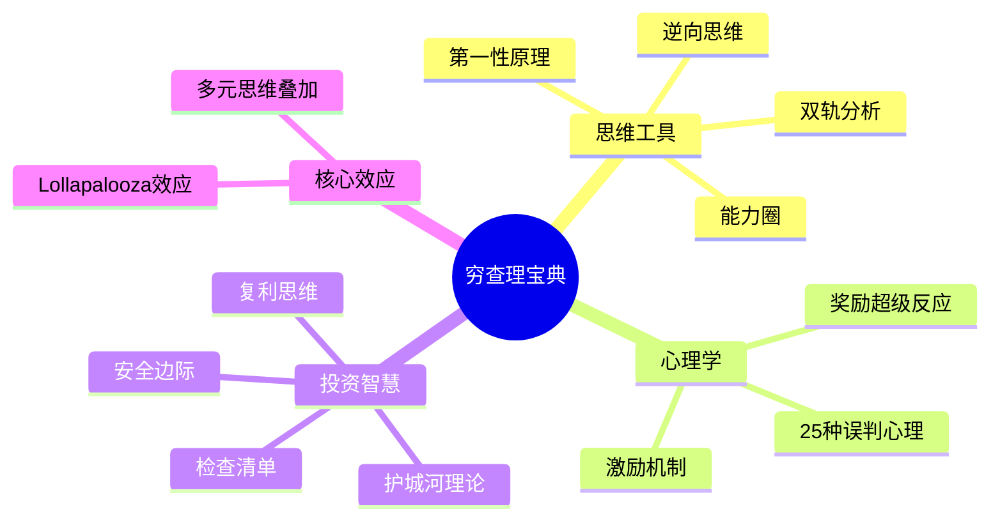

# 穷查理宝典 - 章节笔记导航

## 📖 书籍信息

| 属性 | 内容 |
|------|------|
| **书名** | 穷查理宝典（Poor Charlie's Almanack） |
| **作者** | 查理·芒格（Charlie Munger） |
| **编者** | 彼得·考夫曼（Peter D. Kaufman） |
| **主题** | 多元思维模型、投资智慧、决策方法 |
| **核心价值** | 跨学科思维框架，80-90个思维模型 |

## 🧠 核心思维模型体系

## 📚 传记 + 11讲

### 📖 传记章节

| 序号 | 主题 | 核心内容 | 状态 | 优先级 | 笔记文件 |
|:----:|------|----------|:----:|:------:|----------|

### 🎓 11个核心讲座

| 序号 | 主题 | 核心模型 | 状态 | 优先级 | 笔记文件 |
|:----:|------|----------|:----:|:------:|----------|
## 🎯 模型分类速查

### 思维工具类
- [[第1讲-多元思维模型]] - 跨学科知识框架
- [[第2讲-逆向思维]] - 反向思考问题
- [[能力圈]] - 认知边界意识
- [[第10讲-双轨分析]] - 理性与心理双轨

### 心理学类
- [[第5讲-人类误判心理学]] - 25种认知偏误
- 激励机制 - 超级力量

### 投资智慧类
- [[第11章-安全边际]] - 风险缓冲
- [[11-护城河理论]] - 竞争壁垒
- [[第9讲-复利思维]] - 长期积累
- [[第4讲-检查清单]] - 决策流程

### 核心效应
- [[第6讲-Lollapalooza效应]] - 多因素共振
- [[第2章-芒格主义]] - 人生智慧集锦

### 传记章节
- **总计**: 11 个章节
- **已完成**: 11 个
- **完成率**: 100%

### 讲座章节
- **总计**: 11 个章节
- **已完成**: 11 个
- **完成率**: 100%

### 总体进度
- **总计**: 22 个章节
- **已完成**: 22 个
- **完成率**: 100%
- **最新完成**: 第11章-芒格的智慧总结 (2026-02-28)
## 🔗 相关资源

- [[穷查理宝典]] - 原始拆解笔记
- [[影响力-西奥迪尼]] - 心理学相关
- [[纳瓦尔宝典-乔根森]] - 同类智慧书籍

## 💡 拆解指南

### 高优先级章节（建议先拆）
1. **查理·芒格传略** - 理解芒格其人
2. **多元思维模型** - 全书核心框架
3. **人类误判心理学** - 最实用的心理学工具
4. **逆向思维** - 芒格标志性思维
5. **安全边际** - 投资核心概念
6. **能力圈** - 认知边界

### 拆解模板
每个章节笔记应包含：
- 核心概念定义
- 实际应用案例
- 与其他模型的关联
- 个人行动清单
- 可用于文章的金句

---

*创建日期: 2026-02-26*
*最后更新: 2026-02-28*
*最新完成: 第8章-芒格论学习*
