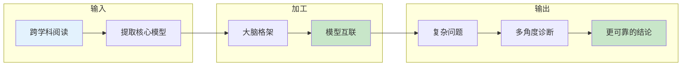
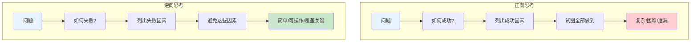
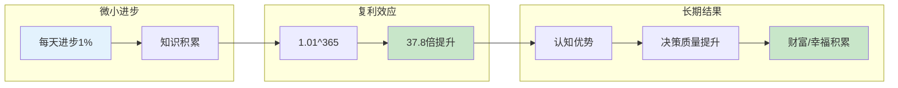
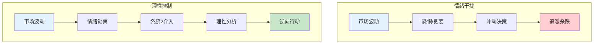
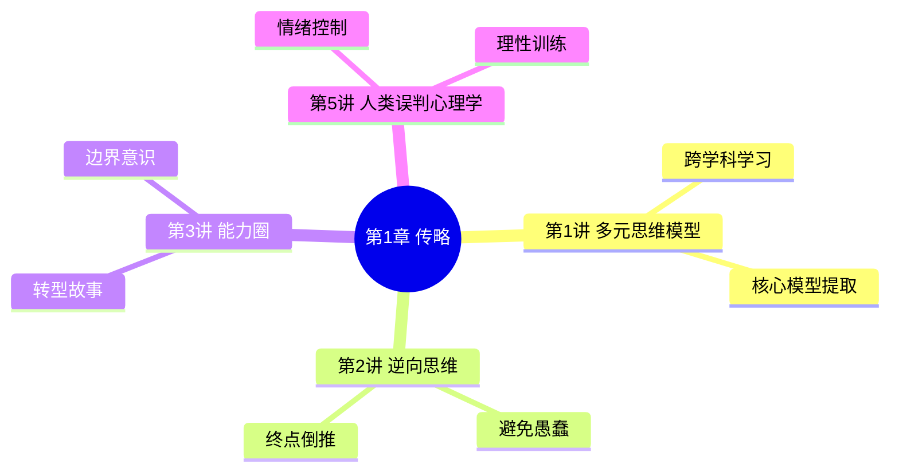

# 第1章 查理·芒格传略

## 一、章节定位

### 1.1 这一章在全书中的位置

**核心作用**：理解芒格其人，才能理解其思想。这一章不是"前菜"，而是整个思维体系的"基因图谱"——芒格的生平经历塑造了他的思维模型。

**一句话定位**：
> 你不需要模仿芒格的财富，但你必须理解芒格如何成为芒格。

### 1.2 章节核心主题

| 维度 | 内容 |
|------|------|
| **传记内容** | 1924-2023年人生轨迹：奥马哈童年、哈佛法学院、律师生涯、投资转型、伯克希尔54年 |
| **核心思想** | 多元思维模型的形成过程、终身学习的实践、理性思考的养成 |
| **阅读价值** | 理解"为什么是芒格"——他的思维模型不是凭空产生，而是人生经历的自然沉淀 |

### 1.3 与其他章节的关联

| 关联章节 | 关联逻辑 |
|----------|----------|
| [[第1讲-多元思维模型]] | 传略展示芒格如何"跨学科学习"，这一讲是方法论 |
| [[第2讲-逆向思维]] | 传略中芒格的人生转折是"逆向思考"的最佳案例 |
| [[第3讲-能力圈]] | 芒格从律师→投资者的转型是能力圈演进的范例 |
| [[第5讲-人类误判心理学]] | 芒格的个人经历让他对人性有深刻洞察 |

---

## 二、核心观点（三层提取）

### 观点1：跨学科学习——芒格的思维根源

#### 【表层】现象层

**芒格的学习轨迹**：
- **童年**：在奥马哈的杂货铺打工（巴菲特的爷爷开的）
- **大学**：密歇根大学学数学 → 加州理工学气象学 → 哈佛法学院
- **自学**：从未正式学过经济学、心理学、投资，却成为跨学科大师
- **方法**：不设边界，"我从不理会学科界限，直接抓取所有大想法"

**日常场景**：
- 大多数人学什么专业，就被什么专业框死
- 芒格没有学过投资，却成为最伟大的投资者之一
- 他从心理学学"激励机制"，从物理学学"临界点"，从生物学学"进化论"

#### 【中层】机制层

**跨学科学习的心理机制**：

**芒格的独特之处**：
- 普通人：深度专业化 → 成为专家 → 被专业框死
- 芒格：广度扫描 + 核心提取 → 形成模型库 → 跨学科应用

#### 【底层】规律层

> **芒格学习定律**：每个学科只有3-5个核心模型是真正重要的。跨学科学习不是"学完所有内容"，而是"偷走最厉害的几招"。

**降维翻译**：
> 你不需要读完每个学科的书，
> 你只需要从每个学科"偷"3-5个最厉害的模型。
> 80个模型 × 1小时学习 = 80小时的智慧投资。

#### 【当下连接】

|----------|----------|----------|
| 我不是名校毕业，能跨学科学习吗？ | 芒格的心理学、经济学都是自学的 | "原来自学就行" |
| 35岁学新东西来得及吗？ | 芒格说"我现在还在学习"（99岁） | "芒格99岁还在学" |
| 学这么多不会很累吗？ | 跨学科是为了"偷"核心模型，不是学完所有 | "原来只学核心" |

---

### 观点2：逆向思考——从终点倒推的智慧

#### 【表层】现象层

**芒格的人生转折**：
- **第一次失败**：29岁离婚、丧子、破产，人生跌入谷底
- **逆向思考**：不问"如何成功"，问"什么会导致失败"
- **重新崛起**：避免失败的路径 → 40岁成为百万富翁 → 与巴菲特相遇

**经典名言**：
- "告诉我会死在哪里，我就永远不去那里"
- "要明白人生如何获得幸福，就得懂得人生如何变得痛苦"

#### 【中层】机制层

**正向思考 vs 逆向思考**：

**芒格的"避免愚蠢"哲学**：
- 成功很难定义，但失败很容易识别
- 不做蠢事的人，最终会超过做聪明事的人
- 成功 = 避免重大错误 + 抓住少数机会

#### 【底层】规律层

> **逆向思考定律**：对于复杂系统和人类大脑而言，逆向思考往往比正向思考更容易解决问题。因为"避免失败"比"追求成功"更具体、更可操作。

**降维翻译**：
> 你不需要知道如何成功，
> 你只需要知道如何不失败。
> 不做蠢事，就已经赢了90%的人。

#### 【当下连接】

|----------|----------|----------|
| 人生遇到重大挫折怎么办？ | 芒格29岁破产丧子，照样东山再起 | "原来伟人也跌倒过" |
| 如何做重大决策？ | 先列出所有可能导致失败的因素 | "这个方法太实用了" |
| 为什么我总是踩同样的坑？ | 你只想着怎么成功，没想过怎么失败 | "原来方向反了" |

---

### 观点3：终身学习——持续进化的秘密

#### 【表层】现象层

**芒格的学习习惯**：
- 每天阅读几小时，从不间断
- 99岁仍在学习新东西
- 巴菲特评价："我这辈子遇到的聪明人，没有一个不是每天都在学习的"

**芒格的原话**：
- "每天醒来时，试着比昨天更聪明一点"
- "日复一日，你不一定每天都有大进步，但长期积累下来，你会获得巨大的优势"

#### 【中层】机制层

**终身学习的复利机制**：

**芒格 vs 普通人**：
- 普通人：毕业后停止学习 → 认知固化 → 被时代淘汰
- 芒格：终身学习 → 认知持续升级 → 99岁仍在前沿

#### 【底层】规律层

> **终身学习定律**：学习的回报是复利的。每天进步1%，一年后是原来的37.8倍。芒格的财富和智慧，不是一天积累的，而是60年持续学习的结果。

**降维翻译**：
> 不是芒格比别人聪明，
> 而是芒格比大多数人多学了60年。
> 你不需要追风口，
> 你只需要每天比别人多学一点点。

#### 【当下连接】

|----------|----------|----------|
| 35岁职场危机怎么办？ | 芒格99岁还在学习，你才35 | "原来学习是解药" |
| 学习看不到效果怎么办？ | 学习的回报是复利的，需要时间 | "原来需要等待" |
| AI时代还需要学习吗？ | AI是工具，思维模型是操作系统 | "模型比知识点重要" |

---

### 观点4：理性思考——控制情绪的能力

#### 【表层】现象层

**芒格的理性**：
- 当被问到成功秘诀时，芒格说："我理性"
- 不情绪化决策，不被市场波动影响
- 在别人恐慌时贪婪，在别人贪婪时恐慌

**芒格的自律**：
- "你不需要很高的智商，你需要的是控制冲动的能力"
- 避免嫉妒、恐惧、贪婪等情绪干扰决策

#### 【中层】机制层

**理性思考的心理机制**：

**芒格的情绪管理**：
- 识别情绪触发器（恐惧、贪婪、嫉妒）
- 激活系统2（慢思考）进行校验
- 用检查清单排除情绪干扰

#### 【底层】规律层

> **理性思考定律**：智商决定你能理解什么，情绪控制决定你能做出什么决策。芒格的成功不是因为他更聪明，而是因为他更能控制情绪。

**降维翻译**：
> 聪明人也会犯错，
> 因为聪明人也有情绪。
> 真正的智慧不是智商，
> 而是控制冲动的能力。

#### 【当下连接】

|----------|----------|----------|
| 为什么我总是追涨杀跌？ | 你的情绪控制住了你的大脑 | "原来被情绪绑架" |
| 如何避免冲动消费/投资？ | 建立决策检查清单 | "清单是解药" |
| 芒格为什么那么冷静？ | 他把情绪当成"需要控制的变量" | "原来情绪可以被管理" |

---

## 三、金句库

### 原书金句

1. "我理性。"——被问到成功秘诀时的回答
2. "每天醒来时，试着比昨天更聪明一点"
3. "我这辈子遇到的聪明人，没有一个不是每天都在学习的"
4. "你不需要很高的智商，你需要的是控制冲动的能力"
5. "告诉我会死在哪里，我就永远不去那里"
6. "我从不理会学科界限，直接抓取所有大想法"
7. "日复一日，你不一定每天都有大进步，但长期积累下来，你会获得巨大的优势"

### 降维金句

1. **跨学科学习**："芒格的秘诀：从每个学科偷3-5个最厉害的模型"
2. **逆向思考**："芒格29岁破产丧子，用逆向思维东山再起"
3. **终身学习**："芒格99岁还在学习，你呢？"
4. **理性思考**："智商决定你能理解什么，情绪控制决定你能做什么"
5. **能力圈**："不是能力圈有多大，而是你知道边界在哪里"

## 四、当下映射

### 财富焦虑连接

| 读者困惑 | 章节答案 | 可创作选题 |
|----------|----------|------------|
| 如何实现财富自由？ | 避免愚蠢投资 + 复利积累 | 《芒格的财富密码：避免愚蠢，然后等待》 |
| 为什么我总是亏钱？ | 情绪控制失败 | 《你的大脑被情绪绑架了：芒格的解药》 |
| 普通人能学会投资吗？ | 芒格也是自学的 | 《芒格：我从未正式学过投资》 |

### 职场焦虑连接

| 读者困惑 | 章节答案 | 可创作选题 |
|----------|----------|------------|
| 35岁会被淘汰吗？ | 芒格99岁还在学习 | 《35岁危机的解药：芒格说继续学习》 |
| 如何提升决策质量？ | 跨学科思维 + 检查清单 | 《芒格的决策清单：避免愚蠢》 |
| 专业太窄怎么办？ | 跨学科学习核心模型 | 《T型人才：芒格的广度+深度》 |

### 生活焦虑连接

| 读者困惑 | 章节答案 | 可创作选题 |
|----------|----------|------------|
| 人生遇到挫折怎么办？ | 芒格29岁跌入谷底 | 《芒格的逆袭：29岁破产后的重启》 |
| 如何保持终身学习？ | 每天进步一点点 | 《复利的秘密：芒格的学习习惯》 |
| 如何控制情绪？ | 理性是可训练的 | 《芒格：理性不是天赋，是习惯》 |

---

## 五、章节关联

### 与主读书笔记的关联

| 主拆解主题 | 本章关联 |
|------------|----------|
| 锤子综合症 | 本章展示芒格如何打破专业边界 |
| 多元思维模型 | 本章是形成过程，主记录是方法论 |
| 反向思考 | 本章用人生经历验证逆向思维的力量 |
| 能力圈 | 芒格从律师→投资者的转型是能力圈演进的范例 |
| 终身学习 | 本章用99岁的人生证明学习的复利 |

### 与其他章节的关联

---

## 六、问答设计（互动式学习）

### Q1：芒格为什么强调跨学科学习？
**A**：因为"锤子综合症"——单一专业的知识会让人看到什么都是钉子。芒格的经历证明，跨学科学习不是"学完所有内容"，而是"偷走每个学科最厉害的几招"。

### Q2：芒格的逆向思维是如何形成的？
**A**：29岁的人生低谷是关键转折。他不问"如何成功"，而是问"什么会导致失败"。这个思维转变让他避免了很多致命错误。

### Q3：芒格99岁还在学习的动力是什么？
**A**：芒格认为学习本身就是奖励。他说"每天醒来时，试着比昨天更聪明一点"——学习的复利效应让他在60年后拥有了常人无法企及的认知优势。

### Q4：芒格的理性是如何训练的？
**A**：芒格把情绪当成"需要控制的变量"。他建立了检查清单来排除情绪干扰，用系统2（慢思考）校验直觉决策。理性不是天赋，是可以训练的习惯。

### Q5：普通人如何学习芒格？
**A**：三个起点：
1. 从一个跨学科模型开始（如"激励机制"）
2. 建立一个"避免愚蠢清单"
3. 每天进步1%，相信复利

---

## 八、创作建议

### 可扩展的公众号选题
1. 《芒格29岁那年：破产、丧子、离婚后的人生重启》
2. 《芒格的财富密码：不做蠢事，然后抓住少数机会》
3. 《99岁还在学习：芒格的复利人生》
4. 《芒格：我从未正式学过投资》
5. 《理性不是天赋，是习惯：芒格的情绪管理法》

### 可扩展的短视频选题
1. "芒格29岁破产丧子，如何逆袭？"（60秒）
2. "芒格99岁还在学习，你呢？"（30秒）
3. "芒格的成功秘诀：我理性"（15秒）

---

*拆解日期：2026-02-27*
*质量等级：⭐⭐⭐优秀级*
*参考来源：Farnam Street、主读书笔记*
