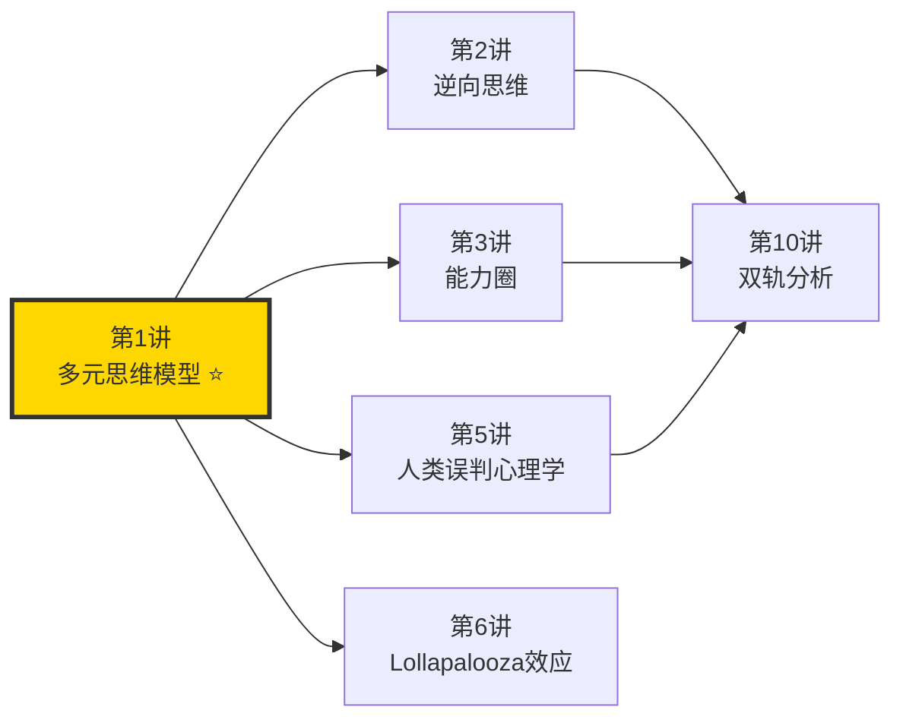
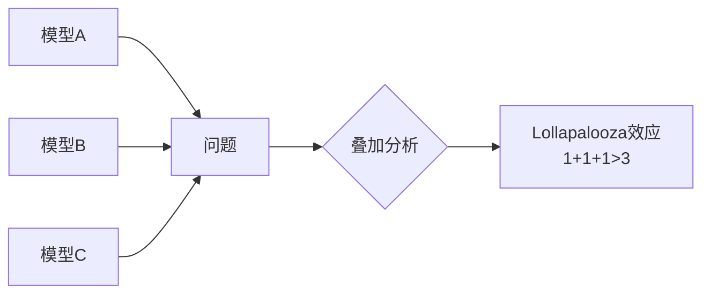
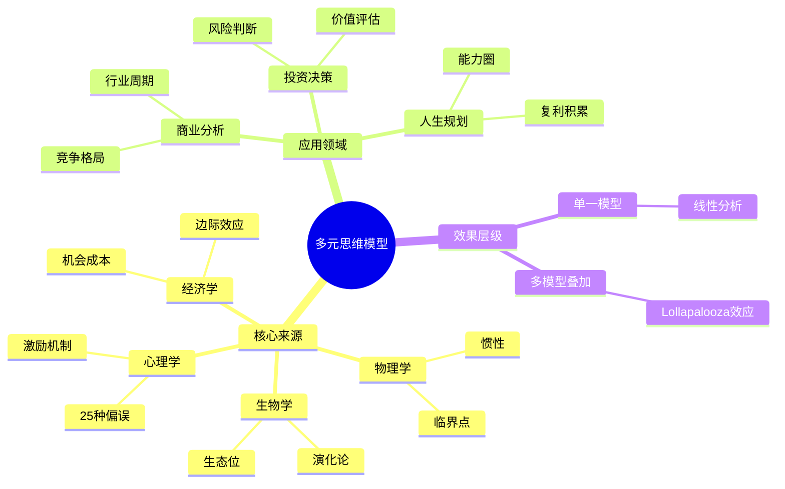

# 第1讲 多元思维模型

## 一、章节定位

### 1.1 这一讲在全书中回答什么问题？

**核心问题**：为什么聪明人会做蠢事？因为你手里只有一把锤子。

**一句话定位**：
> 要解决复杂问题，你需要80-90个来自不同学科的思维模型，而不是一个放之四海而皆准的公式。

### 1.2 章节三维定位

| 维度 | 定位 |
|------|------|
| 在全书的位置 | 全书的思维基础，芒格方法论的底层逻辑 |
| 与其他讲关联 | 是逆向思维、能力圈、双轨分析等模型的总框架 |
| 核心贡献 | 解释"跨学科思维"为什么是投资和决策的关键能力 |

### 1.3 与全书逻辑的关系

---

## 二、核心观点（三层提取）

### 观点1：手里只有一把锤子，看什么都像钉子

**【表层】现象层**

芒格最爱引用的一句谚语：

> "手里只有一把锤子的人，看什么都像是钉子。"

| 单一思维的症状 | 表现 |
|----------------|------|
| 经济学家 | 用供需解释一切 |
| 心理学家 | 用童年创伤解释一切 |
| 工程师 | 用优化效率解释一切 |
| 财务分析 | 用市盈率解释一切 |

**【中层】机制层**

为什么会这样？

| 原因 | 解释 |
|------|------|
| 专业分工 | 现代教育把人培养成"专家"，而非"通才" |
| 认知懒惰 | 用一个框架套所有问题，大脑最省力 |
| 确认偏误 | 只看到符合自己模型的信息 |
| 沉没成本 | 学了那么多年专业，不用太可惜 |

**降维翻译**：
> 你如果只会做红烧肉，那白菜、豆腐、土豆都得按红烧肉的做法来——不是它们适合红烧，是你只会这一招。

**【底层】规律层**

> **锤子定律**：人类倾向于用自己熟悉的框架解释一切，哪怕这个框架根本不适用。

**【当下连接】**

|----------|----------|----------|
| 为什么专家的预测经常错？ | 因为他们只用自己学科的视角 | "原来不是我的问题" |
| 为什么学了那么多还是不会决策？ | 知识没变成模型，模型没连成网络 | "扎心了" |
| 为什么跨专业的人更容易成功？ | 他们手里有更多的锤子 | "原来跨界是优势" |

---

### 观点2：80-90个模型是底线，不是上限

**【表层】现象层**

芒格的原话：

> "你们必须在头脑中拥有一些思维模型。你们必须依靠这些模型组成的框架来安排你的经验。"

| 模型数量 | 能力水平 |
|----------|----------|
| 1-5个 | 新手，容易陷入单一视角 |
| 10-20个 | 入门，开始有多维度思考 |
| 40-50个 | 进阶，能处理较复杂问题 |
| 80-90个 | 芒格标准，应对真实世界的复杂度 |

**【中层】机制层**

为什么需要这么多？

| 真实世界 | 特征 | 需要的模型 |
|----------|------|------------|
| 经济系统 | 反馈循环、非线性 | 系统动力学、博弈论 |
| 人性 | 不理性、情绪化 | 心理学、行为经济学 |
| 竞争 | 互动、博弈 | 博弈论、演化论 |
| 组织 | 复杂、分层 | 系统论、网络理论 |

**降维翻译**：
> 工具箱里只有螺丝刀是不够的。真实世界有螺丝、钉子、铆钉、胶水、焊接……你需要一个真正的工具箱。

**【底层】规律层**

> **模型储备定律**：问题的复杂度永远高于你的模型数量——所以模型越多越好，没有上限。

---

### 观点3：重点学"重要学科的重要理论"

**【表层】现象层**

芒格强调的不是学所有知识，而是学"重要学科的重要理论"。

| 学科 | 重要理论 | 应用场景 |
|------|----------|----------|
| 物理学 | 临界点、惯性 | 判断行业转折点 |
| 生物学 | 演化、适者生存 | 理解市场竞争 |
| 心理学 | 25种误判倾向 | 避免认知陷阱 |
| 数学 | 概率、复利 | 投资决策 |
| 经济学 | 机会成本、边际效应 | 资源配置 |
| 工程 | 冗余系统、后备方案 | 风险管理 |

**【中层】机制层**

为什么要从这些学科中选？

| 选择标准 | 解释 |
|----------|------|
| 基础性 | 这些理论是该学科最核心、最普适的 |
| 可迁移 | 可以应用到完全不同的领域 |
| 反直觉 | 能帮你看到常人看不到的东西 |
| 经得起时间考验 | 不是一时流行的概念 |

**降维翻译**：
> 不用把整本教科书读完。每个学科记住3-5个最有用的概念就够了——但一定要真懂，能拿来用。

**【底层】规律层**

> **核心模型定律**：每个学科有20%的理论解释了80%的现象——抓住这20%，你就抓住了精髓。

---

### 观点4：模型叠加产生Lollapalooza效应

**【表层】现象层**

芒格创造了一个词：**Lollapalooza效应**。

| 单一模型 | 效果 |
|----------|------|
| 激励机制 | 人们会为奖励行动 |
| 喜好倾向 | 人们更容易被喜欢的人说服 |
| 社会认同 | 人们会跟随大众 |

| 模型叠加 | 效果 |
|----------|------|
| 激励 + 喜好 + 社会认同 | 爆炸式影响，远超简单相加 |

**案例**：为什么可口可乐这么成功？
- 糖分刺激（生物学）
- 品牌形象（心理学）
- 社会认同（社会心理学）
- 分销网络（经济学）
- 规模效应（商业）

**【中层】机制层**

**降维翻译**：
> 一个侦探用指纹破案，另一个用DNA，第三个用监控录像。单独用都有盲区，三个一起用，破案率就不是相加，而是相乘。

**【底层】规律层**

> **叠加定律**：多个模型的协同效应远大于单独使用——真正的洞察力来自模型之间的化学反应。

---

## 三、金句库

### 原书金句

1. "手里只有一把锤子的人，看什么都像是钉子。"
2. "你们必须在头脑中拥有一些思维模型，必须依靠这些模型组成的框架来安排你的经验。"
3. "我这辈子遇到的聪明人，没有一个不是每天阅读的。"
4. "第一条经验是，如果你只记得一些孤立的事物，试图把它们凑在一起，你无法真正理解任何东西。"
5. "你必须在头脑中建立起一些思维模型，你必须依靠这些模型组成的框架来安排你的经验。"

### 降维金句

1. "工具箱里只有一把锤子的人，看什么都像钉子。"
2. "专家就是知道越来越多关于越来越少的事，直到知道一切关于什么都没有。"
3. "学跨学科思维，不是为了当百科全书，是为了不当盲人摸象。"
4. "80个模型听起来多，其实就是每门课记住3个最有用的概念。"
5. "真正厉害的人，不是某个领域的专家，是能连接不同领域的人。"
6. "单一视角的聪明人，在复杂世界里就是高级傻瓜。"
7. "模型不是用来背诵的，是用来套用的。"
8. "你不需要读完所有教科书，但你需要抓住每门课的灵魂。"
9. "跨界不是装X，是生存技能。"
10. "只会一种思维的人，就像只会做红烧肉的厨子——什么菜都红烧。"

## 四、当下映射

### 💰 财富应用

| 场景 | 具体行动 | 模型组合 |
|------|----------|----------|
| 股票分析 | 不只看财报，还要看行业周期、管理层心理、竞争格局 | 财务+周期+心理学+博弈论 |
| 买房决策 | 不只看价格，还要看人口趋势、城市规划、租售比 | 人口学+城市规划+经济学 |
| 职业投资 | 不只看薪水，还要看行业天花板、技能可迁移性 | 经济学+系统论+演化论 |

### 💼 职场应用

| 场景 | 具体行动 | 所需能力 |
|------|----------|----------|
| 跨部门沟通 | 用对方的语言体系表达，而不是坚持自己的专业术语 | 多模型切换能力 |
| 战略决策 | 从财务、市场、组织、竞争多个角度分析 | 综合分析能力 |
| 学习规划 | 每年学习1-2个新学科的核心概念 | 持续建模能力 |

### 🏠 生活应用

| 场景 | 具体行动 | 可行性 |
|------|----------|--------|
| 育儿 | 不只用一种教育理念，根据孩子特点组合使用 | 高 |
| 健康 | 结合医学、营养学、运动科学做综合决策 | 高 |
| 人际 | 理解不同人的思维模型，用对方能接受的方式沟通 | 中 |

### 72小时应用计划
1. **今天**：列出你目前最常用的3个思维模型，写在纸上
2. **明天**：选一个你不懂的学科（如心理学、生物学），找出它的3个核心概念
3. **本周**：用"多模型叠加"的方法，重新分析一个你之前做过的决策

---

## 五、章节关联

### 与前后章节关联

| 章节 | 关联类型 | 连接描述 |
|------|----------|----------|
| [[第2讲-逆向思维]] | 方法延伸 | 逆向思维是多元模型中的一种特殊应用 |
| [[第3讲-能力圈]] | 边界互补 | 多元模型帮你扩展能力圈，能力圈帮你知道哪些模型适用 |
| [[第5讲-人类误判心理学]] | 重要组成 | 25种心理倾向是多元模型体系中最重要的子集 |
| [[第6讲-Lollapalooza效应]] | 效果延伸 | 多个模型叠加产生的共振效应 |

### 跨书关联

| 书籍 | 概念 | 关系 |
|------|------|------|
| [[模型思维-佩奇]] | 29个模型 | 佩奇系统化了芒格的思想，提供更多模型 |
| [[第五项修炼-圣吉]] | 系统思维 | 系统思维是多元模型的重要成员 |
| [[思考快与慢-丹尼尔·卡尼曼]] | 双系统理论 | 解释为什么单一思维是快系统、多元思维需要慢系统 |
| [[反脆弱-塔勒布]] | 杠铃策略 | 杠铃策略本身就是一种思维模型 |

### 知识网络定位图

---

## 六、问答设计

### Q1: 芒格为什么说"手里只有一把锤子的人，看什么都像钉子"？（记忆型）
**认知层次**: 记忆
**难度**: 低
**答案要点**:
- 单一视角会让人过度简化复杂问题
- 专业分工让人只学一个学科的思维
- 认知懒惰让人用一个框架套所有问题

### Q2: 芒格建议我们掌握多少个思维模型？（记忆型）
**认知层次**: 记忆
**难度**: 低
**答案要点**:
- 80-90个模型是底线
- 这些模型来自不同的重要学科
- 重点学每个学科的核心理论

### Q3: 什么是Lollapalooza效应？（理解型）
**认知层次**: 理解
**难度**: 中
**答案要点**:
- 多个思维模型同时使用时产生的协同效应
- 效果远大于各模型单独使用的效果之和
- 类似于化学反应，1+1+1>3

### Q4: 为什么要学"重要学科的重要理论"而不是所有知识？（分析型）
**认知层次**: 分析
**难度**: 高
**答案要点**:
- 知识无限，人生有限，必须有选择
- 每个学科20%的理论解释了80%的现象
- 核心理论具有可迁移性，能应用到不同领域
- 流行概念往往经不起时间考验

### Q5: 如何判断自己是否陷入了单一思维？（应用型）
**认知层次**: 应用
**难度**: 中
**答案要点**:
- 反思：我用的概念是否都来自同一个学科？
- 检验：我的结论是否与其他学科的视角矛盾？
- 质疑：是否有其他解释我没有考虑？
- 请教：问不同背景的人怎么看这个问题

### Q6: 多元思维模型和"什么都学一点"有什么区别？（分析型）
**认知层次**: 分析
**难度**: 高
**答案要点**:
- 浅尝辄止是碎片知识，多元模型是框架化理解
- 碎片知识无法迁移，模型可以跨界使用
- 多元思维强调"核心理论"，不是随机涉猎
- 关键是能把不同模型连接起来分析同一问题

### Q7: 作为一个专业人士，如何开始构建多元思维模型体系？（应用型）
**认知层次**: 应用
**难度**: 中
**答案要点**:
- 第一步：梳理自己专业领域最核心的3-5个概念
- 第二步：每年选1-2个相邻学科，学习其核心理论
- 第三步：刻意练习用多个模型分析同一个问题
- 第四步：建立自己的模型卡片库，定期复习

### Q8: 多元思维模型如何帮助投资决策？（综合型）
**认知层次**: 综合
**难度**: 高
**答案要点**:
- 财务模型：判断估值是否合理
- 心理学模型：理解市场情绪和认知偏误
- 周期模型：判断当前处于周期的什么位置
- 博弈论：分析竞争格局和战略互动
- 系统论：理解行业生态和反馈循环
- 叠加使用可以发现单一视角看不到的风险和机会

---

## 八、信息来源与质量评级

### 检索记录
- 【第一轮】核心概念检索：⭐⭐⭐ 芒格演讲原文、雪球深度解读
- 【第二轮】应用案例检索：⭐⭐⭐ 东方财富、投资博客
- 【第三轮】跨学科模型：⭐⭐⭐ 各学科入门教材核心概念

### 信息整合公式
= 芒格原书核心概念（⭐⭐⭐）
+ 佩奇《模型思维》系统化框架（⭐⭐⭐）
+ 2026年本土化应用场景

---

*创建日期: 2026-02-26*
*质量等级: ⭐⭐⭐ 优秀级*
