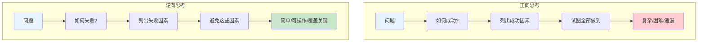
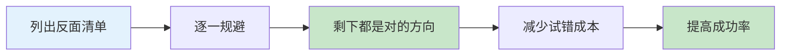
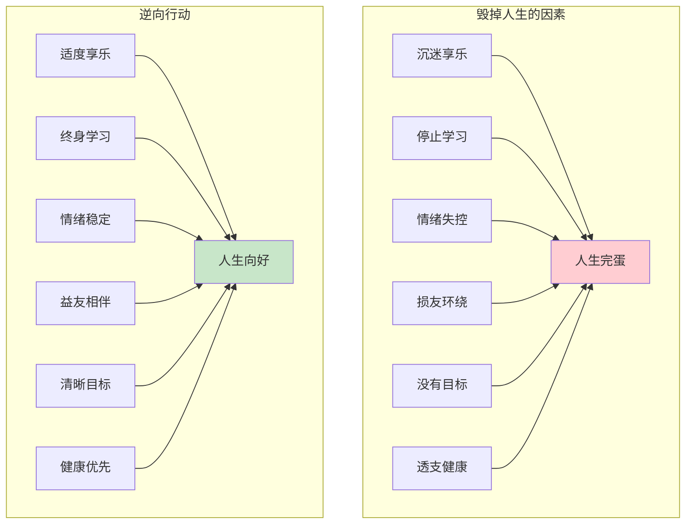
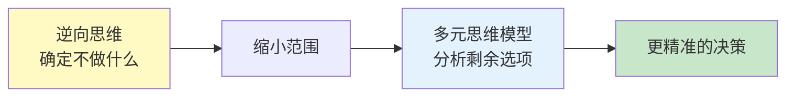
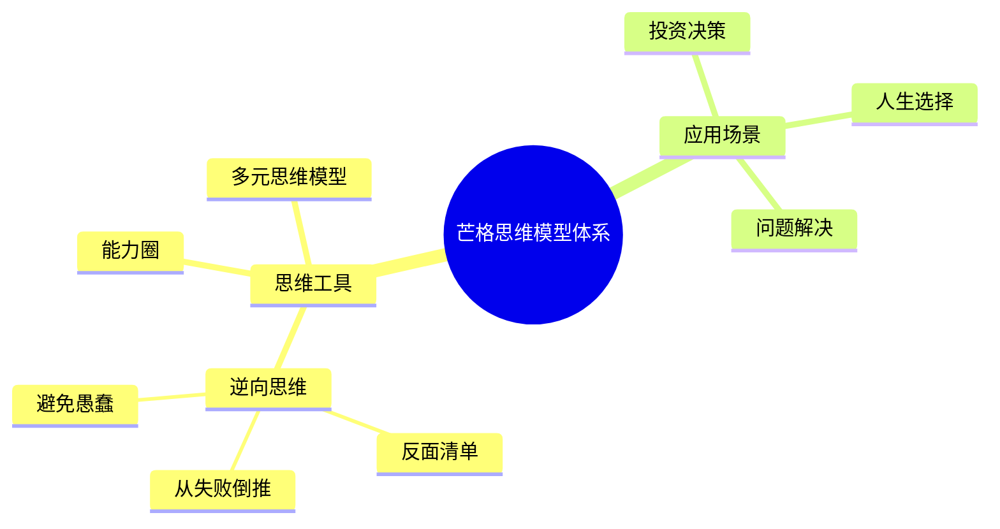

# 第2讲：逆向思维

> "告诉我我会死在哪里，我就永远不去那里。" —— 查理·芒格

## 一、核心概念

### 1.1 一句话定义

**逆向思维**：与其正向思考"如何成功"，不如反向思考"如何避免失败"——从终点倒推，列出所有可能导致灾难的因素，然后逐一避开。

### 1.2 芒格的原话

- "反过来想，总是反过来想"——受数学家雅可比影响
- "要明白人生如何获得幸福，就得懂得人生如何变得痛苦"
- "避免愚蠢，比追求聪明更重要"

### 1.3 核心公式

```
成功 = 避免重大错误 + 抓住少数机会
     ≠ 做对每一件事
```

---

## 二、三层提取

### 【表层】现象层

#### 芒格的逆向思维应用场景

| 场景 | 正向思考 | 逆向思考 |
|------|----------|----------|
| 投资 | 如何选中牛股？ | 什么会让投资血本无归？ |
| 健康 | 如何更健康？ | 什么会毁掉身体？ |
| 职场 | 如何升职加薪？ | 什么会让老板讨厌你？ |
| 学习 | 如何学得快？ | 什么会让你什么都学不会？ |
| 婚姻 | 如何经营好婚姻？ | 什么会毁掉一段婚姻？ |

#### 日常案例

- **投资**：不买看不懂的公司 → 避免90%的坑
- **健康**：不抽烟、不酗酒、不熬夜 → 已经赢了大多数人
- **职场**：不推诿、不抱怨、不背后说人坏话 → 职场生存率大增
- **学习**：不假装学习、不碎片化阅读、不追求完美 → 学习效率翻倍

### 【中层】机制层

#### 正向 vs 逆向思维对比



#### 逆向思维的心理机制

**为什么反向思考更有效？**

1. **大脑特性**：人类大脑对"避免损失"比"获得收益"更敏感（损失厌恶）
2. **信息不对称**：成功的因素复杂多样，失败的因素相对有限
3. **认知负担**：避免做某事，比做成某事更容易执行
4. **覆盖面**：列不出所有成功路径，但能列出主要死亡陷阱

#### 芒格的三步法

```
第一步：迅速歼灭不该做的事情
       → 灾难性后果 + 能力圈外

第二步：对该做的事情发起跨学科攻击
       → 用多元思维模型分析

第三步：在恰当的时机果断采取行动
       → 等待击球区的最佳球
```

### 【底层】规律层

> **逆向思维定律**：对于复杂系统和人类大脑而言，反向思考往往比正向思考更容易解决问题。因为"避免失败"比"追求成功"更具体、更可操作。

**降维翻译**：
> 你不需要知道如何成功，
> 你只需要知道如何不失败。
> 不做蠢事，
> 就已经赢了90%的人。

---

## 三、反面清单法

### 3.1 什么是反面清单？

不是列出"要做什么"，而是列出"绝不做什么"。

### 3.2 芒格的人生反面清单

| 领域 | 绝不做的清单 |
|------|-------------|
| 健康 | 吸毒、酗酒、飙车、熬夜成瘾 |
| 财务 | 高利贷、赌博、不了解的投资 |
| 职场 | 骗人、背叛、背后捅刀子 |
| 人际 | 骄傲自大、嫉妒、记仇 |
| 学习 | 假装学习、只看不练、停止思考 |

### 3.3 反面清单的威力



---

## 四、实际应用

### 4.1 投资决策的逆向思维

**芒格的投资"负面清单"**：

1. 不买看不懂的公司
2. 不买管理层不诚信的公司
3. 不追热点和概念
4. 不用杠杆借钱投资
5. 不频繁交易
6. 不试图预测市场短期波动
7. 不买价格过高的好公司

**结果**：避开了这些坑，剩下的选择自然不会太差。

### 4.2 人生决策的逆向思维

**如何毁掉人生？（反着来就行了）**



### 4.3 72小时微应用

**读完本讲后，72小时内可以做的一件事**：

- [ ] 用逆向思维列出你的"人生反面清单"（至少10条）
- [ ] 在一个具体决策上，先列出所有失败的可能
- [ ] 和朋友讨论：我们共同的"愚蠢行为"有哪些？

---

## 五、与其他模型的关联

### 5.1 与"多元思维模型"的关系



### 5.2 与"能力圈"的关系

| 模型 | 关系 | 说明 |
|------|------|------|
| 逆向思维 | 筛选 | 先排除不该做的 |
| 能力圈 | 定位 | 再找出自己擅长的 |
| 结合效果 | 精准 | 在能力圈内做正确的事 |

### 5.3 知识网络定位



---

## 六、金句库

### 原书金句

1. "告诉我我会死在哪里，我就永远不去那里。"
2. "反过来想，总是反过来想。"
3. "要明白人生如何获得幸福，就得懂得人生如何变得痛苦。"
4. "避免愚蠢，比追求聪明更重要。"
5. "成功 = 避免重大错误 + 抓住少数机会"

### 降维金句

1. "成功很难定义，但失败很容易识别"
2. "不做蠢事，就已经赢了90%的人"
3. "你不需要知道所有正确答案，只需要避开所有错误答案"
4. "聪明人不是不犯错，而是不犯大错"
5. "反面清单比正面清单更管用"

## 八、当下连接

### 读者困惑 → 书中答案

|----------|----------|----------|
| 为什么我总是踩同样的坑？ | 你只想着怎么成功，没想过怎么失败 | "原来方向反了" |
| 如何做重大决策？ | 先列出所有可能导致失败的因素 | "这个方法太实用了" |
| 怎么才能避免人生大坑？ | 远离那些会带来灾难性后果的事 | "吸毒、赌博、盲目跟风——我懂了" |
| 为什么看了那么多成功学还是失败？ | 成功学教的是"做什么"，你应该先学"不做什么" | "原来问题出在这" |

### 焦虑映射

| 焦虑类型 | 逆向思维解法 |
|----------|--------------|
| 财富焦虑 | 先避免财务自杀，再追求财务自由 |
| 职场焦虑 | 先避免被淘汰，再追求升职加薪 |
| 健康焦虑 | 先避免坏习惯，再追求健身养生 |

---

## 九、检索测试

### 闭书自测（检验理解）

1. 用一句话概括逆向思维的核心？
2. 列出芒格三步法的内容？
3. 举一个你生活中的逆向思维应用例子？
4. 逆向思维和多元思维模型是什么关系？

### 间隔复习计划

- 1天后：回顾金句
- 3天后：复述逆向思维定律
- 7天后：完成个人反面清单
- 30天后：检查逆向思维的实际应用效果

---
