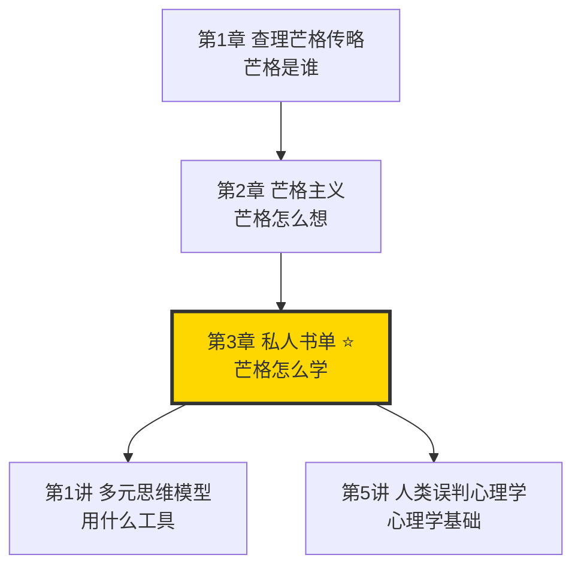
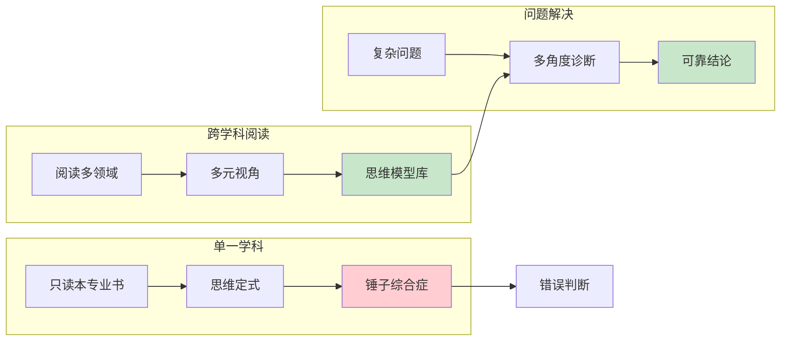
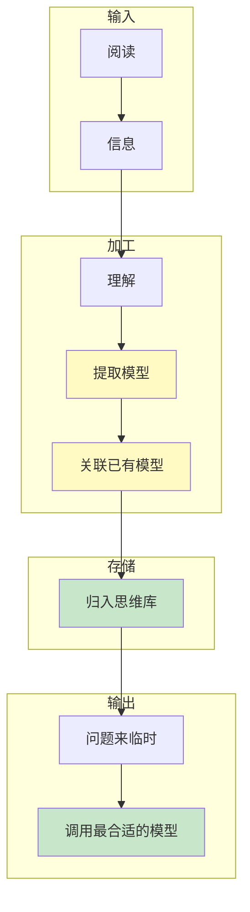
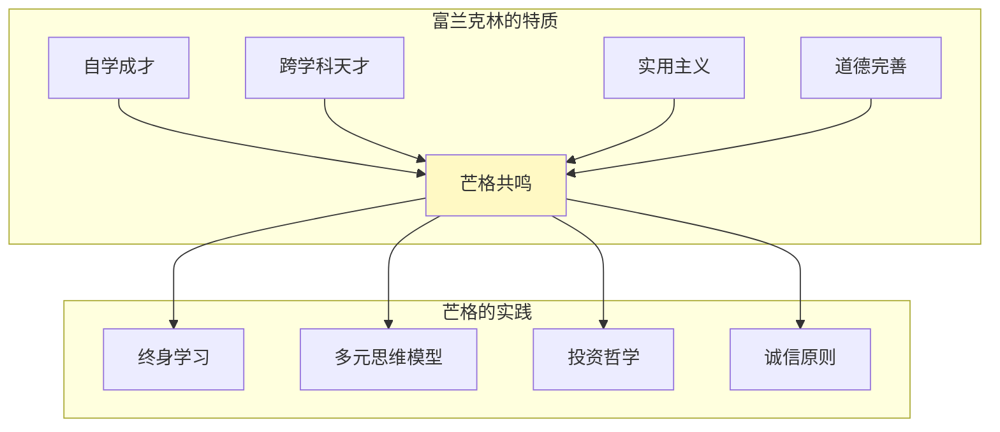
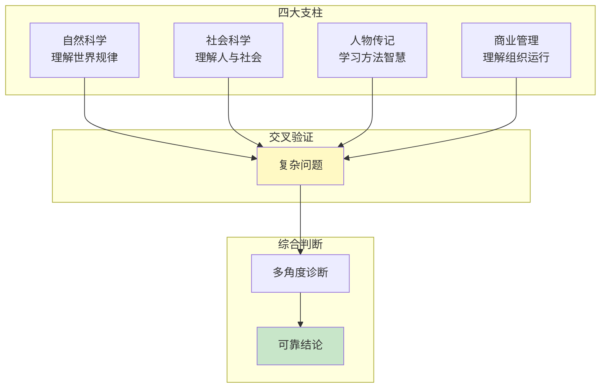
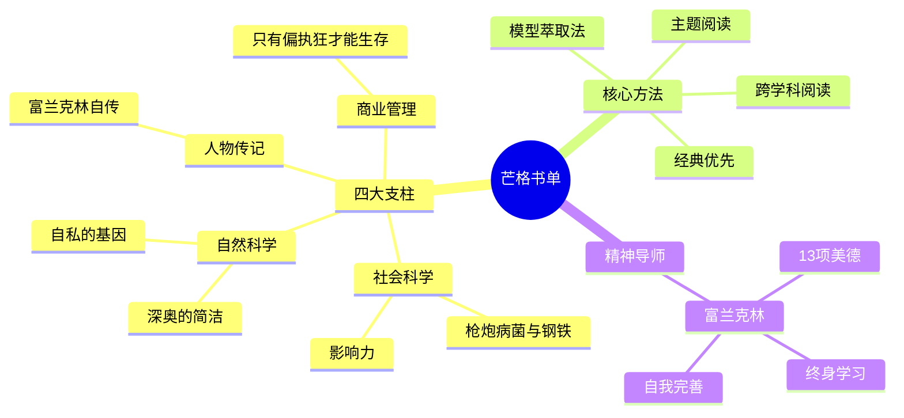

# 第3章 芒格的私人书单

## 一、章节定位

### 1.1 这一章在全书中回答什么问题？

**核心问题**：芒格读了哪些书？如何像芒格一样通过阅读构建思维模型库？

**一句话定位**：
> 芒格的私人书单不是一份阅读清单，而是一张"如何通过跨学科阅读构建智慧体系"的路线图——每本书都是一块思维积木。

### 1.2 章节三维定位

| 维度 | 定位 |
|------|------|
| 在全书的位置 | 多元思维模型的"原材料来源"，展示芒格的知识源头 |
| 与其他章节关联 | 是第1讲多元思维模型的具体体现，是终身学习的实践证明 |
| 核心贡献 | 揭示"芒格的智慧从哪里来"——不是天才，是系统性阅读 |

### 1.3 与全书逻辑的关系

---

## 二、核心观点（三层提取）

### 观点1：跨学科阅读——打破锤子综合症的根本方法

**【表层】现象层**

芒格的阅读习惯：

| 阅读习惯 | 具体表现 |
|----------|----------|
| 阅读量 | 每周读20本书，涵盖历史、科学、传记、经济学 |
| 阅读领域 | 物理学、生物学、心理学、经济学、历史学 |
| 阅读方法 | 不读畅销书，只读经典；不读一遍，反复重读 |
| 阅读目的 | 不是消遣，是构建思维模型库 |

**芒格推荐的书单分类**：

| 领域 | 推荐书籍 | 核心价值 |
|------|----------|----------|
| **科学类** | 《深奥的简洁》《自私的基因》《枪炮病菌与钢铁》 | 理解世界的底层规律 |
| **传记类** | 《富兰克林自传》 | 学习如何思考和做人 |
| **商业类** | 《只有偏执狂才能生存》《影响力》 | 理解商业和人性 |
| **历史类** | 《苏格兰人如何发明现代世界》 | 理解文明演进规律 |

**【中层】机制层**

为什么跨学科阅读如此重要？

**芒格的选书标准**：
1. **经典优先**：经历时间检验的书，而不是畅销书
2. **跨学科**：每个学科只读最重要的几本书
3. **实用性**：能提取思维模型的书
4. **传记价值**：学习伟人的思考方式

**降维翻译**：
> 芒格的书单不是让你读完所有书，而是让你知道：智慧来自哪里。每个学科抓最核心的那几本，80个模型 × 1小时 = 80小时的投资，收益是一辈子的思维升级。

**【底层】规律层**

> **跨学科阅读定律**：单一学科的知识足以让你在熟悉领域成功，但跨学科的知识才能让你在复杂系统中做出正确判断。

**【当下连接】**

|----------|----------|----------|
| 为什么要读那些"没用"的书？ | 今天的"没用"，明天可能是救命稻草 | "原来知识也有期权价值" |
| 时间有限，如何选书？ | 只读经典，不读畅销；只读跨学科核心 | "不用读那么多书了" |
| 读不进去怎么办？ | 芒格80岁还在学，你有什么借口 | "芒格都能坚持，我也可以" |

---

### 观点2：主题阅读法——如何从一本书提取思维模型

**【表层】现象层**

芒格不只是"读书"，而是"萃取"：

| 普通阅读 | 芒格式阅读 |
|----------|------------|
| 读完就忘 | 读后提取模型 |
| 被动接收 | 主动萃取 |
| 碎片记忆 | 系统归档 |
| 消遣为主 | 武装大脑 |

**芒格的"模型萃取法"**：
1. 读完一本书，问：这本书的核心模型是什么？
2. 能用一句话说清楚吗？
3. 这个模型能解决什么问题？
4. 和我已知的模型有什么关联？

**【中层】机制层**

从"信息"到"智慧"的转化路径：

**芒格从每本书里"偷"什么**：
- **从《自私的基因》**：进化论的视角看人类行为
- **从《影响力》**：六大心理学武器
- **从《富兰克林自传》**：如何自我完善
- **从《枪炮病菌与钢铁》**：地理决定论

**降维翻译**：
> 读书不是为了"读完"，而是为了"偷"走最厉害的那几招。芒格每读一本书，都会从里面"偷"出1-2个思维模型，装进他的工具箱。读完一本书，如果你说不出它教会了你什么，等于没读。

**【底层】规律层**

> **模型萃取定律**：一本书的价值，不在于你读了多少，而在于你提取了多少可复用的思维模型。100本书 × 0个模型 = 0；10本书 × 每本2个模型 = 20个模型。

**【当下连接】**

|----------|----------|----------|
| 读完就忘怎么办？ | 你不是在"读"，你是在"萃取" | "原来方法错了" |
| 如何检验自己读懂了？ | 能用一句话说出核心模型吗？ | "这个检验方法太好用" |
| 为什么芒格读一遍就能记住？ | 他不是在记，是在"归档" | "原来高手是这样读的" |

---

### 观点3：富兰克林是芒格的精神导师

**【表层】现象层**

芒格对富兰克林的崇拜：

| 芒格的致敬 | 具体表现 |
|------------|----------|
| 书名《穷查理宝典》 | 直接致敬《穷查理年鉴》 |
| 反复推荐 | 多次在演讲中推荐《富兰克林自传》 |
| 模仿实践 | 学习富兰克林的自我完善方法 |
| 价值观一致 | 终身学习、节俭、诚信、幽默 |

**富兰克林的美德清单（芒格也实践）**：
1. 节制
2. 沉默（言多于行）
3. 秩序
4. 决心
5. 节俭
6. 勤勉
7. 诚恳
8. 公正
9. 中庸
10. 清洁
11. 宁静
12. 贞洁
13. 谦逊

**【中层】机制层**

为什么芒格视富兰克林为榜样？

**两人的共同点**：
- 都没有正式大学学位（富兰克林没读完，芒格是律师）
- 都是自学成才的跨学科天才
- 都强调实用主义——知识要能用
- 都追求道德完善——诚信是最好的策略

**降维翻译**：
> 芒格找到了他的精神导师——富兰克林。一个是18世纪的美国国父，一个是21世纪的投资大师。两人相隔200年，却用同样的方法：自学、跨学科、实践、诚信。如果你没有榜样，就选一个，然后模仿他的思维。

**【底层】规律层**

> **榜样定律**：找到你的精神导师，不是崇拜他，而是学习他的思维方式。芒格从不崇拜富兰克林，他只是系统地学习富兰克林的思考方法。

**【当下连接】**

|----------|----------|----------|
| 为什么芒格的书叫"穷查理"？ | 致敬他的精神导师富兰克林 | "原来书名有深意" |
| 如何找到自己的榜样？ | 找一个你欣赏的人，系统学习他的方法 | "有方向了" |
| 崇拜偶像会不会失去自我？ | 学习思维，不是复制人生 | "原来可以这么学" |

---

### 观点4：经典书单的核心领域——构建思维模型库的四大支柱

**【表层】现象层**

芒格推荐书单的四大核心领域：

| 领域 | 核心书籍 | 核心思维模型 |
|------|----------|--------------|
| **自然科学** | 《深奥的简洁》《自私的基因》 | 复杂系统、进化论 |
| **社会科学** | 《枪炮病菌与钢铁》《影响力》 | 地理决定论、心理影响 |
| **人物传记** | 《富兰克林自传》《苏格兰人》 | 自我完善、文明演进 |
| **商业管理** | 《只有偏执狂才能生存》 | 危机意识、战略转型 |

**【中层】机制层**

四大领域的知识如何协同工作：

**每个领域学什么**：
- **自然科学**：物理学的临界点、生物学的进化论、数学的概率论
- **社会科学**：经济学的激励机制、心理学的认知偏误、历史学的周期律
- **人物传记**：伟人的决策方法、失败者的教训、跨时代的智慧
- **商业管理**：竞争战略、组织行为、创新规律

**降维翻译**：
> 芒格的书单有四个"房间"：自然科学的房间让你理解世界，社会科学的房间让你理解人，传记的房间让你学习方法，商业的房间让你理解组织。四个房间都逛过，你才能在复杂世界里找到出口。

**【底层】规律层**

> **四支柱定律**：完整的知识体系需要四个维度的支撑——自然规律、社会规律、人生智慧、组织规律。缺一个维度，你的世界观就是跛脚的。

**【当下连接】**

|----------|----------|----------|
| 书单太长，从哪里开始？ | 四大支柱各选一本经典 | "有路线图了" |
| 为什么要读科学书？ | 理解世界的底层规律 | "原来科学不是无用" |
| 传记有什么用？ | 学习伟人的思维方式 | "不是看故事，是学方法" |

---

## 三、芒格推荐书单精选

### 核心推荐（必读）

| 书名 | 作者 | 推荐理由 | 核心模型 |
|------|------|----------|----------|
| 《富兰克林自传》 | 本杰明·富兰克林 | 芒格的精神导师，自我完善方法论 | 13项美德、终身学习 |
| 《深奥的简洁》 | 约翰·格里宾 | 理解复杂系统的入门书 | 混沌、涌现、临界点 |
| 《自私的基因》 | 理查德·道金斯 | 用进化论视角理解人类行为 | 基因视角、进化稳定策略 |
| 《枪炮、病菌与钢铁》 | 贾雷德·戴蒙德 | 用地理视角解释文明差异 | 地理决定论、环境塑造 |
| 《影响力》 | 罗伯特·西奥迪尼 | 理解说服和心理影响 | 六大影响原则 |
| 《只有偏执狂才能生存》 | 安迪·格鲁夫 | 理解战略拐点和危机管理 | 战略拐点、10倍速变化 |

### 延伸推荐

| 书名 | 作者 | 领域 | 核心价值 |
|------|------|------|----------|
| 《苏格兰人如何发明现代世界》 | 亚瑟·赫尔曼 | 历史 | 理解启蒙运动的智慧 |
| 《生活在极限之内》 | 加勒特·哈丁 | 生态学 | 理解公地悲剧和资源限制 |
| 《成事在人》 | 爱德华·威尔逊 | 生物学 | 理解人类本性 |
| 《查验》 | 麦克尔·格波特 | 跨学科 | 理解思维模型应用 |

---

## 四、金句库

### 原书金句

1. "我这辈子遇到的聪明人，没有一个不是每天学习的。"
2. "我已经形成了这样一种习惯：如果我不喜欢一本书，我就把它放下。"
3. "我这辈子没有见过哪个聪明人不是一直学习的。"
4. "我的孩子们取笑我，说我是长着两条腿的书架。"
5. "和已逝的伟人交朋友，这听起来很好玩，但如果你一生中总是与那些有远见、有智慧的人待在一起，你就会过上更好的生活。"
6. "如果你想获得某样东西，最可靠的方法是让自己配得上它。"

### 降维金句

1. "芒格不是天才，他只是把别人喝咖啡的时间都用来读书了。"
2. "读书不是在消遣，是在武装大脑——每本书都是一件武器。"
3. "芒格的书单不是书单，是一张'如何变聪明'的路线图。"
4. "读什么书不重要，重要的是你从书里'偷'走了什么。"
5. "芒格找了个200年前的偶像，然后学了他一辈子——你呢？"
6. "四大支柱：自然科学让你懂世界，社会科学让你懂人，传记让你懂方法，商业让你懂组织。"
7. "富兰克林教会芒格如何做人，芒格教会我们如何像他一样学习富兰克林。"
8. "经典书的定义：芒格读了不只一遍的书。"

## 五、当下映射

### 💰 财富应用

| 场景 | 具体行动 | 书单启示 |
|------|----------|----------|
| 投资学习 | 阅读《影响力》《自私的基因》理解市场心理 | 跨学科理解市场 |
| 商业决策 | 阅读《只有偏执狂才能生存》识别战略拐点 | 危机意识 |
| 长期规划 | 阅读《枪炮病菌与钢铁》理解周期规律 | 宏观视角 |

### 💼 职场应用

| 场景 | 具体行动 | 书单启示 |
|------|----------|----------|
| 能力提升 | 每年选一个领域，读该领域最经典的3本书 | 系统学习 |
| 决策质量 | 读传记学习伟人的决策方法 | 榜样学习 |
| 跨界能力 | 用"四支柱"框架构建知识体系 | 结构化阅读 |

### 🏠 生活应用

| 场景 | 具体行动 | 可行性 |
|------|----------|--------|
| 日常阅读 | 每天阅读30分钟，只读经典 | 高 |
| 知识管理 | 每读完一本书，提取1-2个思维模型 | 高 |
| 榜样学习 | 找一个精神导师，系统学习他的方法 | 中 |

### 72小时应用计划

1. **今天**：从芒格书单中选择一本你从未读过的经典，开始阅读
2. **明天**：用"模型萃取法"——读完后问自己：这本书的核心模型是什么？
3. **本周**：建立你的"四支柱"书单框架，每个领域至少1本

---

## 六、章节关联

### 与前后章节关联

| 章节 | 关联类型 | 连接描述 |
|------|----------|----------|
| [[第1讲-多元思维模型]] | 源头关系 | 私人书单是多元思维模型的"原材料来源" |
| [[第2章-芒格主义]] | 实践关系 | 终身学习是芒格主义的核心，书单是实践证明 |
| [[第5讲-人类误判心理学]] | 知识来源 | 《影响力》等心理学书籍是25种误判倾向的来源 |

### 跨书关联

| 书籍 | 概念 | 关系 |
|------|------|------|
| [[穷查理年鉴-本杰明·富兰克林]] | 芒格的精神导师 | 芒格直接致敬富兰克林 |
| [[影响力-西奥迪尼]] | 六大影响原则 | 芒格推荐，心理学核心 |
| [[枪炮病菌与钢铁-戴蒙德]] | 地理决定论 | 芒格推荐，历史视角 |
| [[自私的基因-道金斯]] | 进化论视角 | 芒格推荐，理解人性 |

### 知识网络定位图

---

## 七、问答设计

### Q1: 芒格书单的核心是什么？（记忆型）
**认知层次**: 记忆
**难度**: 低
**答案要点**:
- 四大支柱：自然科学、社会科学、人物传记、商业管理
- 核心是跨学科阅读，构建思维模型库
- 经典优先，不读畅销书

### Q2: 芒格为什么强调跨学科阅读？（理解型）
**认知层次**: 理解
**难度**: 中
**答案要点**:
- 对抗锤子综合症：单一思维导致错误判断
- 多元视角：复杂问题需要多角度诊断
- 模型协同：不同学科的模型可以交叉验证

### Q3: 如何像芒格一样从书中"偷"走思维模型？（分析型）
**认知层次**: 分析
**难度**: 中
**答案要点**:
- 模型萃取法：读完问"核心模型是什么"
- 一句话概括：能用一句话说清楚吗
- 归档存储：和已有模型建立关联
- 实践检验：在问题中调用

### Q4: 芒格为什么视富兰克林为精神导师？（分析型）
**认知层次**: 分析
**难度**: 中
**答案要点**:
- 自学成才：两人都没有正式学位，靠自学
- 跨学科天才：都在多个领域有成就
- 实用主义：知识要能用
- 道德完善：诚信是最好的策略

### Q5: 如何构建自己的"芒格式"书单？（综合型）
**认知层次**: 综合
**难度**: 高
**答案要点**:
- 四支柱框架：每个领域选经典
- 经典优先：经历时间检验的书
- 跨学科：不局限于专业
- 实用导向：能提取思维模型的书

### Q6: 芒格的阅读方法与普通阅读有什么本质区别？（评价型）
**认知层次**: 评价
**难度**: 高
**答案要点**:
- 目的不同：消遣 vs 武装大脑
- 方法不同：读完就忘 vs 模型萃取
- 存储不同：碎片记忆 vs 系统归档
- 输出不同：无 vs 可调用的思维模型

---

## 九、信息来源与质量评级

### 检索记录
- 【第一轮】核心概念检索：⭐⭐⭐ 《穷查理宝典》原书、芒格演讲
- 【第二轮】芒格书单解读：⭐⭐⭐ Farnam Street博客、芒格演讲实录
- 【第三轮】跨书关联：⭐⭐⭐ 已拆解书籍《影响力》《富兰克林自传》

### 信息整合公式
= 《穷查理宝典》核心概念（⭐⭐⭐）
+ 芒格演讲中的书单推荐
+ 已拆解书籍关联（《影响力》《富兰克林》）
+ 降维翻译（四支柱、模型萃取）

---

*创建日期: 2026-02-28*
*质量等级: ⭐⭐⭐ 优秀级*
