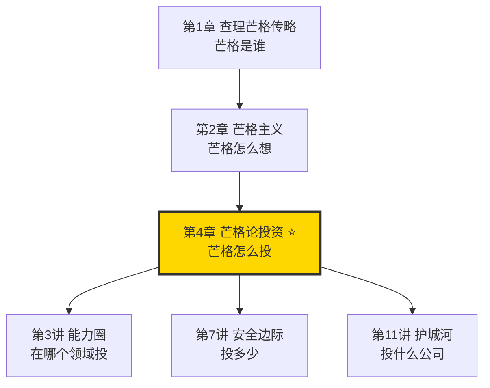
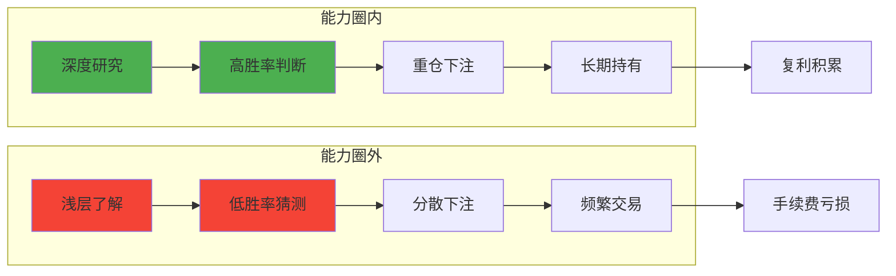
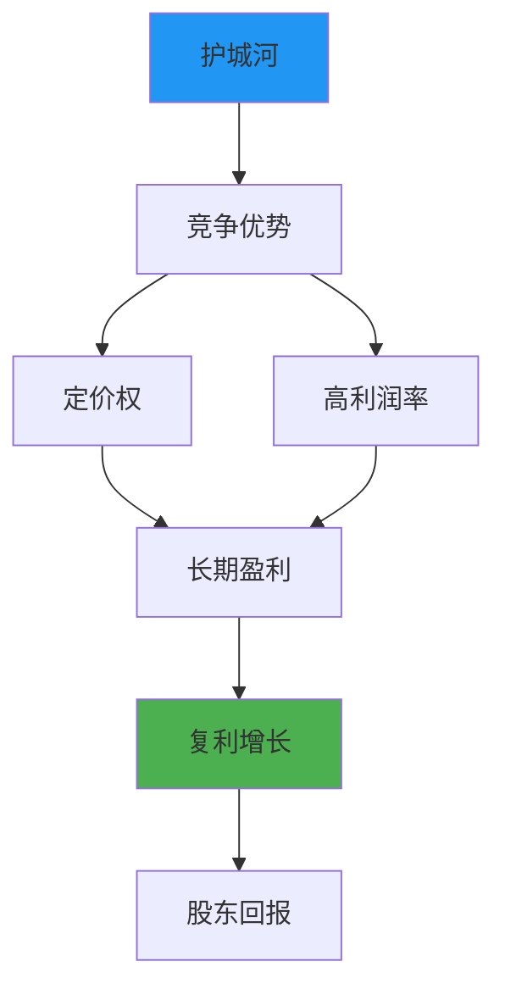
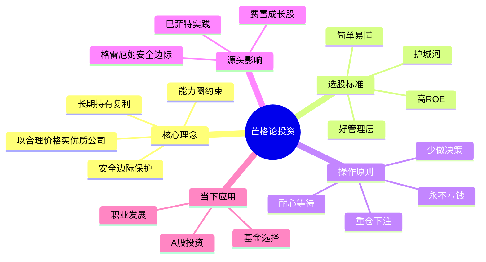
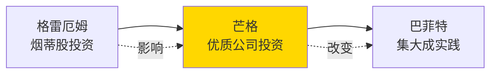

# 第4章 芒格论投资

## 一、章节定位

### 1.1 这一章在全书中回答什么问题？

**核心问题**：芒格的投资哲学是什么？它与巴菲特的投资理念有何不同？普通人如何用芒格的方法投资？

**一句话定位**：
> 芒格的投资哲学是"以合理价格买入优质公司"——他改变了巴菲特，也改变了价值投资的历史。

### 1.2 章节三维定位

| 维度 | 定位 |
|------|------|
| 在全书的位置 | 投资核心章节，将芒格思想从"思维模型"落地到"投资实践" |
| 与其他章节关联 | 是能力圈、安全边际、护城河等概念的集大成应用 |
| 核心贡献 | 解释了芒格如何从"格雷厄姆式价值投资"进化到"芒格式质量投资" |

### 1.3 与全书逻辑的关系



---

## 二、核心观点（三层提取）

### 观点1：以合理价格买入优秀公司——芒格改变了巴菲特

**【表层】现象层**

芒格与格雷厄姆的核心分歧：

| 维度 | 格雷厄姆（旧价值投资） | 芒格（新价值投资） |
|------|------------------------|-------------------|
| 买入标准 | 好价格第一 | 好公司第一 |
| 价格要求 | 低于净资产的2/3 | 合理即可，不追求极低 |
| 公司质量 | 可以是平庸公司 | 必须是优秀公司 |
| 持有时间 | 价格回归即卖出 | 长期持有，永不卖出 |
| 典型案例 | 烟蒂股（捡剩下的烟头） | 喜诗糖果、可口可乐 |

**芒格的原话**：
> "与其以极低的价格买入一家平庸的公司，不如以合理的价格买入一家优秀的公司。"

**巴菲特的转变**：
- 早期：格雷厄姆信徒，捡"烟蒂股"
- 中期：芒格影响，开始买优质公司
- 后期："芒格让我从猿变成了人"

**【中层】机制层**

为什么芒格的方法更有效？

| 原因 | 解释 |
|------|------|
| 优质公司会自我增值 | 时间是好公司的朋友，是平庸公司的敌人 |
| 复利效应更强 | 优秀公司的ROE持续在15-20%以上 |
| 决策成本更低 | 买对一次，持有几十年 |
| 税务优势 | 长期持有减少交易税费 |

**芒格的投资公式**：
```
芒格投资法 = 优秀公司 + 合理价格 + 长期持有 + 复利增长
```

**降维翻译**：
> 买股票就像找对象：与其找个便宜但人品差的，不如找个价格正常但靠谱的。时间会证明一切。

**【底层】规律层**

> **芒格投资定律**：投资收益的90%来自选对公司，只有10%来自选对价格。好公司会自己照顾好价格，平庸公司再便宜也是陷阱。

**【当下连接】**

|----------|----------|----------|
| 为什么便宜股票总是跌？ | 便宜有便宜的原因，可能是陷阱 | "原来便宜不等于划算" |
| A股那么多好公司怎么选？ | 用芒格的标准：护城河+好管理层+好价格 | "有方法了" |
| 茅台那么贵还能买吗？ | 贵不贵看内在价值，不看绝对价格 | "茅塞顿开" |

---

### 观点2：能力圈是投资的第一道防线

**【表层】现象层**

芒格的原则：

> "如果你不清楚自己的能力圈在哪里，你就已经在危险之中了。"

芒格和巴菲特的投资边界：
- 投资的：消费、金融、保险、能源
- 不碰的：高科技、生物医药、复杂金融衍生品

**为什么他们不投科技股？**
- 不是看不懂技术
- 而是看不懂"10年后谁还能活着"
- 科技变化太快，超出能力圈

**【中层】机制层**

能力圈的投资机制：



**降维翻译**：
> 投资就像打牌，你得知道自己擅长什么牌型。胡不了的牌型别硬撑，等你真正看懂的那手牌再下重注。

**【底层】规律层**

> **能力圈投资定律**：在能力圈内，你的收益来自判断力；在能力圈外，你的收益来自运气。长期来看，运气会均值回归，判断力才能持续赚钱。

**【当下连接】**

|----------|----------|----------|
| AI那么火，要不要买？ | 你懂AI吗？不懂就是赌博 | "清醒了" |
| 大家都说新能源好 | 别人说好≠你懂，先问自己懂不懂 | "扎心" |
| 能力圈太小怎么办？ | 宁可圈小，也要圈清 | "方向明确" |

---

### 观点3：护城河是投资的护身符

**【表层】现象层**

芒格眼中的"护城河"：

| 护城河类型 | 案例 | 持续性 |
|------------|------|--------|
| 品牌优势 | 可口可乐、茅台 | 极强 |
| 网络效应 | 微信、淘宝 | 极强 |
| 转换成本 | 苹果生态 | 强 |
| 成本优势 | 沃尔玛、Costco | 中等 |
| 特许经营权 | 公用事业 | 强 |

**芒格的原话**：
> "我们要找的是那种傻瓜都能经营的公司——因为迟早会有傻瓜来经营它。"

**【中层】机制层**

护城河的商业逻辑：



**降维翻译**：
> 护城河就是"别人夺不走的东西"。可口可乐的配方是护城河，茅台的品牌是护城河，微信的网络效应是护城河。没有护城河的公司，今天赚钱明天可能就被颠覆。

**【底层】规律层**

> **护城河定律**：真正的好公司必须有可持续的竞争优势。护城河越宽，未来现金流越确定，投资价值越高。

**【当下连接】**

|----------|----------|----------|
| 如何判断公司有没有护城河？ | 问自己：10年后它还能赚这么多钱吗？ | "方法有了" |
| 为什么很多明星公司昙花一现？ | 没有护城河，红利吃完就死 | "原来如此" |
| 护城河会不会消失？ | 会，所以要持续跟踪 | "警惕" |

---

### 观点4：安全边际是永远不亏钱的秘诀

**【表层】现象层**

芒格的第一原则：

> "投资第一原则：永远不要亏钱。第二原则：记住第一条。"

安全边际的计算：

| 安全边际 | 买入方式 | 风险等级 |
|----------|----------|----------|
| 50%以上 | 深层价值投资 | 低风险 |
| 30-50% | 价值投资 | 中低风险 |
| 10-30% | 成长投资 | 中风险 |
| <10% | 投机 | 高风险 |

**【中层】机制层**

为什么需要安全边际？

| 原因 | 解释 |
|------|------|
| 估值会出错 | 再精确的计算也有误差 |
| 未来不可预测 | 黑天鹅永远存在 |
| 市场会疯狂 | 短期价格可能与价值完全脱节 |
| 人性会犯错 | 恐惧和贪婪会影响判断 |

**芒格的实践**：
- 只在"护城河+安全边际"同时出现时下注
- 宁可错过，不可做错
- 用5毛买1块钱的东西

**降维翻译**：
> 安全边际就是"留退路"。开车系安全带不是因为你预料会撞车，而是为了万一撞车时能活下来。投资也一样，留足安全边际，即使看错了也不会伤筋动骨。

**【底层】规律层**

> **安全边际定律**：投资的收益不取决于你对了多少次，而取决于你错的时候亏了多少。安全边际是控制下行风险的唯一可靠方法。

**【当下连接】**

|----------|----------|----------|
| 好公司太贵怎么办？ | 等待，好公司总会有便宜的时候 | "学会等待" |
| 如何计算安全边际？ | 内在价值 - 买入价格 = 安全边际 | "有公式了" |
| 安全边际多大合适？ | 越大越好，至少30% | "明确标准" |

---

### 观点5：耐心等待——大机会不需要多

**【表层】现象层**

芒格的投资频率：

> "你不需要做对很多事，只需要少做错事。"
> "一生中真正重要的投资决策不超过20个。"

芒格的等待哲学：

| 行为 | 芒格 | 普通投资者 |
|------|------|------------|
| 每年交易次数 | <5次 | >100次 |
| 持有时间 | 数十年 | 数月 |
| 看到机会的反应 | 深入研究，等待好价格 | 立即买入 |
| 错过机会的态度 | 没关系，下一个 | 焦虑，追高 |

**【中层】机制层**

为什么耐心如此重要？

| 原因 | 解释 |
|------|------|
| 大机会稀缺 | 真正的好机会十年可能就5-10次 |
| 频繁决策降低质量 | 人的注意力有限，决策越多质量越差 |
| 复利需要时间 | 财富增长是非线性的，前10年慢后面快 |
| 避免噪音 | 频繁操作会被市场噪音干扰 |

**芒格的"钓鱼"比喻**：
> 投资就像钓鱼，不是谁甩杆次数多谁赢，是谁能在鱼最多的地方，等最长的时间。

**降维翻译**：
> 投资不靠勤奋赚钱，靠的是等待。好机会会自己出现，你只需要有耐心，有钱，有胆量下重注。

**【底层】规律层**

> **耐心定律**：在投资中，少做决策比多做决策更赚钱——前提是决策质量够高。高胜率×低频次 > 低胜率×高频次。

**【当下连接】**

|----------|----------|----------|
| 为什么我一买就跌，一卖就涨？ | 你太急了，等一等会死吗？ | "扎心" |
| 看到别人赚钱很焦虑怎么办？ | 别人的机会不是你的机会 | "冷静" |
| 多久才能财务自由？ | 取决于你愿意等多久，而不是操作多频繁 | "真相" |

---

## 三、金句库

### 原书金句

1. "与其以极低的价格买入一家平庸的公司，不如以合理的价格买入一家优秀的公司。"
2. "投资第一原则：永远不要亏钱。第二原则：记住第一条。"
3. "你不需要做对很多事，只需要少做错事。"
4. "有耐心的人会钓到最大的鱼。"
5. "我们努力做到通过记住一些简单的事情，而不是解决一些复杂的事情来赚钱。"
6. "一生中真正重要的投资决策不超过20个。"
7. "如果你不清楚自己的能力圈在哪里，你就已经在危险之中了。"
8. "好公司会自己照顾好自己。"

### 降维金句

1. "买股票就像找对象：便宜的不如靠谱的。"
2. "投资90%靠选对公司，10%靠选对价格。"
3. "没有护城河的公司，今天赚钱明天死。"
4. "安全边际就是留退路——万一撞车能活下来。"
5. "投资不靠勤奋，靠等待。"
6. "好机会会自己出现，你需要的是耐心、有钱、敢下注。"
7. "在能力圈内你是投资者，在能力圈外你是赌徒。"
8. "少做决策，做大决策，做对决策。"
9. "时间是好公司的朋友，是平庸公司的敌人。"
10. "芒格改变巴菲特，从猿到人。"

## 四、当下映射

### 💰 财富应用

| 场景 | 具体行动 | 芒格原则 |
|------|----------|----------|
| 股票投资 | 只买真正懂的公司，估值合理时买入 | 能力圈+安全边际 |
| 基金投资 | 选择长期业绩优秀、风格稳定的基金经理 | 护城河思维 |
| 房产投资 | 选择核心地段、有持续现金流的房产 | 优质资产 |
| 创业投资 | 投资自己懂的行业，不追风口 | 能力圈 |

### 💼 职场应用

| 场景 | 具体行动 | 芒格原则 |
|------|----------|----------|
| 职业选择 | 选择能长期积累的行业和岗位 | 长期主义 |
| 能力投资 | 聚焦核心竞争力，建立专业护城河 | 护城河 |
| 跳槽决策 | 不因短期薪资跳槽，考虑长期发展 | 耐心等待 |
| 副业选择 | 选择与主业协同的领域，发挥能力圈优势 | 能力圈 |

### 🏠 生活应用

| 场景 | 具体行动 | 可行性 |
|------|----------|--------|
| 大额消费 | 问自己"这是需要还是想要" | 高 |
| 投资学习 | 每年深入学习一个行业的投资逻辑 | 中 |
| 消费习惯 | 只买真正有品质的产品，而非品牌溢价 | 高 |

### 72小时应用计划

1. **今天**：列出你目前持有的所有投资，标注哪些在你能力圈内
2. **明天**：用芒格的四个标准（能力圈+护城河+安全边际+耐心）重新审视你的投资组合
3. **本周**：确定一个你最懂的行业，深入研究其中的3-5家公司

---

## 五、章节关联

### 与前后章节关联

| 章节 | 关联类型 | 连接描述 |
|------|----------|----------|
| [[第1讲-多元思维模型]] | 思维基础 | 多元思维模型是投资分析的工具 |
| [[第3讲-能力圈]] | 核心约束 | 能力圈是投资的第一道防线 |
| [[第7讲-安全边际]] | 风险控制 | 安全边际是永远不亏钱的秘诀 |
| [[第11讲-护城河]] | 选股标准 | 护城河是判断好公司的核心指标 |
| [[第2章-芒格主义]] | 底层态度 | 芒格主义是投资的行为准则 |

### 跨书关联

| 书籍 | 概念 | 关系 |
|------|------|------|
| [[聪明的投资者-格雷厄姆]] | 安全边际 | 格雷厄姆提出，芒格发展 |
| 《巴菲特致股东的信》 | 价值投资 | 巴菲特是芒格理念的最佳实践者 |
| [[非对称风险-塔勒布]] | 凸性 | 塔勒布强调"损失有限，收益无限"，与安全边际呼应 |
| 《费雪论成长股》 | 成长投资 | 费雪影响芒格从"烟蒂"到"优质"的转变 |

### 知识网络定位图



---

## 六、芒格vs格雷厄姆对比

### 核心分歧

| 维度 | 格雷厄姆 | 芒格 |
|------|----------|------|
| 投资哲学 | 买便宜货 | 买好公司 |
| 价格优先级 | 第一优先 | 第二优先 |
| 公司质量 | 可以平庸 | 必须优秀 |
| 持有时间 | 价格回归即卖 | 永不卖出 |
| 研究重点 | 资产负债表 | 商业模式+管理层 |
| 典型案例 | 烟蒂股 | 可口可乐、喜诗糖果 |

### 芒格对格雷厄姆的发展



**芒格的突破**：
- 格雷厄姆解决的是"如何不亏钱"
- 芒格解决的是"如何赚大钱"
- 两者结合 = 完整的价值投资体系

---

## 七、问答设计

### Q1: 芒格的投资哲学核心是什么？（记忆型）
**认知层次**: 记忆
**难度**: 低
**答案要点**:
- 以合理价格买入优秀公司
- 能力圈是第一约束
- 安全边际是永远不亏钱的保障
- 长期持有享受复利

### Q2: 芒格如何改变巴菲特？（理解型）
**认知层次**: 理解
**难度**: 中
**答案要点**:
- 从"买便宜货"到"买好公司"
- 从"烟蒂股"到"优质股"
- 巴菲特自嘲"芒格让我从猿变成了人"
- 这是价值投资的历史性转折

### Q3: 什么是芒格的"能力圈投资"？（理解型）
**认知层次**: 理解
**难度**: 中
**答案要点**:
- 只投资自己真正懂的领域
- 在能力圈内是投资，圈外是赌博
- 边界清晰比大小重要
- 不追不懂的热点

### Q4: 如何用芒格的方法选股？（应用型）
**认知层次**: 应用
**难度**: 高
**答案要点**:
- 第一步：确认在能力圈内
- 第二步：寻找有护城河的公司
- 第三步：评估安全边际
- 第四步：耐心等待合理价格

### Q5: 为什么芒格强调"少做决策"？（分析型）
**认知层次**: 分析
**难度**: 中
**答案要点**:
- 真正的好机会十年没几次
- 频繁决策降低质量
- 高频交易增加手续费
- 复利需要时间

### Q6: 安全边际多大合适？（应用型）
**认知层次**: 应用
**难度**: 中
**答案要点**:
- 深度价值投资：50%以上
- 价值投资：30-50%
- 成长投资：10-30%
- 越大越好，最低30%

### Q7: 芒格为什么几乎不投科技股？（分析型）
**认知层次**: 分析
**难度**: 高
**答案要点**:
- 科技变化太快，超出能力圈
- 无法判断10年后谁还活着
- 不是不懂技术，是不懂未来
- 这是"知道自己不知道什么"的智慧

### Q8: 如何理解"时间是好公司的朋友"？（理解型）
**认知层次**: 理解
**难度**: 中
**答案要点**:
- 好公司会自我增值
- 复利效应随时间放大
- 不需要频繁操作
- 持有本身就是策略

---

## 九、信息来源与质量评级

### 检索记录
- 【第一轮】核心概念检索：⭐⭐⭐ 《穷查理宝典》原书、芒格演讲
- 【第二轮】投资案例检索：⭐⭐⭐ 巴菲特致股东信、伯克希尔年报
- 【第三轮】跨书关联：⭐⭐⭐ 格雷厄姆《聪明的投资者》、费雪《成长股》

### 信息整合公式
```
= 《穷查理宝典》核心投资理念（⭐⭐⭐）
+ 巴菲特-芒格60年投资实践（⭐⭐⭐）
+ 格雷厄姆-费雪投资理论对比（⭐⭐⭐）
+ 2026年本土化应用场景
```

---

*创建日期: 2026-02-28*
*质量等级: ⭐⭐⭐ 优秀级*
